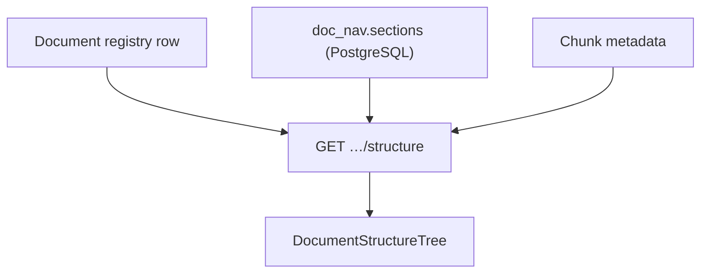
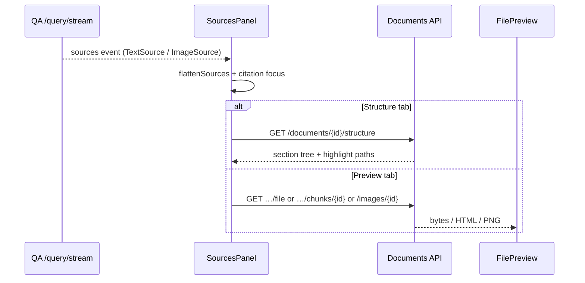

# Documents & Images API

Corpus inspection and **evidence endpoints** for the Q&A citation UI. Routers: `eagle_rag/api/documents.py`. Schemas: `eagle_rag/api/schemas/documents.py`.

Two router instances:

| Router | Prefix | Tag |
|--------|--------|-----|
| `router` | `/documents` | `documents` |
| `images_router` | `/images` | `images` |

---

## `GET /documents`

Paginated document registry with filters.

### Query parameters

| Param | Description |
|-------|-------------|
| `q` | Fuzzy name match |
| `kb_name` | Multi-tenant filter |
| `source_type` | `policy \| financial \| business \| bidding \| tax \| other` |
| `pipeline` | `knowhere \| pixelrag` |
| `status` | `pending \| indexing \| ready \| failed` |
| `limit` | 1–500, default 50 |
| `offset` | ≥ 0 |

### Response — `DocumentListResponse`

```json
{
  "items": [ { "document_id": "…", "name": "…", "kb_name": "finance", "status": "ready", … } ],
  "total": 142,
  "limit": 50,
  "offset": 0
}
```

---

## `GET /documents/{document_id}`

Single `DocumentOut`. **404** if not found.

Typical fields: `document_id`, `name`, `kb_name`, `source_type`, `pipeline`, `status`, `sha256`, `source_uri`, `created_at`, `updated_at`, chunk counts.

---

## `GET /documents/{document_id}/structure`

Returns `DocumentStructureOut` — the **semantic skeleton** from Knowhere parsing.

### Purpose

Powers the Q&A **Structure** rail tab: hierarchical `sections` with `path`, `level`, `summary`, child chunk references, and visual anchor metadata.

Built by `build_document_structure(document_id, doc)` in `eagle_rag/index/document_structure.py`.



### Response shape (conceptual)

```json
{
  "document_id": "doc_abc",
  "name": "Annual Report.pdf",
  "sections": [
    {
      "path": "/1/Introduction",
      "level": 1,
      "title": "Introduction",
      "summary": "…",
      "children": [ … ],
      "chunks": [ { "chunk_id": "…", "type": "text" } ]
    }
  ]
}
```

Exact schema: `DocumentStructureOut` in OpenAPI.

---

## `GET /documents/{document_id}/file`

Original ingested file for inline preview.

| `source_uri` type | Behaviour |
|-------------------|-----------|
| `http://` / `https://` | **307 redirect** to external URL |
| MinIO object key | Stream bytes with guessed `Content-Type` |
| Missing | **404** `document has no stored source file` |
| Read failure | **502** |

**Headers:** `Content-Disposition: inline; filename*=UTF-8''…`

Frontend: `fileUrl(documentId)` in `lib/api/client.ts` → `<iframe>` / PDF viewer in `FilePreview`.

---

## `GET /documents/{document_id}/chunks/{chunk_id}`

Returns **HTML** for a Knowhere table or visual chunk (`text/html; charset=utf-8`).

Resolution: `load_chunk_html(document_id, chunk_id)` — MinIO primary, Milvus metadata fallback.

Frontend: `chunkHtmlUrl(documentId, chunkId)` → table preview in evidence rail.

**404** when chunk not found.

---

## `DELETE /documents/{document_id}`

Deletes registry row. Returns `{ "deleted": true/false }` — `false` when id unknown (no 404).

!!! warning
    Full namespace purge (Milvus + MinIO + keywords) uses KB-level lifecycle APIs. Single-document delete scope depends on `registry.delete_document` implementation.

---

## `GET /images/{image_id}`

Raw **PNG tile bytes** (`image/png`). PixelRAG visual slices and Knowhere-rendered tiles.

**404** if image metadata missing. **500** on storage read failure.

Frontend: `imageUrl(imageId)` — no OpenAPI GET wrapper; hand-built URL.

---

## `GET /images/{image_id}/meta`

`ImageMetaOut`: `image_id`, `document_id`, `page`, `position`, `kb_name`, dimensions, etc.

---

## Evidence viewer flow (frontend)



Citation click → `highlightIndex` → structure focus on `path` or `parent_section`.

---

## Multi-tenancy

Documents carry `kb_name`. List filter `?kb_name=pharma`. Milvus chunks inherit the same scalar.

Scope filter `document_ids` references these ids cross-KB when union semantics apply.

---

## Related documentation

- [Query](query.md) — `TextSource` / `ImageSource` in responses
- [Q&A module](../frontend/qa-module.md) — `SourcesPanel`, `DocumentStructureTree`
- [KB management](knowledge-bases.md) — purge / rebuild
- [Multimodal fusion](../architecture/multimodal-fusion.md) — visual anchor fields
