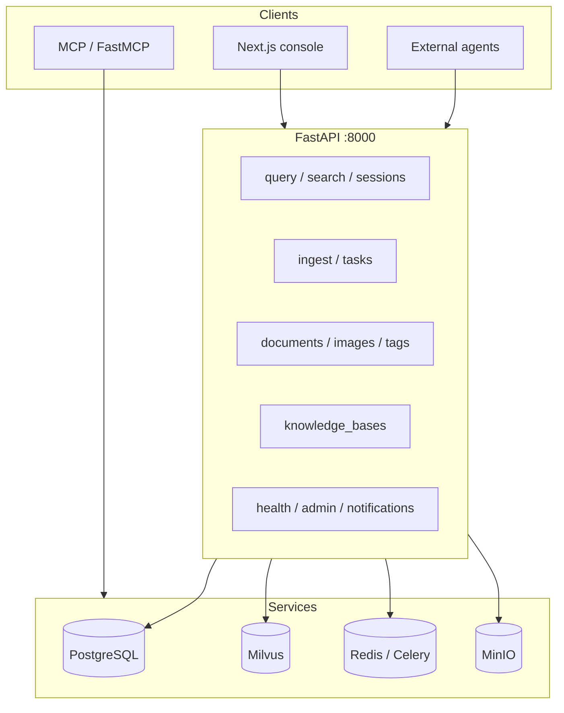

# Eagle-RAG REST API

Eagle-RAG exposes a **FastAPI** HTTP API (default port **8000**). It is the integration surface for the Next.js console, external agents, Celery workers, and MCP clients. Endpoints span the full RAG lifecycle: **ingest → index → retrieve → generate**, plus multi-tenant knowledge-base management and operations probes.

!!! info "Interactive docs"
    Open [`http://localhost:8000/docs`](http://localhost:8000/docs) for Swagger UI generated from route `response_model` definitions and [`/openapi.json`](http://localhost:8000/openapi.json) for machine-readable schema export.

## Architecture placement



MCP tools call the **service layer directly** (no HTTP self-call). REST routes in `eagle_rag/api/*.py` share the same engines and stores.

---

## API map by tag

| OpenAPI tag | Base paths | Guide |
|-------------|------------|-------|
| **query** | `/query`, `/search`, `/sessions` | [Query](query.md), [Sessions](sessions.md) |
| **ingest** | `/ingest`, `/tasks`, `/ingest/queue-metrics` | [Ingest](ingest.md), [Tasks](tasks.md) |
| **documents** | `/documents`, `/images` | [Documents](documents.md) |
| **tags** | `/tags` | [Query → Tags](query.md#get-tags) |
| **knowledge_bases** | `/knowledge_bases` | [Knowledge bases](knowledge-bases.md) |
| **attachments** | `/attachments` | [Attachments](attachments.md) |
| **notifications** | `/notifications` | [Notifications](notifications.md) |
| **health** | `/health`, `/mcp/tools` | [Health & admin](health-admin.md) |
| **admin** | `/admin/*` | [Health & admin](health-admin.md) |

Infrastructure routes (not always listed in tag summaries):

| Path | Purpose |
|------|---------|
| `GET /` | App name, version, docs link (`RootResponse`) |
| `GET /metrics` | Prometheus scrape |
| `GET /health` (metrics module) | Docker / HAProxy liveness |

MCP streamable HTTP mounts at `settings.mcp.streamable_http_path` (default `/mcp`). See [MCP tools](mcp-tools.md).

---

## Request / response conventions

### Pagination

List endpoints return `PaginatedMeta`:

```json
{ "items": […], "limit": 50, "offset": 0 }
```

Some list endpoints also include `total` (documents, knowledge bases) or `error` (degraded task list).

### Delete acknowledgements

`DELETE` routes return `DeletedResponse`:

```json
{ "deleted": true }
```

`deleted: false` is not used for 404 — missing resources raise **404** instead.

### Datetimes

ISO 8601 strings in UTC via `iso_datetime()` helper (`eagle_rag/api/schemas/_helpers.py`).

### Content negotiation

- JSON bodies: `Content-Type: application/json`
- File ingest: `multipart/form-data`
- SSE streams: `text/event-stream` (no `Accept` negotiation)

---

## Multi-tenancy (`kb_name`)

Most write and query endpoints accept optional **`kb_name`** — a knowledge-base identifier (`finance`, `pharma`, `default`, …).

Propagation chain:

| Layer | Usage |
|-------|-------|
| PostgreSQL | `documents.kb_name`, `sessions.kb_name`, `task_audit.kb_name` |
| Milvus | Scalar filter `kb_name == 'pharma'` |
| Celery | Task kwargs `kb_name=…` |
| Dedup PK | `(sha256, kb_name)` — same bytes may exist in multiple KBs |

See [Multi-tenancy](../architecture/multi-tenancy.md).

---

## Scope filter (`ScopeSelection`)

Advanced recall scoping on `/query` and `/search`:

```json
{
  "kb_names": ["pharma", "finance"],
  "document_ids": ["doc_abc123"],
  "tags": ["clinical-trial"]
}
```

**Union (OR) semantics** — a chunk matches if it belongs to any listed KB, explicit document, or document resolved from any tag. Resolved in `router_engine._resolve_scope_filter` and pushed to Milvus. Full detail: [Query → Scope filter](query.md#scope-filter--milvus-pushdown).

---

## Streaming (SSE) overview

| Endpoint | Events |
|----------|--------|
| `POST /query/stream` | `session`, `step`, `sources`, `token`, `done`, `error` |
| `POST /search/stream` | `step`, `sources`, `done`, `error` |
| `GET /tasks/{job_id}/stream` | `progress`, `timeout` |
| `GET /admin/logs` | `log`, `heartbeat` |

Wire format and byte-level examples: [Query → SSE protocol](query.md#post-querystream--sse-protocol).

---

## Error model

FastAPI returns standard HTTP errors unless noted:

| Status | Typical `detail` | Degraded behaviour |
|--------|------------------|-------------------|
| `404` | Resource not found (`session not found: …`) | — |
| `409` | Conflict (`kb_name already exists`) | — |
| `422` | Validation (`Either file or url is required`) | URL prefetch structured detail |
| `500` | Engine / unexpected (`detail` string) | Ingest may return JSON body |
| `502` | Celery dispatch failure (task retry) | — |
| `503` | Database unavailable | `GET /sessions` → empty list |

SSE endpoints emit `error` **events** instead of HTTP error bodies once the stream has started.

### Idempotency summary

| Operation | Idempotent? |
|-----------|-----------|
| `POST /ingest` (same file hash + kb) | **Yes** — `dedup_hit: true`, HTTP 200 |
| `POST /query` | **No** — appends messages |
| `POST /attachments` | **No** — new `attachment_id` each upload |
| `DELETE /*` | **Yes** — second delete → 404 |
| `PATCH /sessions/{id}` | **Yes** — same title |

---

## Authentication

**No authentication middleware** on REST routes by default. Deploy behind a private network, VPN, or API gateway.

MCP may enable auth separately via `settings.auth.enabled` and `configure_mcp_auth()` (static token, GitHub OAuth, custom JWT). See [MCP tools](mcp-tools.md).

---

## OpenAPI generation (frontend)

The Next.js console regenerates its TypeScript SDK from the live OpenAPI document:

```bash
# API must be running (or set OPENAPI_URL)
cd frontend && bun run api:gen
```

Config: `frontend/openapi-ts.config.ts` — input `${API_BASE}/openapi.json`, output `lib/api/generated/`. `predev` runs `api:gen` automatically.

---

## Configuration surface

Server host, port, model keys, Milvus URI, Celery broker, and MCP transport load from `eagle_rag/settings.yaml` with `${ENV:-default}` substitution. See [Configuration](../getting-started/configuration.md).

---

## Integration checklist

- [ ] `alembic upgrade head` (or `task db:migrate`) before first request
- [ ] Register at least one knowledge base (`POST /knowledge_bases`)
- [ ] Start Celery workers for `router_queue`, `knowhere_queue`, `pixelrag_queue`
- [ ] Point clients at `http://<host>:8000` (or reverse proxy + `NEXT_PUBLIC_API_BASE`)
- [ ] Use `/query/stream` for interactive UX; `/search` for retrieval benchmarks
- [ ] Run `bun run api:gen` after API schema changes

---

## Related documentation

| Topic | Link |
|-------|------|
| Backend router layout | [API layer](../backend/api-layer.md) |
| Retrieval routing | [Router engine](../backend/router-engine.md) |
| Frontend SDK | [API client](../frontend/api-client.md) |
| MCP implementation | [MCP server (backend)](../backend/mcp-server.md) |
| Schemas reference | [Schemas](../backend/schemas.md) |
