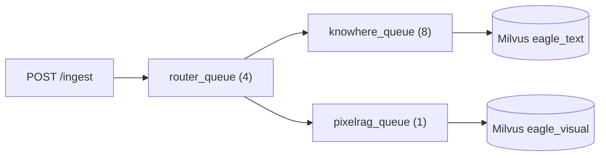

# Ingest API

Document ingestion enters through **`POST /ingest`** and is tracked via **`/tasks`** and **`/ingest/queue-metrics`**. Implementation: `eagle_rag/api/ingest.py`, schemas in `eagle_rag/api/schemas/ingest.py`, runner in `eagle_rag/ingest/runner.py`.

## `POST /ingest`

Unified entry for **multipart file upload** or **URL form field**.

### Request

**Content-Type:** `multipart/form-data`

| Field | Type | Required | Description |
|-------|------|----------|-------------|
| `file` | `UploadFile` | One of `file` / `url` | Raw bytes |
| `url` | `string` | One of `file` / `url` | `http://` or `https://` source |
| `source_type_hint` | `string` | No | `policy \| financial \| business \| bidding \| tax \| other` |
| `kb_name` | `string` | No | Target KB; must be registered |

### Response — `IngestResponse`

```json
{
  "job_id": "celery-uuid",
  "status": "pending",
  "dedup_hit": false,
  "document_id": "doc_abc123"
}
```

| HTTP | Condition |
|------|-----------|
| `201` | New ingest dispatched |
| `200` | Dedup hit — existing `(sha256, kb_name)` row reused |
| `404` | Knowledge base not registered |
| `422` | Missing file/url, validation error, URL prefetch failure |
| `500` | Runner exception (`{"detail": "…"}` JSON body) |

### URL ingest safeguards

Before Celery dispatch, the API:

1. `validate_url_format(url)`
2. `assert_not_ssrf_target(url)` — blocks private IPs / metadata endpoints
3. `prefetch_url(url)` — HEAD/GET reachability check with timeout + redirect cap

422 responses may include structured `UrlValidationErrorDetail`:

```json
{
  "detail": {
    "code": "url_unreachable",
    "reason": "Connection timed out",
    "suggestion": "Check firewall rules"
  }
}
```

### Pipeline routing

After `ingest_router` (Celery `router_queue`), documents route by format + content form:

| Input | Pipeline |
|-------|----------|
| Text-based PDF | Knowhere (`knowhere_queue`) |
| Scanned / image PDF | PixelRAG (`pixelrag_queue`) |
| Office / Markdown / CSV / … | Knowhere |
| Images / URLs / HTML | PixelRAG |

Override: filename prefix `knowhere:` / `pixelrag:`, or `settings.router.mode`.

### Multi-tenancy

`kb_name` flows into:

- PostgreSQL `documents.kb_name`
- Celery kwargs on all downstream tasks
- Milvus scalar field on indexed chunks

Dedup key: `(sha256, kb_name)` — identical file bytes may coexist in `finance` and `pharma`.

### Idempotency

Re-uploading the same file to the same KB returns `dedup_hit: true` without re-indexing. Different KB → new document row.

---

## `GET /ingest/queue-metrics`

Returns `IngestQueueMetricsResponse`:

```json
{
  "queues": [
    { "name": "router_queue", "concurrency": 4, "size": 2 },
    { "name": "knowhere_queue", "concurrency": 8, "size": 0 },
    { "name": "pixelrag_queue", "concurrency": 1, "size": 5 }
  ]
}
```

| Field | Source |
|-------|--------|
| `concurrency` | `settings.celery.queues.*.concurrency` (static) |
| `size` | Redis `LLEN` on queue name; `null` if broker unreachable |

Always HTTP **200** — partial data is acceptable for dashboard display.

---

## Celery queue topology



`pixelrag_queue` concurrency **1** — visual encoder is GPU/memory bound.

---

## Error codes (ingest path)

| Situation | HTTP | `detail` pattern |
|-----------|------|------------------|
| Empty multipart | 422 | `Either file or url is required` |
| Unregistered KB | 404 | `knowledge base not registered` / localized variant |
| SSRF blocked URL | 422 | Structured URL validation |
| Runner `ValueError` | 422 | Message string |
| Unexpected exception | 500 | `{"detail": "…"}` |

---

## MCP parity

The MCP `ingest` tool accepts `source_uri` (file path or URL) and calls `runner.ingest` directly. Returns `{ job_id, status, document_id, dedup_hit }` or `{ error: "…" }`. See [MCP tools](mcp-tools.md).

---

## Frontend integration

The ingest console (`/ingest`) uses:

- `POST /ingest` via `useIngest` hook
- `GET /tasks` with filters + SSE `GET /tasks/{id}/stream`
- `GET /ingest/queue-metrics` for `QueueCard` components

See [Ingest module](../frontend/ingest-module.md).

---

## Related documentation

- [Tasks](tasks.md) — audit list, SSE progress, retry
- [Documents](documents.md) — post-ingest corpus API
- [Knowledge bases](knowledge-bases.md) — register KB before ingest
- [Task queue (backend)](../backend/task-queue.md)
