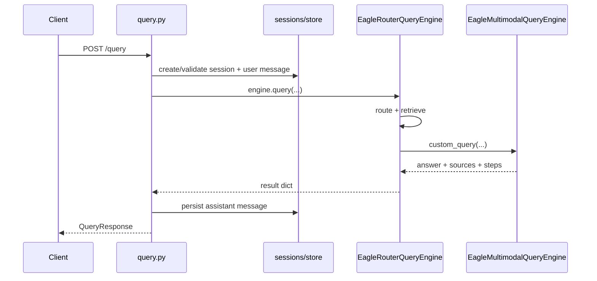

# Query & Search API

The **query** tag group covers multimodal Q&A, pure retrieval, session persistence, and the tag catalog that powers advanced scope filtering. Routes live in `eagle_rag/api/query.py`; request/response models in `eagle_rag/api/schemas/query.py`.

!!! info "Theory: streaming UX for RAG"
    Research on conversational search (e.g. *Incremental Generation* in retrieval-augmented systems) shows that **perceived latency** drops sharply when users see *progress* before the first token. Eagle-RAG therefore separates **step events** (route, recall, rerank) from **token events** (LLM deltas). Step events answer "what is the system doing?"; token events answer "what is the answer becoming?" This mirrors the *progressive disclosure* pattern recommended in HCI literature for long-running AI tasks (Shneiderman, 1998).

## Endpoint summary

| Method | Path | Response | Purpose |
|--------|------|----------|---------|
| `POST` | `/query` | `QueryResponse` | Full Q&A (route → retrieve → generate → persist) |
| `POST` | `/query/stream` | SSE | Same pipeline with step + token streaming |
| `POST` | `/search` | `SearchResponse` | Retrieval only (no LLM answer) |
| `POST` | `/search/stream` | SSE | Streaming retrieval (step + sources) |
| `GET` | `/tags` | `TagListResponse` | Keyword tag catalog for scope filter UI |

Session routes (`/sessions/*`) are documented in [Sessions](sessions.md).

!!! note "Multi-collection retrieval"
    Core queries hit `eagle_text` and/or `eagle_visual` in the instance-bound Milvus Database. Domain profiles may add specialized collections via `QueryRouteClassifier` + `RetrieverOrchestrator` (RRF merge). Core default never auto-queries specialized collections (G4). See [Plugin architecture](../architecture/plugin-architecture.md).

---

## Request models

### `QueryRequest`

```json
{
  "session_id": "550e8400-e29b-41d4-a716-446655440000",
  "query": "What are the revenue recognition rules in section 3?",
  "mode": "auto",
  "kb_name": "finance",
  "attachments": ["att_abc123"],
  "scope": ["doc_xyz"],
  "filters": {
    "source_type": "policy",
    "pipeline": "knowhere",
    "year": 2025
  },
  "scope_filter": {
    "kb_names": ["finance", "pharma"],
    "document_ids": ["doc_abc123"],
    "tags": ["clinical-trial"]
  }
}
```

| Field | Type | Required | Description |
|-------|------|----------|-------------|
| `session_id` | `string \| null` | No | Existing session UUID. Omitted → auto-create with title = first 30 chars of query |
| `query` | `string` | **Yes** | Natural-language question |
| `mode` | `auto \| text \| visual \| hybrid` | No | Override routing. Default from `settings.router.mode` |
| `kb_name` | `string \| null` | No | Single-KB legacy scope. Ignored when `scope_filter` is non-empty |
| `attachments` | `string[] \| null` | No | `attachment_id` values from `POST /attachments` |
| `scope` | `string[] \| null` | No | Legacy document_id list (post-retrieval filter when `scope_filter` inactive) |
| `filters` | `QueryFilters \| null` | No | Milvus scalar facets: `source_type`, `pipeline`, `year` |
| `scope_filter` | `ScopeSelection \| null` | No | Advanced union scope (see below) |

### `QueryFilters`

| Field | Type | Milvus pushdown |
|-------|------|-----------------|
| `source_type` | `policy \| financial \| business \| bidding \| tax \| other` | `source_type == '…'` |
| `pipeline` | `knowhere \| pixelrag` | Also forces routing mode |
| `year` | `int` | `year == N` |

### `ScopeSelection`

```python
# eagle_rag/api/schemas/query.py
class ScopeSelection(BaseModel):
    kb_names: list[str] = []
    document_ids: list[str] = []
    tags: list[str] = []

    def is_empty(self) -> bool:
        return not (self.kb_names or self.document_ids or self.tags)
```

**Union (OR) semantics:** a chunk is eligible if **any** of the following holds:

1. Its `kb_name` is in `kb_names`
2. Its `document_id` is in `document_ids`
3. Its document appears in the tag-resolved document set for **any** selected tag

Empty `ScopeSelection` → fall back to legacy `kb_name` / `scope` behaviour.

### `SearchRequest`

Same fields as `QueryRequest` **except** `session_id` and `attachments` are absent. Used for benchmarks and the frontend "Search mode" (evidence rail without generation).

---

## Response models

### `QueryResponse`

| Field | Type | Description |
|-------|------|-------------|
| `session_id` | `string` | Persisted conversation id |
| `message_id` | `string` | Assistant message UUID |
| `answer` | `string` | Final generated text |
| `sources` | `QuerySources` | `{ text: TextSource[], image: ImageSource[] }` |
| `route` | `RouteInfo` | `{ mode, selected, reason, kb_name, … }` |
| `steps` | `QueryStep[]` | Execution trace (`route`, `recall`, `rerank`, `warning`, …) |

### `TextSource`

Rich citation payload — the UI renders evidence without extra fetches:

| Field | Notes |
|-------|-------|
| `type` | `text \| table \| image \| section_summary` |
| `path` | Knowhere hierarchical path |
| `content` | Chunk body (tables carry HTML) |
| `summary`, `keywords`, `page_nums` | Semantic metadata |
| `document_id`, `file_name`, `file_path` | Document anchors |
| `kb_name`, `source_type` | Multi-tenant + facet |
| `source` | `kb \| attachment` |
| `score` | Rerank-adjusted relevance |

### `ImageSource`

Visual tile with **four fusion anchor fields** (see [Multimodal fusion](../architecture/multimodal-fusion.md)):

| Field | Purpose |
|-------|---------|
| `chunk_type` | `tile \| image \| table` |
| `parent_section` | Nearest text chunk `path` |
| `content_summary` | Knowhere visual summary |
| `source_chunk_id` | Knowhere `chunk_id` anchor |
| `image_id`, `page`, `position` | PixelRAG coordinates |

---

## Scope filter → Milvus pushdown {#scope-filter--milvus-pushdown}

Resolution happens in `EagleRouterQueryEngine._resolve_scope_filter`:

```python
# eagle_rag/router/router_engine.py (abbreviated)
@staticmethod
def _resolve_scope_filter(scope_filter) -> tuple[list[str], list[str], bool]:
    if not scope_filter:
        return [], [], False
    kb_names = list(scope_filter.get("kb_names") or [])
    document_ids = list(scope_filter.get("document_ids") or [])
    tags = list(scope_filter.get("tags") or [])
    if not (kb_names or document_ids or tags):
        return [], [], False
    doc_set = dict.fromkeys(document_ids)
    if tags:
        for doc_id in resolve_tags_to_document_ids(tags, cap=max_scope_documents):
            doc_set.setdefault(doc_id, None)
    return kb_names, list(doc_set), True
```

When `use_scope_filter=True`, retrievers are constructed with `kb_names` and `document_ids` pushed into Milvus scalar expressions:

```python
text_retriever = KnowhereGraphRetriever(
    top_k=self.top_k,
    kb_names=scope_kb_names,
    document_ids=scope_doc_ids,
    source_type=source_type,
    year=year,
)
```

Tag resolution crosses **all knowledge bases** (tags are global keywords in `document_keywords`). The cap `settings.router.max_scope_documents` prevents unbounded `document_id in […]` expressions.

!!! warning "Legacy `scope` vs `scope_filter`"
    When `scope_filter` is active, the legacy `scope` list is **not** applied post-retrieval. Pass document constraints inside `scope_filter.document_ids` instead.

---

## `POST /query` (non-streaming)

**Flow:**



**HTTP status codes:**

| Code | Condition |
|------|-----------|
| `200` | Success |
| `404` | `session_id` not found |
| `500` | Engine exception (`detail` = message) |
| `503` | Database unavailable during session resolve |

**Idempotency:** Not idempotent. Each call creates a new user message and (on success) a new assistant message. Re-posting the same `query` text appends to the session history.

**`kb_name` propagation:** Stored on both user and assistant messages; passed to retrievers when `scope_filter` is empty.

---

## `POST /query/stream` — SSE protocol {#post-querystream--sse-protocol}

**Content-Type:** `text/event-stream`  
**Implementation:** `sse-starlette` `EventSourceResponse` + background thread draining `engine.query_stream`.

### Wire format (byte-level)

Each event follows the [HTML Living Standard SSE grammar](https://html.spec.whatwg.org/multipage/server-sent-events.html):

```
event: <name>\r\n
data: <json>\r\n
\r\n
```

- `event` line is optional in the spec; Eagle-RAG **always** sets a named event.
- `data` is a **single JSON object** serialized with `json.dumps(..., ensure_ascii=False)`.
- Multi-line `data:` fields are **not** used; payloads fit one line.
- No `id:` or `retry:` fields are emitted today.

**Example raw stream (hex-newline annotated):**

```
event: session\r\n
data: {"session_id":"a1b2…","user_message_id":"c3d4…"}\r\n
\r\n
event: step\r\n
data: {"name":"route","mode":"hybrid","selected":["text","visual"],"reason":"…"}\r\n
\r\n
event: step\r\n
data: {"name":"recall","text_count":12,"visual_count":4}\r\n
\r\n
event: step\r\n
data: {"name":"rerank","text_kept":5,"visual_kept":3,"text_top":["/sec/3"],"visual_top":["img_01"]}\r\n
\r\n
event: sources\r\n
data: {"text":[…],"image":[…]}\r\n
\r\n
event: token\r\n
data: {"delta":"Revenue"}\r\n
\r\n
event: token\r\n
data: {"delta":" recognition"}\r\n
\r\n
event: done\r\n
data: {"answer":"…","sources":{…},"route":{…},"steps":[…],"message_id":"e5f6…"}\r\n
\r\n
```

### Event catalogue

| Event | When | `data` shape |
|-------|------|--------------|
| `session` | First yield when `session_id` known | `{ session_id, user_message_id }` |
| `step` | Route / recall / rerank / attach-parse | `{ name, … }` — extra keys allowed |
| `sources` | After rerank, before generation | `QuerySources` object |
| `token` | Each LLM delta | `{ delta: string }` |
| `done` | After persistence | Full payload + `message_id` |
| `error` | Failure | `{ code, message }` |

**`done` deferral:** The API layer buffers the engine's internal `done` event until the assistant message is written to PostgreSQL, then emits `done` with `message_id`. Clients should treat `done` as the terminal success signal.

**Error codes in `error` events:**

| `code` | HTTP equivalent | Cause |
|--------|-----------------|-------|
| `session_error` | 404 | Invalid `session_id` |
| `database_unavailable` | 503 | Session store down |
| `engine_error` | 500 | Retrieval or generation failure |

### Client parsing checklist

1. Use `EventSource` or a fetch-based SSE parser (the frontend uses `@hey-api/client-fetch` SSE mode).
2. `JSON.parse` each `data` string independently.
3. Append `token.delta` to the running answer buffer.
4. Replace pending UI state on `sources` (citations available before answer completes).
5. On `done`, swap temporary message id for `message_id`.
6. Handle connection drop: no automatic resume; re-`POST` is a new query.

!!! tip "Citation UI pattern"
    Emitting `sources` **before** `token` events implements the *evidence-first* pattern used in Perplexity-style interfaces: users can inspect retrieved chunks while the answer streams. See [Q&A module](../frontend/qa-module.md) for how `SourcesPanel` binds to this event order.

---

## `POST /search` and `/search/stream`

Pure retrieval — no `EagleMultimodalQueryEngine` invocation.

**`/search` response:** `{ sources, route, steps }` — no `answer`, no session side-effects.

**`/search/stream` events:** `step` → `sources` → `done` (no `session`, no `token`).

Typical `step` sequence:

1. `{ name: "route", mode, selected, reason, kb_name }`
2. `{ name: "recall", text_count, visual_count }`

---

## `GET /tags` {#get-tags}

Powers the tag dimension of `ScopeSelection`.

| Query param | Type | Description |
|-------------|------|-------------|
| `q` | `string` | Fuzzy keyword match |
| `kb_name` | `string` | Single KB filter |
| `kb_names` | `string[]` | Multi-KB union filter |
| `limit` | `int` | 1–500, default 50 |

**Response `TagOut`:** `{ keyword, hit_count, kb_count, document_count }`

Tags originate from Knowhere chunk keywords aggregated in `document_keywords`. Resolution at query time uses `resolve_tags_to_document_ids`.

---

## Multi-tenancy (`kb_name`)

| Scenario | Behaviour |
|----------|-----------|
| Only `kb_name` set | Retrievers filter `kb_name == '…'` in Milvus |
| `scope_filter.kb_names` non-empty | Union of listed KBs; top-level `kb_name` ignored for retrieval |
| Session create | `kb_name` stored on session row |
| Message persist | `kb_name` copied from request |

Default KB when omitted: `settings.kb_name` (env `KB_NAME`, default `default`).

---

## OpenAPI & code generation

Types land in `frontend/lib/api/generated/types.gen.ts` after:

```bash
cd frontend && bun run api:gen
```

See [API client](../frontend/api-client.md) for the full generation pipeline.

---

## Related documentation

- [Sessions](sessions.md) — `scope_filter` persistence on session rows
- [Router engine](../backend/router-engine.md) — routing matrix
- [Generation](../backend/generation.md) — rerank + VLM streaming
- [Attachments](attachments.md) — lazy parse on query
- [MCP tools](mcp-tools.md) — `core_query` tool schema
