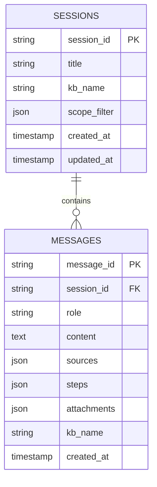

# Sessions API

Conversation persistence for the Q&A console. Sessions store metadata, **scope filter state**, and message history with sources/steps.

Routes live in `eagle_rag/api/query.py` (same router tag as query). Models: `eagle_rag/api/schemas/sessions.py`, store: `eagle_rag/sessions/store.py`.

---

## Data model



---

## `GET /sessions`

List sessions, newest first.

| Query | Default | Description |
|-------|---------|-------------|
| `limit` | 50 | 1–500 |
| `offset` | 0 | Pagination |
| `kb_name` | — | Filter by KB metadata |

### Response — `SessionListResponse`

Degrades to `{ items: [], limit, offset }` on database failure (HTTP **200**, no error field).

---

## `POST /sessions`

Explicit session creation (optional — `/query` auto-creates when `session_id` omitted).

Body — `SessionCreate`:

```json
{ "title": "Revenue policy review", "kb_name": "finance" }
```

**201** `SessionSummary`. **503** if database unavailable.

---

## `GET /sessions/{session_id}`

`SessionSummary`:

| Field | Description |
|-------|-------------|
| `session_id` | UUID |
| `title` | Display title |
| `kb_name` | Legacy single-KB hint |
| `scope_filter` | `{ kb_names, document_ids, tags }` or null |
| `created_at`, `updated_at` | ISO timestamps |

**404** if not found. **503** on DB errors.

---

## `PATCH /sessions/{session_id}`

Update title only (body: `SessionCreate` with `title`). **404** / **503** as above.

---

## `DELETE /sessions/{session_id}`

Cascade delete messages. `DeletedResponse`. **404** if missing.

---

## `GET /sessions/{session_id}/messages`

Paginated `MessageListResponse`.

| Query | Default |
|-------|---------|
| `limit` | 100 (max 1000) |
| `offset` | 0 |

### `MessageOut`

| Field | Type | Notes |
|-------|------|-------|
| `message_id` | string | UUID |
| `role` | `user \| assistant` | |
| `content` | string | Full answer text |
| `sources` | `QuerySources \| null` | Persisted citation payload |
| `steps` | `QueryStep[] \| null` | Execution trace |
| `attachments` | `string[] \| null` | User message only |
| `kb_name` | string \| null | Request KB at write time |
| `created_at` | string | ISO |

---

## Scope filter persistence

On every `/query` and `/query/stream` request, `_resolve_session` in `query.py`:

1. If `session_id` omitted → `create_session(…, scope_filter=…)`
2. If `session_id` provided → `set_session_scope_filter(session_id, scope_filter_dict)`

```python
scope_filter_dict = (
    req.scope_filter.model_dump()
    if req.scope_filter is not None and not req.scope_filter.is_empty()
    else None
)
```

Switching sessions in the UI restores scope into Zustand `useScopeStore` (`QAClient.handleSelectSession`).

### Frontend hydration

```typescript
const sf = session?.scope_filter;
setScope({
  kbNames: idsToRefs(sf?.kb_names),
  documents: idsToRefs(sf?.document_ids),
  tags: idsToRefs(sf?.tags),
});
```

Legacy fallback: if only `session.kb_name` set (not `default`), hydrate as single KB chip.

---

## Auto-create on query

When `session_id` is null on first `/query`:

- New UUID generated
- Title = first 30 characters of query string
- `kb_name` and `scope_filter` from request stored on session row
- User message appended immediately
- Assistant message appended after generation (or on SSE `done`)

---

## Multi-tenancy

`kb_name` on session is metadata — QA page uses `scope_filter` as authoritative for retrieval. `GET /sessions?kb_name=finance` filters session list for history drawer.

---

## TanStack Query keys (frontend)

| Hook | `queryKey` |
|------|------------|
| `useSessions` | `["sessions", params]` |
| `useSession` | `["session", sessionId]` |
| `useMessages` | `["messages", sessionId, params]` |

Mutations invalidate `["sessions"]` and relevant `["session", id]`.

---

## Related documentation

- [Query](query.md) — session side-effects on query
- [State management](../frontend/state-management.md) — scope store vs session API
- [Sessions (backend)](../backend/sessions-notifications.md)
