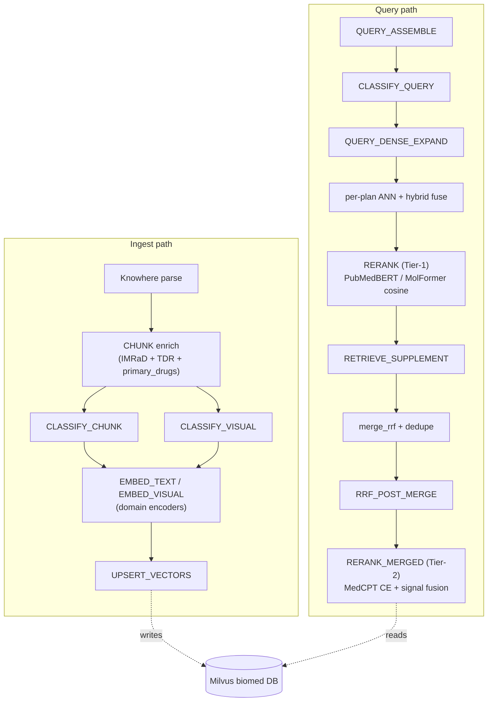

# Biomed plugin

`plugins/biomed` is an **experimental** in-repo domain plugin for the Eagle-RAG microkernel. It implements biomedical literature, compound, and medical-imaging RAG over a dedicated Milvus Database (`biomed`) on the `biomed` namespace. The plugin enters Core only through the `HookBus` and `EncoderRegistry` extension points - Core never imports `plugins.biomed` on the query hot path (ADR-008).

Companion document: [Biomed retrieval](biomed-retrieval.md) for the retrieval algorithms deep dive. Cross-cutting context: [Plugin architecture](plugin-architecture.md). Authoring template: `plugins/_template/`.

---

## Overview & boundary

| Aspect | Value |
| --- | --- |
| Namespace | `biomed` (matches `settings.plugins.default_namespace` when `EAGLE_RAG_PROFILE=biomed`) |
| Milvus Database | `biomed` (via `milvus_ns.milvus_db_name()`) |
| Maturity | **Experimental** - APIs, collections, and encoder wiring may change between releases |
| Specialized collections | 5 (`eagle_text_biomed`, `eagle_text_medcpt`, `eagle_chemical`, `eagle_medical_radiology`, `eagle_medical_pathology`) |
| Domain encoders | 7 registered with `EncoderRegistry` |
| Hot-path hooks | 12 (`PARSE` is not subscribed; `CHUNK` enrich-only per ADR-005) |
| MCP tools | `biomed_query_entities`, `biomed_retrieve_compounds` |
| Boundary | Pure RAG data layer; no Agent workflows; MCP tools are read-only (ADR-008) |



Core owns orchestration, RRF, dedupe, and `encoder_runtime` dispatch; biomed owns intent detection, routing, dense expansion, Tier-1/Tier-2 rerank, supplement, and scoring. See [Core/plugin boundary contract](#coreplugin-boundary-contract).

---

## Specialized collections & schemas

`ensure_biomed_collections` (`plugins/biomed/__init__.py`) iterates `COLLECTION_DIMS` and dispatches to `_ensure_text_collection` or `_ensure_visual_collection`. All collections live in the `biomed` Milvus Database.

| Collection | Encoder | Dim | Metric | Hybrid | Default `chunk_type` | Extra output fields |
| --- | --- | --- | --- | --- | --- | --- |
| `eagle_text_biomed` | `pubmedbert` | 768 | COSINE | yes | `text` | `primary_drugs`, `biomed_section` |
| `eagle_text_medcpt` | `medcpt-query` | 768 | COSINE | yes | `text` | `primary_drugs`, `biomed_section` |
| `eagle_chemical` | `molformer` | 768 | COSINE | no | `chemical` | - |
| `eagle_medical_radiology` | `medimageinsight` | 1024 | **IP** | no | `medical_image` | - |
| `eagle_medical_pathology` | `uni2` | 1536 | **IP** | no | `medical_image` | - |

### Text collection schema (`_ensure_text_collection`)

| Field | Type | Notes |
| --- | --- | --- |
| `id` | VARCHAR(64) | Primary key |
| `vector` | FLOAT_VECTOR(dim) | HNSW index `M=16, efConstruction=256` |
| `text` | VARCHAR(65535) | Chunk body |
| `document_id` | VARCHAR(64) | INVERTED index |
| `kb_name` | VARCHAR(64) | Default `"default"`; INVERTED index |
| `path` | VARCHAR(2048) | Knowhere doc_nav path |
| `chunk_type` | VARCHAR(32) | Default `"text"`; INVERTED index |
| `source_type` | VARCHAR(64) | INVERTED index |
| `source_chunk_id` | VARCHAR(128) | Cross-collection anchor |
| `primary_drugs` | VARCHAR(2048) | Nullable; CSV of drug names (entity boost) |
| `biomed_section` | VARCHAR(64) | Nullable; IMRaD/label section tag |

### Visual collection schema (`_ensure_visual_collection`)

| Field | Type | Notes |
| --- | --- | --- |
| `id` | VARCHAR(64) | Primary key |
| `vector` | FLOAT_VECTOR(dim) | HNSW index; **IP** metric (L2-normalized CLIP embeddings) |
| `image_path` / `image_id` | VARCHAR | Object-storage reference |
| `document_id` / `kb_name` | VARCHAR | `kb_name` default `"default"` |
| `chunk_type` | VARCHAR(32) | Default `"medical_image"` |
| `parent_section` / `content_summary` | VARCHAR | Four-anchor fields |
| `source_chunk_id` | VARCHAR(128) | Cross-collection anchor |
| `source_type` | VARCHAR(64) | |

### Live migration

`_ensure_biomed_section_field` performs live schema migration via `client.add_collection_field` for pre-existing collections that lack the `biomed_section` column. This keeps older `biomed` databases compatible when the field was introduced.

---

## Domain encoders

`plugins/biomed/encoders.py` registers 7 encoders on `ctx.encoder_registry` via `register_encoders(ctx)` (called from `BiomedPlugin.on_load`):

| Label | Modality | Dim | Default HF checkpoint | Override env |
| --- | --- | --- | --- | --- |
| `pubmedbert` | text | 768 | `microsoft/BiomedNLP-PubMedBERT-base-uncased-abstract-fulltext` | `EAGLE_BIOMED_PUBMEDBERT_MODEL` |
| `molformer` | text | 768 | `seyonec/ChemBERTa-zinc-base-v1` | `EAGLE_BIOMED_MOLFORMER_MODEL` |
| `medcpt-query` | text | 768 | `ncbi/MedCPT-Query-Encoder` | `EAGLE_BIOMED_MEDCPT_QUERY_MODEL` |
| `medcpt-article` | text | 768 | `ncbi/MedCPT-Article-Encoder` | `EAGLE_BIOMED_MEDCPT_ARTICLE_MODEL` |
| `medimageinsight` | visual | 1024 | `microsoft/BiomedCLIP-PubMedBERT_256-vit_base_patch16_224` (BiomedCLIP) | `EAGLE_BIOMED_MEDIMAGE_MODEL` |
| `uni2` | visual | 1536 | `MahmoodLab/UNI2-h` | `EAGLE_BIOMED_UNI2_MODEL` |
| `medcpt-rerank` | rerank | 1 | `ncbi/MedCPT-Cross-Encoder` | `EAGLE_BIOMED_MEDCPT_RERANK_MODEL` |

### Three encoder modes

`LazyDomainEncoder` resolves its mode from `plugin_options("biomed").encoder_mode` or `EAGLE_BIOMED_ENCODER_MODE` (default `auto`):

| Mode | Behavior |
| --- | --- |
| `deterministic` | Hash embedding only (SHA-256 -> dim, L2-normalized). CI/tests; no HF download. |
| `require_native` | Fail-fast (`EncoderLoadError`) if native weights cannot load. Production-safe. |
| `auto` | Try native; on failure use deterministic **only if** `EAGLE_BIOMED_ALLOW_DETERMINISTIC=1`, else raise. |

**Medical imaging encoders (`medimageinsight`, `uni2`) never fall back to Qwen3-VL.** This is a hard contract enforced inside `LazyDomainEncoder.encode_image`. Core's `eagle_visual` stays on Qwen; biomed's medical imaging collections stay on BiomedCLIP/UNI2.

### `LazyDomainEncoder` internals

- **Lazy load**: HuggingFace weights load on first `encode_text` / `encode_image` call, not at plugin registration.
- **Text encoding** (`_encode_hf_text`): mean-pool `last_hidden_state` weighted by `attention_mask`; truncate to 512 tokens; `_fit_dim` (truncate or zero-pad to `self.dim`); L2-normalize.
- **Image encoding** (`_encode_vision_bytes`): `PIL.Image.open(BytesIO).convert("RGB")`; for `open_clip` use `preprocess(image).unsqueeze(0)` + `model.encode_image` + L2-normalize; for HF vision backend use `image_embeds` or mean-pooled `last_hidden_state`.

### BiomedCLIP via `open_clip` (cross-modal retrieval)

`_prefer_open_clip` returns `True` for `medimageinsight` or any model id containing `biomedclip`/`clip`. `_load_open_clip_backend` normalizes model refs via `_open_clip_model_ref`:

- HuggingFace Hub refs get the `hf-hub:` prefix and use `open_clip.create_model_from_pretrained` + `open_clip.get_tokenizer`.
- Local `.bin` checkpoints use the architecture from `EAGLE_BIOMED_OPENCLIP_ARCH` (default `ViT-B-16`) and pretrained weights from `EAGLE_BIOMED_OPENCLIP_PRETRAINED` (default `openai`).

The CLIP **text tower** (`_encode_clip_text_query`) shares the image tower's embedding space, so a natural-language query encoded via `encode_text` matches `eagle_medical_radiology` vectors encoded via `encode_image`. This is the foundation of text -> radiology cross-modal retrieval.

`uni2` (pathology) is HuggingFace-only and has no text tower, so pathology retrieval is image -> image only.

### `LazyMedCPTReranker`

A lazy MedCPT cross-encoder used for Tier-2 rerank. `score_pairs(query, texts)` tokenizes `(query, text)` pairs with `max_length=512`, runs `AutoModelForSequenceClassification`, and extracts `logits` (squeeze last column if 2D). CUDA-aware. Falls back to `_deterministic_scores` (SHA-256 based) when weights are absent and deterministic mode is allowed.

### `EncoderRegistry` integration

Each collection is registered with a `CollectionProfile` carrying `default_encoder`, `hybrid_enabled`, and `extra_output_fields`:

```python
registry.register_collection(
    "eagle_text_biomed",
    dim=768,
    default_encoder="pubmedbert",
    hybrid_enabled=True,
    extra_output_fields=("primary_drugs", "biomed_section"),
)
```

`IngestOrchestrator.embed_and_upsert` and `RetrieverOrchestrator._retrieve_plan` call `encoder_registry.validate_plan(collection, encoder_name)` which raises `ValueError` on dim mismatch (except for `modality="rerank"` encoders). `RetrieverOrchestrator` consults `hybrid_enabled_for_collection` and `extra_output_fields_for_collection` at query time.

---

## Ingestion pipeline

### Format selector (`hooks_extra.biomed_format_selector`)

`INGEST_ROUTE_SELECTORS` subscriber. Routes biomed file extensions to the Core `knowhere` pipeline (returns `"knowhere"`), abstains (`None`) otherwise:

`.pdb`, `.sdf`, `.mol`, `.mol2`, `.cif`, `.dcm`, `.nii`, `.nii.gz`

### CHUNK enrich (`chunker.biomed_chunk_transform`)

`CHUNK` transform hook. **Enrich-only contract** (ADR-005): never re-splits text, never rewrites `path` / node body / `doc_nav` / `chunk_id`. Annotates each node with:

1. **Section tag** (`detect_section`): walks Knowhere `path` segments **leaf -> root** (`_section_from_path`); first IMRaD/patent/label alias match wins. Only when `path` is empty does it fall back to text-heading heuristics (`_section_from_text_heading`): heading-number regex, all-caps short heading (<=6 words), patent claim regex. Canonical sections (`_SECTION_ALIASES`): `abstract`, `introduction`, `methods`, `results`, `discussion`, `conclusion`, `claims`, `indications_and_usage`, `warnings`, `dosage`. Unmatched non-empty path -> `"body"`.
2. **Document type** (`detect_doc_type`): `compound` / `drug_label` / `patent` / `research` / `other` based on filename tokens (`compound_`, `label_`) + content (`prescribing information`, `what is claimed`) + section.
3. **Primary drugs** (`_primary_drugs_for_node`): calls `umls.match_drug_entities` over `file_name`, `source_uri`, `path`, `text[:512]`, `document_id`; de-dupes preserving order; caps at 8. Stamps `metadata["primary_drugs"]`.
4. **TDR profile**: after all nodes are annotated, runs `classify_document_text_profile(out)` + `apply_text_profile_to_nodes(out, profile)` (see below).

### Tiered Document Router (TDR) - `doc_profile.py`

`classify_document_text_profile(nodes)` returns a `DocumentTextProfile(profile, confidence, rule, tier, signals)` deciding whether a document is `biomedical` (use PubMedBERT) or `general` (use Core `text-embedding-v4`). Three tiers:

#### Tier-0 - router disabled

If `plugin_options("biomed").doc_semantic_router.enabled == false`, return `biomedical` with confidence 0.5 (`rule="router_disabled_default"`).

#### Tier-1 - signal fusion

`build_document_sketch(nodes, max_chars=sketch_max_tokens*4)` prioritizes `section_summary` chunks and `content_summary` metadata, then the first 8 node texts. Four signals are computed:

| Signal | Formula | Cap |
| --- | --- | --- |
| **Prototype margin** | `proto_margin = score_bio - score_gen`, where `score_*` = max cosine of PubMedBERT-embedded sketch vs prototype vectors in `plugins/biomed/doc_profile_prototypes.yaml` (5 biomedical prototypes: trial abstracts, PubMed abstracts, FDA labels, ClinicalTrials.gov, kinase assays; 3 general prototypes: financial results, press releases, annual reports) | [−1, 1] |
| **UMLS density** | `unique_entities / sqrt(len(sketch))` | [0, 1] |
| **IMRaD diversity** | `distinct_imrad_sections / 3.0` | [0, 1] |
| **Sketch entropy** | Shannon entropy of token frequencies / 5.0 | [0, 1] |

Fusion score (default weights, overridable via `doc_semantic_router.fusion.weights`):

```
confidence = 0.55 * proto_margin + 0.25 * umls_density
           + 0.15 * imrad_diversity + 0.05 * sketch_entropy
```

Decision bands around `confidence_threshold` (default 0) ± `llm_margin` (default 0.12):

- `confidence > threshold + margin` -> `biomedical` (`rule="tier1_fusion_biomedical"`)
- `confidence < threshold − margin` -> `general` (`rule="tier1_fusion_general"`)
- otherwise -> Tier-2 arbitrate

#### Tier-2 - LLM arbitrate

`_llm_arbitrate(sketch, cfg)` calls `create_router_llm(settings.llm)` with a JSON prompt:

```
Classify the document sketch as biomedical or general corporate text.
Return JSON only: {"profile":"biomedical"|"general","confidence":0.0-1.0,"rationale":"..."}
```

On parse failure, `llm.enabled=false`, or LLM unavailable, falls back to `ambiguous_default` (default `biomedical`).

`apply_text_profile_to_nodes(nodes, profile)` stamps `biomed_text_profile`, `biomed_text_profile_rule`, `biomed_text_profile_confidence`, `biomed_text_profile_tier` on every node's metadata. `BiomedTextClassifier` reads these via `ClassificationContext.extra["text_profile*"]`.

### Text/visual classifiers (`classifiers.py`)

#### `BiomedTextClassifier.classify`

1. **SMILES hard override**: if `_SMILES_RE` (`InChI=`, `SMILES`, `C(=O)`, bracket atoms like `[C@]`) matches -> `eagle_chemical` / `molformer` / `chunk_type="chemical"` / confidence 0.7 / `exclusive_group="biomed_text"`.
2. **TDR profile routing**:
   - `text_profile == "general"` -> Core `eagle_text` / `text-embedding-v4` / `chunk_type="text"` / confidence from TDR (default 0.6).
   - else (`"biomedical"`) -> `eagle_text_biomed` / `pubmedbert` / `chunk_type="biomed_text"` / confidence from TDR (default 0.75).

`exclusive_group="biomed_text"` triggers `ingest_helpers` dedupe: only one collection per exclusive group per ingest, so a chunk goes to either `eagle_text_biomed` or `eagle_text`, never both.

#### `BiomedImageClassifier.classify`

Routes visual assets via caption/alt-text/content_summary/parent_section blob + modality + file extension keyword matching:

| Trigger | Collection | Encoder | Confidence |
| --- | --- | --- | --- |
| `_RADIOLOGY_RE` (CT/MRI/ultrasound/radiograph) or modality `ct`/`mri`/`ultrasound`/`radiology` | `eagle_medical_radiology` | `medimageinsight` | 0.8 |
| `_PATHOLOGY_RE` (H&E/hematoxylin/biopsy/dysplasia/IHC) or modality `pathology`/`histology`/`he` | `eagle_medical_pathology` | `uni2` | 0.8 |
| `_CHEMICAL_IMAGE_RE` or `.mol`/`.sdf`/`.pdb` | `eagle_chemical` | `molformer` | 0.75 |
| `.dcm`/`.nii`/`.nii.gz` | `eagle_medical_radiology` | `medimageinsight` | 0.85 |
| Fallback | Core `eagle_visual` | `qwen3-vl` | 0.5 |

Only the fallback path touches Qwen3-VL; medical imaging stays on BiomedCLIP/UNI2.

### Embed dispatch (`_embed_text` / `_embed_visual`)

`EMBED_TEXT` / `EMBED_VISUAL` subscribers. **Abstain (return `None`)** when `decision.target_encoder` is `text-embedding-v4` or `qwen3-vl` (or empty) so Core's default subscriber handles those. Otherwise:

- `_embed_text` -> `encoder_runtime.encode_text_chunk(chunk, encoder_name)` (sets `metadata["embedding"]`).
- `_embed_visual` -> `encoder_runtime.encode_visual_bytes_for_encoder(encoder_name, image_bytes)`.

`IngestOrchestrator.embed_and_upsert` selects the hook by chunk type, then `UPSERT_VECTORS` (Core default) writes to Milvus.

---

## UMLS / ontology integration

`plugins/biomed/umls.py` + `plugins/biomed/routing_rules.yaml`.

### Curated entity index (`routing_rules.yaml`)

Ships ~70 curated entities across four categories, each with `aliases`, `cui` (UMLS CUI), `pathways`, `related_drugs`:

- **Receptor tyrosine kinases / oncogenes**: HER2, EGFR, BRCA1/2, TP53, KRAS, NRAS, ALK, ROS1, BRAF, MET, RET, PIK3CA, PTEN, AKT, mTOR, MEK, JAK2, VEGF, VEGFR, CSF-1R, PD-L1, PD-1, CTLA4, BCL2, MYC, CDK4/6, FGFR, NOTCH1, WNT, ERK, CD20, KIT, FLT3, IDH1/2, PARP.
- **Drugs / small molecules**: fruquintinib, savolitinib, surufatinib, sunitinib, cabozantinib, lenvatinib, regorafenib, sintilimab, camrelizumab, imatinib, metformin, aspirin, trastuzumab, pembrolizumab, nivolumab, olaparib, osimertinib, sotorasib, vemurafenib, palbociclib, bevacizumab, everolimus, venetoclax.
- **Diseases**: breast/lung/colorectal/pancreatic/renal cancer, melanoma, leukemia, lymphoma, neuroendocrine tumor, diabetes, COVID-19.
- **Pathways**: PI3K-AKT, MAPK, JAK-STAT, apoptosis, angiogenesis.

Plus `entity_keywords` (29 generic terms: kinase, pathway, receptor, mutation, ...) and `chemical.name_aliases` mapping 10 common drug names to SMILES (aspirin -> `CC(=O)Oc1ccccc1C(=O)O`, imatinib, fruquintinib, savolitinib, surufatinib, sunitinib, osimertinib, gefitinib, lapatinib, caffeine, ethanol).

### Optional MRCONSO merge

`load_umls_metathesaurus(path)` parses a real UMLS MRCONSO RRF file (env `EAGLE_BIOMED_UMLS_MRCONSO_PATH`, NLM license required), keeping only `LAT=ENG` + `ISPREF=Y` rows. `_merged_index()` merges curated YAML + MRCONSO aliases by normalized canonical name; new MRCONSO entities are added with empty `pathways` / `related_drugs`. Returns an empty dict gracefully when the file is absent.

### Letter-boundary matching (`_entity_pattern`)

`match_entities(query)` builds a per-entity regex with letter boundaries so short acronyms don't fire inside longer words:

| Query | `EGFR` pattern | `VEGFR` pattern | Result |
| --- | --- | --- | --- |
| `"VEGFR1 expression"` | no match (inside `VEGFR`) | match | `["VEGFR"]` |
| `"EGFR mutation"` | match | no match | `["EGFR"]` |
| `"PD-1 inhibitor"` | - | - | `["PD-1"]` (hyphen preserved) |
| `"metastatic site"` | - | - | `[]` (MET does not fire inside `metastatic`) |

Also matches `entity_keywords` with `\b` word boundaries.

### Drug-suffix regex

`match_drug_entities(query)` is a subset filter via `_drug_entity_keys()`: entities with `entity_type=="drug"` OR matching `_DRUG_SUFFIX` (`mab|zumab|limab|nib|tinib|rafenib|citinib|parib|senib|stat|formin$`). This auto-classifies entity names as drugs without explicit `entity_type` metadata.

### Expansion helpers

| Function | Purpose |
| --- | --- |
| `resolve_entity(entity)` | Returns `{entity, found, cui, aliases, pathways, related_drugs}` |
| `expand_query_with_entities(query, limit=12)` | Ranks hits by first occurrence in query; appends 2 aliases + 1 pathway per entity; returns `"[biomed entities: alias1, alias2, ...]"`; de-duped, capped at `limit` |
| `expand_query_for_dense_retrieval(query)` | `f"{query} {suffix}"` - dense embedding only; sparse keeps raw query |
| `resolve_compound_query(smiles_or_name)` | Maps common name -> SMILES via `chemical.name_aliases`, else returns input. Used by MCP `retrieve_compounds` |

---

## MCP tools

`plugins/biomed/mcp_tools.py` registers two tools via `@register_mcp_tool(namespace="biomed", ...)`:

### `biomed_query_entities`

Resolve a biomedical entity to aliases, pathways, and related drugs from the local UMLS-subset ontology index.

| Property | Type | Required | Description |
| --- | --- | --- | --- |
| `entity` | string | yes | Gene, drug, disease, or pathway name (e.g. `HER2`, `imatinib`) |
| `kb_name` | string | no | Knowledge-base scope |

Returns `{entity, found, cui, aliases, pathways, related_drugs}` via `umls.resolve_entity`.

### `biomed_retrieve_compounds`

Retrieve similar compounds from `eagle_chemical` using MolFormer embeddings (ANN). Accepts SMILES or a known compound name.

| Property | Type | Required | Description |
| --- | --- | --- | --- |
| `smiles_or_name` | string | yes | SMILES string or compound name (e.g. `aspirin`, `CC(=O)Oc1ccccc1C(=O)O`) |
| `top_k` | integer | no | Maximum hits (default 5, cap 50) |
| `kb_name` | string | no | Knowledge-base scope |

Implementation:

1. `resolve_compound_query(smiles_or_name)` - name -> SMILES.
2. `encode_text_for_encoder("molformer", query)` - MolFormer embedding.
3. `get_milvus_pool().get(milvus_db_name(ns))` - biomed DB client.
4. `client.search(collection_name="eagle_chemical", data=[vector], anns_field="vector", limit=min(top_k, 50), filter='kb_name == "..."', output_fields=[...])`.
5. Returns `{query, collection, encoder, hits: [{compound_id, smiles, score, document_id, path, kb_name}]}` with graceful error envelopes for `encode_failed` / `collection_missing` / `search_failed`.

### RAG-only enforcement

`assert_rag_only_tool_name` rejects names containing `execute_sql`, `send_email`, `mutate_`, `write_db`, etc. `PluginManager.register_mcp_tools` only registers tools from the `core` + `default_namespace` plugins (G3), so a `biomed` instance exposes `core_*` + `biomed_*` tools and nothing else.

---

## Configuration & dependencies

### `settings.plugins.options.biomed`

Read via `plugin_options("biomed", settings)`. Knobs:

| Knob | Default | Purpose |
| --- | --- | --- |
| `default_dual_text_search` | `false` | Also search Core `eagle_text` with `text-embedding-v4` |
| `exploratory_search_collections` | `[]` | Extra collections to always search |
| `use_general_rerank` | `false` | Force Core `qwen3-rerank` instead of domain rerank |
| `rerank_policy` | `domain` | `domain` / `general` / `none` |
| `domain_rerank_encoder` | `medcpt-rerank` | Encoder label for Tier-2 CE |
| `retrieval_scoring` | (5 profiles) | Per-workflow weight overrides (see [Biomed retrieval](biomed-retrieval.md)) |
| `medcpt_dual_search` | `false` | Also search `eagle_text_medcpt` |
| `collection_recall_top_k` | `20` | Recall pool size per plan |
| `encoder_mode` | `auto` | `auto` / `require_native` / `deterministic` |
| `doc_semantic_router.enabled` | `true` | TDR master switch |
| `doc_semantic_router.sketch_max_tokens` | `2048` | Document sketch size |
| `doc_semantic_router.prototype_config` | `plugins/biomed/doc_profile_prototypes.yaml` | Prototype texts path |
| `doc_semantic_router.fusion.weights` | `{prototype: 0.55, umls: 0.25, imrad: 0.15, entropy: 0.05}` | TDR fusion weights |
| `doc_semantic_router.confidence_threshold` | `0.0` | Tier-1 decision threshold |
| `doc_semantic_router.llm_margin` | `0.12` | Ambiguity band -> Tier-2 |
| `doc_semantic_router.llm.enabled` | `true` | Tier-2 LLM arbitrate switch |
| `doc_semantic_router.llm.max_sketch_chars` | `6000` | LLM prompt sketch cap |
| `doc_semantic_router.ambiguous_default` | `biomedical` | Tier-2 fallback |

### Profile overlay (`profiles.biomed`)

In addition to the per-plugin knobs, the `biomed` profile sets:

```yaml
profiles:
  biomed:
    plugins:
      enabled: [eagle_rag.plugins.core_defaults, plugins.biomed]
      default_namespace: biomed
    router:
      hybrid_text_collections: [eagle_text_biomed, eagle_text_medcpt]
    milvus:
      db_name: biomed
```

`router.hybrid_text_collections` takes precedence over `EncoderRegistry.hybrid_enabled_for_collection` when deciding which collections run dense+sparse fusion.

### Environment variables

| Variable | Purpose |
| --- | --- |
| `EAGLE_RAG_PROFILE=biomed` | Activate the biomed profile |
| `EAGLE_BIOMED_ENCODER_MODE` | `auto` / `require_native` / `deterministic` |
| `EAGLE_BIOMED_ALLOW_DETERMINISTIC` | `1` to permit hash fallback in `auto` mode (CI only; unset in production) |
| `EAGLE_BIOMED_PUBMEDBERT_MODEL` / `_MOLFORMER_MODEL` / `_MEDIMAGE_MODEL` / `_UNI2_MODEL` / `_MEDCPT_RERANK_MODEL` / `_MEDCPT_QUERY_MODEL` / `_MEDCPT_ARTICLE_MODEL` | HF checkpoint overrides |
| `EAGLE_BIOMED_UMLS_MRCONSO_PATH` | Optional UMLS MRCONSO RRF file |
| `EAGLE_BIOMED_OPENCLIP_ARCH` (default `ViT-B-16`) / `EAGLE_BIOMED_OPENCLIP_PRETRAINED` (default `openai`) | Local open_clip checkpoint arch + pretrained |

### `pyproject.toml` biomed extra

```toml
[project.optional-dependencies]
biomed = ["open-clip-torch>=2.23.0"]
```

Only `open-clip-torch` is biomed-specific (for BiomedCLIP radiology text<->image). Everything else (`transformers`, `torch`, `torchvision`, `pillow`, `pymilvus`) is already a Core dependency. Install with `uv sync --extra biomed`.

Notably **no `rdkit`** - molecular similarity is done via MolFormer embeddings + cosine (not Tanimoto on bit fingerprints).

### Docker overlay (`docker-compose.biomed.yml`)

Defines `x-biomed-env` anchor with `EAGLE_RAG_PROFILE: biomed`, `PLUGIN_NAMESPACE: biomed`, pre-downloaded model paths under `/opt/huggingface/biomed/{pubmedbert,molformer,medimageinsight,uni2,medcpt-rerank}`, and `EAGLE_BIOMED_ALLOW_DETERMINISTIC: ${...:-0}` (fail-fast in production). Applied to `api` / `worker-router` / `worker-knowhere` / `worker-pixelrag` / `frontend` services.

---

## Observability & eval baseline

### Audit categories

Biomed hooks write decisions via `ctx.audit.log_decision(category=..., ...)`. Notable categories: `classify_chunk`, `classify_visual`, `route_query`, `biomed_rerank_t1`, `biomed_rerank_t2`, `retrieve_plan`, `rrf_dedupe`, `ingest_exclusive_skip`, `hook_failure`. Sinks fan out to AI JSONL, Redis LIST, in-memory ring, and Prometheus counters (best-effort, never fail the hot path). `GET /health/plugins` exposes `recent_decisions` + `audit_stats`.

### Eval baseline (aligned smoke, 46 queries)

| Metric | Result | Smoke threshold |
| --- | --- | --- |
| Hit@5 | **0.87** | >= 0.70 |
| Recall@5 | **0.87** | >= 0.50 |
| MRR | **0.85** | >= 0.55 |
| Term coverage | **0.87** | >= 0.80 |

Up from pre-optimization Hit@5 0.65 / MRR 0.43. The 6 remaining expansion-query failures are UMLS coverage gaps (gefitinib, capmatinib, tepotinib missing `name_aliases` SMILES) and MolFormer weak recall on empty SMILES - data gaps, not architectural. See the ops-facing failure diagnosis in `eval/biomed/RETRIEVAL.md` (linked at the bottom).

---

## Core/plugin boundary contract

| Concern | Core | Biomed plugin |
| --- | --- | --- |
| Orchestration | `RetrieverOrchestrator` (hook dispatch, RRF, dedupe, inject) | Registers `QUERY_DENSE_EXPAND`, `RERANK`, `RETRIEVE_SUPPLEMENT`, `RRF_POST_MERGE`, `RERANK_MERGED` |
| Intent detection | `QueryRetrievalIntent` dataclass only | `plugins/biomed/query_intent.py` via `QUERY_DENSE_EXPAND` |
| RRF / dedupe / inject | `eagle_rag/router/rerank_fusion.py` primitives | Uses `inject_supplement_candidates`; does not reimplement fusion |
| Hybrid sparse | `hybrid_fuse_dense_sparse` term overlap (no domain logic) | Supplies `sparse_terms` + collection list via `QUERY_DENSE_EXPAND` + `EncoderRegistry` |
| Milvus upsert metadata | Schema-aware passthrough (`milvus_text_store` / `milvus_visual_store`) | `CHUNK` hook sets `primary_drugs`, `biomed_section`, `biomed_doc_type` |
| Encoder dispatch | `encoder_runtime.py` shared helpers | Registers 7 encoders via `EncoderRegistry` |
| Entity boost / filter | - | `RERANK`, `RERANK_MERGED`, `RETRIEVE_SUPPLEMENT` hooks |

Core **must not** `import plugins.biomed` on the query hot path. Biomed eval harness and ops live under `eval/biomed/`.

---

## Related documents

| Doc | Topic |
| --- | --- |
| [Biomed retrieval](biomed-retrieval.md) | Retrieval algorithms deep dive (intent, routing, Tier-1/Tier-2 rerank, supplement, RRF) |
| [Plugin architecture](plugin-architecture.md) | Cross-cutting microkernel + HookBus |
| [Plugin glossary](glossary-plugin.md) | Term cheat sheet |
| [Multimodal fusion](multimodal-fusion.md) | Knowhere + PixelRAG anchors (Core first-class) |
| [Authoring an industry plugin](../guides/authoring-industry-plugin.md) | How to add a vertical |
| [ADR-005](adr/005-knowhere-eagle-boundary.md) | Knowhere responsibility boundary (CHUNK enrich only) |
| [ADR-007](adr/007-plugin-implementation-status.md) | Encoder labels + UMLS MRCONSO + PluginAudit |
| [ADR-008](adr/008-rag-only-plugin-platform.md) | RAG-only + frontend scope |
| `eval/biomed/RETRIEVAL.md` | Ops-facing retrieval pipeline + failure diagnosis |
| `eval/biomed/EVAL.md` | Gold-standard fields + smoke commands |
