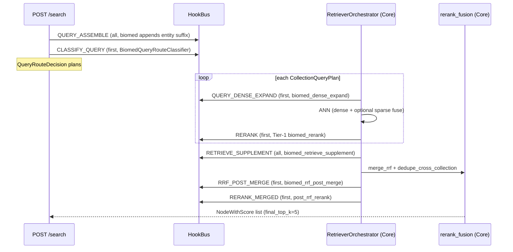

# Biomed retrieval

This document is the algorithm-focused companion to [Biomed plugin](biomed-plugin.md). It covers the full retrieval pipeline - intent detection, route classification, dense/sparse expansion, hybrid fusion, Tier-1 per-plan rerank, entity-anchored supplement, RRF merge, RRF post-merge injection, and Tier-2 merged rerank fusion - with the exact scoring formulas and weight tables used in production.

Cross-cutting context: [Plugin architecture](plugin-architecture.md). Ops-facing failure diagnosis lives in `eval/biomed/RETRIEVAL.md` (linked at the bottom).

---

## End-to-end retrieval flow



Module ownership:

| Stage | Owner | Module |
| --- | --- | --- |
| Query intent | biomed | `plugins/biomed/query_intent.py` |
| Routing | biomed | `plugins/biomed/query_route.py` |
| Dense expand / supplement / RRF inject / merged rerank | biomed | `plugins/biomed/retrieval_hooks.py` + `rerank.py` + `supplement.py` |
| Entity scoring | biomed | `plugins/biomed/scoring.py` |
| RRF / inject / dedupe primitives | Core | `eagle_rag/router/rerank_fusion.py` |
| Orchestration (no biomed import) | Core | `eagle_rag/plugins/retriever_orchestrator.py` |

Core's `RetrieverOrchestrator.retrieve` drives the whole flow; biomed logic enters only via hook subscribers filtered to `plugin_namespace == "biomed"`.

---

## Query intent detection (`query_intent.py`)

`detect_retrieval_intent(query)` infers a `QueryRetrievalIntent(workflow, suppress_collections, section_cues, require_entity_match)` purely from query text - **never** from eval gold labels. Order matters: the first matching cue wins.

| workflow | Trigger | `suppress_collections` | `section_cues` | `require_entity_match` |
| --- | --- | --- | --- | --- |
| `chemical` | `_COMPOUND_CUE_RE`: `smiles` / `inchi` / `compound` / `ligand` / `molecular formula` | `()` | `("compound",)` | True |
| `regulatory` | `_LABEL_CUE_RE`: `drug label` / `prescribing information` / `indications and usage` / `dosage and administration` | `("eagle_chemical",)` | `warnings` / `dosage` / `indications_and_usage` (from query) | True |
| `combination` | `_COMBINATION_CUE_RE` (`combination` / `combined with` / `co-administered` / `plus`) AND `len(drugs) >= 2` | `()` | section cues from query | True |
| `drug_entity` | UMLS drug entity hit (`match_drug_entities`) | `()` | section cues from query | True |
| `general` | fallback | `()` | section cues from query | False |

Section cues added when `warning` / `dosage` / `dosing` / `indications` / `usage` keywords present in the query.

The intent is stashed into `HookContext.extra["retrieval_intent"]` by `biomed_dense_expand` so every downstream hook (`RETRIEVE_SUPPLEMENT`, `RRF_POST_MERGE`, `RERANK_MERGED`) reads the same intent without re-inferring.

---

## Query route classification (`query_route.py`)

`BiomedQueryRouteClassifier.route(query, plugin_namespace, has_image, route_mode, ...)` builds the multi-collection `QueryRouteDecision`. Decision tree:

1. **Abstain** (return `None`) if `plugin_namespace != "biomed"` -> Core's `_default_classify_query` fires (G4: never auto-queries specialized collections).
2. Read config: `default_dual_text_search`, `medcpt_dual_search`, `exploratory_search_collections`, `collection_recall_top_k` (default 20).
3. Run `detect_retrieval_intent(query)` + `match_entities(query)` (UMLS) + `match_drug_entities(query)`.
4. **Collection plan assembly** (in order):
   - `chemical_task` (intent.workflow == `"chemical"` OR SMILES pattern in query) -> add `eagle_chemical` / `molformer`.
   - else text/hybrid mode -> add `eagle_text_biomed` / `pubmedbert`. If `medcpt_dual_search` -> also add `eagle_text_medcpt` / `medcpt-query`. If `default_dual_text_search` -> also add Core `eagle_text` / `text-embedding-v4`.
   - If drug hits AND not chemical AND `eagle_chemical` not suppressed -> add `eagle_chemical` (also added when any UMLS entity has `related_drugs`).
   - Radiology keywords -> `eagle_medical_radiology` / `medimageinsight`.
   - Pathology keywords -> `eagle_medical_pathology` / `uni2`.
   - Visual mode / `has_image` / combination workflow + drugs -> Core `eagle_visual` / `qwen3-vl`.
   - `exploratory_search_collections` adds extra collections.
5. `retrieval_hints["parent_doc_retrieval"] = False` when drug/UMLS hits present - disables Core's two-stage parent-doc expansion to keep chunks entity-specific.
6. Honors `intent.suppress_collections` (e.g. regulatory suppresses `eagle_chemical`).

After the classifier returns, `apply_scope_aware_union` (`scope_routing.py`) merges catalog-discovered collections when scope filters (`kb_names` / `document_ids` / `tags`) are set - G21/G23/G29 force specialized plans the scoped docs/KBs used at ingest time.

---

## Dense/sparse query expansion (`biomed_dense_expand`)

`QUERY_DENSE_EXPAND` subscriber (invoked twice per query - once with `encoder=None` for the global intent pass, then per plan with the plan's encoder). Returns `ExpandedQuery(dense_query, sparse_terms, intent)`.

- **Dense query rewrite**: only when `encoder == "pubmedbert"`, append `expand_query_for_dense_retrieval(query)` - i.e. `f"{query} [biomed entities: alias1, alias2, pathway1, ...]"`. The suffix is ranked by first occurrence of each UMLS entity in the query; 2 aliases + 1 pathway per entity; de-duped; capped at 12. For other encoders the dense query is unchanged.
- **Sparse terms**: `match_drug_entities(query)` + `intent.section_cues` (with `_` normalized to space). These feed Core's `hybrid_fuse_dense_sparse`.
- **Intent stash**: `ctx.extra["retrieval_intent"] = intent` for downstream hooks.

Sparse terms always keep the raw query; only the dense embedding sees the entity suffix. This separation prevents alias noise from polluting lexical matching.

---

## Hybrid dense+sparse fusion (Core primitive)

`hybrid_fuse_dense_sparse` (`eagle_rag/retrievers/hybrid_text_retriever.py`):

```
combined = alpha * dense_score + (1 - alpha) * sparse_score
```

- `dense_score` = Milvus ANN distance (cosine, normalized to `[0,1]`).
- `sparse_score` = `sparse_score(query, text, extra_terms)` - lexical term overlap in `[0,1]`: `hits / len(terms)` where terms include query tokens + `extra_sparse_terms` (drug names, section cues).
- `alpha` from `settings.router.hybrid_alpha`.

**Which collections fuse**: `settings.router.hybrid_text_collections` (biomed profile: `eagle_text_biomed`, `eagle_text_medcpt`) takes precedence; otherwise `EncoderRegistry.hybrid_enabled_for_collection(collection)`. Core's hybrid fusion has **no** domain entity logic - biomed supplies `sparse_terms` via `QUERY_DENSE_EXPAND`.

---

## Tier-1 per-plan rerank (`biomed_rerank`)

`RERANK` subscriber in `plugins/biomed/hooks_extra.py`. Per-collection cosine rerank with optional entity filtering:

1. **Encoder resolution**: `pubmedbert` for `eagle_text_biomed`, `molformer` for `eagle_chemical`. Abstain (return `None`) for other collections - Core or Tier-2 handles them.
2. **Entity filter** (only when `intent.require_entity_match` AND `sparse_terms` non-empty): filter nodes to those where `entity_boost_score(meta, sparse_terms) > 0` OR any term appears in the `text[:512] path` blob. The filter is applied only if it leaves a non-empty set (otherwise the original nodes pass through).
3. **`cosine_rerank`** (`rerank.py`): encode query + each node text (truncated to 2048 chars) with the encoder; dot-product score; sort descending.

`entity_boost_score` (`scoring.py`):

| Condition | Score |
| --- | --- |
| Any `primary_drugs` metadata entry matches a query drug | 1.0 |
| Any query drug appears in `path` / `file_name` / `document_name` / `source_uri` blob | 0.5 |
| Otherwise | 0.0 |

The `primary_drugs` metadata is stamped at ingest by `biomed_chunk_transform` (see [Biomed plugin](biomed-plugin.md) CHUNK enrich section), so the entity boost at query time is zero-rescan.

---

## Entity-anchored supplemental recall (`supplement_entity_anchored_hits`)

`RETRIEVE_SUPPLEMENT` subscriber. The key retrieval optimization: instead of relying on `label_*` / `compound_*` filename prefixes, it queries the PostgreSQL `documents` registry by drug name to find all documents mentioning a drug, then runs scoped ANN within those `document_id`s.

### Algorithm

1. **`_resolve_drug_terms(query)`**: prefer `match_drug_entities(query)`; if none, take the first UMLS entity's `related_drugs[:4]`. De-dupes preserving order.
2. **Filename-agnostic PG lookup**: `lookup_document_ids_by_name_terms(terms, kb_name, plugin_namespace)` - `WHERE name ILIKE %term%` against the `documents` registry table. Returns `document_id` list.
3. **Scoped ANN per `(collection, encoder)`** from `_collections_for_intent(intent)`:
   - `chemical` workflow -> `eagle_chemical` / `molformer`.
   - otherwise `eagle_text_biomed` / `pubmedbert` + `eagle_chemical` / `molformer` (unless suppressed).
4. **Limit**: `min(recall_top_k, max(len(doc_ids) * 4, 8))` per collection.
5. **`_rerank_entity_hits`**: `combined = entity * 2.0 + lexical + dense * 0.1`. Entity from `entity_boost_score`, lexical from `sparse_score(query, text, extra_terms=drug_terms)`, dense from the Milvus distance.

This is injected pre-rerank via `RRF_POST_MERGE` when `require_entity_match=True`, guaranteeing entity-anchored hits enter the rerank candidate pool even when the global ANN missed them.

---

## RRF merge & dedupe (Core primitives)

`merge_rrf` (`eagle_rag/router/rerank_fusion.py`):

```
score[key] += 1.0 / (k + rank)   # k = settings.router.rrf_k (default 60)
```

- **Empty-list exclusion** (G8): zero-hit plans contribute no phantom ranks.
- **Single non-empty list**: pass-through (no fusion math).
- **Dedup key**: `node.node_id` (fallback `source_chunk_id`, then `(document_id, path)`).

`dedupe_cross_collection` (G32) collapses duplicates by `source_chunk_id` (preferred) or `(document_id, path)` when more than one plan succeeded, keeping the higher-ranked node. Logs audit category `rrf_dedupe`.

RRF is the **only** cross-encoder merge mechanism - raw cross-embedding scores are never mixed. This is what lets PubMedBERT 768-d, MolFormer 768-d, MedCPT-Query 768-d, BiomedCLIP 1024-d, and UNI2 1536-d collections all contribute to one ranked list.

---

## RRF_POST_MERGE injection (`biomed_rrf_post_merge`)

Only fires when `intent.require_entity_match == True` AND `supplement_nodes` is non-empty. Calls `inject_supplement_candidates(merged, supplement, min_new=2)`:

- Injects up to `min_new` unseen supplement hits at the top of the merged list.
- Each injected node gets `score += 100.0` so it survives rerank trimming.

This guarantees entity-anchored supplement hits enter the Tier-2 rerank candidate pool. Without this, RRF's rank-based scoring would often push supplement hits below the `final_top_k` cutoff before they get a fair rerank.

---

## Tier-2 merged rerank fusion (`post_rrf_rerank`)

The headline rerank. `RERANK_MERGED` subscriber in `plugins/biomed/rerank.py`. Splits text vs `ImageNode`; image nodes pass through appended at the end (no CE scoring).

### Scoring formula

```
final = w_ce * ce_norm + (w_entity * entity + w_sec * section - w_xdrug_penalty * xdrug)
```

#### MedCPT cross-encoder normalization

`ce_norm = (ce_raw - ce_min) / (ce_max - ce_min)` (min-max over the candidate pool).

`ce_raw` from `_medcpt_scores(query, text_nodes)`:

- Texts truncated to 2048 chars.
- `score_rerank_for_encoder("medcpt-rerank", query, texts)` -> `LazyMedCPTReranker.score_pairs` (max_length=512, `AutoModelForSequenceClassification` logits).
- On any exception, falls back to the existing `nws.score` (post-RRF rank score).
- If `len(ce_scores) != len(text_nodes)`, falls back entirely to existing scores.

`medcpt-rerank` is the configured encoder (`plugin_options("biomed").domain_rerank_encoder`, default `medcpt-rerank`).

#### Entity match score (`_entity_match_score`)

`boost_terms = _boost_terms_for_query(query)`:

- If `match_drug_entities(query)` is non-empty -> those drugs.
- Otherwise, for each `match_entities(query)` entity, take `related_drugs[:6]`.

Score:

| Condition | Score |
| --- | --- |
| `entity_boost_score(meta, query_drugs) >= 1.0` (primary_drugs metadata match) | 1.0 |
| `entity_boost_score >= 0.5` (drug in path/file_name/document_name/source_uri blob) | 0.75 |
| Any query drug in `text[:512]` | 0.75 |
| Otherwise | 0.0 |

#### Section match score (`_section_match_score`)

Fraction of `intent.section_cues` matched in the `biomed_section` / `path` / `content_summary[:200]` blob. Cues are matched both raw (`indications_and_usage`) and with `_` -> space substitution (`indications and usage`).

#### Cross-drug penalty (`_cross_drug_penalty`)

Returns 1.0 (penalty) when **all** of:

- `primary_drugs` metadata is non-empty (parsed as list or single string; JSON arrays handled).
- The metadata drug set is **disjoint** from `query_drugs`.
- No query drug appears in `text[:512]` or `path` blob.

Otherwise returns 0.0. The penalty is multiplied by `w_xdrug_penalty` (2.0-3.0 depending on profile) and **subtracted** from the score. This aggressively suppresses PMC noise for entity-specific queries - e.g. a document about drug A should not rank for a query about drug B just because both are kinase inhibitors.

### Profile weight table (`_PROFILE_WEIGHTS`)

Overridable via `plugin_options("biomed").retrieval_scoring[<profile>]`. Default weights:

| Profile | `w_ce` | `w_entity` | `w_sec` | `w_xdrug_penalty` | When |
| --- | --- | --- | --- | --- | --- |
| `default` (= `general`) | 0.50 | 0.25 | 0.15 | 2.0 | Fallback |
| `regulatory` | 0.30 | 0.20 | 0.35 | 2.5 | Drug label / prescribing info queries - section matters most |
| `drug_entity` | 0.35 | 0.35 | 0.10 | 3.0 | UMLS drug entity hit - entity + strong penalty |
| `chemical` | 0.25 | 0.40 | 0.10 | 3.0 | SMILES / compound queries - entity dominates |
| `combination` | 0.35 | 0.35 | 0.10 | 2.5 | Multi-drug combination queries |

The profile is selected from `intent.workflow`; `general` falls back to `_DEFAULT_WEIGHTS`.

### Chemical workflow special path

For `intent.workflow == "chemical"`, after the fusion scoring:

1. Filter `chemical_nodes` = nodes where `_entity_match_score(...) > 0`.
2. If non-empty, run `cosine_rerank(chemical_nodes, query, encoder="molformer")`.
3. For each node in the fused list, if the MolFormer cosine score exceeds the fused score, take the MolFormer score (and node).

This is **molecular fingerprint-style similarity** - MolFormer embeddings + cosine distance. Not Tanimoto on bit fingerprints (no `rdkit` dependency). The merge takes the higher of (fused, MolFormer) so chemical structure similarity can rescue a hit that MedCPT undervalued.

### `enrich_file_names` backfill

Before scoring, `enrich_file_names(text_nodes, plugin_namespace)` backfills `file_name` / `document_name` from PG `lookup_documents_sync` so `entity_boost_score` works even when Milvus metadata lacks those fields. Critical for older ingests that didn't stamp filename metadata.

### Rerank policy resolution

`resolve_rerank_policy("biomed", bus)` (`eagle_rag/plugins/rerank_policy.py`):

1. `plugin_options("biomed").rerank_policy` (default `domain`).
2. If unset, `use_general_rerank=False` -> `DOMAIN`.
3. If unset and no `RERANK_MERGED` subscribers -> `GENERAL`.

Biomed sets `rerank_policy: domain`, so `rerank_merged` invokes `RERANK_MERGED` (biomed's `post_rrf_rerank`) instead of Core's `qwen3-rerank`. `general` would use DashScope `qwen3-rerank`; `none` skips merged rerank (passthrough trim). All paths log an audit decision (`rerank_t2_domain` / `rerank_t2_general` / `rerank_t2_passthrough`).

---

## Cross-modal retrieval (BiomedCLIP)

`medimageinsight` is loaded via `open_clip`, so the **text tower and image tower share one embedding space**:

- Text query encoded via `_encode_clip_text_query` (CLIP text tower) matches `eagle_medical_radiology` vectors (CLIP image tower).
- The collection uses **IP** metric with L2-normalized vectors, which is effectively cosine.
- This enables natural-language text -> radiology image retrieval without a separate query encoder.

`uni2` (pathology) is HuggingFace-only with no text tower, so pathology retrieval is image -> image only (query image bytes encoded via `encode_image`).

**Hard rule**: medical imaging encoders (`medimageinsight`, `uni2`) **never** fall back to Qwen3-VL. Core's `eagle_visual` stays on Qwen for non-medical visuals (fallback path in `BiomedImageClassifier`, confidence 0.5).

---

## Biomedical-specific optimizations summary

| Optimization | Where | Effect |
| --- | --- | --- |
| Letter-boundary UMLS matching | `umls._entity_pattern` | `EGFR` doesn't fire inside `VEGFR`; `MET` doesn't fire inside `metastatic`; `VEGFR` still matches inside `VEGFR1-3`; `PD-1` preserved |
| Drug-suffix regex | `umls._DRUG_SUFFIX` | `mab`/`nib`/`tinib`/`rafenib`/`parib`/`stat`/`formin$` auto-classifies entity names as drugs without explicit `entity_type` |
| TDR 3-tier fusion | `doc_profile.py` | Avoids sending general corporate text through PubMedBERT (which would degrade quality); uses Core `text-embedding-v4` for general docs |
| IMRaD section cues | `chunker._SECTION_ALIASES` | `indications_and_usage` / `warnings` / `dosage` section tags enable `section_cues` boosting in regulatory rerank |
| `primary_drugs` ingest stamping | `chunker._primary_drugs_for_node` | Zero-rescan entity boost at query - metadata already on the Milvus row |
| Chemical MolFormer re-rerank | `rerank.post_rrf_rerank` chemical branch | Structure similarity rescues hits MedCPT undervalued |
| Filename-agnostic entity supplement | `supplement.supplement_entity_anchored_hits` | PG registry name lookup + scoped ANN; no dependency on filename prefixes |
| Cross-drug penalty | `rerank._cross_drug_penalty` | Aggressively suppresses PMC noise for drug-specific queries (penalty 2.0-3.0x) |
| BiomedCLIP cross-modal | `encoders._encode_clip_text_query` | Text -> radiology image retrieval in shared embedding space |

---

## Known limits & eval baseline

Aligned smoke (46 queries): Hit@5 / Recall@5 **0.87**, MRR **0.85**, term coverage **0.87** - up from pre-optimization Hit@5 0.65 / MRR 0.43.

The 6 remaining expansion-query failures are data/UMLS gaps, not architectural:

| ID | Type | Root cause |
| --- | --- | --- |
| q-exp-042 | competitive_intelligence | UMLS doesn't cover gefitinib -> no entity anchoring; PubMedBERT recall misses Top-50 |
| q-exp-043 | compound_match | Gold in `eagle_chemical`; MolFormer weak on empty SMILES |
| q-exp-049 | competitive_intelligence | Gold only in `eagle_chemical`; text routing didn't search chemical collection |
| q-exp-050 / q-exp-052 | compound_match | capmatinib / tepotinib missing `name_aliases` SMILES; MolFormer misses Top-50 |
| q-exp-053 | competitive_intelligence | everolimus is in UMLS but `_resolve_drug_terms` mis-used `related_drugs` |

Fix directions: UMLS coverage completion, compound SMILES backfill, chemical-aware routing (not Core coupling). The ops-facing failure diagnosis taxonomy (`failure_class`: `gold_corpus_gap` / `gold_over_specified` / `query_route_gap` / `ranking_gap` / `term_metric_strict` / `ok`) is documented in `eval/biomed/RETRIEVAL.md` (linked at the bottom).

---

## Related documents

| Doc | Topic |
| --- | --- |
| [Biomed plugin](biomed-plugin.md) | Collections, encoders, ingest, UMLS, MCP, config |
| [Plugin architecture](plugin-architecture.md) | Cross-cutting microkernel + HookBus |
| [Plugin glossary](glossary-plugin.md) | Term cheat sheet |
| [ADR-004](adr/004-multi-encoder-rrf-fusion.md) | RRF / G4 / G8 / G14 / G32 |
| [ADR-005](adr/005-knowhere-eagle-boundary.md) | Knowhere responsibility boundary |
| [ADR-007](adr/007-plugin-implementation-status.md) | Encoder labels + UMLS MRCONSO |
| `eval/biomed/RETRIEVAL.md` | Ops-facing retrieval pipeline + failure diagnosis |
| `eval/biomed/EVAL.md` | Gold-standard fields + smoke commands |
