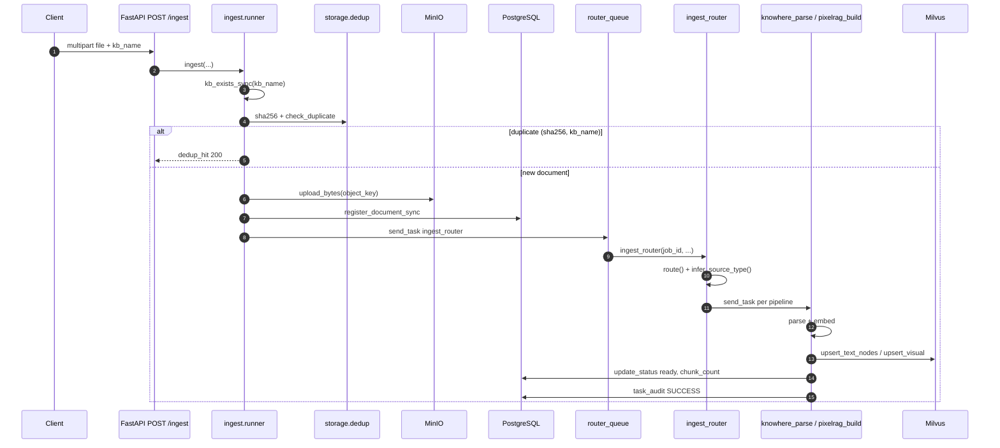
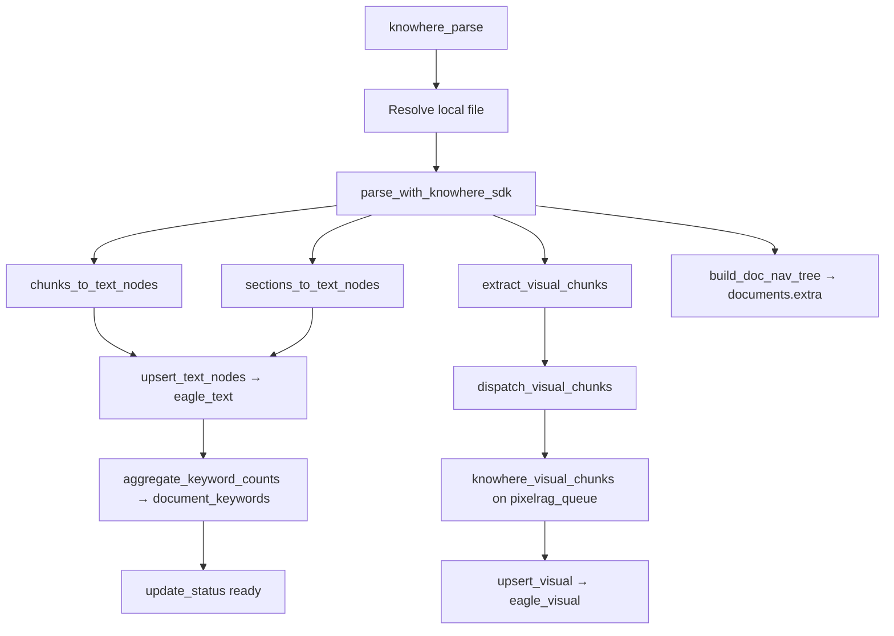
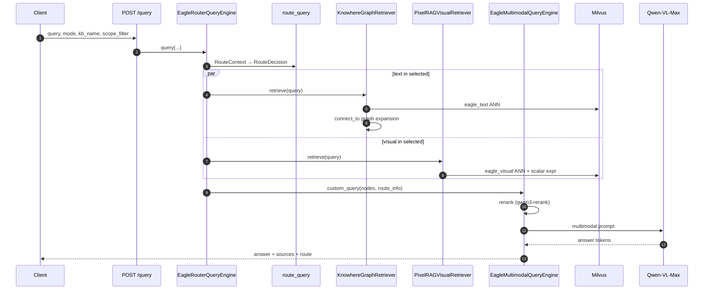
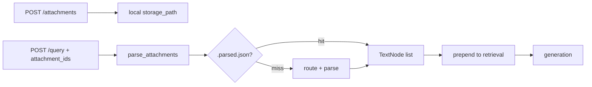

# Data flow

Two end-to-end flows define Eagle-RAG: **ingestion** (document → vectors) and **query** (question → cited answer). Both span API, Celery, adapters, Milvus, and PostgreSQL. This page traces actual function names and control flow.

---

## Theory and foundations

### Indexing-time vs query-time

[RAG surveys (Gao et al., 2023)](https://arxiv.org/abs/2312.10997) separate:

| Phase | Cost profile | Eagle-RAG characteristic |
| --- | --- | --- |
| **Indexing** | High latency, batch/async | Celery 3-queue pipeline; minutes per document |
| **Query** | Low latency, interactive | Sub-second ANN + streaming VLM generation |

[Lewis et al., 2020](https://arxiv.org/abs/2005.11401) retrieve at query time — index freshness depends on ingest completing successfully.

### Dual-index data model

Text and visual embeddings live in **separate Milvus collections** because:

- Different embedding models and dimensions (1536 vs 2048)
- Different index tuning (HNSW params, DiskANN for scale)
- Query-time fusion in `EagleRouterQueryEngine` + `EagleMultimodalQueryEngine`

---

## Ingestion flow

**Goal:** Turn an uploaded file or URL into searchable vectors while preserving provenance for citations.



### Step-by-step implementation

| Step | Function / module | Notes |
| --- | --- | --- |
| 1. API accept | `eagle_rag/api/ingest.py` | Validates `kb_name`; returns `job_id` |
| 2. Runner orchestration | `eagle_rag/ingest/runner.py` `ingest()` | SHA-256 hash; dedup gate |
| 3. Dedup | `eagle_rag/storage/dedup.py` | PK `(sha256, kb_name)` |
| 4. Object storage | `eagle_rag/storage/minio_client.py` | `{document_id}/{filename}` |
| 5. Registry | `register_document_sync()` | Status `pending` → `processing` |
| 6. Router task | `ingest_router` in `eagle_rag/ingest/router.py` | `@with_retry`, `router_queue` |
| 7. Route | `route(filename, local_path, kb_name, ...)` | Returns `["knowhere"]` or `["pixelrag"]` or both |
| 8. Dispatch | `app.send_task(knowhere_parse \| pixelrag_build)` | Per pipeline queue |
| 9. Parse + index | See pipeline sections below | |
| 10. Dedup register | `dedup.register()` | **After** successful parse — failed tasks leave no dedup row |

### URL sources

URL ingest skips upfront MinIO/dedup at API — file fetched lazily inside pipeline tasks (`url_prefetch` settings). Dedup applies after successful index.

### Knowhere path (`knowhere_parse`)



**State transitions** (`eagle_rag/tasks/state.py`):

`PENDING` → `RENDERING` (Knowhere parse) → `EMBEDDING` → `INDEXING` → `SUCCESS`

**Non-blocking side effects** (failures logged, main task continues):

- Tag catalog write (`upsert_document_keywords`)
- Visual dispatch (`dispatch_visual_chunks`)
- `doc_nav` persistence (`update_extra`)

### PixelRAG path (`pixelrag_build`)

For scanned PDFs, images, URLs, HTML:

1. Render pages to tiles (`pixelrag_render`) — settings: `tile_height`, `viewport_width`, `pdf_dpi`
2. Embed tiles (`_Qwen3VLVisualEncoder`) — 2048-d, L2-normalized
3. `upsert_visual_batch()` — `chunk_type=tile`
4. `update_status(ready)`; `dedup.register()` on success

Queue: `pixelrag_queue`, concurrency **1**.

---

## Query flow

**Goal:** Route the question, retrieve relevant text and/or visuals, rerank, and generate a grounded answer with sources.



### `EagleRouterQueryEngine` control flow

```python
# eagle_rag/router/router_engine.py — simplified
def query(self, query, mode=None, kb_name=None, scope_filter=None, attachments=None):
    attach_nodes, image_docs, attach_step, has_doc = self._prepare_attachments(attachments)
    nodes, decision = self.retrieve(query, mode=mode, kb_name=kb_name,
                                    scope_filter=scope_filter, has_doc_attachments=has_doc)
    nodes = attach_nodes + nodes  # attachments prepended
    return EagleMultimodalQueryEngine().custom_query(query, nodes=nodes, route_info=decision.to_dict(), ...)
```

**`retrieve()` internals:**

1. `_route_decision()` → `route_query(RouteContext)` — DeepSeek or heuristics
2. `_resolve_scope_filter(scope_filter)` → `(kb_names, document_ids, active)`
3. Construct retrievers with scope-aware filters
4. `_fetch_nodes()` — per-modality `try/except`; empty list on failure

### `KnowhereGraphRetriever.retrieve()`

1. Embed query via Qwen `text-embedding-v4`
2. Milvus ANN on `eagle_text` with `kb_name` / `document_id` metadata filters
3. For each hit, expand `metadata["connect_to"]` — Knowhere knowledge graph
4. Optional parent-document: boost `type="section_summary"` recall

### `PixelRAGVisualRetriever.retrieve()`

1. Embed query via `_Qwen3VLVisualEncoder` (same space as tiles)
2. `search_visual()` in `milvus_visual_store.py` — IP search, `ef=64`
3. Scalar expr: `kb_name`, `document_id`, optional `chunk_type`, `parent_section`

### Generation (`EagleMultimodalQueryEngine`)

1. Split text `TextNode` vs visual `ImageNode`
2. Rerank text candidates (`settings.rerank.text`)
3. Build VLM prompt: text chunks + `content_summary` + image paths
4. Stream or block call to `settings.vlm` (Qwen-VL-Max)
5. Map sources via `_text_source()` / `_image_source()` — truncate by `router.source_content_max_chars`

---

## Streaming (`POST /query/stream`)

SSE event order:

```
session → step* → sources → token* → done
```

Implementation (`eagle_rag/api/query.py`):

- Daemon thread bridges sync `engine.query_stream()` generator to async SSE
- Events: `session`, `step` (route, recall, attach_parse), `sources`, `token`, `done`
- Assistant message persisted on `done` to `sessions` / `messages` tables

### Retrieval-only

`POST /search` and `/search/stream` call `engine.search()` / `search_stream()` — **no VLM**. Returns `sources{text, image}` + `route` + `steps`.

---

## Attachments flow

Query-time attachments (`POST /attachments`):



- **No Milvus write** — ephemeral context only
- Sidecar cache: `{storage_path}.parsed.json` when `attachments.parse.cache_enabled=true`
- TTL: `attachments.ttl_hours` (default 24)
- Document attachments set `has_doc_attachments=True` → routing bias toward `hybrid`

Code: `eagle_rag/attachments/parser.py`.

---

## `kb_name` everywhere

Both flows thread `kb_name`:

| Stage | Propagation |
| --- | --- |
| Ingest API | Request body → runner → Celery kwargs |
| Parse | `chunks_to_text_nodes(..., kb_name=)` metadata |
| Milvus | Scalar field on every vector |
| Dedup | `(sha256, kb_name)` composite PK |
| Query | `MetadataFilters` / `_build_search_expr` |
| Sessions | `sessions.kb_name` column |
| MCP tools | All four tools accept `kb_name` |

Advanced: `scope_filter` with union semantics — [Multi-tenancy](multi-tenancy.md).

---

## Design tensions and tuning

| Tension | Manifestation | Mitigation |
| --- | --- | --- |
| Eventual consistency window | API returns after audit `PENDING`; vectors appear after Celery | Poll `/tasks/{job_id}`; do not query until `SUCCESS` |
| Dedup race | Two uploads same hash before `register` completes | Rare; second should hit `dedup_hit` — monitor duplicate audits |
| Text-ready before visual | `update_status(ready)` in `knowhere_parse` before tiles indexed | Hybrid queries may return text-only until visual queue catches up |
| Attachment vs index | `parse_attachments` prepended at query time, not Milvus | Session-local evidence; not visible to other users or MCP `retrieve_*` |
| Streaming thread bridge | `stream_custom_query` + sync VLM in thread pool | One thread per SSE client — cap concurrent streams on small APIs |
| Registry without vectors | Best-effort Milvus write logs error but audit may still succeed | KB rebuild / re-ingest; compare `documents.chunk_count` vs Milvus count |

---

## Configuration

| Setting | Flow affected |
| --- | --- |
| `ingest.routing` | Ingest pipeline selection |
| `router.mode` | Query retriever selection |
| `router.max_scope_documents` | Tag → document_id resolution cap |
| `router.source_content_max_chars` | Source payload size in query response |
| `attachments.parse.*` | Attachment lazy parse limits |
| `celery.queues` | Ingest throughput |
| `knowhere.poll_timeout` | Max Knowhere parse wait |

---

## Failure modes and operations

| Failure point | User impact | Code behavior |
| --- | --- | --- |
| `ingest_router` exhausted retries | Task `FAILED`; dead letter | `@with_retry` + `DeadLetterTask` |
| `knowhere_parse` SDK error | Document `failed` | No dedup register |
| Visual dispatch error | Text search works; no images | Logged in `dispatch_visual_chunks` |
| Milvus upsert error | Partial index | May still mark `SUCCESS` |
| Text retriever down | Visual-only answer if hybrid | Warning log; continue |
| VLM timeout | Error in answer field | No process crash |
| Invalid `scope_filter` tags | Tags ignored | `_resolve_scope_filter` warning |

**Replay:** `POST /tasks/{job_id}/retry` or `replay_dead_letter()` after fixing root cause.

---

## References

- [Ingest pipeline](../backend/ingest-pipeline.md)
- [Routing matrix](routing-matrix.md)
- [Retrieval](../backend/retrieval.md)
- [Generation](../backend/generation.md)
- [API query](../api/query.md)
- [Lewis et al., 2020](https://arxiv.org/abs/2005.11401)
- [Milvus hybrid search](https://milvus.io/docs/multi-vector-search.md)
