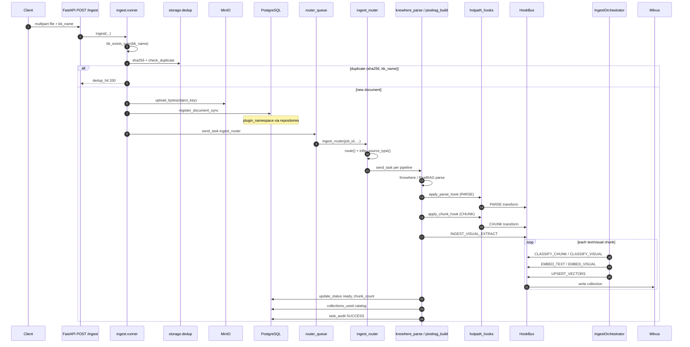
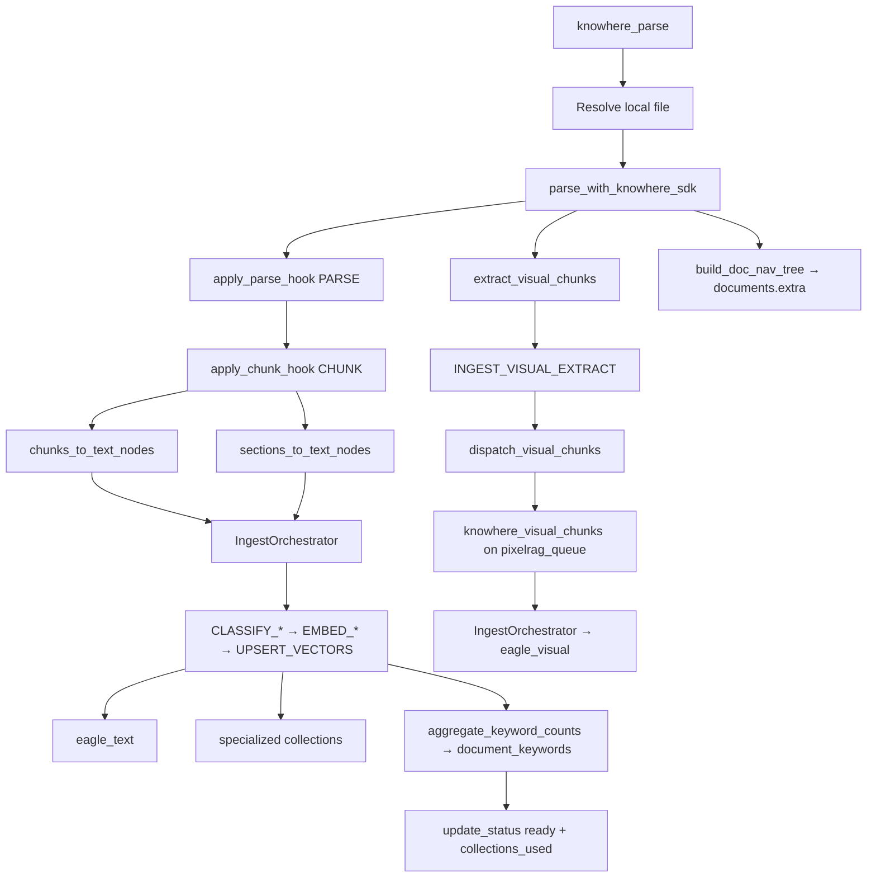
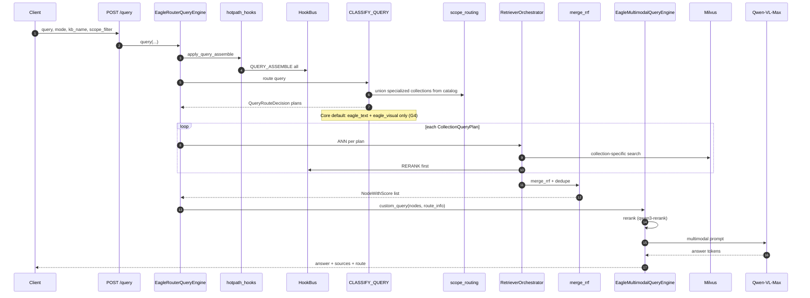
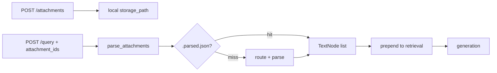

# Data flow

Two end-to-end flows define Eagle-RAG: **ingestion** (document → vectors) and **query** (question → cited answer). Both span API, Celery, adapters, the plugin microkernel, Milvus, and PostgreSQL. This page traces actual function names and control flow.

See [Plugin architecture](plugin-architecture.md) for the full microkernel design.

---

## Theory and foundations

### Indexing-time vs query-time

[RAG surveys (Gao et al., 2023)](https://arxiv.org/abs/2312.10997) separate:

| Phase | Cost profile | Eagle-RAG characteristic |
| --- | --- | --- |
| **Indexing** | High latency, batch/async | Celery 3-queue pipeline; minutes per document |
| **Query** | Low latency, interactive | Sub-second ANN + streaming VLM generation |

[Lewis et al., 2020](https://arxiv.org/abs/2005.11401) retrieve at query time — index freshness depends on ingest completing successfully.

### Dual-index data model

Every domain Milvus Database always has two **base collections**:

| Collection | Content | Embedding |
| --- | --- | --- |
| `eagle_text` | Knowhere semantic chunks | Qwen `text-embedding-v4` (1536-d) |
| `eagle_visual` | PixelRAG tiles / images / tables | Qwen3-VL-Embedding-2B (2048-d) |

Text and visual embeddings live in separate collections because they use different models, dimensions, and index tuning (HNSW params, DiskANN for scale).

**Domain plugins** may add specialized collections in the **same** Milvus Database (e.g. `eagle_text_biomed`, `eagle_chemical`). Ingest records which collections a document used; query may fan out across multiple collections.

**Query-time fusion** is no longer limited to dual text + visual retrievers. `RetrieverOrchestrator` runs ANN per `CollectionQueryPlan`, optional per-plan `RERANK`, then merges with RRF (`eagle_rag/router/rerank_fusion.py`) — never raw cross-embedding scores. See [ADR-004](adr/004-multi-encoder-rrf-fusion.md).

`EagleRouterQueryEngine` remains the API entry point; it delegates retrieval to the orchestrator before `EagleMultimodalQueryEngine` generation.

---

## Ingestion flow

**Goal:** Turn an uploaded file or URL into searchable vectors while preserving provenance for citations.



### Step-by-step implementation

| Step | Function / module | Notes |
| --- | --- | --- |
| 1. API accept | `eagle_rag/api/ingest.py` | Validates `kb_name`; returns `job_id` |
| 2. Runner orchestration | `eagle_rag/ingest/runner.py` `ingest()` | SHA-256 hash; dedup gate |
| 3. Dedup | `eagle_rag/storage/dedup.py` | PK `(sha256, kb_name)` within `plugin_namespace` |
| 4. Object storage | `eagle_rag/storage/minio_client.py` | `{document_id}/{filename}`; keys include namespace |
| 5. Registry | `register_document_sync()` | Status `pending` → `processing`; repositories inject `plugin_namespace` |
| 6. Router task | `ingest_router` in `eagle_rag/ingest/router.py` | `@with_retry`, `router_queue` |
| 7. Route | `route(filename, local_path, kb_name, ...)` | Returns `["knowhere"]` or `["pixelrag"]` or both; plugins may add via `INGEST_ROUTE_SELECTORS` |
| 8. Dispatch | `app.send_task(knowhere_parse \| pixelrag_build)` | Per pipeline queue |
| 9. Plugin hooks | `eagle_rag/plugins/hotpath_hooks.py` | `PARSE` → `CHUNK` → `INGEST_VISUAL_EXTRACT` |
| 10. Classify + index | `IngestOrchestrator` | `CLASSIFY_*` → `EMBED_*` → `UPSERT_VECTORS` per chunk |
| 11. Collection catalog | `ingest_catalog.py` / `ingest_tracker.py` | On full success: `documents.extra["collections_used"]` + `knowledge_bases.collections_used` |
| 12. Dedup register | `dedup.register()` | **After** successful parse — failed tasks leave no dedup row |

Fixed hook order (G26): `PARSE` → `CHUNK` → `INGEST_VISUAL_EXTRACT` → `CLASSIFY_*` → `IngestOrchestrator` (`EMBED_*` → `UPSERT_VECTORS`). Failed or partial ingests do not update the collection catalog. See [ADR-006](adr/006-ingest-query-routing-contract.md).

### URL sources

URL ingest skips upfront MinIO/dedup at API — file fetched lazily inside pipeline tasks (`url_prefetch` settings). Dedup applies after successful index.

### Knowhere path (`knowhere_parse`)



**State transitions** (`eagle_rag/tasks/state.py`):

`PENDING` → `RENDERING` (Knowhere parse) → `EMBEDDING` → `INDEXING` → `SUCCESS`

**Non-blocking side effects** (failures logged, main task continues):

- Tag catalog write (`upsert_document_keywords`)
- Visual dispatch (`dispatch_visual_chunks`)
- `doc_nav` persistence (`update_extra`)

### PixelRAG path (`pixelrag_build`)

For scanned PDFs, images, URLs, HTML:

1. Render pages to tiles (`pixelrag_render`) — settings: `tile_height`, `viewport_width`, `pdf_dpi`
2. `INGEST_VISUAL_EXTRACT` → `IngestOrchestrator` classifies and embeds tiles (`_Qwen3VLVisualEncoder`) — 2048-d, L2-normalized
3. `UPSERT_VECTORS` → `eagle_visual` — `chunk_type=tile`
4. `update_status(ready)`; `collections_used` catalog; `dedup.register()` on success

Queue: `pixelrag_queue`, concurrency **1**.

---

## Query flow

**Goal:** Route the question, retrieve relevant chunks across one or more collections, rerank, and generate a grounded answer with sources.



### `EagleRouterQueryEngine` control flow

```python
# eagle_rag/router/router_engine.py — simplified
def query(self, query, mode=None, kb_name=None, scope_filter=None, attachments=None):
    attach_nodes, image_docs, attach_step, has_doc = self._prepare_attachments(attachments)
    nodes, decision = self.retrieve(query, mode=mode, kb_name=kb_name,
                                    scope_filter=scope_filter, has_doc_attachments=has_doc)
    nodes = attach_nodes + nodes  # attachments prepended
    return EagleMultimodalQueryEngine().custom_query(query, nodes=nodes, route_info=decision.to_dict(), ...)
```

**`retrieve()` internals:**

1. `apply_query_assemble()` — `QUERY_ASSEMBLE` hooks expand query / entity hints before ANN (`plugins.query_assemble_enabled`)
2. `CLASSIFY_QUERY` → `QueryRouteDecision` with one or more `CollectionQueryPlan`s
3. `_resolve_scope_filter(scope_filter)` → `(kb_names, document_ids, active)`; scope-aware catalog may **force** specialized collections when scoped docs/KBs/tags used them ([ADR-006](adr/006-ingest-query-routing-contract.md))
4. `RetrieverOrchestrator.retrieve()` — per-plan ANN (best-effort; failed plans skipped and audited)
5. Per-plan optional `RERANK` hook, then `merge_rrf()` — dedupe by `source_chunk_id` or `(document_id, path)`

**Core default routing (G4):** `CLASSIFY_QUERY` plans only `eagle_text` (+ `eagle_visual` when hybrid / image). Core **never** auto-queries specialized collections; domain classifiers or scope-aware catalog union may add them.

### Legacy retriever detail (Core plans)

When plans target base collections, behavior matches the original dual-index path:

**`eagle_text` (via `KnowhereGraphRetriever` or orchestrator plan):**

1. Embed query via Qwen `text-embedding-v4` (or domain encoder per plan)
2. Milvus ANN on `eagle_text` with `kb_name` / `document_id` metadata filters
3. For each hit, expand `metadata["connect_to"]` — Knowhere knowledge graph
4. Optional parent-document: boost `type="section_summary"` recall

**`eagle_visual` (via `PixelRAGVisualRetriever` or orchestrator plan):**

1. Embed query via `_Qwen3VLVisualEncoder` (same space as tiles)
2. `search_visual()` in `milvus_visual_store.py` — IP search, `ef=64`
3. Scalar expr: `kb_name`, `document_id`, optional `chunk_type`, `parent_section`

### Generation (`EagleMultimodalQueryEngine`)

1. Split text `TextNode` vs visual `ImageNode`
2. Rerank text candidates (`settings.rerank.text`)
3. Build VLM prompt: text chunks + `content_summary` + image paths
4. Stream or block call to `settings.vlm` (Qwen-VL-Max)
5. Map sources via `_text_source()` / `_image_source()` — truncate by `router.source_content_max_chars`

---

## Streaming (`POST /query/stream`)

SSE event order:

```
session → step* → sources → token* → done
```

Implementation (`eagle_rag/api/query.py`):

- Daemon thread bridges sync `engine.query_stream()` generator to async SSE
- Events: `session`, `step` (route, recall, attach_parse), `sources`, `token`, `done`
- Assistant message persisted on `done` to `sessions` / `messages` tables

### Retrieval-only

`POST /search` and `/search/stream` call `engine.search()` / `search_stream()` — **no VLM**. Returns `sources{text, image}` + `route` + `steps`.

---

## Attachments flow

Query-time attachments (`POST /attachments`):



- **No Milvus write** — ephemeral context only
- Sidecar cache: `{storage_path}.parsed.json` when `attachments.parse.cache_enabled=true`
- TTL: `attachments.ttl_hours` (default 24)
- Document attachments set `has_doc_attachments=True` → routing bias toward `hybrid`

Code: `eagle_rag/attachments/parser.py`.

---

## MCP data flow

Single FastMCP app at `/mcp` (HTTP default). Tools follow `{namespace}_{name}` naming.

| Tool | Role |
| --- | --- |
| `core_ingest` | Ingest file/URL into KB |
| `core_query` | Full RAG query (retrieve + generate) |
| `core_retrieve_text` | Text retrieval only |
| `core_retrieve_visual` | Visual retrieval only |

Each instance exposes **`core_*`** plus tools from the bound `default_namespace` plugin only (G3). Domain examples under profile: `biomed_query_entities`, `lakehouse_bi_query_semantic_context`. All tools accept `kb_name`; `plugin_namespace` is process-bound, not a runtime switcher.

Pre-plugin bare names (`ingest`, `query`) are **not** aliased.

---

## Tenancy: `plugin_namespace` + `kb_name`

Two layers — do not conflate them in API or UI copy. See [Multi-tenancy](multi-tenancy.md).

| Term | Layer | Propagation |
| --- | --- | --- |
| `plugin_namespace` | Deploy-time domain (= Milvus Database) | Fixed by `settings.plugins.default_namespace`; repositories inject on all PG reads/writes; `MilvusClientPool` binds `db_name` at construction |
| `kb_name` | KB id inside that Database (scalar filter) | Request body → runner → Celery kwargs → vector metadata → query `MetadataFilters` |

| Stage | `kb_name` | `plugin_namespace` |
| --- | --- | --- |
| Ingest API | Request body → runner → Celery kwargs | Repositories on `register_document_sync` |
| Parse | `chunks_to_text_nodes(..., kb_name=)` metadata | Domain Milvus DB (no per-vector namespace scalar) |
| Milvus | Scalar field on every vector | Physical DB isolation per domain |
| Dedup | `(sha256, kb_name)` composite PK | Scoped by repository filter |
| Query | `MetadataFilters` / `_build_search_expr` | Instance-bound; mismatched request → 403 unless override enabled |
| Sessions | `sessions.kb_name` column | `sessions.plugin_namespace` via repositories |
| MCP tools | All `core_*` + domain tools accept `kb_name` | Instance profile determines exposed namespace |

Advanced: `scope_filter` with union semantics — scoped KBs / documents / tags may force specialized collection plans via ingest catalog.

---

## Design tensions and tuning

| Tension | Manifestation | Mitigation |
| --- | --- | --- |
| Eventual consistency window | API returns after audit `PENDING`; vectors appear after Celery | Poll `/tasks/{job_id}`; do not query until `SUCCESS` |
| Dedup race | Two uploads same hash before `register` completes | Rare; second should hit `dedup_hit` — monitor duplicate audits |
| Text-ready before visual | `update_status(ready)` in `knowhere_parse` before tiles indexed | Hybrid queries may return text-only until visual queue catches up |
| Attachment vs index | `parse_attachments` prepended at query time, not Milvus | Session-local evidence; not visible to other users or MCP `core_retrieve_*` |
| Streaming thread bridge | `stream_custom_query` + sync VLM in thread pool | One thread per SSE client — cap concurrent streams on small APIs |
| Registry without vectors | Best-effort Milvus write logs error but audit may still succeed | KB rebuild / re-ingest; compare `documents.chunk_count` vs Milvus count |
| Multi-collection partial failure | One `CollectionQueryPlan` ANN fails | Orchestrator skips plan, audits, continues with remaining plans |

---

## Configuration

| Setting | Flow affected |
| --- | --- |
| `ingest.routing` | Ingest pipeline selection |
| `plugins.enabled` / `plugins.default_namespace` | Plugin load + Milvus DB binding |
| `plugins.query_assemble_enabled` | `QUERY_ASSEMBLE` before ANN |
| `router.mode` | Query retriever selection (Core `CLASSIFY_QUERY`) |
| `router.max_scope_documents` | Tag → document_id resolution cap |
| `router.source_content_max_chars` | Source payload size in query response |
| `attachments.parse.*` | Attachment lazy parse limits |
| `celery.queues` | Ingest throughput |
| `knowhere.poll_timeout` | Max Knowhere parse wait |

---

## Failure modes and operations

| Failure point | User impact | Code behavior |
| --- | --- | --- |
| `ingest_router` exhausted retries | Task `FAILED`; dead letter | `@with_retry` + `DeadLetterTask` |
| `knowhere_parse` SDK error | Document `failed` | No dedup register; no `collections_used` update |
| Plugin hook error (PARSE/CHUNK/EMBED) | Document `failed` | Fail-fast → `HookInvocationError` |
| Visual dispatch error | Text search works; no images | Logged in `dispatch_visual_chunks` |
| Milvus upsert error | Partial index | May still mark `SUCCESS`; catalog reflects actual writes |
| Single plan ANN failure | Reduced recall | Skipped plan audited; other plans continue |
| VLM timeout | Error in answer field | No process crash |
| Invalid `scope_filter` tags | Tags ignored | `_resolve_scope_filter` warning |

**Replay:** `POST /tasks/{job_id}/retry` or `replay_dead_letter()` after fixing root cause.

---

## References

- [Plugin architecture](plugin-architecture.md)
- [Multi-tenancy](multi-tenancy.md)
- [ADR-004: Multi-encoder RRF fusion](adr/004-multi-encoder-rrf-fusion.md)
- [ADR-006: Ingest ↔ query routing contract](adr/006-ingest-query-routing-contract.md)
- [Ingest pipeline](../backend/ingest-pipeline.md)
- [Routing matrix](routing-matrix.md)
- [Retrieval](../backend/retrieval.md)
- [Generation](../backend/generation.md)
- [API query](../api/query.md)
- [MCP tools](../api/mcp-tools.md)
- [Lewis et al., 2020](https://arxiv.org/abs/2005.11401)
- [Milvus hybrid search](https://milvus.io/docs/multi-vector-search.md)
