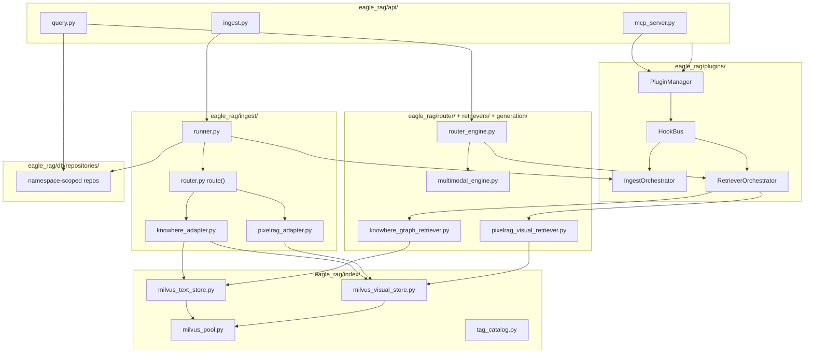
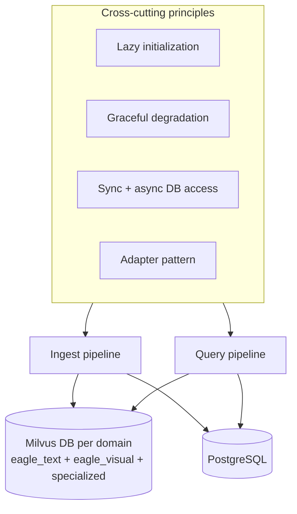

# Architecture

:octicons-project-24: This section explains **why** Eagle-RAG is shaped the way it is and **how** data moves through it. Read here before diving into per-module [backend](../backend/index.md) and [frontend](../frontend/index.md) references.

---

## Theory and foundations

### The problem space

Enterprise knowledge is rarely plain text. Teams ingest PDFs (text and scanned), spreadsheets, slides, images, and web pages — then ask questions that require **paragraphs**, **table layouts**, or **diagram positions**.

| Content type | Text-only RAG failure mode |
| --- | --- |
| Architecture diagram | Summary says "Figure 3 shows layers" — no pixel positions |
| Merged-cell spreadsheet | Flattened CSV loses header hierarchy |
| Scanned contract | OCR summary misses stamp/signature regions |

A single text embedding pipeline loses visual detail; a pure image pipeline loses structure and citations. [MuRAG (Chen et al., 2022)](https://arxiv.org/abs/2210.02928) shows multimodal retrieval improves QA when evidence spans modalities.

[Gao et al., 2023](https://arxiv.org/abs/2312.10997) categorizes production RAG into indexing, retrieval, and generation subsystems — Eagle-RAG maps each to explicit modules and storage tiers.

### Design thesis

Eagle-RAG's architecture answers four questions:

1. **Which parser?** → Route by format + content form ([routing matrix](routing-matrix.md))
2. **How to fuse text and visuals?** → Semantic-tree anchored fusion ([multimodal fusion](multimodal-fusion.md))
3. **How to isolate tenants?** → Two layers: `plugin_namespace` (Milvus Database + PG) and `kb_name` scalar filters inside that domain ([multi-tenancy](multi-tenancy.md))
4. **How to extend vertical domains?** → Microkernel + in-repo plugins + MCP ([plugin architecture](plugin-architecture.md), [ADR-008](adr/008-rag-only-plugin-platform.md))

!!! important "Pure RAG red line"
    Eagle-RAG is a **RAG data layer** (ingest / retrieve / assemble-context), not a business Agent application platform. The built-in frontend showcases **Core** knowhere + pixelrag only; domain plugins are **backend + MCP only**. See [Authoring an industry plugin](../guides/authoring-industry-plugin.md).

---

## Design goals

1. :octicons-file-binary-24: **Multimodal by construction** — separate pipelines, embeddings, and Milvus collections that converge in one generation engine.
2. :octicons-organization-24: **Multi-tenant by default** — `plugin_namespace` (domain) + `kb_name` (KB) enforced at every layer, not bolted on.
3. :octicons-shield-check-24: **Gracefully degradable** — probed dependencies; one outage degrades a feature, not the whole system.
4. :octicons-pulse-24: **Observable** — health probes, SSE logs, queue metrics, admin dashboards built in.

---

## Eagle-RAG implementation

### Module map

### Cross-cutting principles

| Principle | Implementation | Doc |
| --- | --- | --- |
| Lazy initialization | `get_settings()`, Milvus clients, `get_visual_encoder()` | [System design](system-design.md) |
| Graceful degradation | Retriever `try/except` → `[]`; non-blocking visual dispatch | [Reliability](reliability.md) |
| Sync + async DB | `*_sync` / async store pairs | [System design](system-design.md) |
| Adapter pattern | `knowhere_adapter`, `pixelrag_adapter` → LlamaIndex nodes | [System design](system-design.md) |

---

## Sections

| Topic | Page | Depth |
| --- | --- | --- |
| Principles and containers | [System design](system-design.md) | Lazy init, C4, model stack |
| Ingest and query sequences | [Data flow](data-flow.md) | End-to-end sequence diagrams |
| Document → pipeline selection | [Routing matrix](routing-matrix.md) | `route()` line-by-line |
| Domain + KB isolation | [Multi-tenancy](multi-tenancy.md) | `plugin_namespace`, `kb_name`, dedup, scope filter |
| Text + visual fusion | [Multimodal fusion](multimodal-fusion.md) | ANN, anchor fields, code path |
| Retries and degradation | [Reliability](reliability.md) | Celery, dead letter, state machine |
| Microkernel + plugins | [Plugin architecture](plugin-architecture.md) | Manager, hooks, ingest/query, isolation, MCP |
| RAG-only lock | [ADR-008](adr/008-rag-only-plugin-platform.md) | Hot paths, options, frontend scope |
| Authoring industry plugins | [Authoring guide](../guides/authoring-industry-plugin.md) | Template, contracts, bans |

---

## At a glance

**Stack summary**: FastAPI API · Celery workers (3 queues) · Plugin microkernel (`eagle_rag/plugins`) · Knowhere HTTP parser · PixelRAG in-process library · Milvus Database per `plugin_namespace` · PostgreSQL repositories · MinIO objects · Redis broker · Next.js frontend (Core only) · MCP at `/mcp`.

---

## Design tensions and tuning

| Tension | Where it appears | What to watch |
| --- | --- | --- |
| ANN recall vs query p99 | `eagle_text` / `eagle_visual` HNSW `ef` | Raise `ef` when users report “obvious chunk missing”; profile before raising `top_k` |
| Bi-encoder recall vs cross-encoder precision | `KnowhereGraphRetriever` → `_rerank` in `multimodal_engine.py` | High `top_k` with low `top_n` wastes rerank budget; low `top_k` starves reranker |
| Graph expansion noise | `connect_to` follow in `knowhere_graph_retriever.py` | Each ANN hit may pull linked table/footnote nodes — improves table QA, adds tokens |
| PDF probe false negatives | `probe_pdf_form` thresholds | Sparse OCR PDFs can look “text” to pypdf; tune per-KB `pdf_text_page_ratio` |
| Scope union cardinality | `_resolve_scope_filter` + `max_scope_documents` | Large tag unions inflate Milvus `document_id in [...]` — cap prevents expr blow-up |
| Tenant filter correctness | Every query path must push `kb_name` + trust `plugin_namespace` | KB scalar filters on shared collections are safe only when domain binding and filters are tested on all entry points (REST, MCP, search) |

See [system design](system-design.md) for lazy-init cold-start latency and [reliability](reliability.md) for degradation when Milvus or Knowhere is partial.

---

## Configuration

Architecture-relevant settings (full list: [configuration](../getting-started/configuration.md)):

| Key | Architectural effect |
| --- | --- |
| `kb_name` | Default tenant partition |
| `milvus.visual_index_type` | HNSW vs DiskANN for visual ANN |
| `ingest.routing` | Ingest pipeline selector chain |
| `ingest.source_type.rules` | Core default `[]`; industry labels via profile / deploy YAML |
| `plugins.enabled` / `default_namespace` | In-repo plugins and single-domain binding |
| `plugins.options.<ns>` | Vertical knobs (not Core-typed fields) |
| `EAGLE_RAG_PROFILE` | Merges `profiles:` overlays |
| `router.mode` | Query-time retriever selection |
| `celery.queues` | Worker pool topology |
| `pdf_probe` | Scanned vs text PDF classification |

---

## Failure modes and operations

| Subsystem down | User-visible effect | Recovery |
| --- | --- | --- |
| Knowhere | Text ingest fails; URL/Office blocked | Restore `:5005`; replay tasks |
| PixelRAG worker | Visual index incomplete; hybrid queries visual-empty | Fix OOM; drain `pixelrag_queue` |
| Milvus | Retrieval empty; KB health `offline` | Restore Milvus; may need re-ingest |
| PostgreSQL | API errors on sessions/ingest | Restore DB from backup |
| DeepSeek (routing) | Falls back to keyword heuristics if `router.llm.enabled` | Or disable LLM routing |
| Qwen-VL | Generation error message | Fix `VLM_API_KEY` |

Health aggregation: `GET /health` — per-dependency 3s timeout. See [Reliability](reliability.md).

---

## External anchors

| Resource | Role in architecture |
| --- | --- |
| [LlamaIndex](https://docs.llamaindex.ai/) | `TextNode`, `MilvusVectorStore`, query engines |
| [Milvus](https://milvus.io/docs) | ANN + scalar filtering |
| [Knowhere](https://github.com/Ontos-AI/knowhere) | Semantic document parser |
| [PixelRAG](https://github.com/StarTrail-org/PixelRAG) | Visual tiling + embedding |
| [MCP](https://modelcontextprotocol.io/) | Agent tool protocol |
| [Lewis et al., 2020](https://arxiv.org/abs/2005.11401) | RAG foundation |
| [HNSW](https://arxiv.org/abs/1603.09320) | Visual ANN default |

---

## References

- [Learning path](../learning-path.md) — curated reading order
- [Glossary](../glossary.md) — terminology
- [AGENTS.md](https://github.com/fintax-ai/eagle-rag/blob/master/AGENTS.md) — agent constraints
