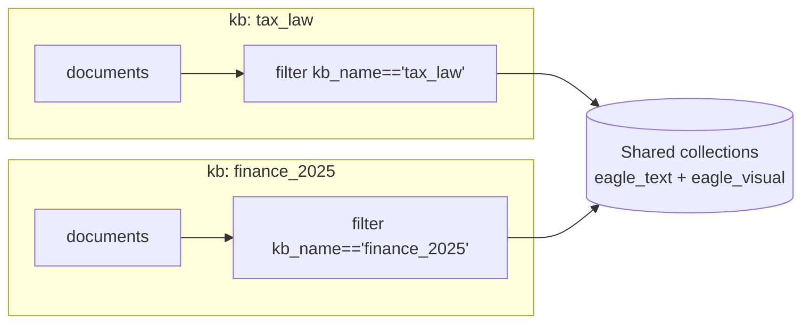

# Multi-tenancy

A single Eagle-RAG deployment can serve **finance**, **patent**, **pharma**, or any other knowledge base without separate Milvus clusters. Isolation is enforced by `kb_name` at every layer — from API request through Milvus scalar filters to dedup keys.

---

## Theory and foundations

### Multi-tenant RAG patterns

[Gao et al., 2023](https://arxiv.org/abs/2312.10997) identifies tenant isolation as a production concern: retrieval must never return another tenant's chunks.

Common patterns:

| Pattern | Isolation mechanism | Eagle-RAG |
| --- | --- | --- |
| Separate vector DB per tenant | Physical isolation | Not used — ops overhead |
| Separate collection per tenant | Logical Milvus isolation | Not used — schema sprawl |
| **Shared collection + metadata filter** | `kb_name` scalar filter on every query | **Chosen** |
| Separate deployment per tenant | Full stack duplication | Optional at infra level |

Milvus supports efficient scalar filtering with inverted indexes ([Milvus filtering](https://milvus.io/docs/scalar_index.md)) — filter pushdown before or during ANN search reduces scanned vectors.

### Why not global file dedup?

The same physical file (SHA-256) may belong in **multiple** knowledge bases — e.g. a regulatory PDF relevant to both `tax_law` and `compliance`. Composite dedup key `(sha256, kb_name)` allows duplicate bytes across tenants while preventing re-upload within one tenant.

---

## The tenancy key

`kb_name` matches `^[a-z0-9_]+$`, is the primary key of `knowledge_bases`, and is **immutable** after creation.

Default: `default` (`KB_NAME` env / `settings.kb_name`).



Vectors from all tenants live in **shared** Milvus collections; scalar filters enforce boundaries at query time.

---

## Eagle-RAG implementation

### Isolation mechanisms

| Layer | Mechanism | Code |
| --- | --- | --- |
| Dedup | PK `(sha256, kb_name)` | `eagle_rag/storage/dedup.py` |
| Milvus text | `MetadataFilters` → `kb_name == "..."` | `eagle_rag/index/milvus_text_store.py` |
| Milvus visual | `kb_name` field + inverted index in `_build_search_expr` | `eagle_rag/index/milvus_visual_store.py` |
| PostgreSQL | `kb_name` column + index on tenant tables | `eagle_rag/db/models/` |
| MinIO | Logical isolation via `document_id` registry | `eagle_rag/storage/minio_client.py` |
| API | `kb_name` on write/query; fallback `settings.kb_name` | API routers |
| MCP | All four tools accept `kb_name` | `eagle_rag/api/mcp_server.py` |
| Celery | `kb_name` in task kwargs | `knowhere_parse`, `pixelrag_build`, `ingest_router` |
| Sessions | `sessions.kb_name` | `eagle_rag/db/models/sessions.py` |
| Tags | `document_keywords.kb_name` | `eagle_rag/index/tag_catalog.py` |

### Dedup flow

```python
# eagle_rag/storage/dedup.py — conceptual
# PK: (sha256, kb_name)
check_duplicate(sha256, kb_name)  # before upload
register(sha256, document_id, kb_name=...)  # after successful parse only
```

Failed parse tasks do **not** register dedup — same file can be re-uploaded.

### Milvus text filtering

`KnowhereGraphRetriever` builds LlamaIndex `MetadataFilters`:

```python
# Pattern in milvus_text_store / retriever
MetadataFilter(key="kb_name", value=kb_name, operator=FilterOperator.EQ)
# Multi-KB scope:
# kb_name in ["tax_law", "pharma"]
```

### Milvus visual filtering

```python
# eagle_rag/index/milvus_visual_store.py — _build_search_expr pattern
expr_parts = [f'kb_name == "{kb_name}"']
if document_ids:
    expr_parts.append(f'document_id in [{quoted_ids}]')
# Combined with ANN search_params
```

Inverted index on `kb_name` created in `ensure_collection()`.

### Example Milvus expression

```
kb_name == 'pharma' and year in [2025, 2026] and document_id in ['doc_a', 'doc_b']
```

### Ingest propagation

```python
# knowhere_parse — effective_kb resolution
effective_kb = kb_name if kb_name is not None else get_settings().kb_name

nodes = chunks_to_text_nodes(..., kb_name=effective_kb)
upsert_text_nodes(nodes)

upsert_visual(..., kb_name=effective_kb)
```

Every vector row carries `kb_name` scalar — no post-hoc tenant assignment.

---

## Scope filter (query-time)

Beyond a single `kb_name`, `QueryRequest.scope_filter` accepts:

```json
{
  "kb_names": ["tax_law", "pharma"],
  "document_ids": ["doc_uuid_1"],
  "tags": ["增值税", "2025"]
}
```

### Resolution: `_resolve_scope_filter()`

```python
# eagle_rag/router/router_engine.py:122-150
def _resolve_scope_filter(scope_filter) -> tuple[list[str], list[str], bool]:
    kb_names = list(scope_filter.get("kb_names") or [])
    document_ids = list(scope_filter.get("document_ids") or [])
    tags = list(scope_filter.get("tags") or [])
    if not (kb_names or document_ids or tags):
        return [], [], False  # inactive — use legacy kb_name path

    doc_set = dict.fromkeys(document_ids)
    if tags:
        cap = get_settings().router.max_scope_documents  # default 500
        for doc_id in resolve_tags_to_document_ids(tags, cap=cap):
            doc_set.setdefault(doc_id, None)
    return kb_names, list(doc_set), True
```

**Union (OR) semantics** — any matching KB, explicit document ID, or tag-resolved document includes chunks.

When `active=True`, retrievers constructed with `kb_names` + `document_ids` lists — pushed to Milvus `in` predicates.

### Tag catalog

- Table: `document_keywords` — aggregated from Knowhere chunk `keywords` at ingest
- API: `GET /tags` — facet listing
- Resolution: `resolve_tags_to_document_ids(tags, cap=500)` — cross-KB tag union
- Tag write failure during ingest is **non-blocking**

Persisted in `sessions.scope_filter` for conversation continuity.

---

## Per-KB configuration

A knowledge base is more than a partition:

| Field | Purpose | Code |
| --- | --- | --- |
| `display_name`, `description`, `theme`, `icon` | Frontend KB module | `eagle_rag/kb/registry.py` |
| `pdf_text_page_ratio` | Overrides global PDF probe | `get_pdf_ratio_sync(kb_name)` in ingest_router |

```yaml
# Global default
pdf_probe:
  text_page_ratio: 0.2

# Per-KB override in knowledge_bases table
# pdf_text_page_ratio: 0.15  → passed to route(text_page_ratio=...)
```

---

## KB lifecycle

| Operation | Module | Behavior |
| --- | --- | --- |
| Create / validate | `eagle_rag/kb/registry.py` | Regex validate `kb_name` |
| Delete (cascade) | `eagle_rag/kb/lifecycle.py` | Milvus delete expr → documents → images → dedup → tasks → KB row |
| Rebuild | Admin API | Re-ingest all `ready` documents from `source_uri` |
| Health | `eagle_rag/kb/health.py` | `online` / `degraded` / `offline` |

### Health rules

| Status | Condition |
| --- | --- |
| **online** | Milvus reachable; no `failed` tasks in last hour for KB |
| **degraded** | Milvus OK but recent failures |
| **offline** | Milvus unreachable |

API: [knowledge bases](../api/knowledge-bases.md). Internals: [kb management](../backend/kb-management.md).

---

## Design tensions and tuning

| Tension | Code / config | Consequence |
| --- | --- | --- |
| Filter pushdown vs client scope | `scope_filter` OR union in `_build_filters` | Missing `kb_name` in one MCP tool path leaks cross-tenant hits — test all surfaces |
| Storage duplication vs dedup key | `(sha256, kb_name)` composite PK | Same bytes in two KBs = two full index copies; expected for tenant isolation |
| Tag union breadth | `resolve_tags_to_document_ids(..., cap=max_scope_documents)` | Hitting cap silently truncates tag expansion — narrow tags or raise cap consciously |
| Immutable `kb_name` | KB registry | Renaming tenant requires re-ingest / Milvus metadata migration, not a SQL UPDATE |
| Default tenant fallback | `get_settings().kb_name` when API omits value | Agents in multi-KB deployments should always pass explicit `kb_name` |

### Security note

Eagle-RAG has **no auth by default** (`auth.enabled: false`). Multi-tenancy is a **data organization** layer, not cryptographic isolation. Expose only on trusted networks or add API key / reverse-proxy auth.

---

## Configuration

| Key | Effect |
| --- | --- |
| `KB_NAME` / `kb_name` | Default tenant when API omits value |
| `router.max_scope_documents` | Cap tag → document_id resolution |
| `kb.text_entity_limit` | Capacity warning threshold text |
| `kb.visual_entity_limit` | Capacity warning threshold visual |
| Per-KB `pdf_text_page_ratio` | Ingest routing sensitivity |

```bash
KB_NAME=pharma task be:api
EAGLE_RAG_ROUTER__MAX_SCOPE_DOCUMENTS=1000
```

---

## Failure modes and operations

| Failure | Impact | Mitigation |
| --- | --- | --- |
| Missing `kb_name` on API call | Falls back to `settings.kb_name` | Always pass explicit `kb_name` in agents |
| Tag resolution error | Tags ignored; other scope dims apply | Check `document_keywords` table |
| Scope exceeds 500 docs | Tag resolution truncated | Increase `max_scope_documents` carefully |
| KB delete partial failure | Orphan vectors possible | Re-run cascade delete; Milvus expr by `kb_name` |
| Legacy vectors without `kb_name` | `ensure_collection` drops collection | Backup before migration |
| Wrong KB in MCP tool args | Retrieves wrong tenant's data | Validate agent tool inputs |

### Audit queries

```sql
-- Documents per KB
SELECT kb_name, count(*) FROM documents GROUP BY kb_name;

-- Vectors per KB (via document registry)
SELECT kb_name, sum(chunk_count) FROM documents WHERE status='ready' GROUP BY kb_name;
```

Milvus count by expr: `kb_name == 'pharma'` via admin or pymilvus.

!!! tip "API default"
    When clients omit `kb_name`, the server uses `settings.kb_name`. Explicit `kb_name` per request is recommended for multi-tenant agents.

---

## References

- [Milvus scalar filtering](https://milvus.io/docs/scalar_index.md)
- [Milvus multi-tenancy patterns](https://milvus.io/docs/multi_tenancy.md)
- [Gao et al., 2023](https://arxiv.org/abs/2312.10997)
- [Data flow — kb_name propagation](data-flow.md)
- [API knowledge bases](../api/knowledge-bases.md)
- [Glossary — kb_name](../glossary.md)
