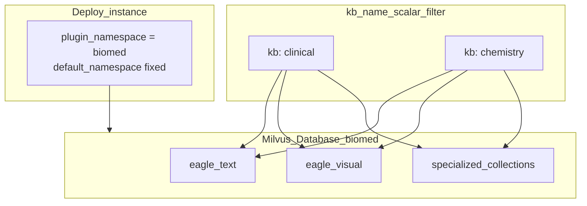

# Multi-tenancy

Eagle-RAG isolates data on **two axes**:

| Axis | Identifier | Mechanism |
| --- | --- | --- |
| **Domain** | `plugin_namespace` | Physical Milvus **Database** + PostgreSQL repository filter (deploy-time) |
| **Knowledge base** | `kb_name` | Scalar filter **inside** one domain Database (request-time) |

A single process binds one domain (`settings.plugins.default_namespace`). Within that domain, many KBs (`finance`, `patent`, `pharma`, …) share base collections and are separated by `kb_name`. Cross-domain retrieval uses **multiple instances**, not Core fan-out.

Canonical detail: [Plugin architecture](plugin-architecture.md). Decisions: [ADR-001](adr/001-milvus-database-isolation.md), [ADR-002](adr/002-single-domain-deployment.md).

---

## Theory and foundations

### Multi-tenant RAG patterns

[Gao et al., 2023](https://arxiv.org/abs/2312.10997) identifies tenant isolation as a production concern: retrieval must never return another tenant's chunks.

| Pattern | Isolation mechanism | Eagle-RAG |
| --- | --- | --- |
| Separate vector **Database** per **domain** | Physical Milvus DB | **Chosen** for `plugin_namespace` |
| Separate collection per KB | Logical sprawl | Not used for KBs |
| **Shared collection + metadata filter** | `kb_name` scalar on every ANN | **Chosen** for KBs inside a domain DB |
| Separate deployment per domain | Full stack duplication | **Chosen** for multi-industry (one instance each) |

Milvus scalar filtering with inverted indexes ([Milvus filtering](https://milvus.io/docs/scalar_index.md)) pushdown `kb_name` / `document_id` during ANN. Domain boundaries are stronger: clients are constructed with `db_name=` via `MilvusClientPool` — no per-request `using_database`.

### Why not global file dedup?

The same physical file (SHA-256) may belong in **multiple** knowledge bases — e.g. a regulatory PDF in both `tax_law` and `compliance`. Dedup PK is `(sha256, kb_name, plugin_namespace)` so the same bytes can exist across KBs/domains while preventing re-upload within one KB of one domain.

---

## Two-layer model



| Term | Meaning | Mutable at runtime? |
| --- | --- | --- |
| `plugin_namespace` | Domain binding (= Milvus DB name mapping) | **No** — deploy config / profile |
| `kb_name` | KB id, `^[a-z0-9_]+$`, PK with namespace | Created/deleted via KB API; immutable rename |

Do **not** call `kb_name` a “namespace” in UI/API copy — that word is reserved for `plugin_namespace`.

Default KB: `default` (`KB_NAME` / `settings.kb_name`).  
Default domain: `core` (`PLUGIN_NAMESPACE` / `settings.plugins.default_namespace`, or `EAGLE_RAG_PROFILE`).

---

## Eagle-RAG implementation

### Isolation mechanisms

| Layer | Mechanism | Code |
| --- | --- | --- |
| Domain resolve | Trust `default_namespace`; mismatch → **403** | `eagle_rag/db/namespace.py` |
| Dedup | PK `(sha256, kb_name, plugin_namespace)` | `eagle_rag/storage/dedup.py` |
| Milvus | `MilvusClientPool.get(db_name)` per domain | `eagle_rag/index/milvus_pool.py` |
| Milvus text/visual | `kb_name` (+ scope) scalar filters | `milvus_text_store.py` / `milvus_visual_store.py` |
| Specialized collections | Same DB; domain plugin schemas | e.g. `eagle_text_biomed` |
| PostgreSQL | Repository injects `plugin_namespace` | `eagle_rag/db/repositories/` |
| MinIO / MCP cache | Keys include `plugin_namespace` | storage + `mcp_cache` |
| API / MCP | `kb_name` on write/query; domain from settings | routers + `core_*` tools |
| Celery | `kb_name` (+ namespace from settings) in kwargs | ingest tasks |
| Sessions / tags | Namespace-scoped rows | repositories + `tag_catalog` |

### Domain binding (G19)

```python
# eagle_rag/db/namespace.py — conceptual
def resolve_namespace(requested: str | None = None) -> str:
    default = settings.plugins.default_namespace
    if not requested:
        return default
    if settings.plugins.allow_namespace_override:  # tests only
        return requested
    if requested != default:
        raise HTTPException(403, ...)  # production
    return default
```

### Dedup flow

```python
# PK: (sha256, kb_name, plugin_namespace)
check_duplicate(sha256, kb_name, plugin_namespace=...)
register(sha256, document_id, kb_name=..., plugin_namespace=...)
```

Failed parse tasks do **not** register dedup — same file can be re-uploaded.

### Milvus filtering (inside one DB)

```
kb_name == 'pharma' and year in [2025, 2026] and document_id in ['doc_a', 'doc_b']
```

`KnowhereGraphRetriever` uses LlamaIndex `MetadataFilters`; visual store builds `expr` in `_build_search_expr`. Inverted index on `kb_name` in `ensure_collection()`.

### Ingest propagation

Every vector row carries `kb_name`. Domain is implicit from the process-bound Milvus Database (and PG `plugin_namespace` column). Effective KB:

```python
effective_kb = kb_name if kb_name is not None else get_settings().kb_name
```

On successful ingest, `collections_used` is recorded on the document and unioned into the KB catalog ([ADR-006](adr/006-ingest-query-routing-contract.md)).

---

## Scope filter (query-time)

Beyond a single `kb_name`, `QueryRequest.scope_filter` accepts:

```json
{
  "kb_names": ["tax_law", "pharma"],
  "document_ids": ["doc_uuid_1"],
  "tags": ["增值税", "2025"]
}
```

**Union (OR) semantics** — any matching KB, explicit document ID, or tag-resolved document includes chunks. Tags resolve via `resolve_tags_to_document_ids(plugin_namespace, tags, cap=...)`.

When scope is active, retrievers use `kb_names` + `document_ids` lists pushed to Milvus `in` predicates.

**Scope-aware collection plans:** if scoped KBs/documents/tags catalog includes specialized collections, `RetrieverOrchestrator` forces those collection plans even when Core’s default classifier would only hit `eagle_text` / `eagle_visual` ([ADR-006](adr/006-ingest-query-routing-contract.md)).

Persisted in `sessions.scope_filter` for conversation continuity (sessions are namespace-scoped).

---

## Per-KB configuration

| Field | Purpose | Code |
| --- | --- | --- |
| `display_name`, `description`, `theme`, `icon` | Frontend KB module | `eagle_rag/kb/registry.py` |
| `collections_used` | Catalog of collections written by successful ingest | `knowledge_bases` + repositories |
| `pdf_text_page_ratio` | Overrides global PDF probe | `get_pdf_ratio_sync(kb_name)` |

KB primary key is `(kb_name, plugin_namespace)`.

---

## KB lifecycle

| Operation | Module | Behavior |
| --- | --- | --- |
| Create / validate | `eagle_rag/kb/registry.py` | Regex validate `kb_name`; bound to instance namespace |
| Delete (cascade) | `eagle_rag/kb/lifecycle.py` | Milvus delete in **domain DB** → documents → images → dedup → tasks → KB row |
| Rebuild | Admin API | Clears `collections_used`, re-ingests, recomputes catalog |
| Health / stats | `kb/health.py`, `kb/stats.py` | Fan-out specialized collections from plugin manifest |

API: [knowledge bases](../api/knowledge-bases.md). Internals: [kb management](../backend/kb-management.md).

---

## Design tensions and tuning

| Tension | Consequence |
| --- | --- |
| Domain vs KB confusion | Wrong mental model → agents pass “namespace” as `kb_name` or expect runtime domain switch |
| Filter pushdown vs client scope | Missing `kb_name` / scope on one MCP path can leak across KBs **inside** the domain DB |
| Storage duplication vs dedup key | Same bytes in two KBs = two index copies; expected |
| Tag union breadth | Cap `max_scope_documents` silently truncates |
| Immutable `kb_name` | Rename requires re-ingest, not SQL UPDATE |
| Multi-industry | Run one instance per `EAGLE_RAG_PROFILE`; do not fan-out across Milvus DBs in one query |

### Security note

Eagle-RAG has **no auth by default** (`auth.enabled: false`). Isolation is a **data organization** layer, not cryptographic multi-tenancy. Expose only on trusted networks or add API key / reverse-proxy auth. Domain 403 prevents accidental cross-namespace API override — it is not a substitute for network auth.

---

## Configuration

| Key | Effect |
| --- | --- |
| `EAGLE_RAG_PROFILE` | Overlay `profiles.<name>` → `default_namespace` + `milvus.db_name` |
| `PLUGIN_NAMESPACE` / `plugins.default_namespace` | Instance domain binding |
| `plugins.allow_namespace_override` | Tests only — allow request override |
| `KB_NAME` / `kb_name` | Default KB when API omits value |
| `router.max_scope_documents` | Cap tag → document_id resolution |

```bash
EAGLE_RAG_PROFILE=biomed task be:api   # domain = biomed Milvus DB
KB_NAME=clinical                       # default KB inside that domain
```

---

## Failure modes and operations

| Failure | Impact | Mitigation |
| --- | --- | --- |
| Missing `kb_name` on API | Falls back to `settings.kb_name` | Agents should pass explicit `kb_name` |
| Mismatched `plugin_namespace` | **403** | Align client with instance profile |
| Wrong profile | Empty ANN / wrong specialized collections | Check `/health/plugins` `default_namespace` |
| Tag resolution error | Tags ignored; other scope dims apply | Check `document_keywords` for namespace |
| KB delete partial | Orphan vectors possible | Re-run cascade in the correct Milvus DB |
| Wrong KB in MCP args | Cross-KB leak **within** domain | Validate agent tool inputs |

### Audit queries

```sql
-- Documents per KB within a domain
SELECT kb_name, count(*) FROM documents
WHERE plugin_namespace = 'biomed' GROUP BY kb_name;

-- KB collection catalog
SELECT kb_name, collections_used FROM knowledge_bases
WHERE plugin_namespace = 'biomed';
```

!!! tip "Two identifiers"
    Deploy binds **domain** (`plugin_namespace`). Requests select **KB** (`kb_name`). MCP Core tools: `core_ingest`, `core_query`, `core_retrieve_text`, `core_retrieve_visual`.

---

## References

- [Plugin architecture](plugin-architecture.md)
- [ADR-001 Milvus Database isolation](adr/001-milvus-database-isolation.md)
- [ADR-002 Single-domain deployment](adr/002-single-domain-deployment.md)
- [ADR-006 Ingest–query routing contract](adr/006-ingest-query-routing-contract.md)
- [Milvus scalar filtering](https://milvus.io/docs/scalar_index.md)
- [Data flow](data-flow.md) · [API knowledge bases](../api/knowledge-bases.md) · [Glossary](../glossary.md)
