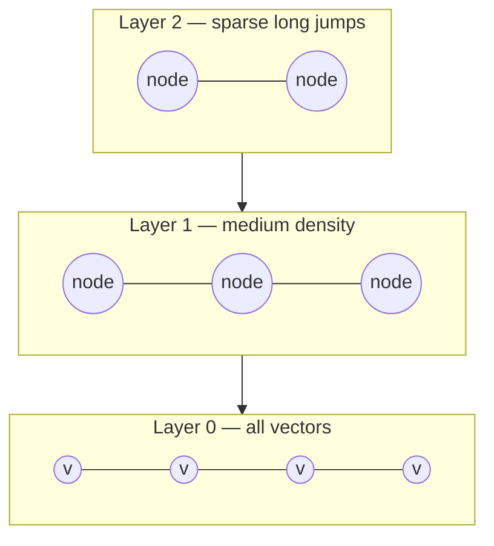
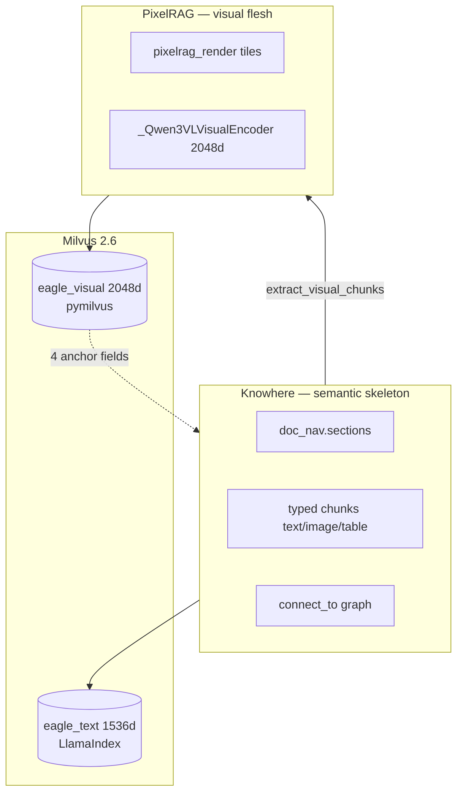
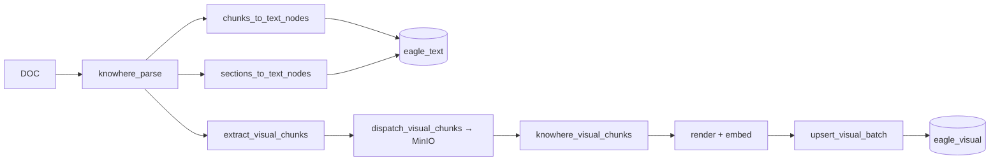
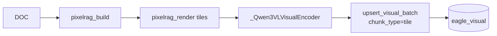
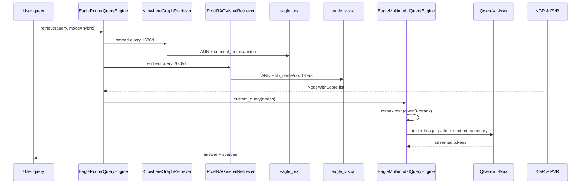

# Multimodal fusion

**Semantic-tree anchored pixel fusion** links Knowhere's document structure to PixelRAG's visual tiles inside one Milvus cluster. This page explains the theory, walks the actual code path (`extract_visual_chunks` → `upsert_visual`), and documents ANN math, tuning tensions, configuration, and failure modes.

---

## Theory and foundations

### The detail-loss problem

Text summaries work for paragraphs but fail for layout-sensitive content:

| Content | Text summary loses |
| --- | --- |
| Architecture diagram | Layer positions, residual branch topology, attention head layout |
| Complex HTML table | Merged cells, header hierarchy, numeric alignment |
| Scanned form | Checkbox states, stamp positions, handwriting |

Pure text RAG retrieves a sentence like *"image-1 Transformer Architecture"* — not the pixels needed to answer *"which side of the residual connection is LayerNorm on?"*

[MuRAG (Chen et al., 2022)](https://arxiv.org/abs/2210.02928) shows that retrieving multimodal evidence (text + images) improves open-domain QA over visually rich documents. Eagle-RAG's fusion design adds **structural anchors** so visual search can be scoped to document sections without cross-collection JOINs.

### Dual vector spaces

Text and images live in different embedding manifolds:

| Modality | Model | Dimension | Metric |
| --- | --- | --- | --- |
| Text | Qwen `text-embedding-v4` | 1536 | Cosine (LlamaIndex default) |
| Visual | Qwen3-VL-Embedding-2B | 2048 | IP on L2-normalized vectors |

[Gao et al., 2023](https://arxiv.org/abs/2312.10997) discusses multi-vector retrieval — Eagle-RAG runs two ANN queries at query time and fuses in the generation engine.

### ANN: HNSW intuition

[HNSW (Malkov & Yashunin, 2016)](https://arxiv.org/abs/1603.09320) builds a hierarchy of proximity graphs:



Search starts at top layer (coarse), greedily descends to lower layers (fine). Parameters:

| Param | Eagle-RAG value | Meaning |
| --- | --- | --- |
| `M` | 16 | Max bidirectional links per node |
| `efConstruction` | 256 | Candidate list size at build time |
| `ef` (search) | 64 | Candidate list size at query time |

[DiskANN](https://papers.nips.cc/paper/2019/hash/09853c7ff1cb93b59a86b8e886786b9b-Abstract.html) replaces in-memory graph with disk-resident Vamana when `MILVUS_VISUAL_INDEX_TYPE=diskann`.

### IP vs cosine with L2 normalization

For vectors \(\mathbf{a}, \mathbf{b}\) with \(\|\mathbf{a}\| = \|\mathbf{b}\| = 1\):

\[
\mathbf{a} \cdot \mathbf{b} = \cos\theta
\]

Eagle-RAG L2-normalizes visual embeddings before upsert. Milvus `metric_type=IP` on unit vectors is **equivalent to cosine similarity** — avoids Milvus cosine metric quirks while preserving ranking.

---

## Two stacks, one cluster



| Component | Role |
| --- | --- |
| [Knowhere](https://github.com/Ontos-AI/knowhere) | Document parser → `ParseResult` (chunks + `doc_nav.sections`). Eagle-RAG `knowhere.mode`: **`api`** (HTTP `:5005` + `knowhere-python-sdk`) or **`parser`** ([`knowhere-parse-sdk`](https://github.com/zhiweio/knowhere-parse-sdk), in-process) |
| [PixelRAG](https://github.com/StarTrail-org/PixelRAG) | Render + embed library (no FAISS in Eagle-RAG) |
| [Milvus](https://milvus.io/docs) | Dual collection; HNSW or DiskANN for visual ANN |

!!! note "Knowhere vs Milvus HNSW"
    `Ontos-AI/knowhere` is the **document parsing service**. Milvus's HNSW/DiskANN engine hosts visual vectors — unrelated projects, similar naming.

---

## Visual vector index in Milvus

Eagle-RAG persists visual embeddings in `eagle_visual` via `pymilvus.MilvusClient`, with scalar inverted indexes co-located for hybrid filter + ANN ([Milvus filtering](https://milvus.io/docs/scalar_index.md)).

### `ensure_collection()` — schema and indexes

```python
# eagle_rag/index/milvus_visual_store.py — key fields
schema.add_field("id", DataType.VARCHAR, max_length=64, is_primary=True)
schema.add_field("vector", DataType.FLOAT_VECTOR, dim=2048)
schema.add_field("kb_name", DataType.VARCHAR, max_length=64, default_value="default")
schema.add_field("document_id", DataType.VARCHAR, max_length=64)
schema.add_field("chunk_type", DataType.VARCHAR, max_length=16, default_value="tile")
schema.add_field("parent_section", DataType.VARCHAR, max_length=512, nullable=True)
schema.add_field("content_summary", DataType.VARCHAR, max_length=2048, nullable=True)
schema.add_field("source_chunk_id", DataType.VARCHAR, max_length=128, nullable=True)
# + image_path, page, position, year, source_type
```

**Vector index** (`_vector_index_params`):

=== "HNSW (default)"

    ```python
    {"index_type": "HNSW", "metric_type": "IP",
     "params": {"M": 16, "efConstruction": 256}}
    ```

    In-memory graph — low latency for tens of millions of 2048-d vectors.

=== "DiskANN"

    Set `MILVUS_VISUAL_INDEX_TYPE=diskann`. Disk-resident Vamana — breaks memory ceiling for billion-scale slices.

**Scalar inverted indexes** on `kb_name`, `document_id`, `source_type`, `year`, `chunk_type`, `parent_section` — accelerate filter pushdown before or during vector search ([Milvus filtering](https://milvus.io/docs/scalar_index.md)).

**Migration:** Legacy collections missing `kb_name` are dropped and recreated. New fields added via `add_collection_field()` without full drop.

### ANN tuning tension (HNSW)

| Parameter | Build-time / search | Raises recall when ↑ | Costs when ↑ |
| --- | --- | --- | --- |
| `M` | Build (`16`) | Graph connectivity — better recall on hard queries | Index size, build time |
| `efConstruction` | Build (`256`) | Index quality | Build time |
| `ef` | Search (`64` in `search_visual`) | Query-time recall | Query latency |

For corpus beyond RAM, switch to DiskANN (`MILVUS_VISUAL_INDEX_TYPE=diskann`) — trades latency for disk-resident graph ([DiskANN, NeurIPS 2019](https://papers.nips.cc/paper/2019/hash/09853c7ff1cb93b59a86b8e886786b9b-Abstract.html)).

---

## Innovation 2: Qwen3-VL visual encoding

`_Qwen3VLVisualEncoder` singleton in `eagle_rag/ingest/pixelrag_adapter.py`:

### Architecture intuition

- **Dual-tower** — query text and document images mapped to shared 2048-d space
- **Last-token pooling** — representation taken at `<|endoftext|>` (EOS) token after chat template; captures full image+instruction context
- **L2 normalization** — \(\|\mathbf{v}\|_2 = 1\) before upsert → IP search = cosine
- **`provider == "pixelrag"`** — `_ensure_loaded()` raises if misconfigured; **no mock embeddings**

### Preprocessing

| Setting | Default | Purpose |
| --- | --- | --- |
| `pixelrag.viewport_width` | 875 px | Render width — aligns to 28 px ViT patches |
| `pixelrag.tile_height` | 8192 px | Vertical slice per page |
| `pixelrag.quality` | 85 | JPEG quality for tiles |
| `pixelrag.embed_instruction` | `"Represent the user's input."` | Shared query/document instruction |

Screenshot fine-tuning in Qwen3-VL-Embedding improves recall on document layouts vs generic CLIP encoders ([PixelRAG paper](https://github.com/StarTrail-org/PixelRAG)).

### Lazy singleton pattern

```python
# Pattern in pixelrag_adapter.py
_encoder: _Qwen3VLVisualEncoder | None = None

def _get_encoder() -> _Qwen3VLVisualEncoder:
    global _encoder
    if _encoder is None:
        _encoder = _Qwen3VLVisualEncoder(...)
    return _encoder
```

API process does not load GPU weights until a worker or handler calls `embed()`.

---

## Innovation 3: Four anchor fields

### Extraction: `extract_visual_chunks()`

```python
# eagle_rag/ingest/knowhere_adapter.py:401-448
def extract_visual_chunks(parse_result) -> list[dict]:
    visual_chunks: list[dict] = []
    parent_section = ""
    for chunk in parse_result.chunks:
        ctype = getattr(chunk, "type", "text")
        if ctype == "text":
            parent_section = getattr(chunk, "path", "") or ""
            continue
        if ctype in ("image", "table"):
            visual_chunks.append({
                "chunk_id": getattr(chunk, "chunk_id", None),
                "type": ctype,
                "data": getattr(chunk, "data", None) if ctype == "image" else None,
                "html": ... if ctype == "table" else None,
                "summary": _meta(chunk, "summary", "") or "",
                "parent_section": parent_section,
                "file_path": _meta(chunk, "file_path", "") or "",
            })
    return visual_chunks
```

**Invariant:** `parent_section` = `path` of the **most recent preceding text chunk** in document order. Preserves reading-order section affiliation.

### Dispatch: `dispatch_visual_chunks()`

```python
# eagle_rag/ingest/knowhere_adapter.py:451-537
def dispatch_visual_chunks(job_id, document_id, visual_chunks, *, kb_name, source_type):
    for chunk in visual_chunks:
        # image → MinIO {document_id}/visual_chunks/{chunk_id}.ext
        # table → MinIO {document_id}/visual_chunks/{chunk_id}.html
        upload_bytes(object_key, ...)
    visual_job_id = f"{job_id}:visual"  # separate lifecycle from knowhere_parse
    app.send_task("eagle_rag.tasks.knowhere_visual_chunks",
                  kwargs={..., "chunks": chunk_descriptors},
                  queue="pixelrag_queue")
```

**Why separate `visual_job_id`:** Sharing parent `job_id` would conflict when parent reaches `SUCCESS` while visual task enters `RENDERING` — illegal state transition → infinite Celery retries.

### Encode + upsert: `knowhere_visual_chunks` → `upsert_visual()`

Task on `pixelrag_queue`:

1. Download visual blob from MinIO
2. Render/embed via PixelRAG (tables may render HTML to image)
3. Call `upsert_visual()` or `upsert_visual_batch()`

```python
# eagle_rag/index/milvus_visual_store.py:277-328
def upsert_visual(*, image_id, vector, image_path, document_id,
                  kb_name=None, chunk_type=None, parent_section=None,
                  content_summary=None, source_chunk_id=None, ...):
    upsert_visual_batch([{...}])

def upsert_visual_batch(items: list[dict]) -> None:
    client = get_visual_client()
    rows = [_build_row(it) for it in items]
    client.upsert(collection_name=_collection_name(), data=rows)
```

`_build_row()` normalizes `kb_name` fallback to `get_settings().kb_name`; defaults `chunk_type` to `"tile"` for pure PixelRAG paths.

### Anchor field reference

| Field | Written by | Meaning | Milvus filter |
| --- | --- | --- | --- |
| `chunk_type` | `knowhere_visual_chunks` / `pixelrag_build` | `tile` / `image` / `table` | EQ |
| `parent_section` | `extract_visual_chunks` | Nearest text chunk `path` | LIKE |
| `content_summary` | Knowhere chunk summary | VLM prompt context | — |
| `source_chunk_id` | Knowhere `chunk_id` | Link to `eagle_text` node | EQ |

**Why four fields?**

| Field | Problem solved |
| --- | --- |
| `parent_section` | Section-scoped visual search: `parent_section like "%3 Model Architecture%"` |
| `content_summary` | Text context for VLM without re-fetching `eagle_text` |
| `source_chunk_id` | Cross-collection drill-down to text chunk |
| `chunk_type` | Distinguish full-page tiles from inline figures |

---

## Parent-document retrieval

Two-stage retrieval for long Knowhere documents:

### Stage 1: Section summaries

`sections_to_text_nodes()` walks `doc_nav.sections` recursively:

```python
# eagle_rag/ingest/knowhere_adapter.py:272-337
digest = hashlib.sha1(f"{document_id}:{path}".encode()).hexdigest()[:16]
node = TextNode(text=summary, id_=f"sec_{digest}")
node.metadata = {"type": "section_summary", "path": path, "chunk_count": chunk_count, ...}
```

Stable IDs enable idempotent upsert across re-parses.

### Stage 2: Path prefix drill-down

Fine-grained chunk `path` shares prefix with section summary:

```
doc/3 Model Architecture          ← section_summary
doc/3 Model Architecture/3.2 Attention/...  ← leaf chunk
```

`KnowhereGraphRetriever` can filter `MetadataFilter(key="path", ...)` or prefix match — parent/child association without extra edge table.

### Visual stage

After text section recall, filter visuals:

```
parent_section like "%doc/3 Model Architecture%" and chunk_type == "image"
```

Implemented in `PixelRAGVisualRetriever` via `_build_search_expr()` in `milvus_visual_store.py`.

---

## Ingest paths

### Path A: Knowhere document with embedded visuals



### Path B: Fully visual document (`pixelrag_build`)

Scanned PDF, image file, URL, HTML:



`chunk_type=tile`; `parent_section` may be empty; `content_summary` from page metadata if available.

Visual dispatch failure on Path A does **not** block document `ready` — text retrieval remains available.

---

## Query path



`content_summary` from visual hits enriches VLM prompt when image alone is ambiguous.

Generation details: [multimodal engine](../backend/generation.md). Retrieval: [retrieval](../backend/retrieval.md).

---

## Design tensions and tuning

| Tension | Code / setting | Why it matters |
| --- | --- | --- |
| Pooling geometry | Last-token at `<\|im_end\|>` in `_Qwen3VLVisualEncoder` | Must match Qwen3-VL-Embedding training; mean pooling shifts query–tile geometry |
| Metric vs normalization | `metric_type=IP` on L2-normalized 2048-d vectors | Inner product equals cosine; unnormalized vectors break ranking |
| Tile granularity | `pixelrag.tile_height`, `viewport_width` (875 → 28px patches) | Smaller tiles ↑ recall on footnotes; ↑ ingest embed cost linearly |
| Anchor field cardinality | Four fields on `upsert_visual` | `parent_section LIKE` without `chunk_type` mixes table tiles with figure tiles |
| Async visual subtask | `knowhere_visual_chunks` after `ready` | Text QA unblocked; section-scoped visual filter useless until tiles land |
| Non-blocking dispatch | `dispatch_visual_chunks` swallows errors | Monitor pixelrag queue / dead letter — silent visual gap |
| Text vs visual model mismatch | 1536-d text + 2048-d visual | Router must run both retrievers in hybrid; generation merges in VLM prompt |

---

## Configuration

| Key | Effect on fusion |
| --- | --- |
| `milvus.dim_visual` | Must match encoder output (2048) |
| `milvus.visual_index_type` | `hnsw` vs `diskann` |
| `pixelrag.tile_height` | Tiles per page — recall granularity |
| `pixelrag.viewport_width` | Patch alignment (875 → 28px multiples) |
| `pixelrag.embed_device` | `auto` / `cuda` / `mps` / `cpu` |
| `embedding.visual.provider` | Must be `pixelrag` |
| `router.structure_max_nodes` | Cap `doc_nav` tree in PostgreSQL |
| `kb.visual_entity_limit` | Capacity planning for visual vectors |

```bash
MILVUS_VISUAL_INDEX_TYPE=diskann
PIXELRAG_EMBED_DEVICE=cuda
```

---

## Failure modes and operations

| Failure | System behavior | Operator action |
| --- | --- | --- |
| `dispatch_visual_chunks` exception | Logged; `knowhere_parse` still `SUCCESS` | Check MinIO; replay visual subtask |
| `knowhere_visual_chunks` OOM | Worker crash; retry → dead letter | Keep `pixelrag_queue` c=1; add RAM |
| Milvus upsert fails | Logged; possible missing visuals | Check Milvus; re-ingest document |
| Missing `parent_section` | Visual hit still searchable globally | Expected for `pixelrag_build` tiles |
| Encoder load fails | `pixelrag_build` `FAILED` | Verify `pixelrag_embed` install, GPU drivers |
| Dimension mismatch | Milvus insert error | Ensure `dim_visual: 2048` matches model |
| Legacy collection no `kb_name` | Auto drop+recreate on `ensure_collection` | **Data loss** — backup before upgrade |

### Verification

```bash
# After Knowhere ingest with images
curl localhost:8000/documents/{id}/structure  # doc_nav tree
# Hybrid query — check image sources in response
uv run pytest tests/test_knowhere_visual_chunks.py -q
```

---

## References

| Resource | Contribution |
| --- | --- |
| [MuRAG, Chen et al., 2022](https://arxiv.org/abs/2210.02928) | Multimodal retrieval motivation |
| [Gao et al., 2023](https://arxiv.org/abs/2312.10997) | Multi-vector RAG survey |
| [HNSW](https://arxiv.org/abs/1603.09320) | Visual ANN default |
| [DiskANN, NeurIPS 2019](https://papers.nips.cc/paper/2019/hash/09853c7ff1cb93b59a86b8e886786b9b-Abstract.html) | Disk ANN option |
| [Milvus hybrid search](https://milvus.io/docs/multi-vector-search.md) | Dual collection patterns |
| [Milvus scalar index](https://milvus.io/docs/scalar_index.md) | Inverted indexes on anchors |
| [PixelRAG](https://github.com/StarTrail-org/PixelRAG) | MLSys 2026 Best Paper |
| [Knowhere](https://github.com/Ontos-AI/knowhere) | Semantic parser SDK |
| [Qwen3-VL-Embedding](https://huggingface.co/Qwen) | Model card |
