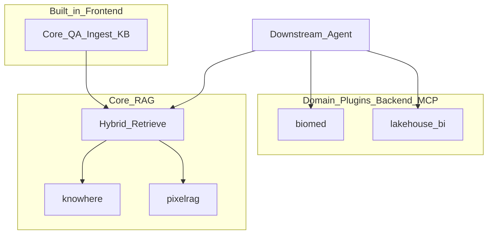
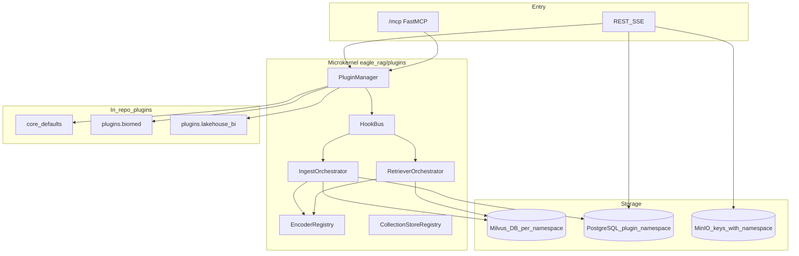
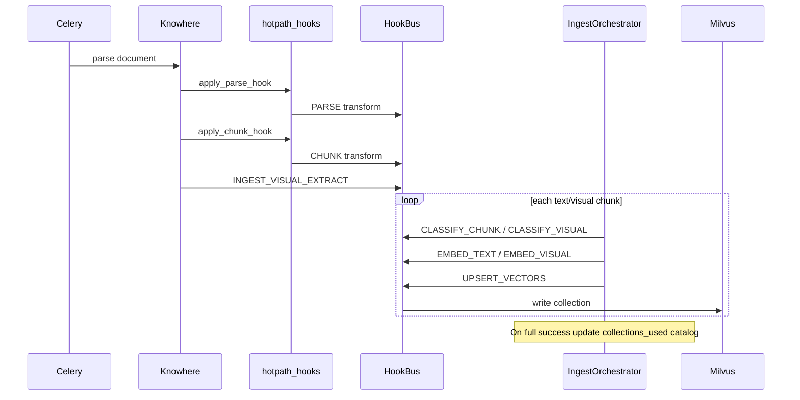
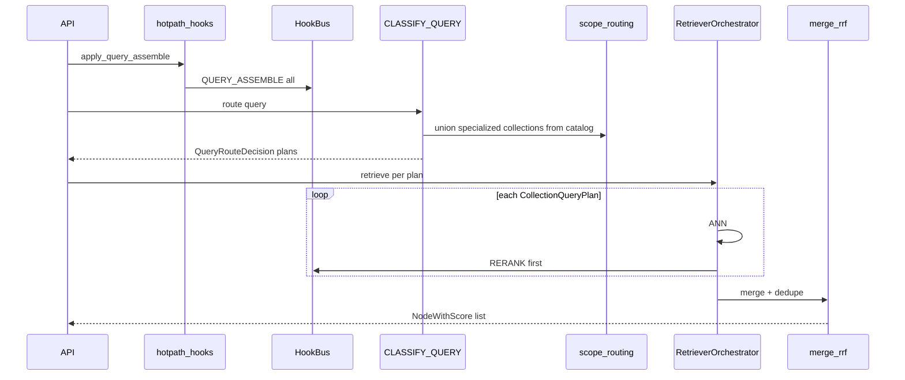

# Plugin architecture

Eagle-RAG is a **microkernel RAG platform**: a domain-agnostic Core plus in-process industry plugins that improve recall quality. Plugins share the same process, models, and MCP endpoint; each deployed instance binds a single industry namespace.

Chinese translation: [plugin-architecture.md](../../zh/architecture/plugin-architecture.md).

Authoring guide: [Authoring an industry plugin](../guides/authoring-industry-plugin.md). Template: `plugins/_template/`.

---

## Product boundary

Eagle-RAG is a **pure RAG data layer** for Agents — not a business Agent application platform.

| In scope | Out of scope |
| --- | --- |
| Ingest, chunk, multi-encoder retrieve, RRF, provenance | Agent workflows, multi-step planning / reflection |
| REST / SSE / MCP for **retrieve + ingest** | Text-to-SQL execution, DB writes, email, orders |
| Domain plugins that improve **recall quality** | Domain Agent UIs, approval flows, dashboards |
| Structured context packs + sources for Agents | Deciding or closing business loops |

| Surface | Scope |
| --- | --- |
| **Built-in frontend** | **Core only** — knowhere (semantic structure) + pixelrag (visual) hybrid |
| **Domain plugins** (biomed, lakehouse-bi, …) | **Backend + MCP only** — no domain UI in this repo |
| **Downstream** | Agent / customer UI via MCP or API |

See [ADR-008](adr/008-rag-only-plugin-platform.md).



---

## Design summary

| Concern | Mechanism |
| --- | --- |
| Extension model | In-process plugins loaded from `settings.plugins.enabled` (in-repo modules only; no pip `entry_points`) |
| Instance binding | `settings.plugins.default_namespace` = Milvus Database + PG repository filter ([ADR-002](adr/002-single-domain-deployment.md)) |
| KB tenancy | `kb_name` scalar filter **inside** one domain DB ([multi-tenancy](multi-tenancy.md)) |
| Hot-path hooks | `PARSE` / `CHUNK` / `QUERY_ASSEMBLE` via `eagle_rag/plugins/hotpath_hooks.py` |
| Ingest orchestration | `IngestOrchestrator` + `CLASSIFY_*` / `EMBED_*` / `UPSERT_VECTORS` |
| Query orchestration | `QueryRouteClassifier` → `RetrieverOrchestrator` → per-plan rerank → RRF merge |
| MCP | `{namespace}_{name}`; instance exposes `core_*` + `default_namespace` tools only |
| Config knobs | `settings.plugins.options[<namespace>]` via `plugin_options()` — not Core-typed industry settings |

Core itself is a plugin (`eagle_rag.plugins.core_defaults`, namespace `core`) on the same hook and MCP path as domain plugins.

---

## Layered architecture



| Module | Role |
| --- | --- |
| `eagle_rag/plugins/manager.py` | Discover, validate (G3), load, register MCP / Celery modules |
| `eagle_rag/plugins/hookbus.py` | `invoke_first` / `invoke_all` / `invoke_transform` with namespace filter |
| `eagle_rag/plugins/contract.py` | `PluginManifest` + `Plugin` protocol |
| `eagle_rag/plugins/hotpath_hooks.py` | Wire PARSE / CHUNK / QUERY_ASSEMBLE into Knowhere + router |
| `eagle_rag/plugins/ingest_orchestrator.py` | Classify → embed → upsert per chunk |
| `eagle_rag/plugins/retriever_orchestrator.py` | Multi-collection ANN + RRF |
| `eagle_rag/plugins/mcp_registry.py` | `@register_mcp_tool` + RAG-only name guard |
| `eagle_rag/plugins/core_defaults.py` | Base classifiers, encoders, knowhere/pixelrag pipelines |
| `eagle_rag/db/namespace.py` | Resolve / reject request `plugin_namespace` vs instance default |
| `eagle_rag/db/repositories/` | Force `plugin_namespace` on all PG reads/writes |
| `eagle_rag/index/milvus_pool.py` | Pooled `MilvusClient(uri, db_name=)` — no per-request DB switch |

---

## Core concepts

### `plugin_namespace` vs `kb_name`

| Term | Meaning |
| --- | --- |
| `plugin_namespace` | Deploy-time domain binding (= Milvus Database). Fixed by config; **not** a runtime UI switcher. |
| `kb_name` | Knowledge-base id inside that Database (scalar filter). Users pick KBs; they do not pick domains. |

Do not conflate the two in API or UI copy.

### Single-domain deployment

Each process binds one `default_namespace`. Cross-industry retrieval is **multiple instances**, not Core fan-out across Milvus Databases. Within one DB, a single query **may** hit multiple collections (e.g. `eagle_text` + `eagle_text_biomed` + `eagle_visual`).

Production repositories trust only `settings.plugins.default_namespace`. An explicit mismatched `plugin_namespace` returns **403** unless `plugins.allow_namespace_override` is enabled (tests). See [ADR-002](adr/002-single-domain-deployment.md).

### Base vs specialized collections

Every domain Database always has:

- `eagle_text` — Knowhere semantic chunks (Qwen text embedding, 1536-d)
- `eagle_visual` — PixelRAG tiles / images / tables (Qwen3-VL, 2048-d)

Plugins may add specialized collections (declared on `PluginManifest.provides_specialized_collections`). Core default routing **never** auto-queries those collections ([ADR-004](adr/004-multi-encoder-rrf-fusion.md) G4); only a domain `QueryRouteClassifier` or scope-aware catalog union may add them.

PixelRAG vision is a **first-class Core** capability — not an optional plugin. What is pluggable is domain chunking, classifiers, encoders, and specialized collections.

---

## Plugin contract

A plugin module exports a module-level `plugin` object implementing:

```python
class Plugin(Protocol):
    manifest: PluginManifest
    def register_hooks(self, bus: HookBus) -> None: ...
    def on_load(self, ctx: PluginContext) -> None: ...
    def on_unload(self) -> None: ...
    def ensure_collections(self, ctx: PluginContext) -> None: ...
    # optional
    def register_mcp_tools(self) -> None: ...
```

`PluginManifest` fields:

| Field | Purpose |
| --- | --- |
| `namespace` | Domain id (`core`, `biomed`, `lakehouse-bi`, …) |
| `version` | Semver string |
| `milvus_db_name` | Target Milvus Database (optional; mapped via `milvus_ns`) |
| `depends_on` | Other namespaces; load order is topological |
| `provides_pipelines` | Ingest pipeline names registered on load |
| `provides_specialized_collections` | Extra Milvus collections for reconstruct / stats fan-out |
| `provides_mcp_tools` | Declared tool short-names (documentation / health) |
| `resource_hints` | Optional GPU / load-order hints |

`PluginManager.load_all()`:

1. Ensures `eagle_rag.plugins.core_defaults` is always enabled first.
2. Imports each module; rejects duplicate namespaces.
3. Validates G3: non-`core` enabled plugins must match `default_namespace`.
4. Calls `on_load` → `ensure_collections` → `register_hooks` in dependency order.
5. Collects Celery task modules via `CELERY_TASKS` hook.
6. Calls `register_mcp_tools()` for `core` + `default_namespace` only.

---

## Hook system

### Invocation modes

| Mode | Method | Semantics |
| --- | --- | --- |
| `FIRST` | `invoke_first` | First non-`None` wins (priority desc) |
| `TRANSFORM` | `invoke_transform` | Pipeline: each subscriber transforms the value |
| `ALL` | `invoke_all` | Collect all results; used by `QUERY_ASSEMBLE` / `CELERY_TASKS` |

Subscribers with `namespace=None` run for every context; others only when `HookContext.plugin_namespace` matches. Core defaults typically use low priority (`-1000`) as fallbacks; domain plugins use higher priority (`100`).

### Exception policy (G13)

| Path | Policy |
| --- | --- |
| Ingest / classify / embed / upsert / PARSE / CHUNK | **Fail-fast** → `HookInvocationError` |
| `QUERY_ASSEMBLE` | Per-subscriber try/except; degrade and audit |

### Hook catalog

| Hook | Mode | Typical use |
| --- | --- | --- |
| `PARSE` | transform | Enrich Knowhere `ParseResult` |
| `CHUNK` | transform | Domain chunking / typed metadata before orchestrator |
| `INGEST_VISUAL_EXTRACT` | first | Extract visual chunks + four-anchor fields |
| `CLASSIFY_CHUNK` / `CLASSIFY_VISUAL` | first | Route chunk → collection + encoder |
| `CLASSIFY_QUERY` | first | Build multi-collection `QueryRouteDecision` |
| `EMBED_TEXT` / `EMBED_VISUAL` | first | Domain encoders via `EncoderRegistry` |
| `UPSERT_VECTORS` | transform | Persist vectors (default writes Milvus) |
| `INGEST_ROUTE_SELECTORS` | first | Extra format → pipeline selectors |
| `QUERY_ASSEMBLE` | all | Query expand / entity hints before ANN |
| `RERANK` | first | Per-plan domain rerank |
| `RETRIEVE_VISUAL_FILTER` | first | Visual filter overrides |
| `CELERY_TASKS` | all | Extra Celery include modules |

Hot-path wiring:

- `apply_parse_hook` / `apply_chunk_hook` — Knowhere ingest path
- `apply_query_assemble` — router before ANN (`plugins.query_assemble_enabled`)

---

## Ingest path

Fixed order (G26):

```text
PARSE → CHUNK → INGEST_VISUAL_EXTRACT → CLASSIFY_* → IngestOrchestrator (EMBED_* → UPSERT_VECTORS)
```



`IngestOrchestrator.classify` uses `CLASSIFY_*` hooks; `embed_and_upsert` honors `ClassificationDecision.target_encoder` through `EncoderRegistry` / `encoder_runtime`.

### Collection catalog (ingest ↔ query contract)

On **successful** ingest only (`documents.status=success`, all chunks written):

- `documents.extra["collections_used"]` — per document
- `knowledge_bases.collections_used` — KB-level union

Failed or partial ingests do not update the catalog. Query scope uses this catalog to force specialized collection plans when the scoped docs/KBs/tags used them ([ADR-006](adr/006-ingest-query-routing-contract.md)).

Format routing (Knowhere vs PixelRAG) remains in `eagle_rag/ingest/router.py` — see [routing matrix](routing-matrix.md). Plugins may contribute via `INGEST_ROUTE_SELECTORS`.

---

## Query path



### Default vs domain routing (G4 / G20)

- **Core** `CLASSIFY_QUERY`: only `eagle_text` (+ `eagle_visual` when hybrid / image). Never specialized collections.
- **Biomed**: rule + UMLS entity triggers may add `eagle_text_biomed` / chemical / medical collections; abstain falls back to Core. Pure text without entity hits defaults to `eagle_text` only (`default_dual_text_search: false`).
- **Scope-aware union**: if `scope_filter` KBs / documents / tags catalog includes specialized collections, those plans are forced even when the classifier abstains.

### Multi-encoder merge (G8 / G14 / G32)

1. Run ANN per `CollectionQueryPlan` (best-effort: failed plans are skipped and audited).
2. Optional per-plan `RERANK` hook.
3. Merge with RRF (`eagle_rag/router/rerank_fusion.py`) — never raw cross-embedding scores.
4. Dedupe by `source_chunk_id` (if set) or `(document_id, path)`.

Parent-document retrieval (`settings.router.parent_doc_retrieval`, default `true`) remains a Core two-stage Milvus path on `eagle_text` (`section_summary` then path drill-down). Eagle does not call Knowhere's `RetrievalAgent` / `WorkflowOrchestrator` ([ADR-005](adr/005-knowhere-eagle-boundary.md)).

---

## Isolation model

### Milvus ([ADR-001](adr/001-milvus-database-isolation.md))

- One Milvus **Database** per `plugin_namespace` (`core` → `default`, `lakehouse-bi` → `lakehouse_bi`, …).
- No `plugin_namespace` scalar field on vectors; isolation is physical DB separation.
- `MilvusClientPool` binds `db_name` at construction. Do not call `using_database` per request or `close()` on pooled clients.

### PostgreSQL

All domain tables go through repositories that inject `plugin_namespace`. Same `kb_name` in different namespaces does not collide. Applies to documents, keywords/tags, sessions, images metadata, task audit, notifications, MCP call logs.

### Object storage / cache

Image object keys, original document keys, and MCP cache keys include `plugin_namespace` so multi-instance shares of MinIO/Redis stay isolated.

---

## MCP surface

Single FastMCP app at `/mcp` (HTTP default).

| Rule | Detail |
| --- | --- |
| Naming | `{namespace}_{name}` with underscores (`core_ingest`, `biomed_query_entities`) |
| Registration | Explicit `plugin.register_mcp_tools()`; decorator `@register_mcp_tool` |
| Instance filter (G3) | Only `core_*` + tools from the `default_namespace` plugin |
| RAG-only | `assert_rag_only_tool_name` rejects side-effect fragments (`execute_sql`, `send_email`, …) |
| Breaking change | Pre-plugin bare names (`ingest`) are **not** aliased |

Core tools: `core_ingest`, `core_query`, `core_retrieve_text`, `core_retrieve_visual`.

Domain examples:

- Biomed: `biomed_query_entities`, `biomed_retrieve_compounds`
- Lakehouse: `lakehouse_bi_query_semantic_context`, `lakehouse_bi_retrieve_historical_analysis`

See [ADR-003](adr/003-mcp-tool-naming-and-registration.md) and [MCP tools](../api/mcp-tools.md).

---

## Deployment profiles

Activate with `EAGLE_RAG_PROFILE` (or YAML `active_profile`). Profile overlays deep-merge into top-level settings.

```yaml
# eagle_rag/settings.yaml (excerpt)
plugins:
  enabled:
    - eagle_rag.plugins.core_defaults
  default_namespace: ${PLUGIN_NAMESPACE:-core}
  allow_namespace_override: false
  query_assemble_enabled: true
  options:
    biomed:
      default_dual_text_search: false
      encoder_mode: auto   # auto | require_native | deterministic

profiles:
  core:
    plugins:
      enabled: [eagle_rag.plugins.core_defaults]
      default_namespace: core
    milvus:
      db_name: default
  biomed:
    plugins:
      enabled: [eagle_rag.plugins.core_defaults, plugins.biomed]
      default_namespace: biomed
    milvus:
      db_name: biomed
  lakehouse-bi:
    plugins:
      enabled: [eagle_rag.plugins.core_defaults, plugins.lakehouse_bi]
      default_namespace: lakehouse-bi
    milvus:
      db_name: lakehouse_bi
```

Default compose profile is `core`. Enabling biomed / lakehouse-bi requires the matching profile and restart. Docker images package `plugins/`; compose override mounts `./plugins` for local iteration.

---

## Shipped domain plugins

### `plugins/biomed`

| Capability | Detail |
| --- | --- |
| Specialized collections | `eagle_text_biomed`, `eagle_chemical`, `eagle_medical_radiology`, `eagle_medical_pathology` |
| Text encoder | PubMedBERT (via `EncoderRegistry`) |
| Medical imaging | Radiology → MedImageInsight; pathology → UNI 2 — **never** fall back to Qwen3-VL |
| Query routing | Rules + local UMLS subset (`routing_rules.yaml` / `umls.py`); no LLM classifier |
| MCP | Entity query + compound retrieve (MolFormer ANN on `eagle_chemical`) |
| Encoder modes | `auto` / `require_native` / `deterministic` (CI) |

### `plugins/lakehouse_bi`

| Capability | Detail |
| --- | --- |
| Collections | Base `eagle_text` / `eagle_visual` only |
| Hooks | `PARSE` / `CHUNK` typed semantic-layer metadata; `QUERY_ASSEMBLE` hints |
| MCP | Read-only semantic context + historical analysis retrieve |
| Boundary | Retrieval only — no SQL execution; connectors export metadata files for ingest |

### `plugins/_template`

Minimal skeleton for a new industry plugin: manifest, hooks, MCP registration, README.

---

## Models

| Role | Owner | Model |
| --- | --- | --- |
| Routing / generation LLM | Core | DeepSeek |
| VLM | Core | Qwen-VL-Max |
| Text embedding | Core default | Qwen `text-embedding-v4` (1536) |
| Visual embedding | Core default | Qwen3-VL-Embedding-2B (2048) |
| Rerank | Core | Qwen `qwen3-rerank` |
| Domain encoders | Plugins | e.g. PubMedBERT, MedImageInsight, UNI 2, MolFormer |

Domain plugins may register additional encoders; Core keeps DeepSeek/Qwen for global routing and generation.

---

## Observability

`PluginManager.health_payload()` (surfaced via admin health) reports:

- `default_namespace`, enabled modules, manifests
- Specialized collections, declared MCP tools, Celery modules

KB stats / collection listings fan out `provides_specialized_collections` for the bound namespace. Hook and ANN plan failures are recorded on `PluginAudit` / HookBus audit lists.

---

## Source layout

```text
eagle_rag/plugins/          # Microkernel
  manager.py
  hookbus.py / hooks.py / hotpath_hooks.py
  contract.py / context.py
  ingest_orchestrator.py / retriever_orchestrator.py
  classifier.py / routing.py / scope_routing.py
  encoder_registry.py / encoder_runtime.py
  mcp_registry.py / milvus_ns.py
  core_defaults.py
  ingest_catalog.py / ingest_tracker.py / …
plugins/                    # In-repo domain plugins
  _template/
  biomed/
  lakehouse_bi/
tests/plugins/              # Contract, isolation, hook, domain tests
```

---

## Related documents

| Doc | Topic |
| --- | --- |
| [Authoring an industry plugin](../guides/authoring-industry-plugin.md) | How to add a vertical |
| [Plugin glossary](glossary-plugin.md) | Term cheat sheet |
| [Multimodal fusion](multimodal-fusion.md) | Knowhere + PixelRAG anchors |
| [Routing matrix](routing-matrix.md) | Format → pipeline |
| [ADR-001](adr/001-milvus-database-isolation.md) | Milvus DB = domain |
| [ADR-002](adr/002-single-domain-deployment.md) | Single-domain instance |
| [ADR-003](adr/003-mcp-tool-naming-and-registration.md) | MCP naming / G3 |
| [ADR-004](adr/004-multi-encoder-rrf-fusion.md) | RRF / G4 |
| [ADR-005](adr/005-knowhere-eagle-boundary.md) | Knowhere responsibility boundary |
| [ADR-006](adr/006-ingest-query-routing-contract.md) | Catalog + scope-aware plans |
| [ADR-007](adr/007-plugin-implementation-status.md) | Profile / encoder / UMLS notes |
| [ADR-008](adr/008-rag-only-plugin-platform.md) | RAG-only + frontend scope |
