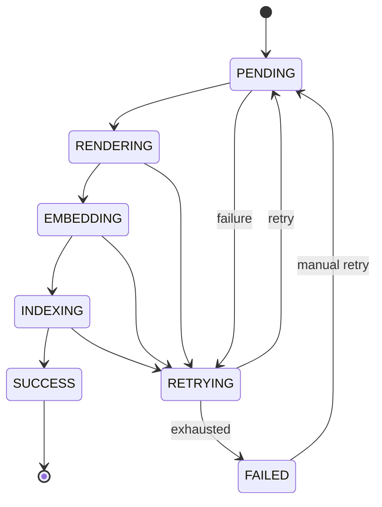
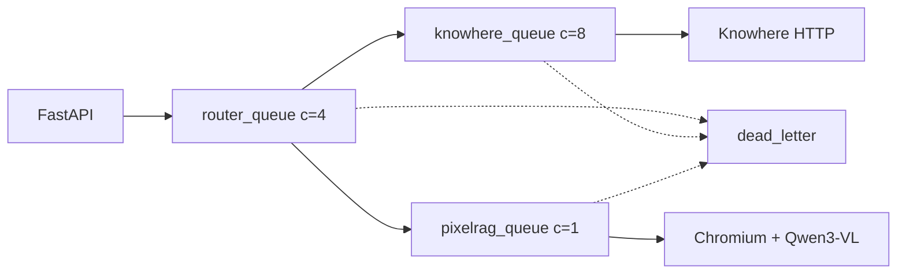

# Reliability and degradation

Production RAG depends on parsers, vector DBs, model APIs, and workers. Eagle-RAG assumes **partial failure is normal** and designs for continued operation with reduced capability — not total outage.

---

## Theory and foundations

### Failure domains in RAG

| Domain | Typical failures | Blast radius if unhandled |
| --- | --- | --- |
| **Parser** (Knowhere, PixelRAG) | Timeout, OOM, SDK error | Stuck ingest; corrupt index |
| **Vector DB** (Milvus) | Network partition, memory pressure | Empty retrieval |
| **Model APIs** (DeepSeek, Qwen) | Rate limit, key expiry | No answers |
| **Workers** (Celery) | Process crash, queue backlog | Stale index |
| **Broker** (Redis) | Connection loss | Task dispatch failure |

Distributed systems literature recommends **graceful degradation** — reduce service quality rather than fail the entire request ([Michael Nygard, *Release It!*](https://pragprog.com/titles/mnee2/release-it-second-edition/)) — and **bulkheads** — isolate resource pools (Eagle-RAG's three Celery queues).

### At-least-once task delivery

Celery with `acks_late=True` and `task_reject_on_worker_lost=True` provides at-least-once semantics. Idempotency required at:

- Dedup `(sha256, kb_name)`
- Milvus upsert by primary key (`id` / node `id_`)
- Section summary IDs `sec_{sha1(document_id:path)[:16]}`

---

## Design intent

| Principle | Meaning | Example |
| --- | --- | --- |
| Fail-closed on parse config | Bad parser config → explicit failure | `KnowhereError`, no mock parse |
| Best-effort secondary writes | Core path succeeds; extras may fail | Tag catalog, `doc_nav`, visual dispatch |
| Isolate probes | One slow dep doesn't block `/health` | 3s timeout per dependency |
| Bounded retries | Exponential backoff + dead letter | `max_retries: 3` |
| Retriever isolation | One modality failure doesn't 500 query | Empty list + warning log |

Cross-module: [backend index](../backend/index.md), [observability](../ops/observability.md).

---

## Eagle-RAG implementation

### Degradation patterns

| Pattern | Where | Effect |
| --- | --- | --- |
| **Fail-closed** | `parse_with_knowhere_sdk()` | `KnowhereError` → task `FAILED` |
| **Fail-fast** | `pixelrag_adapter._ensure_loaded()` | Wrong `provider` → `ValueError` |
| **Best-effort writes** | Milvus upsert edge cases | Logged; ingest may complete |
| **Non-blocking side effects** | `knowhere_parse` steps 5.2, 5.5, 5.7 | Tag catalog, visual dispatch, doc_nav |
| **Lazy singletons** | Stores, encoders | No import-time connection storms |
| **Idempotent collections** | `ensure_collection()` | Safe repeated calls; field migration |
| **SSE fallback** | `/query/stream`, `/admin/logs` | Redis down → in-memory queue + 5s heartbeats |
| **Probe isolation** | `/health` | Separate `try/except` per dependency |
| **`unknown` vs `down`** | PixelRAG probe | Unconfigured → `unknown`, not red |
| **Retriever empty list** | `_fetch_nodes()` | Degraded answer, not 500 |
| **MCP `resilient_call`** | `mcp_server.py` | `{"error": ...}` preserves session |
| **Tag resolution fail** | `_resolve_scope_filter()` | Ignore tags; continue |

### `knowhere_parse` failure taxonomy

```python
# eagle_rag/ingest/knowhere_adapter.py — structural
try:
    parse_result = parse_with_knowhere_sdk(...)     # FAIL-CLOSED
    upsert_text_nodes(nodes)                          # FAIL-CLOSED (main index)
    try:
        upsert_document_keywords(...)                 # BEST-EFFORT
    except Exception:
        logger.warning(...)
    try:
        dispatch_visual_chunks(...)                   # BEST-EFFORT
    except Exception:
        logger.warning(...)
    try:
        update_extra(doc_nav)                         # BEST-EFFORT
    except Exception:
        logger.warning(...)
    update_status(document_id, "ready")               # SUCCESS path
except Exception as exc:
    update_state(job_id, TaskState.FAILED, ...)
    retry_on_failure(self, exc)
```

---

## Task state machine

Every ingest job tracked in `task_audit`. `eagle_rag/tasks/state.py` enforces `ALLOWED_TRANSITIONS`:



| Rule | Rationale |
| --- | --- |
| `SUCCESS` is terminal | Triggers `ingest_complete` notification |
| `FAILED` → manual `PENDING` | Operator replay via API |
| Illegal transitions raise | Audit rows stay consistent |
| Separate `visual_job_id` | Avoid `SUCCESS` → `RENDERING` conflict |

---

## Retry and dead letter

`eagle_rag/tasks/dead_letter.py`:

### `@with_retry` decorator

```python
def with_retry(*, name, queue, base=DeadLetterTask, max_retries=None, retry_backoff=None):
    # Registers Celery task with:
    # autoretry_for=(Exception,)
    # retry_backoff = settings.celery.retry_backoff * 2^retries
    # acks_late=True
    # base=DeadLetterTask → on_failure sends to dead_letter queue
```

Applied to: `ingest_router`, `knowhere_parse`, `pixelrag_build`.

### `retry_on_failure(task, exc)`

Manual retry path for custom exception handlers:

```python
if task.request.retries < max_retries:
    countdown = retry_backoff * (2 ** task.request.retries)
    update_state(job_id, TaskState.RETRYING, ...)
    raise task.retry(exc=exc, countdown=countdown)
else:
    send_to_dead_letter(job_id, task.name, payload, repr(exc))
```

### Dead letter operations

| Function | Purpose |
| --- | --- |
| `send_to_dead_letter()` | Publish to `dead_letter` queue; mark audit `FAILED` |
| `drain_dead_letter(limit)` | Admin inspect messages |
| `replay_dead_letter(job_id)` | Re-dispatch after root-cause fix |

Celery worker settings (`eagle_rag/tasks/celery_app.py`):

| Setting | Value | Purpose |
| --- | --- | --- |
| `task_acks_late` | `True` | Ack after task completes |
| `worker_prefetch_multiplier` | `1` | Fair dispatch |
| `task_reject_on_worker_lost` | `True` | Requeue on worker crash |
| `task_time_limit` | 3600s | Hard kill runaway tasks |
| `task_soft_time_limit` | 3300s | Graceful shutdown window |

---

## Queue topology and backpressure



| Queue | Bottleneck | Scaling guidance |
| --- | --- | --- |
| `router_queue` | CPU light | Scale horizontally to 4+ workers |
| `knowhere_queue` | Knowhere HTTP throughput | Scale to 8; watch Knowhere capacity |
| `pixelrag_queue` | **RAM + GPU** | **Keep concurrency 1**; scale vertically |

**`pixelrag_queue` concurrency = 1** — Chromium rendering + Qwen3-VL encoder is OOM-prone. Prod Compose may cap worker memory at 4 GB.

Beat job (when enabled): samples queue `LLEN` every 30s → `metric_sample` table for ops dashboard.

---

## Idempotency guarantees

| Operation | Guarantee | Mechanism |
| --- | --- | --- |
| Dedup | Atomic check-and-register | PostgreSQL transaction |
| `register_document` | Upsert | `INSERT ON CONFLICT DO UPDATE` |
| Milvus text upsert | Overwrite by node `id_` | LlamaIndex upsert |
| Milvus visual upsert | Overwrite by PK `id` | `client.upsert()` |
| `ensure_collection` | Idempotent create | `has_collection` check |
| Section summary IDs | Stable across re-parse | `sec_{sha1(document_id:path)[:16]}` |
| MCP retrieval cache | Key from query + scope | Empty results not cached |

---

## Health and observability

### `/health` probe model

Each dependency probed independently (~3s timeout):

| Dependency | Probe | Status values |
| --- | --- | --- |
| PostgreSQL | Simple query | `up` / `down` |
| Redis | PING | `up` / `down` |
| Milvus | Collection list | `up` / `down` |
| MinIO | Bucket exists | `up` / `down` |
| Knowhere | HTTP health | `up` / `down` |
| PixelRAG | Import + provider check | `unknown` / `up` / `down` |

Aggregate API process stays **up** if only a non-critical dependency fails.

### Telemetry

| Channel | Config | Content |
| --- | --- | --- |
| AI events JSONL | `telemetry.ai_log_file` | `ingest`, `route`, `query` structured events |
| Ops log | `telemetry.op_log_file` | loguru rotation |
| OpenTelemetry | `telemetry.tracing_enabled` | Optional OTLP export |

`TelemetryMiddleware` — per-request SERVER span with `request_id`.

### SSE log fallback

When Redis pub/sub unavailable for `/admin/logs`:

- In-memory `asyncio.Queue` per connection
- 5-second heartbeat events keep connection alive
- No cross-instance fanout without Redis

---

## Design tensions and tuning

| Tension | Mechanism | Operator lever |
| --- | --- | --- |
| Availability vs index completeness | Best-effort Milvus write on ingest; visual dispatch errors logged only | Re-run ingest or KB rebuild when registry shows `ready` but search is empty |
| Partial answer vs hard error | Retriever returns `[]` on failure; hybrid mode continues other path | Monitor `ai_logger` `retrieve` events with `error` field |
| At-least-once side effects | `acks_late` + retry → duplicate tile upserts possible | Idempotent `image_id` / chunk IDs; check dead letter before replay |
| Text-first UX vs visual fidelity | `knowhere_parse` marks `ready` before `knowhere_visual_chunks` | Users may get text-only answers until visual queue drains |
| Probe fail-open vs mis-route | PDF probe exception → treat as text PDF | Lower `text_page_ratio` for KBs with scanned forms |
| Health signal vs probe latency | Celery `inspect.ping` timeout 1.0s | `down` ≠ `unknown` — see probe matrix in [troubleshooting](../ops/troubleshooting.md) |

---

## Configuration

| Key | Reliability effect |
| --- | --- |
| `celery.max_retries` | Default 3 |
| `celery.retry_backoff` | Base seconds for exponential backoff (60) |
| `knowhere.poll_timeout` | Max parse wait (1800s) |
| `knowhere.max_retries` | SDK HTTP retries |
| `mcp.circuit_fail_threshold` | MCP circuit breaker (5) |
| `mcp.tool_timeout` | MCP tool seconds (30) |
| `telemetry.enabled` | Structured event logging |

```bash
EAGLE_RAG_CELERY__MAX_RETRIES=5
KNOWHERE_POLL_TIMEOUT=3600
```

---

## Failure modes and operations

### Incident playbook

| Symptom | Diagnosis | Response |
| --- | --- | --- |
| Tasks in `RETRYING` loop | Transient Knowhere/Milvus | Wait; check backoff logs |
| `pixelrag_queue` depth growing | Render bottleneck | Do **not** raise concurrency; add RAM |
| All queries empty | Milvus down or wrong host | `task health`; fix `MILVUS_HOST` |
| Hybrid query text-only | Visual retriever exception | Check worker-pixelrag logs |
| Dead letter growing | Systematic failure | `drain_dead_letter`; fix root cause; replay |
| SSE stream dies | Proxy timeout | Heartbeats every 5s; check nginx `proxy_read_timeout` |
| Duplicate documents | Dedup race before register | Expected rare; dedup catches re-upload |

### Operator checklist

- [ ] Monitor `/health` and `/admin/probes`
- [ ] Watch `pixelrag_queue` LLEN — backlog signals render bottleneck
- [ ] Replay `FAILED` tasks after fixing Knowhere or API keys
- [ ] Drain dead letter after root-cause fix
- [ ] Run `task db:migrate` after upgrades touching models
- [ ] Restart workers after `.env` change (`get_settings` cache)
- [ ] Backup PostgreSQL + MinIO before Milvus schema migration

### Recovery commands

```bash
task health
task logs:worker SERVICE=worker-pixelrag
# Admin API: POST /tasks/{job_id}/retry
# After fix: replay dead letter via admin module
```

Troubleshooting: [ops/troubleshooting](../ops/troubleshooting.md). Backup: [ops/backup-restore](../ops/backup-restore.md).

---

## References

- [Celery task retry docs](https://docs.celeryq.dev/en/stable/userguide/tasks.html#retrying)
- [Milvus availability](https://milvus.io/docs/admin_guide.md)
- [Gao et al., 2023](https://arxiv.org/abs/2312.10997) — production RAG concerns
- [System design — graceful degradation](system-design.md)
- [Data flow](data-flow.md)
- [Task queue](../backend/task-queue.md)
