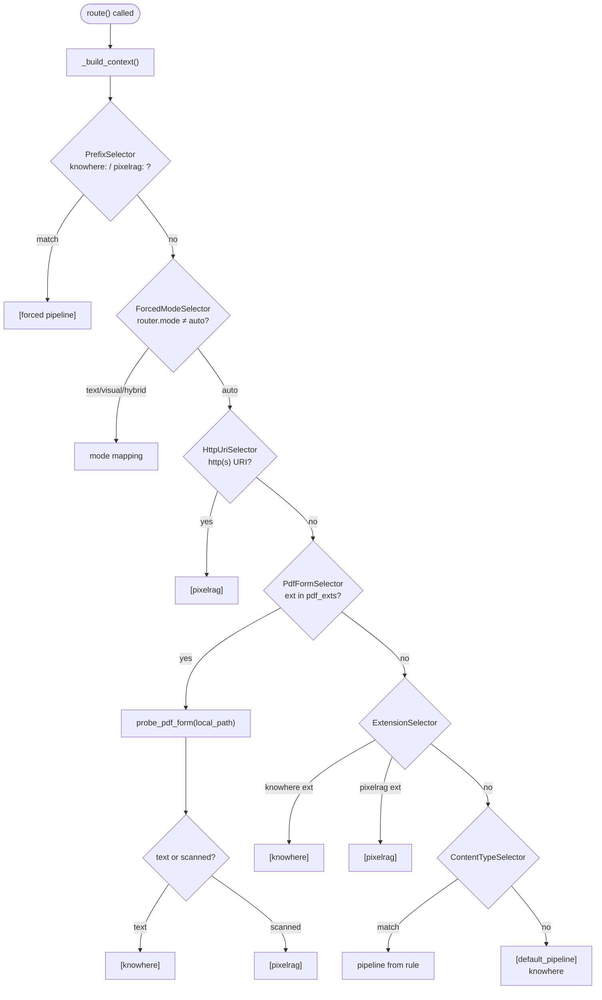
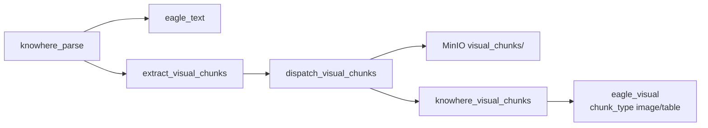

# Routing matrix

The routing matrix decides **which parsing pipeline(s)** handle a document at **ingest time**. It lives in `eagle_rag/ingest/router.py` and evaluates with a strict **selector chain** — first non-`None` result wins.

!!! warning "Not query-time routing"
    Ingest routing (`route()`) ≠ query routing (`route_query()` in `eagle_rag/router/router_engine.py`). This page covers ingest; query routing is in [router engine](../backend/router-engine.md).

---

## Theory and foundations

### Why route at all?

Different document **forms** need different parsers:

| Form | Parser need | Pipeline |
| --- | --- | --- |
| Text-based PDF, Office, CSV | Semantic tree, typed chunks, `connect_to` graph | Knowhere |
| Scanned PDF, photos, web pages | Pixel tiling, layout-preserving embeddings | PixelRAG |

Routing by **format + content form** — not by topic — keeps behavior predictable. A financial spreadsheet and a patent table both go to Knowhere if text-structured.

[Gao et al., 2023](https://arxiv.org/abs/2312.10997) notes that document-type-aware preprocessing improves downstream retrieval quality.

### PDF: text vs scanned

Text PDFs embed selectable character streams; scanned PDFs are image sequences. Heuristic classification avoids sending image-only PDFs to a text parser (poor OCR) or text PDFs through expensive visual tiling.

Eagle-RAG uses **page-level statistics** (not ML classifier) — fast, explainable, tunable via `pdf_probe` settings.

---

## Eagle-RAG implementation

### Entry point: `route()`

```python
# eagle_rag/ingest/router.py:238-273
def route(
    *,
    filename: str,
    content_type: str | None = None,
    source_uri: str | None = None,
    source_type_hint: str | None = None,
    local_path: str | None = None,
    kb_name: str | None = None,
    text_page_ratio: float | None = None,
) -> list[str]:
    cfg = get_settings().ingest.routing
    ctx = _build_context(
        filename, content_type, source_uri, local_path, kb_name,
        text_page_ratio, prefix_force=cfg.prefix_force,
    )
    chain = _build_chain(cfg, probe=probe_pdf_form)
    return chain.select(ctx)
```

**Returns:** `["knowhere"]`, `["pixelrag"]`, or `["knowhere", "pixelrag"]` (hybrid ingest).

**Does NOT use:** `source_type_hint` (metadata only via `infer_source_type()`), `kb_name` for routing (passed for downstream; per-KB PDF ratio via `text_page_ratio` arg).

### Context construction: `_build_context()`

```python
# eagle_rag/ingest/router.py:181-206
def _build_context(...) -> IngestRouteContext:
    cleaned_name, forced_prefix = _strip_prefix(filename, prefix_force)
    ext = _lower_ext(cleaned_name)
    is_http = _is_http_uri(source_uri)
    return IngestRouteContext(
        filename=filename,
        cleaned_name=cleaned_name,
        ext=ext,
        content_type=content_type,
        source_uri=source_uri,
        is_http=is_http,
        local_path=local_path,
        forced_prefix=forced_prefix,
        kb_name=kb_name,
        text_page_ratio=text_page_ratio,
    )
```

`IngestRouteContext` is a dataclass consumed by all selectors.

### Selector chain: `_build_chain()`

```python
# eagle_rag/ingest/router.py:209-227
def _build_chain(cfg, *, probe) -> FallbackChain:
    selectors = [
        PrefixSelector(prefix_force=cfg.prefix_force),
        ForcedModeSelector(router_mode=_router_mode()),
        HttpUriSelector(),
        PdfFormSelector(probe=probe, pdf_exts=cfg.pdf_exts),
        ExtensionSelector(knowhere_exts=cfg.knowhere_exts, pixelrag_exts=cfg.pixelrag_exts),
        ContentTypeSelector(rules=cfg.content_type_rules),
    ]
    return FallbackChain(selectors, default_pipeline=cfg.default_pipeline)
```

`FallbackChain.select(ctx)` iterates selectors; first non-`None` list returned. If all return `None`, wraps `default_pipeline` as single-element list.

`probe` is passed explicitly so tests can patch `probe_pdf_form` without stale references.

---

## Decision priority (detailed)



### Level 1 — Filename prefix (`PrefixSelector`)

Config: `ingest.routing.prefix_force`:

```yaml
prefix_force:
  "knowhere:": knowhere
  "pixelrag:": pixelrag
```

`knowhere:report.pdf` → `["knowhere"]`; prefix stripped via `_strip_prefix()`.

**Use case:** Force pipeline regardless of extension — e.g. `pixelrag:text-heavy.pdf` for visual experiment.

### Level 2 — `settings.router.mode` (`ForcedModeSelector`)

Reads `_router_mode()` → `get_settings().router.mode` (lowercased).

| `router.mode` | Pipelines returned |
| --- | --- |
| `text` | `["knowhere"]` |
| `visual` | `["pixelrag"]` |
| `hybrid` | `["knowhere", "pixelrag"]` |
| `auto` | `None` (continue chain) |

!!! note "Same setting name, different phases"
    `ROUTER_MODE` affects **both** ingest (`ForcedModeSelector`) and query (`route_query`) when not `auto`. For ingest-only control, use filename prefix or extension rules.

### Level 3 — HTTP/HTTPS URLs (`HttpUriSelector`)

If `source_uri` starts with `http://` or `https://` → `["pixelrag"]`.

PixelRAG renders web pages (CDP/Playwright backend) — Knowhere expects file upload.

### Level 4 — PDF form probe (`PdfFormSelector` + `probe_pdf_form`)

When extension ∈ `ingest.routing.pdf_exts` (default `.pdf`) and `local_path` is set:

#### Algorithm: `probe_pdf_form()`

```python
# eagle_rag/ingest/router.py:133-173
def probe_pdf_form(file_path: str, *, text_page_ratio: float | None = None) -> str:
    probe_cfg = get_settings().pdf_probe
    ratio_threshold = text_page_ratio if text_page_ratio is not None else probe_cfg.text_page_ratio
    chars_threshold = probe_cfg.avg_chars_per_page

    pages_text = _extract_pdf_pages_text(file_path)  # pypdf → pdfplumber fallback
    if pages_text is None or len(pages_text) == 0:
        return "text"  # fail-open to Knowhere

    total_pages = len(pages_text)
    text_pages = sum(1 for t in pages_text if len(t or "") > chars_threshold)
    computed_ratio = text_pages / total_pages
    avg_chars = sum(len(t or "") for t in pages_text) / total_pages

    if computed_ratio < ratio_threshold or avg_chars < chars_threshold:
        return "scanned"
    return "text"
```

**Metrics:**

| Metric | Formula | Default threshold |
| --- | --- | --- |
| `text_page_ratio` | (# pages with chars > `avg_chars_per_page`) / total pages | `< 0.2` → scanned |
| `avg_chars_per_page` | mean char count across all pages | `< 50` → scanned |

**Classification:**

| `probe_pdf_form` result | Pipeline |
| --- | --- |
| `"text"` | `["knowhere"]` |
| `"scanned"` | `["pixelrag"]` |

**Fail-open:** Missing file, parse failure, or zero pages → `"text"` (Knowhere). Rationale: text parser degrades on scanned docs; visual pipeline on text PDFs is wasteful but not blocking.

**Per-KB override:** `ingest_router` passes `text_page_ratio` from `kb.registry.get_pdf_ratio_sync(kb_name)` when set on `knowledge_bases` table.

#### Text extraction: `_extract_pdf_pages_text()`

1. **Primary:** `pypdf.PdfReader` — `page.extract_text()` per page
2. **Fallback:** `pdfplumber.open()` — same per-page extraction
3. **Failure:** returns `None` → probe defaults to `"text"`

### Level 5 — Extension (`ExtensionSelector`)

From `settings.ingest.routing`:

| Extension set | Pipeline |
| --- | --- |
| `knowhere_exts` | `.docx`, `.doc`, `.md`, `.txt`, `.xlsx`, `.csv`, `.pptx`, `.json`, … | `knowhere` |
| `pixelrag_exts` | `.png`, `.jpg`, `.html`, `.webp`, … | `pixelrag` |

### Level 6 — Content-Type (`ContentTypeSelector`)

Fallback when extension unknown — rules from `content_type_rules`:

```yaml
content_type_rules:
  - {match: "text/", mode: startswith, pipeline: knowhere}
  - {match: "image/", mode: startswith, pipeline: pixelrag}
  - {match: spreadsheet, mode: contains, pipeline: pixelrag}
```

### Default

`default_pipeline: knowhere` — unknown extensions favor structured text parsing.

---

## `source_type` (metadata only)

```python
# eagle_rag/ingest/router.py:281-305
def infer_source_type(filename, source_uri=None, source_type_hint=None) -> str:
    if source_type_hint in {policy, financial, business, bidding, tax, other}:
        return hint
    for rule in get_settings().ingest.source_type.rules:
        if _has_keyword(text, rule.keywords):
            return rule.source_type
    return cfg.default  # "other"
```

**Does not affect `route()`.** Stored on document registry and Milvus metadata for query filters.

---

## `ingest_router` Celery task

After `route()` returns pipeline list:

```python
# eagle_rag/ingest/router.py — ingest_router (simplified)
@with_retry(name="eagle_rag.tasks.ingest_router", queue="router_queue", bind=True)
def ingest_router(self, job_id, document_id, filename, local_path, kb_name, ...):
    pipelines = route(filename=filename, local_path=local_path, kb_name=kb_name, ...)
    source_type = infer_source_type(filename, source_uri, source_type_hint)
    for pipeline in pipelines:
        if pipeline == "knowhere":
            app.send_task("eagle_rag.tasks.knowhere_parse", queue="knowhere_queue", ...)
        elif pipeline == "pixelrag":
            app.send_task("eagle_rag.tasks.pixelrag_build", queue="pixelrag_queue", ...)
```

Called from: `eagle_rag/ingest/runner.py` after MinIO upload and `register_document`.

Attachments lazy parse also calls `route()` — `eagle_rag/attachments/parser.py`.

---

## Intra-document routing (Knowhere only)

Document-level routing picks the **main** pipeline. A Knowhere document also produces a **visual index** from embedded images and tables:



| Dimension | Decides | Example |
| --- | --- | --- |
| Document-level | Whole document pipeline | Text PDF → Knowhere |
| Intra-document | Image/table chunks → visual encode | Table in Word doc → `eagle_visual` |

`extract_visual_chunks()` walks `ParseResult.chunks` in order:

- `type=="text"` → update `parent_section = chunk.path`
- `type in ("image", "table")` → append descriptor with `parent_section`, `summary`, `chunk_id`

Visual dispatch failure is **logged only** — text index and document `SUCCESS` still complete.

---

## Query-time routing (contrast)

`EagleRouterQueryEngine._route_decision()` → `route_query(RouteContext)`:

| Input signal | Effect |
| --- | --- |
| `mode` parameter | Override `settings.router.mode` |
| `has_doc_attachments` | Bias toward `hybrid` |
| `filters.pipeline` | `knowhere` → text; `pixelrag` → visual |
| DeepSeek LLM | Classify text/visual/hybrid from query text |
| Heuristics | Keyword rules in `router.heuristic.rules` |

Attachments with documents bias toward `hybrid`. Details: [router engine](../backend/router-engine.md).

---

## Design tensions and tuning

| Tension | Knob | Deep note |
| --- | --- | --- |
| Ingest vs query routing objectives | `ingest.routing` vs `router.mode` | Same word “router” — ingest picks parser; query picks retriever. Forcing `visual` at query time does not re-parse a Knowhere-only document |
| PDF probe precision/recall | `text_page_ratio`, `avg_chars_per_page`, per-KB override | Ratio counts **pages** above char threshold, not total chars — a 2-page scan with one OCR junk page can flip classification |
| Fail-open on probe errors | `probe_pdf_form` exception → `text` | Availability win; mis-routes damaged PDFs to Knowhere (garbled text index) |
| Prefix override | `knowhere:` / `pixelrag:` filename | Bypasses probe for golden tests; production mis-prefix sends whole doc down wrong parser |
| Extension list maintenance | `knowhere_exts` / `pixelrag_exts` in YAML | `.html` on PixelRAG path uses headless render — heavier than Knowhere markdown path for simple pages |
| `source_type` metadata | `infer_source_type` keywords | **Does not affect** `route()` — only facets; do not expect routing changes from `source_type_hint` |

---

## Configuration

| Key | Location | Effect |
| --- | --- | --- |
| `ingest.routing.prefix_force` | `settings.yaml` | Level 1 overrides |
| `ingest.routing.knowhere_exts` / `pixelrag_exts` | `settings.yaml` | Level 5 |
| `ingest.routing.pdf_exts` | `settings.yaml` | Which extensions trigger probe |
| `ingest.routing.default_pipeline` | `settings.yaml` | Final fallback |
| `pdf_probe.text_page_ratio` | `settings.yaml` | Scanned threshold |
| `pdf_probe.avg_chars_per_page` | `settings.yaml` | Per-page char threshold |
| `router.mode` | env `ROUTER_MODE` | Level 2 forced ingest + query default |
| `knowledge_bases.pdf_text_page_ratio` | PostgreSQL per KB | Overrides global probe ratio |

```bash
# Force all ingest to Knowhere (also affects query default)
ROUTER_MODE=text

# Per-process override
EAGLE_RAG_PDF_PROBE__TEXT_PAGE_RATIO=0.15
```

---

## Failure modes and operations

| Symptom | Cause | Mitigation |
| --- | --- | --- |
| Scanned PDF went to Knowhere | Probe fail-open; low thresholds | Lower `text_page_ratio`; use `pixelrag:filename.pdf` prefix |
| Text PDF went to PixelRAG | Very sparse text layers | Raise thresholds; use `knowhere:` prefix |
| URL ingest always PixelRAG | By design (`HttpUriSelector`) | Download and upload as file for Knowhere |
| Hybrid ingest duplicate work | `router.mode=hybrid` | Use only when intentionally dual-indexing |
| Wrong `source_type` | Keyword mismatch | Pass `source_type_hint` on ingest API |
| `route()` returns unexpected pipeline | Check selector order | Add logging; unit test in `tests/test_ingest_assets.py` |

### Testing routing

```bash
uv run pytest tests/test_ingest_assets.py tests/test_ingest_smoke.py -q
```

Tests patch `probe_pdf_form` for deterministic PDF classification.

---

## References

- [Multimodal fusion](multimodal-fusion.md) — intra-document visual dispatch
- [Data flow](data-flow.md) — full ingest sequence
- [Ingest pipeline](../backend/ingest-pipeline.md)
- [AGENTS.md](https://github.com/fintax-ai/eagle-rag/blob/master/AGENTS.md) — routing matrix table
- [Gao et al., 2023](https://arxiv.org/abs/2312.10997)
