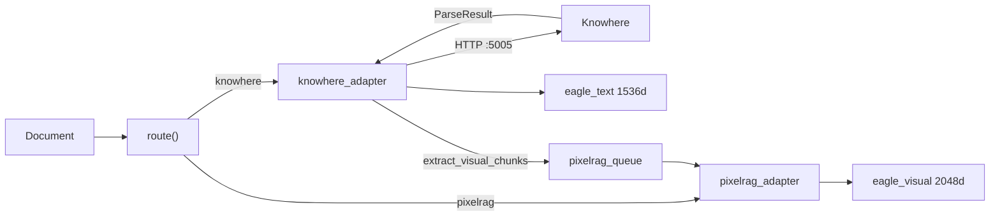
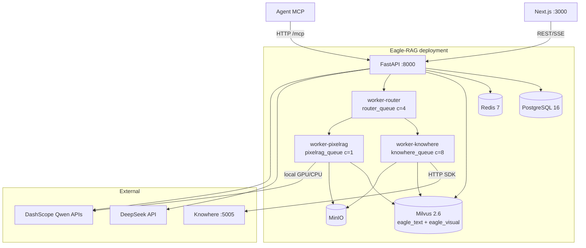
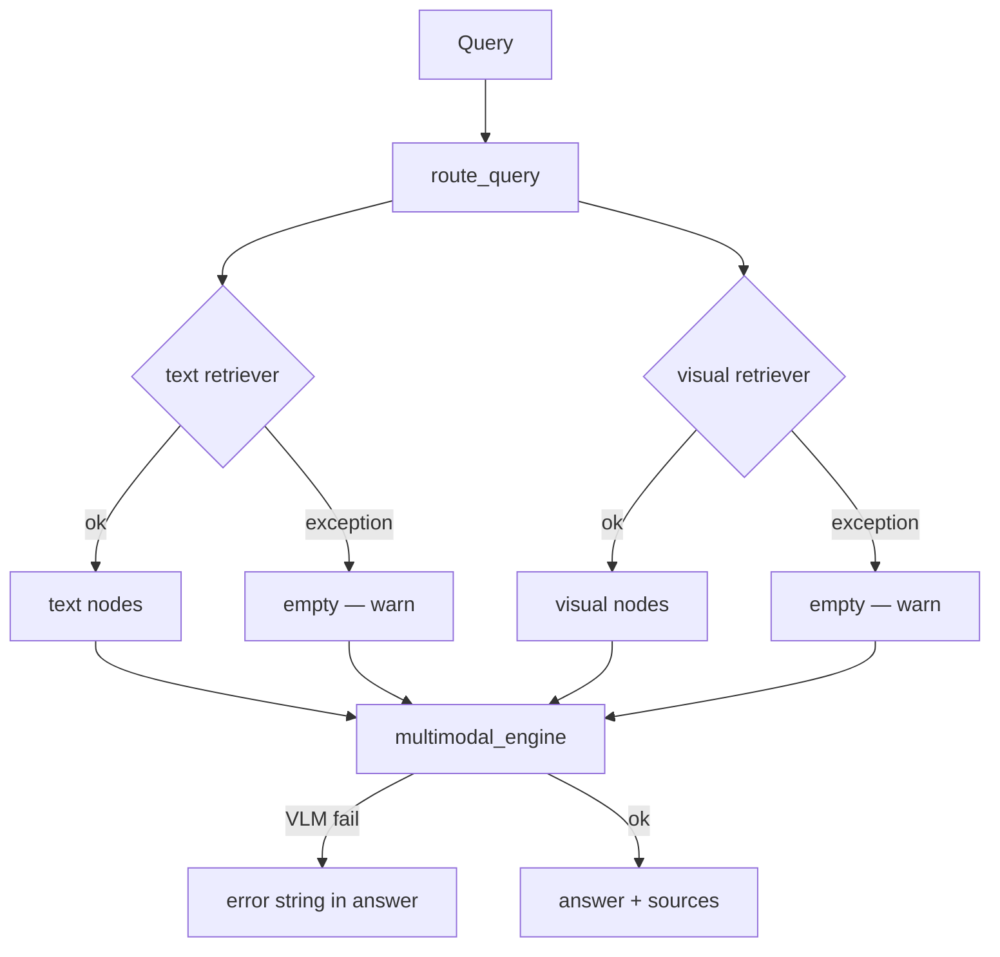

# System design

Eagle-RAG is an industry-agnostic, multi-tenant multimodal RAG knowledge base. Four design principles recur in every module; this page explains the theory behind each, walks the actual code paths, and documents tuning tensions, configuration, and failure behavior.

---

## Theory and foundations

### RAG as a layered system

[Gao et al., 2023](https://arxiv.org/abs/2312.10997) decomposes RAG into:

| Layer | Function | Eagle-RAG primary modules |
| --- | --- | --- |
| **Indexing** | Parse → chunk → embed → store | `ingest/`, `index/`, Celery tasks |
| **Retrieval** | Query embed → ANN → filter → expand | `retrievers/`, `router_engine.py` |
| **Generation** | Rerank → prompt → LLM/VLM | `generation/multimodal_engine.py` |

[Lewis et al., 2020](https://arxiv.org/abs/2005.11401) established that retrieval conditioning reduces hallucination on knowledge-intensive tasks. Eagle-RAG adds **multimodal** indexing (dual vector spaces) and **multi-tenant** scalar filtering ([Milvus hybrid search](https://milvus.io/docs/multi-vector-search.md)).

### ANN index choice

Visual vectors (2048-d) may exceed RAM at scale:

| Algorithm | Paper | Complexity | Eagle-RAG usage |
| --- | --- | --- | --- |
| **HNSW** | [Malkov & Yashunin, 2016](https://arxiv.org/abs/1603.09320) | O(log N) search; graph in RAM | Default `MILVUS_VISUAL_INDEX_TYPE=hnsw` |
| **DiskANN** | [Subramanya et al., NeurIPS 2019](https://papers.nips.cc/paper/2019/hash/09853c7ff1cb93b59a86b8e886786b9b-Abstract.html) | Disk-resident Vamana graph | `diskann` for billion-scale visual slices |

HNSW builds a hierarchy of proximity graphs: upper layers for coarse navigation, lower layers for fine search. Parameters `M` (neighbors per node) and `efConstruction` trade build time/recall for search quality.

---

## Principle 1: Lazy initialization

### Why

Import-time connections cause:

- Slow cold start (Milvus, PostgreSQL, GPU model load)
- Cascading import failures when a dependency is absent in dev
- Brittle unit tests that require full infrastructure

### How — code walkthrough

**Settings singleton:**

```python
# eagle_rag/config.py
@lru_cache(maxsize=1)
def get_settings() -> Settings:
    path_str = os.environ.get("EAGLE_RAG_SETTINGS_PATH", str(_DEFAULT_SETTINGS_PATH))
    data = _load_yaml(Path(path_str))
    return Settings(**data)
```

Loaded once per process. Tests call `get_settings.cache_clear()` between cases.

**Milvus text store:**

`get_text_vector_store()` / `get_text_index()` in `eagle_rag/index/milvus_text_store.py` — construct `MilvusVectorStore` on first retrieval or ingest upsert, not at `import eagle_rag`.

**Milvus visual client:**

```python
# eagle_rag/index/milvus_visual_store.py
_client: MilvusClient | None = None

def get_visual_client() -> MilvusClient:
    global _client
    if _client is None:
        ensure_collection()  # idempotent create + load
    return _client
```

**Visual encoder singleton:**

`_Qwen3VLVisualEncoder` in `eagle_rag/ingest/pixelrag_adapter.py` — loads Qwen3-VL-Embedding-2B on first `embed()` call. Keeps API process free of GPU memory unless it handles visual tasks directly.

**FastAPI app:**

```python
# eagle_rag/api/app.py
settings = get_settings()  # config only — no DB connect
app = FastAPI(..., lifespan=get_combined_lifespan(mcp_app))
```

Routers imported after `app` creation; no Milvus at import.

### Trade-off

| Pro | Con |
| --- | --- |
| Fast startup; testable without Docker | First request pays connection + model load latency |
| Missing dep fails at use site with clear error | Must restart process to pick up config changes |

---

## Principle 2: Graceful degradation

### Why

RAG systems depend on parsers, vector DBs, model APIs, and workers. Total failure on one outage is unacceptable for an intranet data layer.

### Degradation matrix

| Failure | Code location | Behavior |
| --- | --- | --- |
| Knowhere SDK unreachable | `parse_with_knowhere_sdk()` | `KnowhereError` → task `FAILED`; **no mock parse** |
| PixelRAG provider ≠ `pixelrag` | `pixelrag_adapter._ensure_loaded()` | `ValueError`; no random vectors |
| VLM API key missing | `multimodal_engine.py` | Error string in response; no unhandled 500 |
| Milvus write fails during ingest | `upsert_text_nodes` / `upsert_visual` | May log and continue (ingest availability) |
| Tag resolution fails | `_resolve_scope_filter()` | Log warning; ignore tag dimension |
| Visual dispatch fails | `dispatch_visual_chunks()` | Log error; `knowhere_parse` still `SUCCESS` |
| Keyword catalog write fails | `knowhere_parse` step 5.2 | Non-blocking warning |
| `doc_nav` persistence fails | `knowhere_parse` step 5.7 | Non-blocking warning |
| Text retriever exception | `_fetch_nodes()` | `logger.warning`; skip text modality |
| Visual retriever exception | `_fetch_nodes()` | `logger.warning`; skip visual modality |
| Redis down for SSE logs | notifications router | In-memory `asyncio.Queue` + 5s heartbeats |
| MCP tool exception | `resilient_call()` in `mcp_server.py` | `{"error": ...}` without breaking session |

### Health probe semantics

`GET /health` — each dependency probed in isolated `try/except` with ~3s timeout:

- **`up`** — probe succeeded
- **`down`** — probed and failed
- **`unknown`** — not configured (e.g. PixelRAG when visual provider inactive)

This distinguishes *misconfiguration* from *outage*.

---

## Principle 3: Sync + async dual DB access

### Why

FastAPI handlers are **async**; Celery workers are **sync**. A single async-only ORM would force `asyncio.run()` in workers or block the event loop in API handlers.

### How

Stores in `eagle_rag/db/stores/` expose paired APIs:

| Pattern | Async (API) | Sync (Celery) |
| --- | --- | --- |
| KB exists | `kb_exists()` | `kb_exists_sync()` |
| Document register | `register_document()` | `register_document_sync()` |
| Dedup check | `check_duplicate()` | `check_duplicate_sync()` |

JSONB columns: `json.dumps` + `::jsonb` cast on write; defensive `_loads` on read for legacy string values.

Connection pools: separate async (`asyncpg`) and sync (`psycopg`) engines from `POSTGRES_DSN`.

### Trade-off

Duplicated store methods increase maintenance but avoid worker/event-loop coupling — standard pattern for FastAPI + Celery codebases.

---

## Principle 4: Adapter pattern

### Why

Knowhere (HTTP → `ParseResult`) and PixelRAG (render → tiles) produce different native outputs. Retrieval and generation must see uniform **LlamaIndex** `TextNode` / `ImageNode` with consistent metadata (`kb_name`, `document_id`, `path`).

### Adapter flow



**`knowhere_adapter.py` key functions:**

| Function | Output |
| --- | --- |
| `parse_with_knowhere_sdk()` | `ParseResult` |
| `chunks_to_text_nodes()` | `list[TextNode]` with `connect_to`, `path` |
| `sections_to_text_nodes()` | `type="section_summary"` nodes |
| `extract_visual_chunks()` | Visual dispatch descriptors |
| `knowhere_parse` | Celery task — full pipeline |

**`pixelrag_adapter.py` key functions:**

| Function | Output |
| --- | --- |
| `pixelrag_build` | Full visual document ingest |
| `knowhere_visual_chunks` | Knowhere image/table → tiles → vectors |
| `_Qwen3VLVisualEncoder.embed()` | 2048-d L2-normalized vector |

!!! note "Single Knowhere document → dual index"
    After `knowhere_parse`, text chunks and section summaries land in `eagle_text`. Image/table chunks dispatch to `knowhere_visual_chunks` on `pixelrag_queue` with four anchor fields into `eagle_visual`. See [Multimodal fusion](multimodal-fusion.md).

---

## C4 container view



Deployment layers: infrastructure → Knowhere sub-stack → application. Details: [ops/docker](../ops/docker.md).

---

## Model stack (DeepSeek + Qwen only)

| Role | Model | Dimension | Config path |
| --- | --- | --- | --- |
| LLM / routing | DeepSeek-V4-Pro | — | `settings.llm` |
| VLM generation | Qwen-VL-Max | — | `settings.vlm` |
| Text embedding | `text-embedding-v4` | 1536 | `settings.embedding.text` |
| Visual embedding | Qwen3-VL-Embedding-2B | 2048 | `settings.embedding.visual` |
| Rerank | `qwen3-rerank` | — | `settings.rerank.text` |

No OpenAI / Cohere adapters. New models via LlamaIndex integration packages.

**Routing LLM:** `route_query()` uses DeepSeek with `router.llm.prompt_template` when `router.llm.enabled=true`. Heuristic fallback: `router.heuristic.rules` in YAML.

---

## MCP integration architecture

FastMCP mounted on FastAPI at `/mcp`:

```python
# eagle_rag/api/app.py — pattern
mcp_app = build_mcp_app()
app = FastAPI(..., lifespan=get_combined_lifespan(mcp_app))
app.mount(settings.mcp.streamable_http_path, mcp_app)
```

`get_combined_lifespan` chains:

1. Application startup (DB pools, telemetry)
2. `StreamableHTTPSessionManager` task group — prevents "Task group is not initialized" on MCP requests

Tools registered in `eagle_rag/api/mcp_server.py` + `TOOL_DEFINITIONS`: `ingest`, `query`, `retrieve_text`, `retrieve_visual`.

`resilient_call()` wraps tool execution with timeout, circuit breaker (`circuit_fail_threshold`), and optional Redis cache (`cache_ttl`).

---

## Configuration

| Setting | Design impact |
| --- | --- |
| `get_settings()` cache | Restart after `.env` change |
| `milvus.visual_index_type` | HNSW vs DiskANN |
| `embedding.visual.provider` | Must be `pixelrag` — fail-fast otherwise |
| `router.llm.enabled` | LLM vs heuristic query routing |
| `celery.queues.pixelrag_queue.concurrency` | Must be 1 — OOM prevention |
| `mcp.standalone` | Separate uvicorn on `:8081` vs API mount |
| `telemetry.tracing_enabled` | OpenTelemetry export |

Full reference: [configuration](../getting-started/configuration.md).

---

## Failure modes and operations

### Startup failures

| Symptom | Cause | Action |
| --- | --- | --- |
| API starts, Milvus errors on first query | Lazy init — Milvus not ready | Wait for Milvus healthy |
| MCP 500 on first tool call | Lifespan not initialized | Ensure `get_combined_lifespan` used |
| Worker import error on PixelRAG | Missing GPU drivers / package | Check `pixelrag` install; use CPU `embed_device` |

### Runtime degradation paths



### Operator checklist

- [ ] Verify lazy singletons not holding stale connections after Milvus restart
- [ ] Restart workers after `settings.yaml` change (`get_settings` cached)
- [ ] Monitor `/health` — distinguish `unknown` vs `down`
- [ ] Keep `pixelrag_queue` at concurrency 1

---

## Design tensions summary

| Tension | Where | Tuning |
| --- | --- | --- |
| Cold start vs fast import | `get_settings()`, `get_text_index()`, `_Qwen3VLVisualEncoder` | First query after deploy pays connection + model load; warm workers with smoke retrieve |
| Config immutability per process | `@lru_cache` on settings | Restart API + workers after `settings.yaml` / `.env` change |
| Degradation vs silent wrong answers | Retriever `[]`, VLM `None` | Prefer explicit error strings in generation over hallucinating without context |
| Adapter normalization cost | Knowhere `ParseResult` → many `TextNode`s | Large docs = high embed API cost linear in chunk count |
| Index write strictness | `knowhere_parse` fails on text upsert error | Visual path still best-effort — asymmetry is intentional |

---

## References

- [Lewis et al., 2020](https://arxiv.org/abs/2005.11401)
- [Gao et al., 2023](https://arxiv.org/abs/2312.10997)
- [HNSW](https://arxiv.org/abs/1603.09320)
- [DiskANN](https://papers.nips.cc/paper/2019/hash/09853c7ff1cb93b59a86b8e886786b9b-Abstract.html)
- [Milvus docs](https://milvus.io/docs)
- [LlamaIndex](https://docs.llamaindex.ai/)
- [MCP specification](https://modelcontextprotocol.io/)
- [Data flow](data-flow.md) · [Reliability](reliability.md) · [Multimodal fusion](multimodal-fusion.md)
