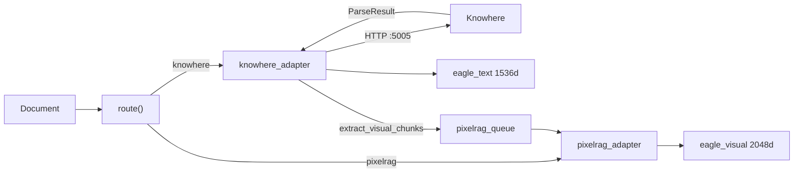
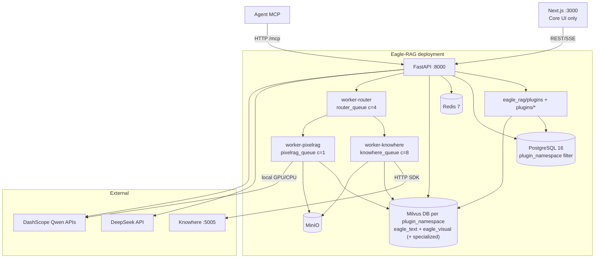
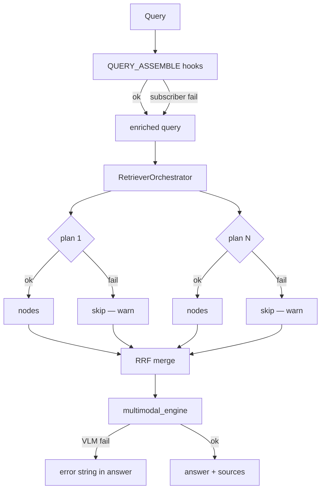

# System design

Eagle-RAG is an industry-agnostic, multimodal RAG **data layer** for Agents and LLMs. A **microkernel** hosts in-process industry plugins; **two-layer isolation** separates domain deploy binding (`plugin_namespace` = Milvus Database) from knowledge-base tenancy (`kb_name` = Milvus scalar filter within that Database). Five design principles recur in every module; this page explains the theory behind each, walks the actual code paths, and documents tuning tensions, configuration, and failure behavior.

For the full plugin contract, hook catalog, and deployment model, see [Plugin architecture](plugin-architecture.md).

---

## Theory and foundations

### RAG as a layered system

[Gao et al., 2023](https://arxiv.org/abs/2312.10997) decomposes RAG into:

| Layer | Function | Eagle-RAG primary modules |
| --- | --- | --- |
| **Plugins** | Domain classify / embed / route / assemble | `eagle_rag/plugins/`, in-repo `plugins/` |
| **Indexing** | Parse → chunk → embed → store | `ingest/`, `index/`, `IngestOrchestrator`, Celery tasks |
| **Retrieval** | Query embed → ANN → filter → expand | `retrievers/`, `RetrieverOrchestrator`, `router_engine.py` |
| **Generation** | Rerank → prompt → LLM/VLM | `generation/multimodal_engine.py` |

[Lewis et al., 2020](https://arxiv.org/abs/2005.11401) established that retrieval conditioning reduces hallucination on knowledge-intensive tasks. Eagle-RAG adds **multimodal** indexing (dual vector spaces), **plugin-namespace** Milvus Database isolation, and **multi-tenant** `kb_name` scalar filtering ([Milvus hybrid search](https://milvus.io/docs/multi-vector-search.md)).

### ANN index choice

Visual vectors (2048-d) may exceed RAM at scale:

| Algorithm | Paper | Complexity | Eagle-RAG usage |
| --- | --- | --- | --- |
| **HNSW** | [Malkov & Yashunin, 2016](https://arxiv.org/abs/1603.09320) | O(log N) search; graph in RAM | Default `MILVUS_VISUAL_INDEX_TYPE=hnsw` |
| **DiskANN** | [Subramanya et al., NeurIPS 2019](https://papers.nips.cc/paper/2019/hash/09853c7ff1cb93b59a86b8e886786b9b-Abstract.html) | Disk-resident Vamana graph | `diskann` for billion-scale visual slices |

HNSW builds a hierarchy of proximity graphs: upper layers for coarse navigation, lower layers for fine search. Parameters `M` (neighbors per node) and `efConstruction` trade build time/recall for search quality.

---

## Principle 1: Lazy initialization

### Why

Import-time connections cause:

- Slow cold start (Milvus, PostgreSQL, GPU model load)
- Cascading import failures when a dependency is absent in dev
- Brittle unit tests that require full infrastructure

### How — code walkthrough

**Settings singleton (with profile overlay):**

```python
# eagle_rag/config.py
@lru_cache(maxsize=1)
def get_settings() -> Settings:
    path_str = os.environ.get("EAGLE_RAG_SETTINGS_PATH", str(_DEFAULT_SETTINGS_PATH))
    data = _apply_profile(_load_yaml(Path(path_str)))  # EAGLE_RAG_PROFILE → profiles.<name>
    return Settings(**data)
```

`_apply_profile()` deep-merges `profiles.<name>` when `EAGLE_RAG_PROFILE` (or YAML `active_profile`) is set. Env `EAGLE_RAG_PROFILE` wins over YAML. Loaded once per process; tests call `get_settings.cache_clear()` between cases.

**Milvus text store:**

`get_text_vector_store()` / `get_text_index()` in `eagle_rag/index/milvus_text_store.py` — construct `MilvusVectorStore` on first retrieval or ingest upsert, not at `import eagle_rag`.

**Milvus client pool (per Database):**

```python
# eagle_rag/index/milvus_pool.py
class MilvusClientPool:
    def get(self, db_name: str | None = None, *, plugin_namespace: str | None = None) -> MilvusClient:
        if db_name is None:
            db_name = milvus_db_name(plugin_namespace)
        # ... pooled MilvusClient(uri=..., db_name=db_name) — never switch DB per request
```

`MilvusClientPool` binds `db_name` at client creation time (one pooled client per Milvus Database). Legacy module-level `_client` in `milvus_visual_store.py` still lazy-inits for backward compatibility; new paths use `get_milvus_pool()`.

**Visual encoder singleton:**

`get_visual_encoder()` in `eagle_rag/ingest/visual_encoder.py` — `provider=pixelrag` loads local Qwen3-VL-Embedding-2B on first encode; `provider=dashscope` calls Bailian `qwen3-vl-embedding` (no local weights). Keeps API process free of GPU memory unless it handles visual tasks directly. Domain encoders (`pubmedbert`, `molformer`, `medimageinsight` BiomedCLIP/`open_clip`, `uni2`) lazy-load via `EncoderRegistry` in plugin `on_load`.

**FastAPI app:**

```python
# eagle_rag/api/app.py
settings = get_settings()  # config only — no DB connect
app = FastAPI(..., lifespan=get_combined_lifespan(mcp_app))
```

Routers imported after `app` creation; no Milvus at import. `PluginManager.load_all()` runs during lifespan startup.

### Trade-off

| Pro | Con |
| --- | --- |
| Fast startup; testable without Docker | First request pays connection + model load latency |
| Missing dep fails at use site with clear error | Must restart process to pick up config changes |

---

## Principle 2: Graceful degradation

### Why

RAG systems depend on parsers, vector DBs, model APIs, workers, and optional domain plugins. Total failure on one outage is unacceptable for an intranet data layer.

### Degradation matrix

| Failure | Code location | Behavior |
| --- | --- | --- |
| Knowhere SDK unreachable | `parse_with_knowhere_sdk()` | `KnowhereError` → task `FAILED`; **no mock parse** |
| Unknown visual embed provider | `visual_encoder.get_visual_encoder()` | `ValueError`; no random vectors |
| DashScope visual embed missing key / API error | `DashScopeQwen3VLEncoder` | Fail-fast `ValueError` / `RuntimeError`; no empty vectors |
| VLM API key missing | `multimodal_engine.py` | Error string in response; no unhandled 500 |
| Milvus write fails during ingest | `upsert_text_nodes` / `upsert_visual` | May log and continue (ingest availability) |
| Tag resolution fails | `_resolve_scope_filter()` | Log warning; ignore tag dimension |
| Visual dispatch fails | `dispatch_visual_chunks()` | Log error; `knowhere_parse` still `SUCCESS` |
| Keyword catalog write fails | `knowhere_parse` step 5.2 | Non-blocking warning |
| `doc_nav` persistence fails | `knowhere_parse` step 5.7 | Non-blocking warning |
| Text retriever exception | `_fetch_nodes()` | `logger.warning`; skip text modality |
| Visual retriever exception | `_fetch_nodes()` | `logger.warning`; skip visual modality |
| `QUERY_ASSEMBLE` hook subscriber fails | `hookbus.invoke_all()` | Log warning; skip failed plugin hint; continue query |
| Specialized-collection retrieval plan fails | `RetrieverOrchestrator.retrieve()` | Log warning; skip plan; RRF merge remaining hits (best-effort) |
| Wrong `plugin_namespace` in request | `api/deps.py`, `db/namespace.py` | HTTP **403** (unless `plugins.allow_namespace_override`) |
| Domain encoder load / encode fails | `plugins/*/encoders.py`, `encoder_runtime` | `EncoderLoadError` on affected chunk/plan; no OpenAI/Cohere fallback |
| Redis down for SSE logs | notifications router | In-memory `asyncio.Queue` + 5s heartbeats |
| MCP tool exception | `resilient_call()` in `mcp_server.py` | `{"error": ...}` without breaking session |

### Health probe semantics

`GET /health` — each dependency probed in isolated `try/except` with ~3s timeout:

- **`up`** — probe succeeded
- **`down`** — probed and failed
- **`unknown`** — not configured (e.g. PixelRAG when visual provider inactive)

`GET /health/plugins` — loaded plugin manifests, Celery task modules, and namespace binding (worker consistency probe).

This distinguishes *misconfiguration* from *outage*.

---

## Principle 3: Sync + async dual DB access

### Why

FastAPI handlers are **async**; Celery workers are **sync**. A single async-only ORM would force `asyncio.run()` in workers or block the event loop in API handlers.

### How

Repositories in `eagle_rag/db/repositories/` expose paired APIs and **force `plugin_namespace`** on every read/write via `instance_namespace()`:

| Pattern | Async (API) | Sync (Celery) |
| --- | --- | --- |
| KB exists | `kb_exists()` | `kb_exists_sync()` |
| Document register | `register_document()` | `register_document_sync()` |
| Dedup check | `check_duplicate()` | `check_duplicate_sync()` |

`eagle_rag/db/namespace.py` resolves the instance-bound namespace from `settings.plugins.default_namespace` and rejects explicit mismatches (403 in production).

JSONB columns: `json.dumps` + `::jsonb` cast on write; defensive `_loads` on read for legacy string values.

Connection pools: separate async (`asyncpg`) and sync (`psycopg`) engines from `POSTGRES_DSN`.

### Trade-off

Duplicated repository methods increase maintenance but avoid worker/event-loop coupling — standard pattern for FastAPI + Celery codebases.

---

## Principle 4: Adapter pattern

### Why

Knowhere (HTTP → `ParseResult`) and PixelRAG (render → tiles) produce different native outputs. Retrieval and generation must see uniform **LlamaIndex** `TextNode` / `ImageNode` with consistent metadata (`kb_name`, `document_id`, `path`).

### Adapter flow



**`knowhere_adapter.py` key functions:**

| Function | Output |
| --- | --- |
| `parse_with_knowhere_sdk()` | `ParseResult` |
| `chunks_to_text_nodes()` | `list[TextNode]` with `connect_to`, `path` |
| `sections_to_text_nodes()` | `type="section_summary"` nodes |
| `extract_visual_chunks()` | Visual dispatch descriptors |
| `knowhere_parse` | Celery task — full pipeline |

**`pixelrag_adapter.py` key functions:**

| Function | Output |
| --- | --- |
| `pixelrag_build` | Full visual document ingest |
| `knowhere_visual_chunks` | Knowhere image/table → tiles → vectors |
| `get_visual_encoder().embed_*()` | 2048-d L2-normalized vector |

!!! note "Single Knowhere document → dual index"
    After `knowhere_parse`, text chunks and section summaries land in `eagle_text`. Image/table chunks dispatch to `knowhere_visual_chunks` on `pixelrag_queue` with four anchor fields into `eagle_visual`. Domain plugins may add specialized collections via `IngestOrchestrator`. See [Multimodal fusion](multimodal-fusion.md).

---

## Principle 5: Microkernel + plugins

### Why

Industry-specific recall (biomedical encoders, lakehouse metadata, entity expansion) must extend Core without forking the platform or reintroducing finance-specific hardcoding.

### How

| Component | Role |
| --- | --- |
| `PluginManager` | Loads from `settings.plugins.enabled` (in-repo modules); `core_defaults` always first |
| `HookBus` | `invoke_first` / `invoke_all` / `invoke_transform` with namespace filter |
| Hot-path hooks | `PARSE` / `CHUNK` / `QUERY_ASSEMBLE` via `hotpath_hooks.py` |
| `IngestOrchestrator` | `CLASSIFY_*` → `EMBED_*` → `UPSERT_VECTORS` per chunk |
| `RetrieverOrchestrator` | Multi-collection ANN plans → per-plan rerank → RRF merge (`rerank_fusion.py`) |
| `EncoderRegistry` | Domain encoders registered at plugin `on_load` |
| `mcp_registry` | `@register_mcp_tool` with RAG-only name guard |

**Single-domain deployment:** each process binds one `settings.plugins.default_namespace` (= Milvus Database + PG filter). Cross-industry retrieval is **multiple instances**, not runtime domain switching ([ADR-002](adr/002-single-domain-deployment.md)).

**G4 routing rule:** Core default never auto-queries specialized collections; only a domain `QueryRouteClassifier` or scope-aware catalog union may add them.

**Surface split:**

| Surface | Scope |
| --- | --- |
| Built-in Next.js UI | **Core only** — Knowhere + PixelRAG hybrid |
| Domain plugins (biomed **experimental**, lakehouse-bi **under development**, …) | **Backend + MCP only** — no domain UI in this repo |

Full hook catalog, manifest fields, and authoring guide: [Plugin architecture](plugin-architecture.md) · [ADR-008](adr/008-rag-only-plugin-platform.md).

---

## C4 container view



Deployment layers: infrastructure → Knowhere sub-stack → application. Details: [ops/docker](../ops/docker.md).

---

## Model stack (Core: DeepSeek + Qwen)

| Role | Model | Dimension | Config path |
| --- | --- | --- | --- |
| LLM / routing | DeepSeek-V4-Pro | — | `settings.llm` |
| VLM generation | Qwen-VL-Max | — | `settings.vlm` |
| Text embedding | `text-embedding-v4` | 1536 | `settings.embedding.text` |
| Visual embedding | Local Qwen3-VL-Embedding-2B or Bailian `qwen3-vl-embedding` | 2048 | `settings.embedding.visual` |
| Rerank | `qwen3-rerank` | — | `settings.rerank.text` |

**Core only** — no OpenAI / Cohere adapters. New Core models via LlamaIndex integration packages.

**Domain plugins** may register additional encoders via `EncoderRegistry` (e.g. `pubmedbert` 768-d, `molformer` 768-d, `medimageinsight` BiomedCLIP/`open_clip` 1024-d, `uni2` 1536-d in `plugins/biomed`). Medical imaging encoders never fall back to Qwen3-VL; load failures raise `EncoderLoadError` unless test-mode deterministic is explicitly enabled.

**Routing LLM:** `route_query()` uses DeepSeek with `router.llm.prompt_template` when `router.llm.enabled=true`. Heuristic fallback: `router.heuristic.rules` in YAML. Domain plugins may supply `QueryRouteClassifier` for specialized collection plans.

---

## MCP integration architecture

FastMCP mounted on FastAPI at `/mcp`:

```python
# eagle_rag/api/app.py — pattern
mcp_app = build_mcp_app()
app = FastAPI(..., lifespan=get_combined_lifespan(mcp_app))
app.mount(settings.mcp.streamable_http_path, mcp_app)
```

`get_combined_lifespan` chains:

1. Application startup (DB pools, `PluginManager.load_all()`, telemetry)
2. `StreamableHTTPSessionManager` task group — prevents "Task group is not initialized" on MCP requests

**Exposed tools (G3):** Core tools `core_ingest`, `core_query`, `core_retrieve_text`, `core_retrieve_visual`, plus `{namespace}_*` tools from the `default_namespace` plugin only. Names are registered via `eagle_rag/plugins/mcp_registry.py` (`@register_mcp_tool`); bare `ingest` / `query` names are rejected (RAG-only platform boundary).

`resilient_call()` wraps tool execution with timeout, circuit breaker (`circuit_fail_threshold`), and optional Redis cache (`cache_ttl`).

---

## Configuration

| Setting | Design impact |
| --- | --- |
| `EAGLE_RAG_PROFILE` | Overlay `profiles.<name>` in `settings.yaml` (plugins, `default_namespace`, encoders) |
| `get_settings()` cache | Restart after `.env` / profile change |
| `plugins.default_namespace` | Milvus Database + PG repository filter for this instance |
| `plugins.options[<namespace>]` | Per-plugin knobs via `plugin_options()` — not Core-typed industry settings |
| `milvus.visual_index_type` | HNSW vs DiskANN |
| `embedding.visual.provider` | `pixelrag` (local HF) or `dashscope` (Bailian); same provider for ingest+query; switch requires `eagle_visual` rebuild |
| `router.llm.enabled` | LLM vs heuristic query routing |
| `celery.queues.pixelrag_queue.concurrency` | Must be 1 — OOM prevention |
| `mcp.standalone` | Separate uvicorn on `:8081` vs API mount |
| `telemetry.tracing_enabled` | OpenTelemetry export |

Full reference: [configuration](../getting-started/configuration.md).

---

## Failure modes and operations

### Startup failures

| Symptom | Cause | Action |
| --- | --- | --- |
| API crash on boot | Unknown `EAGLE_RAG_PROFILE` | Use `core`, `biomed`, or `lakehouse-bi`; check `profiles:` in YAML |
| API starts, Milvus errors on first query | Lazy init — Milvus not ready | Wait for Milvus healthy; verify `default_namespace` Database exists |
| MCP 500 on first tool call | Lifespan not initialized | Ensure `get_combined_lifespan` used |
| Worker import error on PixelRAG | Missing GPU drivers / package | Check `pixelrag` install; use CPU `embed_device` |
| Plugin load error on boot | `enabled` plugin ≠ `default_namespace` (G3) | Align profile `plugins.enabled` with `default_namespace` |

### Runtime degradation paths



### Operator checklist

- [ ] Verify `EAGLE_RAG_PROFILE` matches intended domain before deploy
- [ ] Check `/health/plugins` — loaded namespace, manifests, Celery modules match workers
- [ ] Verify lazy singletons not holding stale connections after Milvus restart
- [ ] Restart workers after `settings.yaml` change (`get_settings` cached)
- [ ] Monitor `/health` — distinguish `unknown` vs `down`
- [ ] Keep `pixelrag_queue` at concurrency 1

---

## Design tensions summary

| Tension | Where | Tuning |
| --- | --- | --- |
| Cold start vs fast import | `get_settings()`, `get_text_index()`, `get_visual_encoder()`, domain encoders | First query after deploy pays connection + model/API setup; warm workers with smoke retrieve |
| Config immutability per process | `@lru_cache` on settings | Restart API + workers after `settings.yaml` / `.env` / profile change |
| Degradation vs silent wrong answers | Retriever `[]`, VLM `None`, skipped RRF plans | Prefer explicit error strings in generation over hallucinating without context |
| Adapter normalization cost | Knowhere `ParseResult` → many `TextNode`s | Large docs = high embed API cost linear in chunk count |
| Index write strictness | `knowhere_parse` fails on text upsert error | Visual path still best-effort — asymmetry is intentional |
| Single-domain vs multi-collection | `RetrieverOrchestrator` within one Milvus DB | Specialized plans are best-effort; Core never auto-fans out to domain collections |

---

## References

- [Lewis et al., 2020](https://arxiv.org/abs/2005.11401)
- [Gao et al., 2023](https://arxiv.org/abs/2312.10997)
- [HNSW](https://arxiv.org/abs/1603.09320)
- [DiskANN](https://papers.nips.cc/paper/2019/hash/09853c7ff1cb93b59a86b8e886786b9b-Abstract.html)
- [Milvus docs](https://milvus.io/docs)
- [LlamaIndex](https://docs.llamaindex.ai/)
- [MCP specification](https://modelcontextprotocol.io/)
- [Plugin architecture](plugin-architecture.md) · [Multi-tenancy](multi-tenancy.md)
- [ADR-001 Milvus database isolation](adr/001-milvus-database-isolation.md) · [ADR-002 Single-domain deployment](adr/002-single-domain-deployment.md) · [ADR-008 RAG-only plugin platform](adr/008-rag-only-plugin-platform.md)
- [Data flow](data-flow.md) · [Reliability](reliability.md) · [Multimodal fusion](multimodal-fusion.md)
