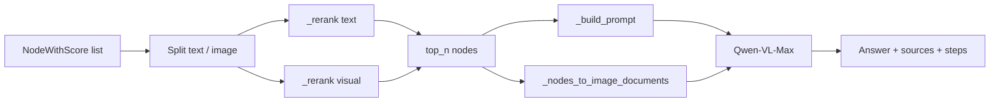

# Generation

The generation engine transforms retrieved `NodeWithScore` objects into a grounded, cited answer via a Vision-Language Model (VLM). It implements the final stage of the RAG pipeline: **split → rerank → prompt → VLM generate → sources**.

**Source module:** `eagle_rag/generation/multimodal_engine.py`

---

## 1. Theoretical background

### 1.1 RAG generation

After retrieval, the LLM receives retrieved passages as context and generates an answer conditioned on them (Lewis et al., *Retrieval-Augmented Generation for Knowledge-Intensive NLP Tasks*, arXiv:2005.11401). Eagle-RAG extends this to **multimodal RAG**: text chunks plus visual tile images are fed to a VLM (Qwen-VL-Max).

### 1.2 Bi-encoder recall vs cross-encoder rerank

Retrieval uses bi-encoders (fast, approximate top-K). Before generation, a **cross-encoder reranker** (Qwen `qwen3-rerank` via `DashScopeRerank`) jointly scores query-passage pairs for higher precision at lower K (Nogueira & Cho, arXiv:1901.04085).

| Stage | Model type | Speed | Precision |
|-------|-----------|-------|-----------|
| Recall (retrieval) | Bi-encoder | Fast | Moderate |
| Rerank (generation) | Cross-encoder | Slower | High |
| Generate | VLM | Slowest | N/A |

Visual nodes have **no reranker** yet — they fall back to score-descending sort.

### 1.3 Multimodal prompting

The VLM receives:

1. Structured text context (reference passages + attachment text + image captions).
2. Actual image bytes/URLs as multimodal input.

This follows the "image-as-context" paradigm (Alayrac et al., *Flamingo*, arXiv:2204.14198; Qwen-VL series).

### 1.4 Grounding and citation

The prompt instructs the model to cite reference text by `[n]` index and describe images without fabricating URLs — reducing hallucination in grounded generation (Shi et al., *REPLUG*, arXiv:2301.12652).

### 1.5 Parent-document context

Section summaries (`type="section_summary"`) and fine-grained chunks may both appear in reranked results. The prompt includes `path` metadata so the VLM can reason about document structure — supporting hierarchical context (parent-document retrieval pattern).

---

## 2. Pipeline



---

## 3. Code walkthrough

### 3.1 EagleMultimodalQueryEngine

Extends LlamaIndex `CustomQueryEngine`. Key fields:

| Field | Default | Purpose |
|-------|---------|---------|
| `multi_modal_llm` | `_DashScopeVLM` | Qwen-VL via native DashScope SDK |
| `text_reranker` | `DashScopeRerank` | Cross-encoder text rerank |
| `image_reranker` | `None` | No visual reranker wired |
| `top_n` | 3 | Post-rerank keep count |

### 3.2 Entry points

**Sync:** `custom_query(query_str, nodes, route_info, ...)`

**Stream:** `stream_custom_query(...)` → yields SSE dicts:

| Event | Data |
|-------|------|
| `step` | `{name: "rerank", text_top, visual_top, ...}` |
| `sources` | `{text: [...], image: [...]}` |
| `token` | `{delta: "..."}` |
| `done` | `{answer, sources, route, steps}` |

Called by `EagleRouterQueryEngine.query()` / `query_stream()`.

### 3.3 `_prepare_generation`

1. Split nodes: `TextNode` (not ImageNode) vs `ImageNode`.
2. `_rerank()` each path independently.
3. Detect language (`zh` if CJK chars, else `en`).
4. Separate KB text from attachment text (`metadata.source == "attachment"`).
5. `_build_prompt()` + `_nodes_to_image_documents()`.
6. Assemble `sources` and `steps` trace chain.

### 3.4 `_rerank` (critical path)

```python
def _rerank(nodes, reranker, query_str, top_n):
    if reranker is not None:
        processed = reranker.postprocess_nodes(nodes, query_str=query_str)
    else:
        processed = nodes
    processed = sorted(processed, key=lambda n: n.score or 0.0, reverse=True)
    return processed[:top_n]
```

- Uses LlamaIndex `BaseNodePostprocessor.postprocess_nodes()` interface.
- On reranker failure → fallback to original score ordering.
- Telemetry: `ai_logger.info("rerank", stage="text"|"visual", kept=..., top=[...])`.
- OpenTelemetry span: `rerank`.

### 3.5 `_build_prompt`

Structured Chinese prompt template:

```
你是多模态问答助手，请基于以下参考信息回答用户问题。

【参考文本】
[1] 路径: doc/Chapter 1
{chunk content}

【用户附件】
[1] 文件: upload.pdf
{attachment text}

【参考图片】
[1] image_id=..., 页码=..., 章节=..., 摘要=...

【用户问题】
{query}

图片已作为多模态输入提供。回答时勿使用 Markdown 图片语法...
请用中文/English回答。
```

Image captions carry fusion anchors (`parent_section`, `content_summary`) for semantic placement without requiring the VLM to OCR the image.

### 3.6 VLM invocation

**`_DashScopeVLM`** bypasses deprecated `llama-index-multi-modal-llms-dashscope` (broken ChatMessage compat) and calls `dashscope.MultiModalConversation` directly:

```python
messages = [{
    "role": "user",
    "content": [
        {"image": "data:image/png;base64,..."},  # per ImageDocument
        {"text": prompt},
    ],
}]
```

**Sync:** `complete(prompt, image_documents)` → `_VLMResponse(text=...)`

**Stream:** `stream_complete(...)` with `incremental_output=True` → yields delta tokens.

On failure: returns `"生成失败：{error}"` without raising.

### 3.7 ImageDocument resolution (`_nodes_to_image_documents`)

Priority chain per visual node:

1. `ImageDocument(image_path=...)` — MinIO presigned URL or local path.
2. `ImageDocument(image_url=...)` — fallback.
3. `ImageDocument(image=get_image_bytes(image_id))` — byte fallback when URLs unreachable.

Unreadable nodes are skipped (logged at debug).

### 3.8 Source mapping

**Text source** (`_text_source`):

```json
{
  "type": "text|section_summary|table|...",
  "path": "doc/Chapter 1",
  "level": 2,
  "document_id": "...",
  "score": 0.87,
  "content": "...(capped at source_content_max_chars)...",
  "summary": "...",
  "keywords": ["..."],
  "page_nums": [1, 2],
  "kb_name": "finance",
  "source_type": "policy"
}
```

**Image source** (`_image_source`):

```json
{
  "type": "image",
  "image_id": "...",
  "image_path": "minio://...",
  "page": 3,
  "position": "strip_2",
  "chunk_type": "tile|image|table",
  "parent_section": "doc/Financial Statements",
  "content_summary": "Balance sheet table",
  "source_chunk_id": "chunk_abc",
  "score": 0.75
}
```

### 3.9 Steps trace

Full chain exposed to frontend:

```
route → recall → [attach_parse] → rerank → generate
```

Each step carries diagnostic metadata for the query inspector UI.

---

## 4. Milvus schema (read-only at generation)

Generation does not query Milvus directly — it consumes pre-retrieved nodes. Understanding metadata fields helps debug source mapping:

| Metadata field | Appears in text source | Appears in image source |
|---------------|----------------------|------------------------|
| `path` | ✓ | — |
| `document_id` | ✓ | ✓ |
| `kb_name` | ✓ | ✓ |
| `chunk_type` | — | ✓ |
| `parent_section` | — | ✓ |
| `content_summary` | — | ✓ (also in prompt caption) |

---

## 5. LlamaIndex integration

| LlamaIndex component | Eagle-RAG usage |
|---------------------|-----------------|
| `CustomQueryEngine` | Base class for `EagleMultimodalQueryEngine` |
| `NodeWithScore` | Input from router/retrievers |
| `TextNode` / `ImageNode` | Split before rerank |
| `ImageDocument` | VLM multimodal input |
| `DashScopeRerank` | `llama_index.postprocessor.dashscope_rerank` |
| `BaseNodePostprocessor` | Reranker interface via `postprocess_nodes()` |

VLM is **not** LlamaIndex-wrapped — native DashScope SDK for compatibility with llama-index-core ≥ 0.12.

---

## 6. Design tensions and tuning

| Tension | Code path | Consequence | Dial |
| --- | --- | --- | --- |
| **Recall–rerank–generate funnel** | `top_k` (router) → `_rerank` → `top_n` (default 3) | `top_k=20, top_n=3` burns DashScope rerank on 17 discarded passages; `top_k=3, top_n=3` starves reranker with weak ANN tail | Raise `top_k` when answers miss facts; keep `top_n` low for latency |
| **Asymmetric rerank coverage** | `_rerank`: text uses `DashScopeRerank`; visual uses `image_reranker=None` | Visual evidence ordered by ANN score only — high IP score ≠ best image for question | Manually cap visual `top_k`; future visual reranker would go here |
| **Rerank failure mode** | `postprocess_nodes` except → sort by original ANN score | Cross-encoder outage silently reverts to bi-encoder ordering | Alert on `rerank` telemetry without `latency_ms` success pattern |
| **VLM context budget** | `_build_prompt` + `_nodes_to_image_documents` | Each image tile consumes vision tokens; `top_n` text + N images can exceed Qwen-VL context | Lower `top_n` or visual `top_k` before truncating prompt text |
| **Evidence truncation asymmetry** | `_text_source` uses `source_content_max_chars` for API response | Prompt may contain fuller chunk text than returned `sources` — UI shows less than model saw | Raise `router.source_content_max_chars` for evidence panel, not for model |
| **Attachment precedence** | Router prepends attachment nodes at score 1.0 | Attachments always enter rerank pool — can displace KB hits when `top_n` small | Increase `top_n` when `attachments[]` present |
| **Language template split** | `_detect_language` + `_CJK_PATTERN` | Mixed zh/en query picks one template; citations format differs | Pass explicit `language` in API when UI locale ≠ query language |
| **Streaming vs sync error surface** | `_invoke_vlm_stream` yields tokens; errors mid-stream | Client may render partial answer before `error` event | Frontend should gate citations on `done` event |

**Cross-encoder theory (why `top_n` is small):** Nogueira & Cho (arXiv:1901.04085) — joint query–passage encoding is O(pairs) at rerank time; Eagle-RAG intentionally keeps `top_n` ≤ 5 in production configs.

---

## 7. Config & tuning

```yaml
vlm:
  model: qwen3.6-flash          # Qwen-VL-Max family
  api_key: ${VLM_API_KEY}

rerank:
  text:
    model: qwen3-rerank         # qwen3-rerank
    api_key: ${DASHSCOPE_API_KEY}

router:
  source_content_max_chars: 4000  # caps source payload in response
```

**Query-time parameters:**

| Parameter | Default | Effect |
|-----------|---------|--------|
| `top_k` (retrieval) | 5 | ANN recall breadth |
| `top_n` (generation) | 3 | Post-rerank context size |

**Tuning guide:**

| Goal | Action |
|------|--------|
| More context in answer | Increase `top_n` (watch VLM token limits) |
| Better precision | Increase `top_k` at retrieval, keep `top_n` low |
| Faster generation | Disable reranker (falls back to score sort) |
| Smaller API responses | Lower `source_content_max_chars` |
| English answers | Query in English (auto-detected) |

---

## 8. Tests

**Primary:** `tests/test_router_generation.py`

| Contract | Verification |
|----------|-------------|
| Text rerank | Mock `DashScopeRerank.postprocess_nodes` reorders nodes |
| Rerank fallback | Reranker exception → score-descending sort |
| Prompt assembly | Reference text, attachments, image captions present |
| VLM call | Mock `complete()` receives prompt + image_documents |
| Stream tokens | `stream_complete` yields incremental deltas |
| Source mapping | Fusion anchor fields in image sources |
| Language detection | CJK query → Chinese instruction |
| Failure message | VLM None → "生成失败：未配置多模态大模型" |

---

## 9. Streaming SSE integration

`EagleRouterQueryEngine.query_stream()` wraps generation events:

```
session → step(route) → step(recall) → step(attach_parse?) → step(rerank) → sources → token* → done
```

Frontend consumes via `POST /query/stream` (see [api-layer](api-layer.md)).

---

## 10. Error handling philosophy

| Failure | Behavior |
|---------|----------|
| Reranker unavailable | Score sort (graceful) |
| VLM unavailable | Failure message in answer |
| VLM API error | `"生成失败：{error}"` returned |
| Image load failure | Skip image, continue with text |
| Stream empty | Fallback to sync `complete()` |

Generation never raises to the API layer — errors are embedded in the response.

---

## 11. References

- Lewis et al., *Retrieval-Augmented Generation for Knowledge-Intensive NLP*, [arXiv:2005.11401](https://arxiv.org/abs/2005.11401)
- Nogueira & Cho, *Passage Re-ranking with BERT*, [arXiv:1901.04085](https://arxiv.org/abs/1901.04085)
- Reimers & Gurevych, *Sentence-BERT*, [arXiv:1908.10084](https://arxiv.org/abs/1908.10084)
- Alayrac et al., *Flamingo*, [arXiv:2204.14198](https://arxiv.org/abs/2204.14198)
- Shi et al., *REPLUG*, [arXiv:2301.12652](https://arxiv.org/abs/2301.12652)
- Gao et al., *RAG Survey*, [arXiv:2312.10997](https://arxiv.org/abs/2312.10997)
- DashScope multimodal API: [help.aliyun.com/document_detail/2712576.html](https://help.aliyun.com/document_detail/2712576.html)
- LlamaIndex CustomQueryEngine: [docs.llamaindex.ai/module_guides/deploying/query_engine](https://docs.llamaindex.ai/en/stable/module_guides/deploying/query_engine/)
- LlamaIndex DashScopeRerank: [docs.llamaindex.ai/en/stable/examples/node_postprocessor/DashScopeRerank](https://docs.llamaindex.ai/en/stable/examples/node_postprocessor/DashScopeRerank/)
