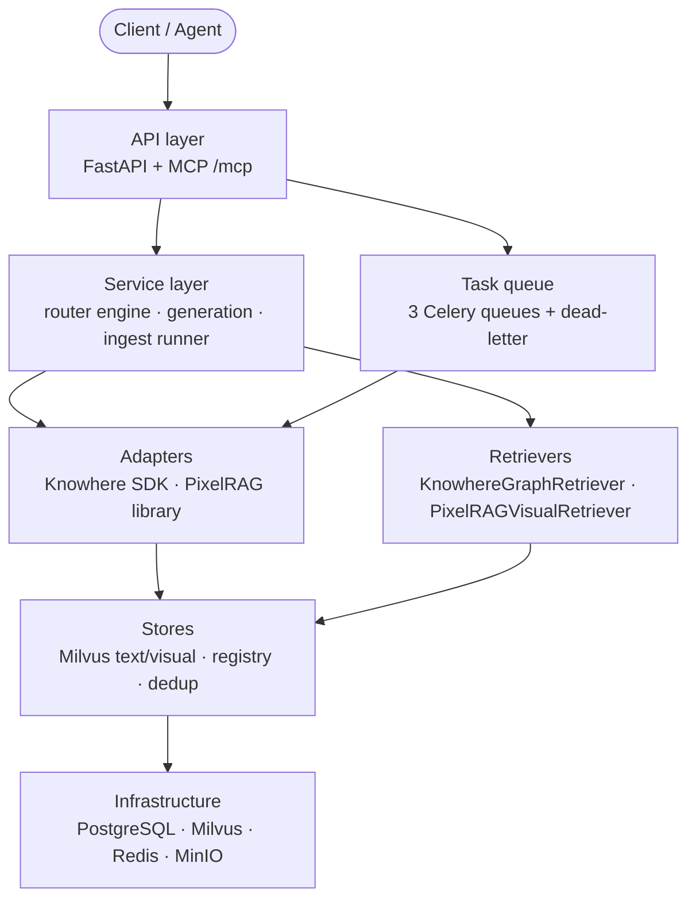

# Backend

Eagle-RAG's backend is an **industry-agnostic, multi-tenant multimodal RAG data layer** for Agents and LLMs. It combines [FastAPI](https://fastapi.tiangolo.com/) (HTTP API), [Celery](https://docs.celeryq.dev/) (async ingest), [LlamaIndex](https://docs.llamaindex.ai/) (retrieval orchestration), [Milvus](https://milvus.io/docs) (dual vector collections), and PostgreSQL (metadata/audit). A single `kb_name` threads through every layer to isolate knowledge bases.

Application entry: `eagle_rag/api/app.py`. No auth middleware on REST (intranet). Schema migrations: `task db:migrate`.

---

## What is a RAG backend?

Retrieval-Augmented Generation augments an LLM with external knowledge. Eagle-RAG implements four responsibilities:

| Responsibility | Module | Key papers |
|---------------|--------|-----------|
| **Ingest** — parse, chunk, embed, index | `eagle_rag/ingest/` + Celery | Karpukhin et al. DPR ([arXiv:2004.04906](https://arxiv.org/abs/2004.04906)) |
| **Retrieve** — ANN + graph expansion + cross-modal | `eagle_rag/retrievers/` | G-Retriever ([arXiv:2402.07629](https://arxiv.org/abs/2402.07629)), CLIP ([arXiv:2103.00020](https://arxiv.org/abs/2103.00020)) |
| **Route** — text / visual / hybrid selection | `eagle_rag/router/` | Self-RAG ([arXiv:2310.11511](https://arxiv.org/abs/2310.11511)) |
| **Generate** — rerank + VLM + cited answer | `eagle_rag/generation/` | Lewis et al. RAG ([arXiv:2005.11401](https://arxiv.org/abs/2005.11401)), cross-encoder rerank ([arXiv:1901.04085](https://arxiv.org/abs/1901.04085)) |

Eagle-RAG extends text RAG with a **dual-pipeline** architecture: structured parsing via [Knowhere](https://github.com/Ontos-AI/knowhere) and visual tile encoding via PixelRAG (`pixelrag_render` + Qwen3-VL embedding). Both write to separate Milvus collections, fused at retrieval via four anchor fields on visual tiles.

---

## Layered architecture



Two cross-cutting flows:

1. **Ingest** — document in → vectors out (API → Celery → adapters → Milvus).
2. **Query** — question in → cited answer out (API → route → retrieve → rerank → VLM).

See [architecture/data-flow](../architecture/data-flow.md) for sequence diagrams.

---

## Dual database strategy

| Driver | Placeholder | Used by |
|--------|------------|---------|
| **asyncpg** (async) | `$1`, `$2` | FastAPI handlers |
| **psycopg2** (sync) | `%s` | Celery tasks, sync stores |

Celery workers cannot share the asyncpg pool. Alembic normalizes DSN in `alembic/env.py`.

---

## Milvus collections (`eagle_text` + `eagle_visual`)

| Collection | Dim | Metric | Index | Embed model |
|------------|-----|--------|-------|------------|
| `eagle_text` | 1536 | COSINE | HNSW (LlamaIndex) | Qwen text-embedding-v4 |
| `eagle_visual` | 2048 | IP | HNSW M=16, efConstruction=256 | Qwen3-VL-Embedding-2B |

Tenant isolation: `kb_name == "{tenant}"` on every query. Scope union: `(kb_name in [...] or document_id in [...])`.

---

## LlamaIndex integration map

| LlamaIndex type | Eagle-RAG role |
|----------------|---------------|
| `TextNode` | Knowhere chunks + section summaries |
| `ImageNode` | Visual retrieval hits |
| `VectorStoreIndex` | Text ANN over `eagle_text` |
| `MilvusVectorStore` | LlamaIndex ↔ Milvus text bridge |
| `BaseRetriever` | KnowhereGraphRetriever, PixelRAGVisualRetriever |
| `CustomQueryEngine` | EagleMultimodalQueryEngine |
| `DashScopeRerank` | Cross-encoder text reranking |
| `MetadataFilters` | kb_name / scope / facet → Milvus expr |

Visual vectors bypass LlamaIndex vector store (managed by pymilvus directly).

---

## Documentation index

Each page includes theoretical background, code walkthrough, **design tensions and tuning** (parameter-level trade-offs tied to code paths), Milvus schema/expr, LlamaIndex mapping, config keys, tests, and references.

### Cross-cutting tensions (where to read more)

| Symptom | Start here |
| --- | --- |
| Missing chunks in answers | [retrieval](retrieval.md) §8, [vector-stores](vector-stores.md) §8 (`ef`, filters) |
| Weak or noisy citations | [generation](generation.md) §6 (`top_k`/`top_n`, visual rerank gap) |
| Wrong pipeline / parser | [ingest-pipeline](ingest-pipeline.md) §6, [router-engine](router-engine.md) §7 |
| Ingest stuck / duplicate tiles | [task-queue](task-queue.md) §9 (acks, DLQ) |
| Tenant or scope leaks | [retrieval](retrieval.md) §8, [kb-management](kb-management.md) §8 |

| Page | Lines | Scope |
|------|-------|-------|
| [api-layer](api-layer.md) | 200+ | FastAPI app, routers, SSE, query engine singleton |
| [ingest-pipeline](ingest-pipeline.md) | 400+ | runner, router, Knowhere/PixelRAG adapters, Celery tasks |
| [retrieval](retrieval.md) | 400+ | KnowhereGraphRetriever, PixelRAGVisualRetriever, filters |
| [vector-stores](vector-stores.md) | 400+ | eagle_text + eagle_visual schema, index params, registry |
| [router-engine](router-engine.md) | 350+ | route_query selectors, EagleRouterQueryEngine |
| [generation](generation.md) | 350+ | split, rerank, prompt, VLM streaming |
| [task-queue](task-queue.md) | 300+ | Celery config, with_retry, dead-letter |
| [storage](storage.md) | 200+ | MinIO, dedup, attachments, image store |
| [database](database.md) | 250+ | SQLModel tables, Alembic, ER diagram |
| [kb-management](kb-management.md) | 200+ | KB registry, lifecycle, stats, health |
| [admin-module](admin-module.md) | 200+ | MCP log, queue metrics, config snapshot |
| [sessions-notifications](sessions-notifications.md) | 200+ | Chat sessions, scope persistence, notifications |
| [mcp-server](mcp-server.md) | 250+ | Four MCP tools, HTTP/stdio, resilience |
| [schemas](schemas.md) | 250+ | Pydantic v2 request/response contracts |

---

## Cross-cutting concerns

Documented in the architecture section:

- **[Multi-tenancy](../architecture/multi-tenancy.md)** — `kb_name` on every table, dedup PK, Milvus filter, MinIO prefix.
- **[Reliability](../architecture/reliability.md)** — lazy singletons, fail-closed Knowhere, fail-fast PixelRAG, best-effort writes.
- **[Routing matrix](../architecture/routing-matrix.md)** — ingest pipeline selection by format + content form.
- **[Multimodal fusion](../architecture/multimodal-fusion.md)** — four visual anchor fields, parent-document retrieval.

---

## Model stack (DeepSeek + Qwen only)

| Use | Model | Dim |
|-----|-------|-----|
| Text LLM / routing | DeepSeek (`deepseek-v4-pro`) | — |
| VLM generation | Qwen-VL (`qwen3.6-flash`) | — |
| Text embedding | Qwen (`text-embedding-v4`) | 1536 |
| Visual embedding | Qwen3-VL-Embedding-2B | 2048 |
| Text rerank | Qwen (`qwen3-rerank`) | — |

No OpenAI / Cohere adapters. Configuration: `eagle_rag/settings.yaml`.

---

## Key test files

| Area | Test file |
|------|-----------|
| Retrievers | `tests/test_retrievers.py` |
| Router + generation | `tests/test_router_generation.py` |
| Ingest routing | `tests/test_ingest_assets.py`, `tests/test_ingest_smoke.py` |
| Knowhere sections | `tests/test_knowhere_sections.py` |
| Visual chunks | `tests/test_knowhere_visual_chunks.py` |
| Milvus structure | `tests/test_milvus_structure_fetch.py` |
| API integration | `tests/test_api_query_sessions_documents_tasks.py` |
| MCP | `tests/test_mcp_*.py` |
| Attachments | `tests/test_attachments_parser.py` |

Run: `uv run pytest tests/`

---

## Quick start

```bash
uv sync
task db:migrate
uv run uvicorn eagle_rag.api.app:app --host 0.0.0.0 --port 8000

# Celery workers (separate terminals)
celery -A eagle_rag.tasks.celery_app worker -Q router_queue -c 4
celery -A eagle_rag.tasks.celery_app worker -Q knowhere_queue -c 8
celery -A eagle_rag.tasks.celery_app worker -Q pixelrag_queue -c 1
```

---

## References

- Gao et al., *RAG Survey*, [arXiv:2312.10997](https://arxiv.org/abs/2312.10997)
- Karpukhin et al., *Dense Passage Retrieval*, [arXiv:2004.04906](https://arxiv.org/abs/2004.04906)
- Lewis et al., *Retrieval-Augmented Generation*, [arXiv:2005.11401](https://arxiv.org/abs/2005.11401)
- Milvus documentation: [milvus.io/docs](https://milvus.io/docs)
- LlamaIndex documentation: [docs.llamaindex.ai](https://docs.llamaindex.ai/)
- AGENTS.md — agent coding constraints for this repository
