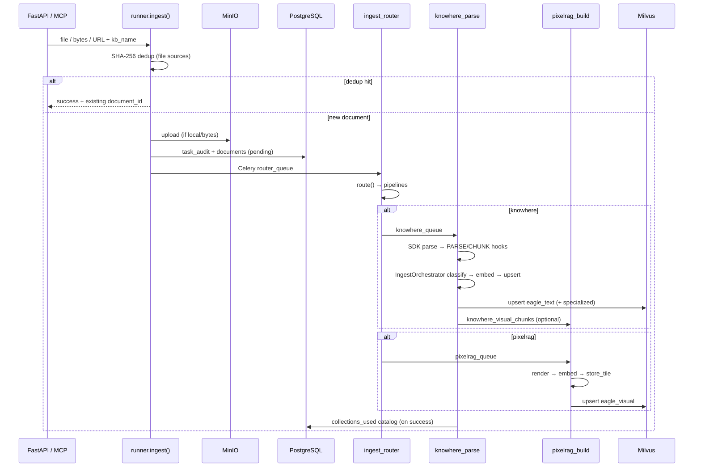

# Ingest pipeline

The ingest pipeline transforms raw documents (local files, byte streams, MinIO objects, or URLs) into searchable Milvus vectors and PostgreSQL registry records. Eagle-RAG uses a **dual-pipeline** design: structured text parsing via [Knowhere](https://github.com/Ontos-AI/knowhere) and visual tile encoding via PixelRAG (`pixelrag_render` + local Qwen3-VL embedding). A Celery router task decides which pipeline(s) run for each document. After parse/chunk, the **plugin microkernel** runs `IngestOrchestrator` with `CLASSIFY_*` / `EMBED_*` / `UPSERT_VECTORS` hooks for domain encoders and specialized collections.

**Source modules:** `eagle_rag/ingest/runner.py`, `eagle_rag/ingest/router.py`, `eagle_rag/ingest/knowhere_adapter.py`, `eagle_rag/ingest/pixelrag_adapter.py`, `eagle_rag/ingest/selectors.py`, `eagle_rag/plugins/ingest_orchestrator.py`, `eagle_rag/plugins/hotpath_hooks.py`

See [Plugin architecture](../architecture/plugin-architecture.md) for hook catalog and `collections_used` contract.

---

## 1. Theoretical background

### 1.1 Document parsing and chunking for RAG

Classic RAG indexes fixed-size text chunks. Knowhere extends this with **semantic skeleton parsing**: typed chunks (`text`, `table`, `image`) carry hierarchy (`path`, `level`), summaries, keywords, and cross-chunk relations (`connect_to`). This aligns with **structure-aware chunking** research showing that preserving document hierarchy improves retrieval precision (Gao et al., *Retrieval-Augmented Generation for Large Language Models: A Survey*, arXiv:2312.10997).

### 1.2 Dense passage retrieval (DPR) and bi-encoders

Text chunks are embedded with a **bi-encoder** (Qwen `text-embedding-v4`, 1536-d) and stored in Milvus. At query time, the query is embedded in the same space (asymmetric `text_type=query` vs `document`) and nearest neighbors are retrieved — the standard **Dense Passage Retrieval** paradigm (Karpukhin et al., *Dense Passage Retrieval for Open-Domain Question Answering*, arXiv:2004.04906).

### 1.3 Visual / cross-modal embedding

Scanned PDFs, images, and URLs bypass text extraction and are rendered into **visual tiles**. Each tile is encoded by a vision-language embedding model (Qwen3-VL-Embedding-2B, 2048-d). Queries are encoded in the **same vector space** via text-side encoding — a form of **cross-modal retrieval** (Radford et al., *Learning Transferable Visual Models From Natural Language Supervision*, arXiv:2103.00020; CLIP-style alignment).

PixelRAG's embedding is fine-tuned on document screenshots, making it suited for table/chart/diagram retrieval where OCR fails.

### 1.4 Graph-augmented retrieval (ingest side)

Knowhere chunks carry `connect_to` edges (chunk_id references). During retrieval, `KnowhereGraphRetriever` expands ANN hits along these edges — a lightweight **graph-augmented retrieval** pattern related to G-Retriever (He et al., arXiv:2402.07629) but scoped to document-internal relations rather than external knowledge graphs.

### 1.5 Parent-document retrieval

Knowhere's `doc_nav.sections` tree produces `type="section_summary"` TextNodes. Retrieval can recall coarse section summaries first, then drill down via `path` prefix — the **parent-document / hierarchical retrieval** strategy (Liu et al., *Lost in the Middle*, arXiv:2307.03172; parent-child chunking in LlamaIndex).

### 1.6 Routing as a classification problem

Ingest routing selects pipeline(s) by **format + content form** (text PDF vs scanned PDF, extension, URL). Query routing (separate module) selects text/visual/hybrid retrieval. Both use **FallbackChain** strategy pattern with ordered selectors.

---

## 2. End-to-end flow



---

## 3. Code walkthrough

### 3.1 Unified entry: `runner.py`

`ingest()` is the single synchronous entry called by FastAPI (`POST /ingest`) and MCP (`core_ingest` tool).

**Four input sources:**

| Source | Parameters | Dedup | MinIO upload |
|--------|-----------|-------|--------------|
| Local file | `file_path` | Yes (SHA-256) | Yes if no `object_key` |
| Bytes | `file_bytes` + `filename` | Yes | Yes |
| MinIO key | `object_key` + `filename` | Yes | No (already stored) |
| URL | `source_uri` (http/https) | No | No |

**Key design decisions:**

1. **`kb_name` validation** — raises if KB not registered (`kb_exists_sync` via repositories).
2. **Dedup deferred** — `dedup.register()` runs only after successful `knowhere_parse`, so failed jobs don't block re-upload. PK: `(sha256, kb_name, plugin_namespace)`.
3. **`local_path` not dispatched** — API container temp files are unreachable from worker containers; workers fetch via `object_key`.
4. **Graceful PG degradation** — audit/registry failures are logged but don't block Celery dispatch.
5. **Namespace binding** — repositories inject `plugin_namespace` from `settings.plugins.default_namespace`.

```python
# runner.py — dispatch after registration
send_task_with_trace(
    "eagle_rag.ingest.router.ingest_router",
    queue="router_queue",
    kwargs={
        "job_id": job_id,
        "document_id": document_id,
        "name": name,
        "object_key": object_key,
        "local_path": None,  # workers use MinIO
        "kb_name": kb,
        "sha256": sha256,
        ...
    },
)
```

Returns: `{"job_id", "status", "dedup_hit", "document_id"}`.

### 3.2 Routing matrix: `router.py`

`route()` returns a pipeline list: `["knowhere"]`, `["pixelrag"]`, or `["knowhere", "pixelrag"]`.

**Override priority (high → low):**

| # | Selector | Trigger | Result |
|---|----------|---------|--------|
| 1 | `PrefixSelector` | Filename `knowhere:` / `pixelrag:` | Force single pipeline |
| 2 | `ForcedModeSelector` | `settings.router.mode` = text/visual/hybrid | Force pipeline(s) |
| 3 | `HttpUriSelector` | `source_uri` is http/https | pixelrag |
| 4 | `PdfFormSelector` | PDF + `local_path` | knowhere (text) or pixelrag (scanned) |
| 5 | `ExtensionSelector` | Extension in knowhere/pixelrag sets | Matching pipeline |
| 6 | `ContentTypeSelector` | MIME rules | Matching pipeline |
| — | default | Unknown | `settings.ingest.routing.default_pipeline` (knowhere) |

**PDF form probe** (`probe_pdf_form`):

- Extracts per-page text via pypdf → pdfplumber fallback.
- Computes `text_page_ratio` (pages above char threshold / total pages) and `avg_chars_per_page`.
- Returns `"scanned"` when below `settings.pdf_probe` thresholds; otherwise `"text"`.
- Parse failure defaults to `"text"` (Knowhere degrades gracefully).

`source_type_hint` and `kb_name` do **not** affect routing — `source_type` is metadata only (`infer_source_type`).

**Celery task `ingest_router`** (`router_queue`, concurrency 4):

1. `TaskState.RENDERING` — "routing in progress"
2. `route()` + `infer_source_type()`
3. `register_document()` with pipeline list
4. `app.send_task` to `knowhere_queue` / `pixelrag_queue`
5. `TaskState.SUCCESS` — "dispatched to {pipelines}"

On exception: `retry_on_failure(self, exc)`.

### 3.3 Knowhere adapter: `knowhere_adapter.py`

#### SDK client

```python
client = knowhere.Knowhere(api_key=..., base_url=..., timeout=...)
result = client.parse(
    file=Path(file_path),
    file_name=file_name,
    parsing_params=...,
    poll_interval=...,
    poll_timeout=...,
)
```

Fail-closed: SDK errors raise `KnowhereError` → task FAILED, no silent fallback.

#### Chunk → TextNode mapping

| Chunk type | Text content | Metadata |
|------------|-------------|----------|
| `text` | `chunk.content` | path, level, summary, keywords, connect_to, page_nums |
| `table` | `chunk.html` | same + type=table |
| `image` | `metadata.summary` | same + type=image |

All nodes carry `document_id`, `source_type`, `kb_name`. `document_top_summary` is stored in metadata only (not concatenated into text — avoids embedding dilution).

#### Section summaries (parent-document)

`sections_to_text_nodes()` walks `parse_result.doc_nav.sections`, emitting `type="section_summary"` nodes with stable IDs (`sec_{sha1[:16]}`).

#### Visual chunk dispatch (multimodal fusion)

`extract_visual_chunks()` collects image/table chunks with `parent_section` anchor. `dispatch_visual_chunks()` uploads to MinIO and sends `knowhere_visual_chunks` to `pixelrag_queue` with a **separate job_id** (`{parent_job_id}:visual`) to avoid state machine conflicts.

#### Task `knowhere_parse` state machine

| Stage | TaskState | Action |
|-------|-----------|--------|
| Fetch | RENDERING | Download from MinIO if needed |
| Parse | RENDERING | Knowhere SDK |
| Embed prep | EMBEDDING | chunks → TextNodes + section nodes |
| Index | INDEXING | `upsert_text_nodes()` |
| Tags | (non-blocking) | `upsert_document_keywords()` |
| Visual | (non-blocking) | dispatch to pixelrag_queue |
| doc_nav | (non-blocking) | `update_extra({"doc_nav": ...})` |
| Done | SUCCESS | registry ready + dedup.register + collections_used catalog |

### 3.4 Plugin ingest path

After Knowhere parse, hot-path hooks wire domain customization:

| Stage | Hook | Module |
|-------|------|--------|
| Parse enrich | `PARSE` | `eagle_rag/plugins/hotpath_hooks.py` |
| Domain metadata enrich (Knowhere-preserving) | `CHUNK` | `eagle_rag/plugins/hotpath_hooks.py` |
| Visual extract | `INGEST_VISUAL_EXTRACT` | HookBus |
| Classify | `CLASSIFY_CHUNK` / `CLASSIFY_VISUAL` | `IngestOrchestrator.classify()` |
| Embed + upsert | `EMBED_*` → `UPSERT_VECTORS` | `IngestOrchestrator.embed_and_upsert()` |

Fixed order (G26): `PARSE → CHUNK → INGEST_VISUAL_EXTRACT → CLASSIFY_* → IngestOrchestrator`.

On **successful** ingest only (`documents.status=success`, all chunks written):

- `documents.extra["collections_used"]` — per document
- `knowledge_bases.collections_used` — KB-level union

Failed or partial ingests do not update the catalog. Query scope uses this catalog for specialized collection plans ([ADR-006](../architecture/adr/006-ingest-query-routing-contract.md)).

### 3.5 PixelRAG adapter: `pixelrag_adapter.py`

PixelRAG is a **library only** — no `pixelrag serve`, no FAISS, no `pixelrag.build()`.

#### Render pipeline

| Source | Function |
|--------|----------|
| URL | `pixelrag_render.render_url()` |
| PDF | `pixelrag_render.render_pdf()` |
| Other file | `pixelrag_render.render_file()` |

Output: tile dicts `{image_bytes, page, position, width, height}`.

#### Visual encoder (`get_visual_encoder`)

`eagle_rag/ingest/visual_encoder.py` selects a backend from `embedding.visual.provider`:

| Provider | Backend | Notes |
| --- | --- | --- |
| `pixelrag` (default) | Local HF Qwen3-VL-Embedding | Last-token pool + L2; device `auto` → cuda → mps → cpu |
| `dashscope` | Bailian `qwen3-vl-embedding` | DashScope `MultiModalEmbedding`; `dimension=2048`; needs `DASHSCOPE_API_KEY` |

- Image and text queries share one vector space (same provider for ingest + query)
- Switching providers requires **rebuilding** `eagle_visual` (do not mix backends)
- Public API unchanged: `embed_tiles` / `embed_query` / `embed_image_bytes`

#### Task `pixelrag_build` (`pixelrag_queue`, concurrency 1)

1. Resolve source (local_path / URL / MinIO download)
2. `render_to_tiles()` → `embed_tiles()`
3. Per tile: `store_tile()` (MinIO/local) + `upsert_visual()` (Milvus)
4. `update_status(document_id, "ready")`

#### Task `knowhere_visual_chunks`

Processes Knowhere-extracted image/table chunks: download from MinIO → render → embed → upsert with fusion anchor fields (`chunk_type`, `parent_section`, `content_summary`, `source_chunk_id`).

---

## 4. Milvus schema & filter expressions (ingest writes)

### 4.1 Text collection `eagle_text`

Written via LlamaIndex `MilvusVectorStore` + `VectorStoreIndex.insert_nodes()`.

**Metadata fields** (stored in dynamic field / `_node_content`):

| Field | Type | Set by |
|-------|------|--------|
| `path` | string | Knowhere chunk path |
| `level` | int | `infer_level_from_path()` |
| `summary` | string | Knowhere metadata |
| `type` | string | text/table/image/section_summary |
| `keywords` | list | Knowhere metadata |
| `connect_to` | list | Knowhere cross-chunk refs |
| `document_id` | string | ingest |
| `source_type` | string | infer_source_type |
| `kb_name` | string | multi-tenant key |
| `page_nums` | list | Knowhere metadata |
| `chunk_count` | int | section_summary only |

**Example filter expr** (used at retrieval, not ingest):

```
kb_name == "finance" and source_type == "policy" and type == "section_summary"
```

### 4.2 Visual collection `eagle_visual`

Written via `upsert_visual()` / `upsert_visual_batch()`.

| Field | Type | Notes |
|-------|------|-------|
| `id` / `image_id` | VARCHAR(64) PK | `{document_id}_{tile_index}` |
| `vector` | FLOAT_VECTOR(2048) | IP metric, HNSW M=16, efConstruction=256 |
| `image_path` | VARCHAR(512) | MinIO object key |
| `document_id` | VARCHAR(64) | |
| `kb_name` | VARCHAR(64) | default `default` |
| `chunk_type` | VARCHAR(16) | tile / image / table |
| `parent_section` | VARCHAR(512) | Knowhere path anchor |
| `content_summary` | VARCHAR(2048) | Knowhere visual summary |
| `source_chunk_id` | VARCHAR(128) | Knowhere chunk_id anchor |

**Example filter expr:**

```
kb_name == "pharma" and chunk_type == "table" and parent_section like "%Financial%"
```

---

## 5. LlamaIndex integration

| LlamaIndex type | Eagle-RAG usage |
|-----------------|-----------------|
| `TextNode` | Knowhere chunks + section summaries → `eagle_text` |
| `ImageNode` | Created at retrieval from Milvus visual hits (not at ingest) |
| `VectorStoreIndex` | `get_text_index()` singleton over `MilvusVectorStore` |
| `NodeRelationship.SOURCE` | `_attach_source_ref()` binds document_id |
| `MetadataFilter` / `MetadataFilters` | Built by retrievers from kb_name, source_type, year |

Visual vectors bypass LlamaIndex vector store — managed directly by `pymilvus.MilvusClient` because the embed model is not a standard LlamaIndex integration.

---

## 6. Design tensions and tuning

| Tension | Stage | Symptom | Mitigation |
| --- | --- | --- | --- |
| **Dedup vs re-parse** | `check_duplicate(sha256, kb_name, plugin_namespace)` short-circuit | Parser upgrade does not re-index unchanged bytes | Delete registry row or change `kb_name` to force re-ingest |
| **PDF probe errors** | `probe_pdf_form` fail-open → `text` | Scanned deck indexed as garbage text | Lower per-KB `pdf_text_page_ratio`; use `pixelrag:` prefix |
| **Knowhere fail-closed** | `KnowhereError` → task `FAILED` | No partial text index on SDK timeout | Increase `knowhere.poll_timeout`; scale Knowhere workers |
| **Visual dispatch best-effort** | `dispatch_visual_chunks` logs-only failure | `ready` doc with empty `eagle_visual` | Monitor `pixelrag_queue` + dead letter; re-run visual subtask |
| **Section summary holes** | `sections_to_text_nodes` skips empty `summary` / `chunk_count==0` | Parent-document retrieval missing branch | Fix Knowhere parse quality; not fixable by re-chunking alone |
| **Chunk graph completeness** | `connect_to` from Knowhere manifest | Weak graph → retriever expansion useless | Validate manifest in Knowhere output; compare ingest logs |
| **Embed cost linearity** | `chunks_to_text_nodes` + batch embed | 500-page policy → hundreds of DashScope calls | Expect ingest SLA dominated by embed, not Milvus upsert |
| **Hybrid ingest double work** | `route()` returns both pipelines | Same bytes through Knowhere + PixelRAG | Use routing overrides; avoid `hybrid` ingest mode unless needed |
| **MinIO upload soft-fail** | runner continues on MinIO error | Worker relies on ephemeral `local_path` | Ensure worker shares storage or upload succeeds before task ends |

**State machine note:** `knowhere_visual_chunks` failures do **not** roll back `documents.status=ready` — by design text QA proceeds; tune monitoring accordingly.

---

## 7. Config & tuning

### 6.1 Ingest routing (`settings.yaml` → `ingest.routing`)

```yaml
ingest:
  routing:
    prefix_force:
      "knowhere:": knowhere
      "pixelrag:": pixelrag
    knowhere_exts: [.docx, .doc, .md, .txt, .xlsx, .csv, .pptx, .json]
    pixelrag_exts: [.png, .jpg, .jpeg, .webp, .gif, .html]
    default_pipeline: knowhere
  source_type:
    rules: [...]   # metadata only
    default: other
```

### 6.2 PDF probe

```yaml
pdf_probe:
  text_page_ratio: 0.2      # below → scanned
  avg_chars_per_page: 50
```

Per-KB override via `get_pdf_ratio_sync(kb_name)`.

### 6.2.1 Ingest size / page limits (MinerU)

MinerU Precision Extract API (`mineru.net` `/api/v4`) caps each file at **200 MiB** and **200 pages**. Eagle-RAG enforces the same defaults via `ingest.limits` so oversized PDFs fail at ingest time (422) instead of after Celery retries inside Knowhere/MinerU:

```yaml
ingest:
  limits:
    enabled: true
    max_file_bytes: 209715200   # 200 MiB
    max_pdf_pages: 200
```

Override with `INGEST_MAX_FILE_BYTES` / `INGEST_MAX_PDF_PAGES` / `INGEST_LIMITS_ENABLED`.

### 6.3 Knowhere SDK

```yaml
knowhere:
  base_url: http://localhost:5005
  poll_interval: 10
  poll_timeout: 1800
  parsing_params:
    model: advanced
    ocr_enabled: true
```

### 6.4 PixelRAG render/embed

```yaml
pixelrag:
  tile_height: 8192
  viewport_width: 875
  pdf_dpi: 200
  backend: cdp          # cdp | playwright
  embed_device: auto    # cuda | mps | cpu (local provider only)
  embed_instruction: "Represent the user's input."

embedding:
  visual:
    provider: pixelrag                 # or dashscope
    model: Qwen/Qwen3-VL-Embedding-2B  # or qwen3-vl-embedding
    dim: 2048
    # api_key / batch_size used when provider=dashscope
```

### 6.5 Celery queues

```yaml
celery:
  queues:
    router_queue: { concurrency: 4 }
    knowhere_queue: { concurrency: 8 }
    pixelrag_queue: { concurrency: 1 }   # GPU memory bound
  max_retries: 3
  retry_backoff: 60
```

**Tuning tips:**

- Increase `knowhere_queue` concurrency for I/O-bound parsing; keep `pixelrag_queue` at 1 unless multiple GPUs.
- Lower `pdf_probe.text_page_ratio` to route more PDFs to PixelRAG (better for mixed documents).
- Use filename prefix `pixelrag:report.pdf` to force visual pipeline without changing global config.

---

## 8. Tests

| Test file | Contract verified |
|-----------|-------------------|
| `tests/test_ingest_smoke.py` | End-to-end ingest dispatch, router task wiring |
| `tests/test_ingest_assets.py` | Routing matrix: extensions, PDF probe, prefix override |
| `tests/test_knowhere_sections.py` | `sections_to_text_nodes` parent-document IDs and metadata |
| `tests/test_knowhere_visual_chunks.py` | Visual chunk extraction + dispatch to pixelrag_queue |
| `tests/test_ingest_url_validation.py` | URL source validation |
| `tests/test_mcp_resilience.py` | MCP `core_ingest` tool with circuit breaker |
| `tests/plugins/test_hotpath_hooks.py` | PARSE / CHUNK hook wiring |
| `tests/plugins/test_core_defaults.py` | Core classify / embed defaults |

**Behavioral contracts:**

- Dedup hit returns `status="success"` without Celery dispatch.
- Router dispatches correct queue(s) for each file type.
- Knowhere SDK failure → task FAILED (no silent fallback).
- PixelRAG missing library → fail-fast at first embed call.
- Visual dispatch failure is non-blocking for knowhere_parse SUCCESS.

---

## 9. Operational notes

### 8.1 Multi-tenancy

Every ingest path propagates `kb_name` and `plugin_namespace`:

- Dedup PK: `(sha256, kb_name, plugin_namespace)`
- Milvus scalar: `kb_name == '{kb}'` (inside domain Database)
- Document registry: `documents.kb_name` + repository-injected `plugin_namespace`

### 8.2 Idempotency

- Section node IDs are SHA-1 stable across re-parse.
- Visual upsert overwrites by PK `image_id`.
- Dedup prevents duplicate file ingestion within a KB.

### 8.3 Failure modes

| Failure | Behavior |
|---------|----------|
| MinIO upload (API) | Fatal — workers can't fetch file |
| PostgreSQL audit | Non-fatal — logged, dispatch continues |
| Knowhere SDK | FAILED + retry + dead-letter |
| Tag catalog write | Non-fatal |
| Visual dispatch | Non-fatal |

---

## 10. References

- Karpukhin et al., *Dense Passage Retrieval for Open-Domain Question Answering*, [arXiv:2004.04906](https://arxiv.org/abs/2004.04906)
- Gao et al., *Retrieval-Augmented Generation for Large Language Models: A Survey*, [arXiv:2312.10997](https://arxiv.org/abs/2312.10997)
- Radford et al., *Learning Transferable Visual Models From Natural Language Supervision (CLIP)*, [arXiv:2103.00020](https://arxiv.org/abs/2103.00020)
- He et al., *G-Retriever: Retrieval-Augmented Generation for Textual Graph Understanding*, [arXiv:2402.07629](https://arxiv.org/abs/2402.07629)
- Liu et al., *Lost in the Middle: How Language Models Use Long Contexts*, [arXiv:2307.03172](https://arxiv.org/abs/2307.03172)
- Nogueira & Cho, *Passage Re-ranking with BERT (cross-encoder)*, [arXiv:1901.04085](https://arxiv.org/abs/1901.04085)
- Knowhere SDK: [github.com/Ontos-AI/knowhere](https://github.com/Ontos-AI/knowhere)
- Milvus filter expressions: [milvus.io/docs/boolean.md](https://milvus.io/docs/boolean.md)
- LlamaIndex VectorStoreIndex: [docs.llamaindex.ai](https://docs.llamaindex.ai/en/stable/module_guides/indexing/vector_store_index/)
- Celery routing: [docs.celeryq.dev](https://docs.celeryq.dev/en/stable/userguide/routing.html)
