# Retrieval

Eagle-RAG retrieval combines two specialized retrievers behind a routing query engine: **KnowhereGraphRetriever** for structured text (1536-d, Milvus `eagle_text` + graph expansion) and **PixelRAGVisualRetriever** for visual tiles (2048-d, Milvus `eagle_visual`). Domain deployments additionally use **RetrieverOrchestrator** (`eagle_rag/plugins/retriever_orchestrator.py`) to query multiple collections per plan, optional per-plan `RERANK` hooks, and **RRF merge** (`eagle_rag/router/rerank_fusion.py`). Core default routing (G4) never auto-queries specialized collections.

**Source modules:** `eagle_rag/retrievers/knowhere_graph_retriever.py`, `eagle_rag/retrievers/pixelrag_visual_retriever.py`, `eagle_rag/plugins/retriever_orchestrator.py`, `eagle_rag/router/rerank_fusion.py`

See [Plugin architecture](../architecture/plugin-architecture.md) for multi-encoder fusion and scope-aware catalog union.

---

## 1. Theoretical background

### 1.1 Dense passage retrieval (DPR)

**Bi-encoder** retrieval encodes queries and documents independently into a shared embedding space, then finds nearest neighbors via approximate nearest neighbor (ANN) search. This is the foundation of modern open-domain QA (Karpukhin et al., arXiv:2004.04906).

Eagle-RAG text retrieval uses Qwen `text-embedding-v4` (1536-d, cosine similarity) with **asymmetric encoding**: documents use `text_type=document`, queries use `text_type=query` — a practice shown to improve retrieval quality in commercial embedding APIs.

### 1.2 Graph-augmented retrieval

Pure vector search may miss structurally related chunks (e.g., a table linked to its explanatory paragraph). Knowhere chunks carry `connect_to` edges. After ANN recall, the retriever **expands** along these edges via the LlamaIndex docstore — a document-internal graph augmentation inspired by G-Retriever (He et al., arXiv:2402.07629) and HippoRAG (Gutiérrez et al., arXiv:2405.14831).

### 1.3 Cross-modal (text-to-image) retrieval

Visual retrieval encodes the **text query** into the same 2048-d space as document screenshot tiles (Qwen3-VL-Embedding-2B). This enables retrieving relevant page regions from natural language questions — the CLIP paradigm (Radford et al., arXiv:2103.00020) applied to document screenshots.

### 1.4 Parent-document retrieval

Knowhere indexes `type="section_summary"` nodes alongside fine-grained chunks. A two-stage strategy:

1. Recall section summaries (coarse, high signal-to-noise).
2. Drill down via `path` prefix to child chunks.

This follows the parent-document retriever pattern (LlamaIndex `RecursiveRetriever`; Chen et al., arXiv:2310.09435 on hierarchical indexing).

### 1.6 Reciprocal rank fusion (RRF)

When multiple `CollectionQueryPlan` objects are active (domain plugins or scope-aware catalog union), `RetrieverOrchestrator` runs ANN per plan, optionally applies per-plan `RERANK` hooks, then merges with RRF — never raw cross-embedding scores. Dedupe by `source_chunk_id` (if set) or `(document_id, path)`. See [ADR-004](../architecture/adr/004-multi-encoder-rrf-fusion.md).

### 1.7 Reranking (downstream)

Retrieval returns top-K candidates; **cross-encoder reranking** happens in the generation engine (`DashScopeRerank` / qwen3-rerank). Bi-encoders are fast but approximate; cross-encoders jointly encode query+passage for higher precision at lower K (Nogueira & Cho, arXiv:1901.04085; Reimers & Gurevych, arXiv:1908.10084).

---

## 2. Architecture

```mermaid
flowchart LR
    Q[Query string] --> RE[EagleRouterQueryEngine]
    RE --> QA[apply_query_assemble hooks]
    QA --> RD[QueryRouteClassifier / route_query]
    RD --> RO[RetrieverOrchestrator]
    RO --> TR[KnowhereGraphRetriever / per-plan ANN]
    RO --> VR[PixelRAGVisualRetriever / per-plan ANN]
    TR --> TI[VectorStoreIndex eagle_text]
    TI --> ANN1[HNSW ANN + scalar filter]
    ANN1 --> GE[connect_to graph expansion]
    VR --> EQ[embed_query 2048-d]
    EQ --> SV[search_visual eagle_visual]
    SV --> ANN2[HNSW ANN + scalar filter]
    GE --> RRF[merge_rrf]
    ANN2 --> RRF
    RRF --> NWS[NodeWithScore list]
    NWS --> GEN[EagleMultimodalQueryEngine]
```



---

## 3. RetrieverOrchestrator (multi-collection)

**File:** `eagle_rag/plugins/retriever_orchestrator.py`

When `QueryRouteClassifier` (`CLASSIFY_QUERY` hook) returns multiple `CollectionQueryPlan` objects, the orchestrator:

1. Runs ANN per plan (best-effort: failed plans are skipped and audited).
2. Optionally applies per-plan `RERANK` hook.
3. Merges with RRF (`merge_rrf` in `eagle_rag/router/rerank_fusion.py`).
4. Returns deduplicated `NodeWithScore` list.

**Core default (G4):** only `eagle_text` (+ `eagle_visual` when hybrid/image). Never specialized collections unless a domain classifier or scope-aware catalog union adds them.

**Scope-aware union:** if `scope_filter` KBs / documents / tags catalog includes specialized collections (`collections_used`), those plans are forced even when the classifier abstains.

---

## 4. Code walkthrough: KnowhereGraphRetriever

**File:** `eagle_rag/retrievers/knowhere_graph_retriever.py`

### 4.1 Constructor parameters

| Parameter | Purpose |
|-----------|---------|
| `top_k` / `similarity_top_k` | ANN recall count (default 5) |
| `kb_name` | Single-KB Milvus filter |
| `kb_names` + `document_ids` | Advanced scope (OR union) |
| `source_type`, `year` | Facet filters (AND) |
| `document_id` | Client-side post-filter |

### 4.2 Filter assembly (`_build_filters`)

Builds LlamaIndex `MetadataFilters`:

```python
# Single tenant
MetadataFilter(key="kb_name", value="finance", operator=FilterOperator.EQ)

# Scope union (OR)
MetadataFilters(
    filters=[
        MetadataFilter(key="kb_name", value=["finance", "pharma"], operator=FilterOperator.IN),
        MetadataFilter(key="document_id", value=["doc-a", "doc-b"], operator=FilterOperator.IN),
    ],
    condition=FilterCondition.OR,
)

# Combined with facets (AND)
MetadataFilters(filters=[scope_group, source_type_filter, year_filter], condition=FilterCondition.AND)
```

Translated by `MilvusVectorStore` to Milvus boolean expressions.

### 4.3 Retrieval flow (`_retrieve`)

1. `get_text_index()` — lazy `VectorStoreIndex` singleton.
2. `text_index.as_retriever(similarity_top_k=K, filters=...)` → ANN search.
3. Optional client-side `document_id` filter.
4. **Graph expansion:** for each hit, read `metadata["connect_to"]`, fetch related nodes from docstore, deduplicate by `node_id`, inherit parent score.
5. Telemetry via `ai_logger.info("retrieve", retriever="text", ...)`.

### 4.4 Error degradation

Any Milvus/embedding exception → log warning, return `[]`. The router engine decides whether to proceed with visual-only results.

### 4.5 Graph expansion detail

`connect_to` entries may be plain chunk_id strings or dicts `{target, relation, ref, position}`. Missing docstore or absent targets are silently skipped — expansion is best-effort.

---

## 5. Code walkthrough: PixelRAGVisualRetriever

**File:** `eagle_rag/retrievers/pixelrag_visual_retriever.py`

### 5.1 Retrieval flow

```python
query_vector = embed_query(query_str)          # Qwen3-VL text encoding, 2048-d
results = search_visual(
    query_vector,
    top_k=self.top_k,
    kb_name=..., kb_names=..., document_ids=...,
    year=..., source_type=...,
    parent_section=..., chunk_type=...,
)
nodes = [self._to_node_with_score(r) for r in results]
```

### 5.2 ImageNode construction

Each Milvus hit becomes an `ImageNode` with metadata:

| Field | Source |
|-------|--------|
| `image_id`, `document_id`, `page`, `position` | Milvus scalar |
| `kb_name`, `year`, `source_type` | Milvus scalar |
| `chunk_type`, `parent_section`, `content_summary`, `source_chunk_id` | Fusion anchors |

Score defaults to 1.0 if Milvus returns None.

### 5.3 Cross-modal encoding

`embed_query()` delegates to `_Qwen3VLVisualEncoder.embed_text()` — the same singleton used at ingest. This ensures query and tile vectors are in the same normalized space (last-token pooling + L2 norm).

---

## 6. Milvus schema & filter expressions

### 6.1 Text collection `eagle_text`

**Vector:** 1536-d FLOAT_VECTOR, COSINE metric (via LlamaIndex `MilvusVectorStore`).

**Scalar/metadata fields used in filters:**

| Field | Example expr |
|-------|-------------|
| `kb_name` | `kb_name == "default"` |
| `document_id` | `document_id == "550e8400-..."` |
| `source_type` | `source_type == "financial"` |
| `year` | `year == 2025` |
| `type` | `type == "section_summary"` |
| `path` | `path like "report/Chapter 3%"` |

**Combined examples:**

```
kb_name == "finance" and source_type == "policy"
```

```
(kb_name in ["finance", "pharma"] or document_id in ["doc-1", "doc-2"]) and year == 2025
```

Index params (managed by LlamaIndex Milvus integration): HNSW with COSINE; scalar fields indexed as dynamic metadata.

### 6.2 Visual collection `eagle_visual`

**Vector:** 2048-d FLOAT_VECTOR, **IP** (inner product) metric.

**Index params** (`milvus_visual_store.py`):

| Index type | Params |
|------------|--------|
| HNSW (default) | `M=16`, `efConstruction=256`, search `ef=64` |
| DiskANN | `metric_type=IP`, no extra search params |

**Scalar inverted indexes:** `kb_name`, `document_id`, `source_type`, `year`, `chunk_type`, `parent_section`.

**Filter examples:**

```
kb_name == "pharma" and chunk_type == "tile"
```

```
document_id == "abc-123" and year in [2024, 2025]
```

```
(kb_name in ["finance"] or document_id in ["doc-x"]) and source_type == "financial" and parent_section like "%Balance Sheet%"
```

Built by `_build_search_expr()` in `search_visual()`.

---

## 7. LlamaIndex integration

| Component | Role |
|-----------|------|
| `BaseRetriever` | Both retrievers subclass this; implement `_retrieve(QueryBundle)` |
| `TextNode` | Knowhere text/table/image/section_summary chunks |
| `ImageNode` | Visual hits (created at retrieval, not stored in docstore) |
| `NodeWithScore` | Unified output with similarity score |
| `VectorStoreIndex` | Text ANN via `as_retriever()` |
| `MetadataFilters` | Declarative scalar filter → Milvus expr |
| `QueryBundle` | Wraps query string for `_retrieve` |

Visual retrieval **does not** use `VectorStoreIndex` — it calls `pymilvus.MilvusClient.search()` directly because the embed model is custom (Qwen3-VL singleton, not LlamaIndex `BaseEmbedding`).

**Docstore graph expansion:** `text_index.docstore.get_node(target_id)` retrieves related `TextNode` objects already indexed in Milvus/LlamaIndex storage.

---

## 8. Scope filtering

Two scope mechanisms coexist:

### 8.1 Legacy `scope: list[str]`

Document ID list; client-side filter after retrieval (`_filter_by_scope`).

### 8.2 Advanced `scope_filter: ScopeSelection`

```json
{
  "kb_names": ["finance", "pharma"],
  "document_ids": ["doc-a"],
  "tags": ["增值税", "2025"]
}
```

- Tags resolve to document IDs via `document_keywords` table (`resolve_tags_to_document_ids`, namespace-scoped).
- Union (OR) semantics: `(kb_name IN ...) OR (document_id IN ...)` pushed to Milvus.
- Specialized collections from `collections_used` catalog unioned when scope matches ([scope_routing](../architecture/plugin-architecture.md)).
- Capped by `router.max_scope_documents` (default 500).

---

## 9. Design tensions and tuning

| Tension | Location | Effect | Mitigation |
| --- | --- | --- | --- |
| **Graph expansion score inheritance** | `knowhere_graph_retriever._retrieve`: expanded nodes get parent `nws.score` | Linked table/footnote ranks as high as primary hit even if vector-similarity to query is low | Lower `top_k` if expansion adds noise; filter `type` in facets |
| **Expansion horizon** | Only `connect_to` from initial ANN hits, one hop | Multi-hop reasoning chains not traversed | Enrich Knowhere `connect_to` at parse time, not retriever |
| **Docstore availability** | `text_index.docstore` try/except → skip expansion | Identical ANN results with/without graph depending on docstore sync | After reindex, verify docstore contains same node IDs as Milvus |
| **Scope OR cardinality** | `_build_filters`: `kb_names OR document_ids` AND facets | Large tag→doc unions approach `max_scope_documents` cap — tail documents silently excluded | Narrow tags; monitor resolved doc count in `ai_logger` route events |
| **Post-filter legacy scope** | `_filter_by_scope` when `scope_filter` inactive | Milvus returns global top-K then Python filters — wastes ANN work and skews scores | Prefer `scope_filter` pushdown for multi-doc QA |
| **Visual query–image gap** | `embed_query` text in 2048-d screenshot space | Pure policy-text questions retrieve irrelevant page regions | Router `visual` path; use `chunk_type` / `parent_section` filters |
| **Empty retriever degradation** | except → `[]` | Hybrid query silently becomes single-path | Inspect `recall` step `text_count`/`visual_count` in SSE |
| **RRF vs raw scores** | `merge_rrf` after multi-plan ANN | Cannot sort mixed 1536-d / domain-encoder hits by score | Use rank positions in telemetry, not raw Milvus distance |
| **G4 specialized abstain** | Core `CLASSIFY_QUERY` | Domain collections never queried unless classifier or catalog union adds them | Expected Core behavior; enable domain profile for specialized recall |
| **Section summary drill-down** | Parent-document pattern not automatic in retriever | Must filter `type=="section_summary"` or rely on path overlap in prompt | Two-stage search in client or future retriever mode |

**ANN + filter interaction:** Milvus applies scalar predicates during HNSW search when inverted indexes exist; without them, filter runs post-ANN — same `expr`, different latency profile (see [vector-stores](vector-stores.md) §8).

---

## 10. Config & tuning

### 10.1 Retrieval top_k

Set at query time via `QueryRequest.top_k` (default 5). Passed to both retrievers as `similarity_top_k` / `top_k`.

### 10.2 Embedding

```yaml
embedding:
  text:
    model: text-embedding-v4
    dim: 1536
  visual:
    provider: pixelrag
    model: Qwen/Qwen3-VL-Embedding-2B
    dim: 2048
```

### 10.3 Milvus visual index

```yaml
milvus:
  visual_index_type: hnsw    # hnsw | diskann
  dim_text: 1536
  dim_visual: 2048
```

**Tuning guide:**

| Goal | Adjustment |
|------|-----------|
| More recall | Increase `top_k` (5 → 10) |
| Faster visual search | HNSW with lower `ef` (trade recall) |
| Large visual corpus | Switch to `diskann` |
| Narrower results | Add `source_type` / `year` facet filters |
| Section-first retrieval | Filter `type == "section_summary"` then drill by path |

### 10.4 Rerank (downstream)

```yaml
rerank:
  text:
    model: qwen3-rerank
```

Generation engine `top_n` (default 3) controls post-rerank count — see [generation](generation.md).

---

## 11. Tests

**Primary:** `tests/test_retrievers.py`

| Test area | Contract |
|-----------|----------|
| Text ANN recall | Mock `get_text_index().as_retriever().retrieve()` |
| kb_name filter pushdown | `MetadataFilter(key="kb_name", ...)` passed to retriever |
| Graph expansion | `connect_to` targets fetched from docstore, deduplicated |
| Scope union | `kb_names` + `document_ids` OR filter assembly |
| Visual embed + search | Mock `embed_query` + `search_visual` |
| ImageNode metadata | Fusion anchor fields preserved |
| Error degradation | Exception → empty list, no raise |
| Facet filters | `source_type`, `year`, `chunk_type`, `parent_section` |

**Related:**

- `tests/test_milvus_structure_fetch.py` — document structure reconstruction from Milvus
- `tests/test_router_generation.py` — end-to-end route → retrieve → generate
- `tests/plugins/test_encoder_runtime.py` — domain encoder routing

---

## 12. MCP exposure

MCP tools call retrievers directly:

| Tool | Retriever |
|------|-----------|
| `core_retrieve_text` | `KnowhereGraphRetriever` / `RetrieverOrchestrator` |
| `core_retrieve_visual` | `PixelRAGVisualRetriever` |

Both accept `kb_name`, `top_k`, and facet filters.

---

## 13. Performance characteristics

| Retriever | Bottleneck | Typical latency driver |
|-----------|-----------|----------------------|
| Text | DashScope embedding API + Milvus ANN | Network RTT to DashScope |
| Visual | Local Qwen3-VL encode (first call loads model) + Milvus ANN | GPU/CPU inference |
| Graph expansion | Docstore lookups | Number of `connect_to` edges per hit |

Both retrievers emit OpenTelemetry spans (`retrieve.text`, `retrieve.visual`) and AI telemetry JSONL events.

---

## 14. References

- Karpukhin et al., *Dense Passage Retrieval*, [arXiv:2004.04906](https://arxiv.org/abs/2004.04906)
- Nogueira & Cho, *Passage Re-ranking with BERT*, [arXiv:1901.04085](https://arxiv.org/abs/1901.04085)
- Reimers & Gurevych, *Sentence-BERT*, [arXiv:1908.10084](https://arxiv.org/abs/1908.10084)
- Radford et al., *CLIP*, [arXiv:2103.00020](https://arxiv.org/abs/2103.00020)
- He et al., *G-Retriever*, [arXiv:2402.07629](https://arxiv.org/abs/2402.07629)
- Gutiérrez et al., *HippoRAG*, [arXiv:2405.14831](https://arxiv.org/abs/2405.14831)
- Chen et al., *Dense Hierarchical Retrieval*, [arXiv:2310.09435](https://arxiv.org/abs/2310.09435)
- Milvus HNSW index: [milvus.io/docs/index.md](https://milvus.io/docs/index.md)
- Milvus boolean expressions: [milvus.io/docs/boolean.md](https://milvus.io/docs/boolean.md)
- LlamaIndex retrievers: [docs.llamaindex.ai/module_guides/querying/retriever](https://docs.llamaindex.ai/en/stable/module_guides/querying/retriever/)
- LlamaIndex metadata filters: [docs.llamaindex.ai/examples/vector_stores/MilvusIndexDemo](https://docs.llamaindex.ai/en/stable/examples/vector_stores/MilvusIndexDemo/)
