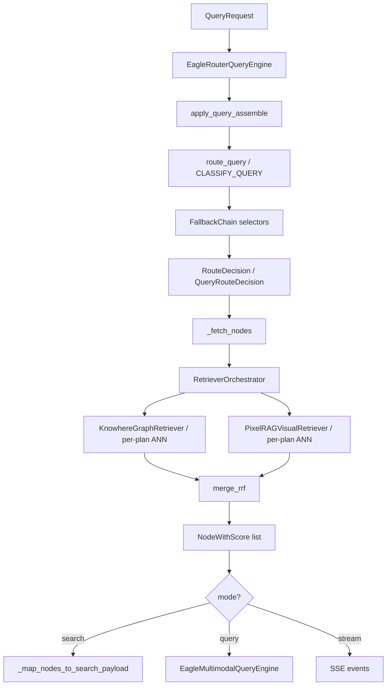

# Router engine

The router engine decides **which retrieval modalities and Milvus collections** to invoke (text, visual, hybrid, or multi-collection domain plans) and orchestrates the full query path: route → retrieve → (optional) generate. It sits between the API layer and the retrievers/generation engine. Plugin integration adds `apply_query_assemble` hooks, `QueryRouteClassifier` (`CLASSIFY_QUERY`), and `RetrieverOrchestrator` with RRF merge.

**Source modules:** `eagle_rag/router/router_engine.py`, `eagle_rag/router/selectors.py`, `eagle_rag/router/models.py`, `eagle_rag/router/llm_factory.py`, `eagle_rag/router/rerank_fusion.py`, `eagle_rag/plugins/retriever_orchestrator.py`, `eagle_rag/plugins/hotpath_hooks.py`

See [Plugin architecture](../architecture/plugin-architecture.md) for query path and G4 Core default.

---

## 1. Theoretical background

### 1.1 Adaptive retrieval routing

Not every query benefits from the same retrieval strategy. Text-heavy policy questions need dense passage retrieval; chart-reading questions need visual tile search; complex questions may need **hybrid** retrieval merging both modalities. Adaptive routing is an active research area (Ma et al., *Query Rewriting for Retrieval-Augmented LLMs*, arXiv:2310.03135; self-routing in Self-RAG, Asai et al., arXiv:2310.11511).

Eagle-RAG implements routing as a **FallbackChain** of selectors — a rule-based + LLM-augmented classifier that runs in milliseconds before expensive retrieval.

### 1.2 Multi-index retrieval

Hybrid mode queries two independent vector indexes (`eagle_text` 1536-d cosine, `eagle_visual` 2048-d IP) and merges results. Domain plugins may add specialized collections; `RetrieverOrchestrator` runs ANN per `CollectionQueryPlan` and merges with **RRF** (`eagle_rag/router/rerank_fusion.py`) — never raw cross-embedding scores. Core default (G4) never auto-queries specialized collections.

### 1.3 Bi-encoder recall vs cross-encoder rerank

The router handles **recall routing** (which index(es) to query). **Precision refinement** (reranking) is delegated to the generation engine's cross-encoder — separating the fast bi-encoder recall stage from the slower cross-encoder rerank stage (Nogueira & Cho, arXiv:1901.04085).

### 1.4 Scope-constrained retrieval

Advanced scope filters implement **metadata-filtered ANN** — pre-filtering the search space by tenant (`kb_name`), document set, or keyword tags before vector similarity. This follows the filtered vector search pattern supported by Milvus hybrid search (Milvus docs: scalar filtering + ANN).

---

## 2. Architecture



Two classes:

| Class | Role |
|-------|------|
| `route_query()` | Modality routing decision (no retrieval) |
| `QueryRouteClassifier` / `CLASSIFY_QUERY` | Multi-collection plan selection (domain plugins) |
| `EagleRouterQueryEngine` | Query assemble → route → retrieve (orchestrator) → search/query/stream |

---

## 3. Code walkthrough: query routing selectors

**File:** `eagle_rag/router/selectors.py`

### 3.1 FallbackChain order

| # | Selector | Decides when | Returns None when |
|---|----------|-------------|-------------------|
| 1 | `ForcedModeSelector` | `mode=text/visual/hybrid` | `mode=auto` |
| 2 | `AttachmentSelector` | User attached documents | No doc attachments |
| 3 | `LLMIntentSelector` | LLM classifies query intent | LLM disabled/fails |
| 4 | `HeuristicSelector` | Keyword rules | Never (always decides) |

All selectors receive config via constructor injection (no global `get_settings()` inside selectors — testable).

### 3.2 ForcedModeSelector

Maps explicit API `mode` parameter:

```python
mode="text"    → selected=["text"]
mode="visual"  → selected=["visual"]
mode="hybrid"  → selected=["text", "visual"]
mode="auto"    → None (defer)
```

Also triggered when `filters.pipeline == "knowhere"` → text, `"pixelrag"` → visual.

### 3.3 AttachmentSelector

When `has_doc_attachments=True` (parsed attachments include document files), forces hybrid retrieval — attachments may contain both text and visual content.

### 3.4 LLMIntentSelector

Calls DeepSeek via DashScope with `settings.router.llm.prompt_template`:

```
判断以下查询应使用哪种检索方式，只回复一个单词：text、visual 或 hybrid。
查询：{query}
```

Parses response for `text`, `visual`, or `hybrid`. On failure → `None` (falls through to heuristics).

Telemetry: `ai_logger.info("llm_intent", model=..., latency_ms=...)`.

### 3.5 HeuristicSelector

First-match keyword rules from `settings.router.heuristic.rules`:

| Keywords (sample) | Route |
|-------------------|-------|
| 架构图, diagram, figure | hybrid |
| 表格, 报表, chart, table | visual |
| 政策, 法规, policy, law | text |
| 工商, 招投标, bid, tender | visual |

Default when no keyword matches: `settings.router.heuristic.default` (text).

### 3.6 RouteDecision model

```python
@dataclass
class RouteDecision:
    mode: str           # auto | text | visual | hybrid
    selected: list[str] # ["text"] | ["visual"] | ["text", "visual"]
    reason: str         # human-readable explanation
    kb_name: str | None
    selector: str       # forced | attachment | llm | heuristic | default
```

---

## 4. Code walkthrough: EagleRouterQueryEngine

**File:** `eagle_rag/router/router_engine.py`

### 4.1 Construction

```python
EagleRouterQueryEngine(
    text_retriever=KnowhereGraphRetriever(top_k=5, kb_name=kb),
    visual_retriever=PixelRAGVisualRetriever(top_k=5, kb_name=kb),
    mode=settings.router.mode,
    top_k=5,
)
```

Singleton created in `eagle_rag/api/query.py` at app startup.

### 4.2 Scope filter resolution (`_resolve_scope_filter`)

Input: `scope_filter: {kb_names, document_ids, tags}`.

1. Tags → document IDs via `resolve_tags_to_document_ids(tags, cap=max_scope_documents)`.
2. Union document IDs from explicit list + tag resolution.
3. Returns `(kb_names, document_ids, active)`.

When `active=True`, retrievers are **re-instantiated** with scope parameters pushed to Milvus.

### 4.3 Retrieval orchestration (`_fetch_nodes`)

Before routing, `apply_query_assemble` runs `QUERY_ASSEMBLE` hooks (when `plugins.query_assemble_enabled`).

Based on `RouteDecision.selected` and `QueryRouteDecision` plans:

```python
if "text" in selected:
    nodes.extend(text_retriever.retrieve(query))  # or RetrieverOrchestrator per plan
if "visual" in selected:
    nodes.extend(visual_retriever.retrieve(query))
```

When domain plugins are active, `_fetch_nodes` delegates to `RetrieverOrchestrator.retrieve()` which:

1. `QUERY_DENSE_EXPAND` (first) — dense rewrite + sparse terms + `QueryRetrievalIntent` in `retrieval_hints`.
2. ANN per `CollectionQueryPlan` (best-effort); hybrid fuse when collection is in `router.hybrid_text_collections` or `EncoderRegistry.CollectionProfile.hybrid_enabled`.
3. Per-plan `RERANK` (first) — Tier-1 domain rerank.
4. `RETRIEVE_SUPPLEMENT` (all) — entity-anchored or other supplemental hits.
5. RRF merge + dedupe (`merge_rrf`).
6. `RRF_POST_MERGE` (first) — optional candidate injection before merged rerank.
7. `RERANK_MERGED` (first) or Core `qwen3-rerank` per `RerankPolicy`.

Core never imports domain plugins on this path; all domain logic is hook-registered. See [Plugin architecture](../architecture/plugin-architecture.md) § Query path.

**Core default (G4):** only `eagle_text` (+ `eagle_visual` when hybrid/image). Specialized collections require domain `CLASSIFY_QUERY` or scope-aware `collections_used` catalog union.

Retriever selection logic:

| Condition | Retriever config |
|-----------|-----------------|
| `scope_filter` active | New retriever with `kb_names` + `document_ids` |
| Facet filters or `kb_name` | New retriever with single `kb_name` + facets |
| Default | Singleton retrievers from constructor |

Each retriever call is wrapped in `trace_span("retrieve.text")` / `trace_span("retrieve.visual")` with exception isolation (failure → skip modality, log warning).

### 4.4 Attachment preparation (`_prepare_attachments`)

Lazy-parses attachment IDs via `attachments.parser.parse_attachments()`:

- Text nodes prepended with `score=1.0` (always included).
- Image docs passed to generation engine separately.
- Sets `has_doc_attachments` for routing.

### 4.5 API modes

| Method | LLM | SSE events |
|--------|-----|-----------|
| `search()` | No | No |
| `search_stream()` | No | step, sources, done |
| `query()` | Yes (VLM) | No |
| `query_stream()` | Yes (VLM) | session, step, sources, token, done |

Pure search has **full parity** with generative query for filters and scope.

### 4.6 Source mapping (`_map_nodes_to_search_payload`)

Splits nodes into text/image, maps via `EagleMultimodalQueryEngine._text_source()` / `_image_source()`, returns:

```json
{
  "sources": {"text": [...], "image": [...]},
  "route": {"mode", "selected", "reason", "selector"},
  "steps": [{"name": "route", ...}, {"name": "recall", "text_count", "visual_count"}]
}
```

---

## 5. Milvus filter expressions (via retrievers)

The router engine does not build Milvus expressions directly — it configures retrievers that push filters downstream.

**Single tenant:**

```
kb_name == "finance"
```

**Scope union (OR):**

```
(kb_name in ["finance", "pharma"] or document_id in ["doc-1", "doc-2"])
```

**With facets (AND):**

```
kb_name == "finance" and source_type == "policy" and year == 2025
```

See [retrieval](retrieval.md) and [vector-stores](vector-stores.md) for full schema reference.

---

## 6. LlamaIndex integration

| LlamaIndex type | Usage in router |
|-----------------|----------------|
| `NodeWithScore` | Unified retrieval output |
| `TextNode` / `ImageNode` | Split for source mapping |
| `CustomQueryEngine` | Generation delegated to `EagleMultimodalQueryEngine` |
| `MetadataFilters` | Built inside retrievers, not router |

The router engine itself is **not** a LlamaIndex query engine — it orchestrates retrievers and delegates generation to `EagleMultimodalQueryEngine` (which extends `CustomQueryEngine`).

---

## 7. Design tensions and tuning

| Tension | Selector / method | Behavior | Dial |
| --- | --- | --- | --- |
| **LLM vs heuristic routing** | `LLMIntentSelector` → `HeuristicSelector` fallback | Same query different `selected` when API key missing | Set `router.llm.enabled: false` in dev for determinism |
| **Attachment-forced hybrid** | `AttachmentSelector` | Uploading doc forces text+visual even for definitional questions | Expected; reduce visual `top_k` if latency spikes |
| **Pipeline facet override** | `filters.pipeline` in `_route_decision` | `knowhere` pipeline filter forces `text` mode regardless of `mode=hybrid` | Document in API clients mixing facets + mode |
| **Scope filter rebuild** | `_fetch_nodes` constructs fresh retrievers when `use_scope_filter` | Per-request Milvus filter objects — correct but no connection reuse | Not tunable; avoid huge `document_ids` lists |
| **Legacy `scope` post-filter** | `_filter_by_scope` after ANN | Retrieves global neighbors then drops — recall bias toward out-of-scope docs that matched query semantically | Migrate clients to `scope_filter` |
| **kb_name on decision vs request** | `route_query` kb fallback | `RouteDecision.kb_name` may differ from retriever filters if selectors omit tenant | Always pass `kb_name` on `QueryRequest` |
| **Heuristic keyword collision** | `config.router.heuristic.rules` first-match | Finance keyword list may fire on non-financial homographs | Domain-specific YAML rules per deployment |
| **G4 specialized abstain** | Core `CLASSIFY_QUERY` | Specialized collections never queried on Core profile | Enable domain profile + classifier or scope catalog union |
| **RRF latency** | `RetrieverOrchestrator` multi-plan | N collections → N ANN calls before merge | Scope narrowly; monitor per-plan audit |
| **QUERY_ASSEMBLE degrade** | Per-subscriber try/except | Failed hook skipped; query proceeds | Check HookBus audit in admin health |

| **Search/query parity** | `search()` vs `query()` attachment handling | `/search` ignores attachments — different recall than `/query` with files | Use `/query` when attachments matter |

**Latency budget:** `route_query` and `apply_query_assemble` are sync and cheap; `_fetch_nodes` / `RetrieverOrchestrator` dominates (N× ANN + embed_query). Profile `trace_span` `retrieve.text` / `retrieve.visual` before optimizing selectors.

---

## 8. Config & tuning

```yaml
router:
  mode: auto                    # auto | text | visual | hybrid
  max_scope_documents: 500      # tag → doc_id cap
  parent_doc_retrieval: true    # Core two-stage section_summary drill-down
  recall_top_k: 30              # per-plan ANN pool before rerank
  hybrid_text_collections: []   # profile override, e.g. biomed: [eagle_text_biomed, eagle_text_medcpt]
  source_content_max_chars: 4000
  structure_max_nodes: 2000
  llm:
    enabled: true
    prompt_template: |
      判断以下查询应使用哪种检索方式...
  heuristic:
    rules:
      - keywords: [表格, chart, table]
        route: visual
      - keywords: [政策, policy, law]
        route: text
    default: text

plugins:
  query_assemble_enabled: true
  default_namespace: core
```

**Environment overrides:**

```
ROUTER_MODE=hybrid
ROUTER_LLM_ENABLED=false
ROUTER_MAX_SCOPE_DOCUMENTS=1000
```

**Tuning guide:**

| Scenario | Recommendation |
|----------|---------------|
| Disable LLM routing latency | `router.llm.enabled: false` |
| Force visual for all queries | `router.mode: visual` |
| Domain-specific keywords | Add rules to `heuristic.rules` |
| Large tag selections | Increase `max_scope_documents` |
| Domain hybrid sparse | Set `router.hybrid_text_collections` in profile or `EncoderRegistry.register_collection(..., hybrid_enabled=True)` |
| Smaller API payloads | Lower `source_content_max_chars` |

Query-time override: pass `mode` in `QueryRequest` to bypass global setting.

---

## 9. Tests

**Primary:** `tests/test_router_generation.py`

| Contract | Verification |
|----------|-------------|
| Forced mode routing | `mode=text` → text retriever only |
| Heuristic keywords | Chart query → visual selected |
| LLM intent fallback | LLM failure → heuristic default |
| Hybrid retrieval | Both retrievers called, nodes merged |
| Scope filter pushdown | Tag resolution → document_ids in retriever |
| Search vs query parity | Same filters produce same recall |
| SSE event sequence | route → recall → sources → token → done |
| Attachment hybrid | Doc attachment → hybrid route |

**Related:** `tests/test_retrievers.py` (retriever filter contracts in isolation), `tests/plugins/test_hotpath_hooks.py` (QUERY_ASSEMBLE wiring).

---

## 10. Telemetry & tracing

Each routing decision emits:

```json
{"event": "route", "query": "...", "mode": "auto", "selected": ["text"], "reason": "heuristic: ...", "selector": "heuristic"}
```

OpenTelemetry spans: `route`, `retrieve.text`, `retrieve.visual` (nested under query trace).

---

## 11. References

- Asai et al., *Self-RAG: Learning to Retrieve, Generate, and Critique*, [arXiv:2310.11511](https://arxiv.org/abs/2310.11511)
- Ma et al., *Query Rewriting for Retrieval-Augmented LLMs*, [arXiv:2310.03135](https://arxiv.org/abs/2310.03135)
- Nogueira & Cho, *Passage Re-ranking with BERT*, [arXiv:1901.04085](https://arxiv.org/abs/1901.04085)
- Karpukhin et al., *Dense Passage Retrieval*, [arXiv:2004.04906](https://arxiv.org/abs/2004.04906)
- Milvus filtered search: [milvus.io/docs/single-vector-search.md](https://milvus.io/docs/single-vector-search.md)
- LlamaIndex query engines: [docs.llamaindex.ai/module_guides/deploying/query_engine](https://docs.llamaindex.ai/en/stable/module_guides/deploying/query_engine/)
