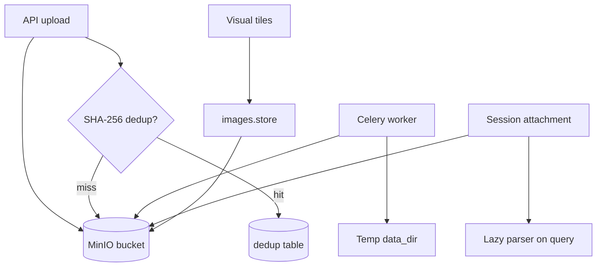

# Storage

Eagle-RAG storage spans three backends: **MinIO** (S3-compatible object storage for files and tile images), **PostgreSQL** (dedup index and metadata), and local filesystem (temporary worker files). The storage layer provides content-addressed deduplication and session-scoped attachment handling.

**Source modules:** `eagle_rag/storage/minio_client.py`, `eagle_rag/storage/dedup.py`, `eagle_rag/attachments/store.py`, `eagle_rag/attachments/parser.py`, `eagle_rag/images/store.py`

---

## 1. Theoretical background

### 1.1 Content-addressed storage

SHA-256 content hashing enables **deduplication** — identical files within a knowledge base are indexed once (Merkle tree principles applied to document storage). The composite key `(sha256, kb_name)` allows the same content in different tenants.

### 1.2 Object storage for RAG artifacts

Binary artifacts (original documents, rendered tile JPEGs) belong in object storage, not the vector database. This follows the **lambda architecture** pattern: hot path (Milvus ANN) vs cold path (MinIO blobs).

### 1.3 Lazy attachment parsing

Session attachments are parsed on query, not at upload — avoiding unnecessary Milvus writes for ephemeral context. This is **query-time augmentation** distinct from permanent KB ingestion (Lewis et al., arXiv:2005.11401).

---

## 2. Architecture



---

## 3. Code walkthrough: MinIO client

**Module:** `eagle_rag/storage/minio_client.py`

| Function | Purpose |
|----------|---------|
| `ensure_bucket()` | Create bucket if missing |
| `upload_file(key, path)` | Upload local file |
| `upload_bytes(key, data)` | Upload in-memory bytes |
| `download_file(key, path)` | Download to local path |
| `presigned_url(key)` | Generate temporary access URL |
| `delete_prefix(prefix)` | Bulk delete (KB cleanup) |

**Object key conventions:**

| Pattern | Content |
|---------|---------|
| `{source_type}/{document_id}/{filename}` | Ingested documents |
| `{document_id}/visual_chunks/{chunk_id}.png` | Knowhere visual chunks |
| `tiles/{image_id}.jpg` | PixelRAG tile images |
| `attachments/{session_id}/{attachment_id}` | Session attachments |

### Config

```yaml
minio:
  endpoint: localhost:9000
  access_key: minioadmin
  secret_key: minioadmin
  bucket: eagle-rag
  secure: false
```

---

## 4. Code walkthrough: dedup

**Module:** `eagle_rag/storage/dedup.py`

```python
sha256 = compute_sha256(file_path)          # streaming hash
dup = check_duplicate(sha256, kb_name=kb)   # PostgreSQL lookup
# ... on success:
dedup.register(sha256, document_id, kb_name=kb, ...)
```

**Lifecycle:**

1. Checked at ingest entry (before Celery dispatch).
2. Registered only after successful `knowhere_parse` (prevents blocking re-upload on failure).
3. Same file in different KBs → separate dedup records (multi-tenant).

---

## 5. Code walkthrough: image store

**Module:** `eagle_rag/images/store.py`

```python
store_tile(image_id, document_id, data=bytes, kb_name=..., page=..., position=...)
# → {"url", "object_key", "local_path"}
```

Used by both `pixelrag_build` and `knowhere_visual_chunks` tasks. `get_image_bytes(image_id)` provides byte fallback when presigned URLs are unreachable (VLM generation path).

---

## 6. Code walkthrough: attachments

**Module:** `eagle_rag/attachments/store.py`, `eagle_rag/attachments/parser.py`

### Upload (`POST /attachments`)

1. Store bytes in MinIO under session prefix.
2. Record in `attachments` table with TTL.
3. Return `attachment_id`.

### Lazy parse (on query)

```python
parse_attachments(attachment_ids) → ParsedAttachments(
    text_nodes=[TextNode(...)],     # metadata.source = "attachment"
    image_docs=[ImageDocument(...)],
)
```

- Uses Knowhere-style chunking for documents, direct read for text.
- **No Milvus write** — attachments are ephemeral query context.
- Config limits: `max_bytes`, `max_chunks`, `timeout_sec`, `chunk_size`.

Parser reuses `knowhere_adapter._meta()` and chunk typing conventions for consistency.

---

## 7. Milvus relationship

Storage layer feeds Milvus indirectly:

| Storage artifact | Milvus field |
|-----------------|-------------|
| MinIO object key | `image_path` in `eagle_visual` |
| Document metadata | `document_id`, `kb_name` scalars |
| Knowhere chunk text | `text` field in `eagle_text` |

Filter expressions reference storage-derived scalars:

```
document_id == "550e8400-..." and kb_name == "finance"
```

---

## 8. LlamaIndex integration

| Component | Storage interaction |
|-----------|-------------------|
| `TextNode` | Built from attachment parser or Knowhere chunks |
| `ImageDocument` | Built from attachment images or Milvus visual hits |
| `ImageNode.image_path` | Points to MinIO presigned URL or local path |

Attachment nodes carry `metadata.source = "attachment"` so the generation engine separates them in the prompt (`【用户附件】` section).

---

## 9. Design tensions and tuning

| Tension | Component | Effect | Mitigation |
| --- | --- | --- | --- |
| **Content-hash dedup** | `dedup.compute_sha256` | Semantically different files with same bytes dedup; renames do not re-ingest | Version files or change content to force new hash |
| **MinIO key layout** | `{source_type}/{document_id}/{name}` | Moving objects breaks `source_uri` in nodes | Use document API for download, not guessed keys |
| **Visual chunk sidecar** | `visual_chunks/{chunk_id}.html` | Table preview depends on MinIO availability separate from Milvus | Re-ingest if sidecar missing but text node exists |
| **Attachment ephemeral** | `attachments/` prefix, not indexed | Large upload every query if client re-sends ID | Persist attachment IDs per session only |
| **Tile PNG size** | `store_tile` quality + dimensions | Storage cost ∝ pages × tiles | Tune `pixelrag.quality` and `tile_height` |
| **Dedup short-circuit** | No Celery on hit | Updated metadata (e.g. `source_type`) not refreshed without force | Delete dedup row to reprocess |

---

## 10. Config & tuning

```yaml
storage:
  data_dir: ./data          # Worker temp files
  image_store: ./data/images

attachments:
  ttl_hours: 24
  parse:
    max_bytes: 10485760     # 10 MB
    max_chunks: 50
    timeout_sec: 120
    cache_enabled: true
    chunk_size: 2000
```

---

## 11. Tests

| Test file | Contract |
|-----------|----------|
| `tests/test_attachments_parser.py` | Lazy parse, chunk limits, text/image extraction |
| `tests/test_api_kb_attachments_notifications_users.py` | Upload + TTL |
| `tests/test_ingest_smoke.py` | MinIO upload in ingest flow |

---

## 12. References

- MinIO Python SDK: [min.io/docs/minio/linux/developers/python/minio-py.html](https://min.io/docs/minio/linux/developers/python/minio-py.html)
- Lewis et al., *Retrieval-Augmented Generation*, [arXiv:2005.11401](https://arxiv.org/abs/2005.11401)
- Content-addressed storage: [en.wikipedia.org/wiki/Content-addressable_storage](https://en.wikipedia.org/wiki/Content-addressable_storage)
