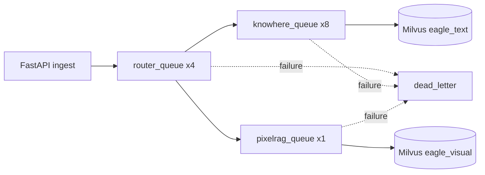

# Task queue

Eagle-RAG offloads document ingestion to **Celery** workers backed by Redis. Three pipeline queues isolate routing, Knowhere parsing, and PixelRAG visual encoding workloads. Failed tasks retry with exponential backoff and ultimately land in a **dead-letter queue** for admin inspection.

**Source modules:** `eagle_rag/tasks/celery_app.py`, `eagle_rag/tasks/dead_letter.py`, `eagle_rag/tasks/state.py`

---

## 1. Theoretical background

### 1.1 Async task queues in RAG pipelines

Document ingestion is I/O- and compute-heavy (parsing, embedding, indexing). Decoupling ingest from the API via a **message broker** (Redis) enables horizontal scaling, backpressure, and fault tolerance — standard practice in production RAG systems.

### 1.2 At-least-once delivery

Celery with `task_acks_late=True` and `task_reject_on_worker_lost=True` provides at-least-once semantics: tasks are requeued if a worker dies mid-execution. Idempotent writes (Milvus upsert by PK, dedup deferred to success) prevent duplicate side effects.

### 1.3 Retry with exponential backoff

Transient failures (network blips, Knowhere timeout) benefit from **exponential backoff** retry — reducing thundering herd on recovering services (AWS Architecture Blog: exponential backoff and jitter).

### 1.4 Dead-letter queues

After max retries, failed messages move to a **dead-letter queue (DLQ)** for manual inspection and replay — the pattern from enterprise messaging (Enterprise Integration Patterns: Dead Letter Channel).

---

## 2. Queue topology



| Queue | Concurrency | Tasks | Bottleneck |
|-------|------------|-------|-----------|
| `router_queue` | 4 | `ingest_router` | CPU (routing logic) |
| `knowhere_queue` | 8 | `knowhere_parse` | Knowhere SDK I/O |
| `pixelrag_queue` | 1 | `pixelrag_build`, `knowhere_visual_chunks` | GPU/CPU visual encoding |
| `dead_letter` | — (admin only) | Failed messages | — |

---

## 3. Code walkthrough: celery_app.py

### 3.1 App construction

```python
app = Celery(
    "eagle_rag",
    broker=settings.celery.broker_url,
    backend=settings.celery.result_backend,
    include=[
        "eagle_rag.ingest.router",
        "eagle_rag.ingest.knowhere_adapter",
        "eagle_rag.ingest.pixelrag_adapter",
        "eagle_rag.kb.lifecycle",
    ],
)
```

Tasks registered via `@app.task` / `@with_retry` decorators in included modules.

### 3.2 Queue declaration

```python
app.conf.task_queues = (
    Queue("router_queue", routing_key="router_queue"),
    Queue("knowhere_queue", routing_key="knowhere_queue"),
    Queue("pixelrag_queue", routing_key="pixelrag_queue"),
)
app.conf.task_routes = settings.celery.task_routes
```

Task routing from `settings.yaml`:

```yaml
task_routes:
  eagle_rag.tasks.ingest_router: router_queue
  eagle_rag.tasks.knowhere_parse: knowhere_queue
  eagle_rag.tasks.pixelrag_build: pixelrag_queue
```

### 3.3 Reliability settings

| Setting | Value | Purpose |
|---------|-------|---------|
| `task_acks_late` | True | Ack after completion |
| `worker_prefetch_multiplier` | 1 | No task hoarding |
| `task_reject_on_worker_lost` | True | Requeue on crash |
| `task_time_limit` | 3600s | Hard kill |
| `task_soft_time_limit` | 3300s | Graceful cleanup window |

### 3.4 Telemetry integration

- `worker_process_init` → `configure_telemetry()`
- `task_prerun` → fallback telemetry init
- `register_celery_signals(app)` → OpenTelemetry trace propagation
- `send_task_with_trace()` injects trace headers from FastAPI → Celery

### 3.5 Celery Beat

```python
app.conf.beat_schedule = {
    "sample-queue-metrics": {
        "task": "eagle_rag.admin.metrics.sample_queue_metrics",
        "schedule": 30.0,
    },
}
```

Samples queue depths into `metric_samples` table every 30 seconds.

---

## 4. Code walkthrough: dead_letter.py

### 4.1 Two retry mechanisms

| Mechanism | Usage | Behavior |
|-----------|-------|----------|
| `@with_retry` decorator | Task registration | Celery `autoretry_for=(Exception,)`, exponential backoff |
| `retry_on_failure(task, exc)` | Manual in try/except | Explicit `task.retry()` or DLQ |

Both use the same backoff formula:

```
countdown = retry_backoff * (2 ** retries)
# Default: 60, 120, 240 seconds
```

### 4.2 `@with_retry` decorator

```python
@with_retry(name="eagle_rag.tasks.knowhere_parse", queue="knowhere_queue", bind=True)
def knowhere_parse(self, ...):
    ...
```

Defaults:

- `base=DeadLetterTask` — auto DLQ on exhaustion
- `max_retries=3`
- `retry_backoff=60`
- `retry_backoff_max=60 * 2^3 = 480`
- `acks_late=True`

Pass `base=None` to disable auto DLQ and use manual `retry_on_failure` only.

### 4.3 DeadLetterTask base class

```python
class DeadLetterTask(app.Task):
    def on_failure(self, exc, task_id, args, kwargs, einfo):
        send_to_dead_letter(task_id, self.name, payload, repr(exc))
```

Triggered when autoretry exhausts and exception propagates.

### 4.4 `retry_on_failure`

```python
if task.request.retries < max_retries:
    update_state(job_id, TaskState.RETRYING, ...)
    raise task.retry(exc=exc, countdown=countdown)
else:
    send_to_dead_letter(job_id, task.name, payload, repr(exc))
```

Updates audit to `RETRYING` before retry, `FAILED` on exhaustion.

### 4.5 Dead-letter queue operations

| Function | Purpose |
|----------|---------|
| `send_to_dead_letter(job_id, task_name, payload, error)` | Publish to `dead_letter` queue |
| `drain_dead_letter(limit=100)` | Admin: pull and ack messages |
| `replay_dead_letter(job_id)` | Re-dispatch original task by job_id |

DLQ is **not** in `task_queues` — business workers don't consume it.

---

## 5. Task state machine

**Module:** `eagle_rag/tasks/state.py`

| State | Meaning |
|-------|---------|
| `PENDING` | Audit created, not yet started |
| `RENDERING` | Routing / parsing / rendering |
| `EMBEDDING` | Vector encoding in progress |
| `INDEXING` | Writing to Milvus |
| `RETRYING` | Backoff retry scheduled |
| `SUCCESS` | Pipeline complete |
| `FAILED` | Exhausted retries or fatal error |

Persisted in `task_audit` PostgreSQL table with progress, log entries, and error messages.

### Sub-task isolation

Knowhere visual chunks use a separate job_id (`{parent_job_id}:visual`) to avoid state machine conflicts with the parent's terminal SUCCESS state.

---

## 6. Registered tasks

| Task name | Queue | Module |
|-----------|-------|--------|
| `eagle_rag.tasks.ingest_router` | router_queue | `ingest/router.py` |
| `eagle_rag.tasks.knowhere_parse` | knowhere_queue | `ingest/knowhere_adapter.py` |
| `eagle_rag.tasks.pixelrag_build` | pixelrag_queue | `ingest/pixelrag_adapter.py` |
| `eagle_rag.tasks.knowhere_visual_chunks` | pixelrag_queue | `ingest/pixelrag_adapter.py` |
| `eagle_rag.admin.metrics.sample_queue_metrics` | (beat) | `admin/metrics.py` |

KB lifecycle tasks in `kb/lifecycle.py` (delete, rebuild) also registered via `include`.

---

## 7. Milvus interaction (via tasks)

Tasks don't build Milvus filter expressions — they write vectors:

| Task | Milvus write |
|------|-------------|
| `knowhere_parse` | `upsert_text_nodes()` → `eagle_text` |
| `pixelrag_build` | `upsert_visual()` → `eagle_visual` |
| `knowhere_visual_chunks` | `upsert_visual()` with fusion anchors |

Scalar fields written at ingest time (`kb_name`, `source_type`, `document_id`) enable filter expressions at retrieval time.

---

## 8. LlamaIndex integration

Celery tasks produce LlamaIndex `TextNode` objects (Knowhere path) which are inserted via `VectorStoreIndex.insert_nodes()`. Visual tasks bypass LlamaIndex, writing directly via pymilvus.

The task queue itself has no LlamaIndex dependency — the integration happens inside task implementations.

---

## 9. Design tensions and tuning

| Tension | Celery / task behavior | Risk | Mitigation |
| --- | --- | --- | --- |
| **At-least-once upserts** | `acks_late` + `max_retries` | Same tile `image_id` upserted twice on retry — safe if IDs deterministic | Never randomize `image_id` suffix |
| **Visual after ready** | `knowhere_visual_chunks` post-dates `update_status(ready)` | Users query before visual index complete | Surface task audit for visual subtasks |
| **Poll timeout vs doc size** | `knowhere_parse` blocks on SDK poll | 1800s default may still fail on huge Excel | Split source files; raise timeout consciously |
| **Router fan-out** | `ingest_router` sends N pipeline tasks | Hybrid ingest doubles queue load | Monitor both `knowhere_queue` and `pixelrag_queue` depth |
| **Dead letter replay** | `replay_dead_letter` re-dispatches | Stale `local_path` if temp file gone | Replay only recent DLQ entries with valid `object_key` |
| **Beat metrics sampling** | 30s `sample_queue_metrics` | Spiky backlog between samples | Use Redis `LLEN` directly for incident response |
| **Worker time limit** | `task_time_limit` 1h default | Long PixelRAG PDF may hit hard kill mid-embed | Split PDFs or raise limit with memory headroom |
| **Prefetch=1 fairness** | `worker_prefetch_multiplier=1` | Throughput per worker lower than default Celery | Scale worker count, not prefetch |

**OOM tension (visual worker):** `embed_tiles` loads Qwen3-VL weights + batch images — concurrency >1 multiplies peak RSS. Tune `pixelrag.tile_height` before raising worker concurrency.

---

## 10. Config & tuning

```yaml
celery:
  broker_url: redis://localhost:6379/0
  result_backend: redis://localhost:6379/1
  max_retries: 3
  retry_backoff: 60
  task_routes:
    eagle_rag.tasks.ingest_router: router_queue
    eagle_rag.tasks.knowhere_parse: knowhere_queue
    eagle_rag.tasks.pixelrag_build: pixelrag_queue
  queues:
    router_queue: { concurrency: 4 }
    knowhere_queue: { concurrency: 8 }
    pixelrag_queue: { concurrency: 1 }
```

**Worker startup:**

```bash
# Router workers
celery -A eagle_rag.tasks.celery_app worker -Q router_queue -c 4

# Knowhere workers
celery -A eagle_rag.tasks.celery_app worker -Q knowhere_queue -c 8

# PixelRAG workers (GPU recommended)
celery -A eagle_rag.tasks.celery_app worker -Q pixelrag_queue -c 1

# Beat (metrics)
celery -A eagle_rag.tasks.celery_app beat
```

**Tuning guide:**

| Scenario | Action |
|----------|--------|
| Ingest backlog on Knowhere | Scale `knowhere_queue` workers |
| GPU OOM on visual encoding | Keep `pixelrag_queue` concurrency at 1 |
| Frequent transient failures | Increase `max_retries` or `retry_backoff` |
| Long PDF parse timeout | Increase `task_time_limit` (default 1h) |
| Monitor queue depth | Enable Celery Beat + admin metrics dashboard |

---

## 11. Tests

| Test file | Contract |
|-----------|----------|
| `tests/test_ingest_smoke.py` | Task dispatch to correct queue |
| `tests/test_ingest_assets.py` | Router task routing matrix |
| `tests/test_api_ingest_queue_metrics.py` | Queue metrics sampling |
| `tests/test_telemetry_tracing.py` | Trace propagation FastAPI → Celery |

---

## 12. Operational runbook

### Inspect failed job

```python
from eagle_rag.ingest.runner import get_job_status
get_job_status("job-uuid")  # → task_audit record
```

### Drain dead-letter queue

```python
from eagle_rag.tasks.dead_letter import drain_dead_letter, replay_dead_letter
records = drain_dead_letter(limit=50)
replay_dead_letter("job-uuid")  # re-dispatch
```

### Common failure patterns

| Error | Likely cause | Fix |
|-------|-------------|-----|
| KnowhereError | SDK/service down | Check Knowhere :5005 |
| ValueError embed provider | Wrong visual provider config | Set `embedding.visual.provider: pixelrag` |
| SoftTimeLimitExceeded | Large document | Increase time limit or split document |
| MinIO download failure | Object key missing | Check upload from API runner |

---

## 13. References

- Celery routing: [docs.celeryq.dev/en/stable/userguide/routing.html](https://docs.celeryq.dev/en/stable/userguide/routing.html)
- Celery retry: [docs.celeryq.dev/en/stable/userguide/tasks.html#retry](https://docs.celeryq.dev/en/stable/userguide/tasks.html#retry)
- Dead letter pattern: [enterpriseintegrationpatterns.com/DeadLetterChannel.html](https://www.enterpriseintegrationpatterns.com/patterns/messaging/DeadLetterChannel.html)
- Milvus upsert: [milvus.io/docs/insert_upsert_en.md](https://milvus.io/docs/insert_upsert_en.md)
- OpenTelemetry Celery: [opentelemetry.io/docs/instrumentation/python/celery](https://opentelemetry.io/docs/instrumentation/python/celery/)
