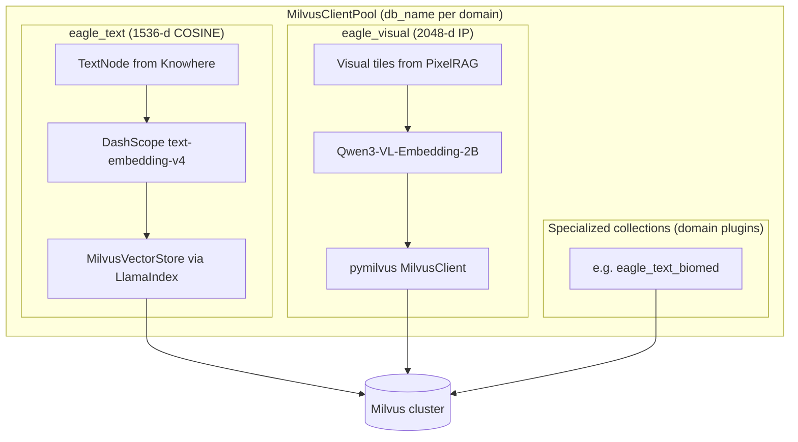

# Vector stores

Eagle-RAG persists embeddings in Milvus collections inside a **per-domain Database**. Base collections in every domain: **`eagle_text`** (1536-d text, LlamaIndex-managed) and **`eagle_visual`** (2048-d visual tiles, pymilvus-managed). Domain plugins may add specialized collections (e.g. `eagle_text_biomed`). PostgreSQL holds the document registry, dedup index, and tag catalog via repositories.

**Source modules:** `eagle_rag/index/milvus_pool.py`, `eagle_rag/index/milvus_text_store.py`, `eagle_rag/index/milvus_visual_store.py`, `eagle_rag/index/registry.py`, `eagle_rag/index/tag_catalog.py`, `eagle_rag/db/repositories/`

See [Plugin architecture](../architecture/plugin-architecture.md) for domain isolation and specialized collections.

---

## 1. Theoretical background

### 1.1 Approximate nearest neighbor (ANN) indexes

Vector databases use ANN algorithms to search high-dimensional spaces in sub-linear time. Milvus supports **HNSW** (Hierarchical Navigable Small World; Malkov & Yashunin, arXiv:1603.09320) and **DiskANN** for billion-scale corpora. Eagle-RAG defaults to HNSW for both collections.

### 1.2 Bi-encoder asymmetric retrieval

Text embeddings use **asymmetric** query/document encoding (`text_type=query` vs `document`) — a technique shown to improve retrieval in dual-encoder systems (Khattab & Zaharia, *ColBERT*, arXiv:2004.12832; applied in commercial APIs like Cohere/Qwen).

### 1.3 Cross-modal vector spaces

Visual vectors (2048-d, inner product) live in a **different space** from text vectors (1536-d, cosine). Cross-modal alignment happens at the VLM embedding model level (Qwen3-VL), not via shared Milvus collection — a **dual-index** architecture.

### 1.4 Metadata-filtered hybrid search

Milvus supports **filtered ANN**: scalar predicates (e.g., `kb_name == "finance"`) applied before/during vector search. Inverted indexes on scalar fields accelerate filtering (Milvus docs: INVERTED index type).

### 1.5 Multi-tenancy via scalar partitioning

`kb_name` as a scalar filter field implements logical multi-tenancy **within** one Milvus Database — the pattern recommended by Milvus multi-tenancy guides. **Domain** isolation is physical: one Milvus Database per `plugin_namespace`, bound at client construction via `MilvusClientPool` (no per-request `using_database`).

---

## 2. Dual-collection architecture



| Collection | Dim | Metric | Index | Managed by |
|------------|-----|--------|-------|-----------|
| `eagle_text` | 1536 | COSINE | HNSW (LlamaIndex default) | `llama-index-vector-stores-milvus` |
| `eagle_visual` | 2048 | IP | HNSW M=16, efConstruction=256 | `pymilvus.MilvusClient` |
| Plugin collections | varies | per manifest | per plugin | `EncoderRegistry` + `UPSERT_VECTORS` hook |

### 2.1 MilvusClientPool

**Module:** `eagle_rag/index/milvus_pool.py`

Process-wide cache of `MilvusClient(uri, db_name=)` instances:

| Method | Purpose |
|--------|---------|
| `get(db_name=..., plugin_namespace=...)` | Pooled client for domain Database |
| `ensure_database(db_name)` | Create DB when `milvus.auto_create_db` |
| `admin_client()` | Default DB for database administration only |

Clients are bound at construction — **never** call `close()` on pooled clients or switch DB per request. Namespace → DB mapping: `eagle_rag/plugins/milvus_ns.py`.

---

## 3. Code walkthrough: milvus_text_store.py

### 3.1 Embedding model

`_DimensionalDashScopeEmbedding` subclass fixes LlamaIndex's broken `dimension` forwarding to DashScope API:

```python
dashscope.TextEmbedding.call(
    model="text-embedding-v4",
    input=texts,
    text_type="document",  # query side uses "query"
    dimension=1536,
)
```

Batch size capped at 10 (DashScope API limit).

### 3.2 Singletons

| Function | Returns |
|----------|---------|
| `get_text_vector_store()` | `MilvusVectorStore(uri, collection_name, dim=1536, metric=COSINE)` |
| `get_text_index()` | `VectorStoreIndex.from_vector_store(store, embed_model)` |

Lazy initialization — no Milvus connection at import time.

### 3.3 Write path

```python
upsert_text_nodes(nodes: list[TextNode]) -> list[str]:
    index = get_text_index()
    index.insert_nodes(nodes)
    return [n.node_id for n in nodes]
```

LlamaIndex stores full node content in `_node_content` JSON field plus promoted scalar metadata.

`text` is Milvus `VARCHAR(65535)` (schema hard limit). Oversized Knowhere chunks / section summaries are truncated at upsert (`clamp_milvus_varchar`) so writes do not fail with MilvusException code 1100.

### 3.4 Read path

Two access patterns:

1. **Via retriever:** `VectorStoreIndex.as_retriever()` → ANN + MetadataFilters.
2. **Direct search:** `search_text(query, top_k, kb_name, source_type)` → manual `VectorStoreQuery`.

### 3.5 Management operations

| Function | Purpose |
|----------|---------|
| `count_text(kb_name?)` | Entity count by tenant |
| `delete_text_by_kb(kb_name)` | Cascade KB deletion |
| `fetch_text_nodes_by_kb(kb_name)` | Reindex source data |
| `fetch_text_nodes_by_document_id(...)` | Structure reconstruction |
| `reindex_kb_text(kb_name)` | Re-embed without re-parse |

### 3.6 Structure fetch fallback

`fetch_text_nodes_by_document_id` tries scalar filters first (`document_id`, `doc_id`), then falls back to scoped scan with `_node_content` client-side filtering — handling legacy rows where `document_id` scalar is empty.

---

## 4. Code walkthrough: milvus_visual_store.py

### 4.1 Schema creation (`ensure_collection`)

Idempotent: creates collection + indexes if missing, migrates legacy schemas.

**Fields:**

| Field | DataType | Notes |
|-------|----------|-------|
| `id` | VARCHAR(64) PK | Same as `image_id` |
| `vector` | FLOAT_VECTOR(2048) | |
| `image_path` | VARCHAR(512) | MinIO key |
| `image_id` | VARCHAR(64) | |
| `document_id` | VARCHAR(64) | |
| `page` | INT64 nullable | |
| `position` | VARCHAR(64) nullable | e.g. `strip_3` |
| `kb_name` | VARCHAR(64) | default `default` |
| `year` | INT64 nullable | |
| `source_type` | VARCHAR(32) nullable | |
| `chunk_type` | VARCHAR(16) | default `tile` |
| `parent_section` | VARCHAR(512) nullable | Fusion anchor |
| `content_summary` | VARCHAR(2048) nullable | Fusion anchor |
| `source_chunk_id` | VARCHAR(128) nullable | Fusion anchor |

### 4.2 Index parameters

**HNSW (default):**

```python
{
    "index_type": "HNSW",
    "metric_type": "IP",
    "params": {"M": 16, "efConstruction": 256},
}
# Search: {"metric_type": "IP", "params": {"ef": 64}}
```

**DiskANN:**

```python
{"index_type": "DISKANN", "metric_type": "IP", "params": {}}
```

**Scalar inverted indexes:** `kb_name`, `document_id`, `source_type`, `year`, `chunk_type`, `parent_section`.

### 4.3 Search (`search_visual`)

```python
client.search(
    collection_name="eagle_visual",
    data=[query_vector],
    anns_field="vector",
    search_params={"metric_type": "IP", "params": {"ef": 64}},
    limit=top_k,
    filter=expr,  # boolean expression
    output_fields=[...],
)
```

### 4.4 Filter builder (`_build_search_expr`)

Builds boolean expressions with AND/OR semantics:

```python
# Single tenant
'kb_name == "finance" and source_type == "financial"'

# Scope union
'(kb_name in ["finance", "pharma"] or document_id in ["doc-1"]) and year in [2024, 2025]'

# Fusion anchor
'chunk_type == "table" and parent_section like "%Balance Sheet%"'
```

---

## 5. Milvus filter expression reference

### 5.1 Text collection (via LlamaIndex MetadataFilters)

LlamaIndex translates filters to Milvus expr automatically:

| MetadataFilter | Milvus expr |
|---------------|-------------|
| `EQ kb_name="finance"` | `kb_name == "finance"` |
| `IN kb_name=["a","b"]` | `kb_name in ["a", "b"]` |
| `EQ source_type="policy"` | `source_type == "policy"` |
| `EQ year=2025` | `year == 2025` |

Combined with `FilterCondition.AND` / `OR`.

**Direct expr examples:**

```
kb_name == "default" and type == "section_summary"
```

```
document_id == "550e8400-e29b-41d4-a716-446655440000" and type in ["text", "table"]
```

```
path like "Annual Report/Chapter 3%"
```

### 5.2 Visual collection (direct expr)

```
kb_name == "pharma" and chunk_type == "tile" and year == 2025
```

```
document_id == "abc-123"
```

```
(kb_name in ["finance"] or document_id in ["doc-x", "doc-y"]) and source_type == "financial"
```

```
parent_section like "%Model Architecture%" and source_chunk_id == "chunk_img_42"
```

### 5.3 Escaping

User-provided strings are escaped via `_escape_milvus_str()` (double-quote backslash) before interpolation.

---

## 6. LlamaIndex integration

### 6.1 Text path

```
TextNode → VectorStoreIndex.insert_nodes()
         → MilvusVectorStore (collection=eagle_text)
         → ANN search via as_retriever(filters=MetadataFilters)
         → NodeWithScore
```

**Key mappings:**

| LlamaIndex | Milvus |
|-----------|--------|
| `node_id` | Primary key / `id` |
| `node.text` | `text` field |
| `node.metadata.*` | Dynamic scalar fields |
| `_node_content` | Full JSON serialization |

### 6.2 Visual path (non-LlamaIndex)

Visual vectors bypass LlamaIndex vector store. At retrieval, `PixelRAGVisualRetriever._to_node_with_score()` constructs `ImageNode` from Milvus hit dicts — bridging pymilvus results into LlamaIndex node types for downstream generation.

`eagle_visual` is managed by `pymilvus` because anchor fields (`parent_section`, `chunk_type`, …) and the Qwen3-VL 2048-d IP index do not map cleanly onto LlamaIndex `MilvusVectorStore` defaults. See **§8 Design tensions** for operational consequences.

---

## 7. PostgreSQL document registry

**Modules:** `eagle_rag/index/registry.py`, `eagle_rag/db/repositories/documents.py`, `eagle_rag/db/repositories/catalog.py`

| Field | Purpose |
|-------|---------|
| `document_id` | UUID primary key |
| `name` | Display filename |
| `source_type` | policy/financial/... |
| `pipeline` | knowhere/pixelrag/combined |
| `kb_name` | Tenant key |
| `plugin_namespace` | Domain binding (repository-injected) |
| `status` | pending/indexing/ready |
| `chunk_count` | Indexed node count |
| `extra` | JSONB (doc_nav tree, `collections_used` catalog) |
| `sha256` | Content hash |

Registry is the **source of truth** for document lifecycle; Milvus holds searchable vectors. On successful ingest, `collections_used` is merged into `documents.extra` and `knowledge_bases.collections_used` (see [database](database.md) §5).

### Tag catalog

**Module:** `eagle_rag/index/tag_catalog.py`, `eagle_rag/db/repositories/catalog.py`

`document_keywords` table maps `(document_id, keyword, kb_name, plugin_namespace)` for scope tag resolution at query time.

---

## 8. Design tensions and tuning

| Tension | Mechanism (`milvus_*_store.py`) | What goes wrong | Dial |
| --- | --- | --- | --- |
| **ANN recall vs p99** | `_search_params`: HNSW `ef=64` (visual); LlamaIndex default on text | Users see “chunk exists in UI but not in answer” | Raise `ef` before raising `top_k`; profile Milvus `search` latency |
| **Build vs search quality** | `M=16`, `efConstruction=256` fixed at collection create | Rebuilding index after param change requires re-ingest or rebuild job | Plan index params before large backfill |
| **DiskANN vs HNSW** | `visual_index_type: diskann` | Lower RAM ceiling; higher tail latency on cold segments | Switch when `count_visual` exceeds RAM budget, not preemptively |
| **Metric semantics** | Text COSINE vs visual IP on L2-normalized vectors | Merging text/visual `score` in one sort key is meaningless — router keeps separate lists | Compare ranks per modality in telemetry, not raw scores |
| **Schema migration blast radius** | `ensure_collection` drops collection if `kb_name` field missing | One upgrade path wipes entire `eagle_visual` | Backup before deploy; run KB rebuild after migration |
| **Inverted index optional** | Scalar index creation wrapped in try/except | Old Milvus → filter devolves to post-filter scan; `kb_name` leak risk if filter dropped | Verify `list_indexes` after upgrade |
| **Embed throughput** | DashScope batch cap 10 in `_DimensionalDashScopeEmbedding` | Large Knowhere docs → linear embed API round-trips | Expect ingest time ∝ `len(chunks)/10` |
| **Registry drift** | `update_chunk_count` in tasks vs Milvus truth | `documents.chunk_count` ≠ Milvus rows after partial upsert failure | Reconcile via `GET /admin` / KB stats before trusting UI counts |
| **`parent_section LIKE`** | Prefix/substring filter on 512-char path | Over-broad pattern pulls unrelated tiles; under-specific pattern misses section siblings | Tune query-side filters; anchor paths are hierarchical (`a/b/c`) |

**Symptom → check:**

- [ ] Slow visual QA only → `ef`, tile count per doc, `embed_device`
- [ ] Wrong tenant hits → `_build_filters` / `expr` on **both** collections
- [ ] Post-upgrade empty search → collection recreate logs in worker startup

---

## 9. Config & tuning

```yaml
milvus:
  host: localhost
  port: 19530
  db_name: default              # overridden per profile (biomed, lakehouse_bi, …)
  auto_create_db: true
  text_collection: eagle_text
  visual_collection: eagle_visual
  dim_text: 1536
  dim_visual: 2048
  visual_index_type: hnsw    # hnsw | diskann

plugins:
  default_namespace: core     # binds Milvus db_name via milvus_ns
```

embedding:
  text:
    model: text-embedding-v4
    dim: 1536
  visual:
    provider: pixelrag
    model: Qwen/Qwen3-VL-Embedding-2B
    dim: 2048

kb:
  text_entity_limit: 500000
  visual_entity_limit: 200000
```

**Tuning guide:**

| Scenario | Recommendation |
|----------|---------------|
| >1M visual tiles | Switch to `diskann` |
| Higher visual recall | Increase HNSW search `ef` (64 → 128) |
| Faster visual build | Lower `efConstruction` (256 → 128) |
| Model dimension change | **Must** drop and recreate collection |
| KB rebuild | `reindex_kb_text(kb_name)` for text; visual requires re-ingest |
| Multi-tenant isolation | Always filter `kb_name` — domain isolation is Milvus Database, not collection separation |
| Multi-domain deployment | One instance per `plugin_namespace`; do not share pooled clients across domains |

---

## 10. Tests

| Test file | Contract |
|-----------|----------|
| `tests/test_retrievers.py` | Filter pushdown to Milvus via MetadataFilters |
| `tests/test_milvus_structure_fetch.py` | `fetch_text_nodes_by_document_id` scalar + fallback |
| `tests/test_knowhere_sections.py` | Section node metadata in Milvus |
| `tests/test_api_admin_health.py` | Milvus connectivity in health check |
| `tests/plugins/test_namespace_isolation.py` | Milvus DB isolation per namespace |

---

## 11. Lifecycle operations

### 10.1 KB deletion

`kb/lifecycle.py` orchestrates:

1. `delete_text_by_kb(kb_name)` — Milvus text
2. `delete_visual_by_kb(kb_name)` — Milvus visual
3. PostgreSQL cascade (documents, keywords, dedup)

### 10.2 Reindex

Text: `reindex_kb_text()` — fetch existing text/metadata, delete old vectors, re-embed with current model settings.

Visual: no reindex shortcut — requires re-ingest (render + embed is compute-heavy).

### 10.3 Migration

Visual store handles schema migration:

- Missing `kb_name` → drop and recreate (Milvus can't ALTER ADD in older versions).
- New fusion fields → `add_collection_field()` + inverted index backfill.

---

## 12. References

- Malkov & Yashunin, *Efficient and Robust Approximate Nearest Neighbor Search Using HNSW*, [arXiv:1603.09320](https://arxiv.org/abs/1603.09320)
- Khattab & Zaharia, *ColBERT*, [arXiv:2004.12832](https://arxiv.org/abs/2004.12832)
- Karpukhin et al., *Dense Passage Retrieval*, [arXiv:2004.04906](https://arxiv.org/abs/2004.04906)
- Milvus HNSW index: [milvus.io/docs/index.md](https://milvus.io/docs/index.md)
- Milvus DiskANN: [milvus.io/docs/diskann.md](https://milvus.io/docs/diskann.md)
- Milvus boolean expressions: [milvus.io/docs/boolean.md](https://milvus.io/docs/boolean.md)
- Milvus INVERTED index: [milvus.io/docs/index.md#inverted-index](https://milvus.io/docs/index.md)
- LlamaIndex MilvusVectorStore: [docs.llamaindex.ai/examples/vector_stores/MilvusIndexDemo](https://docs.llamaindex.ai/en/stable/examples/vector_stores/MilvusIndexDemo/)
- LlamaIndex metadata filters: [docs.llamaindex.ai/en/stable/examples/vector_stores/pinecone_metadata_filter](https://docs.llamaindex.ai/en/stable/examples/vector_stores/pinecone_metadata_filter/)
