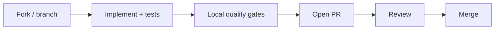

# :material-source-pull: Contributing

How to propose changes to Eagle-RAG. The project is hosted at [github.com/fintax-ai/eagle-rag](https://github.com/fintax-ai/eagle-rag).

Read [`AGENTS.md`](https://github.com/fintax-ai/eagle-rag/blob/master/AGENTS.md) before your first PR — it encodes non-negotiable architecture boundaries (Knowhere vs PixelRAG, model vendors, removed dependencies).

## Workflow



1. Branch from `master` (or the repo default): `feat/short-description` or `fix/issue-slug`.
2. Keep commits focused; avoid unrelated formatting sweeps.
3. Open a PR with a clear summary and test plan.
4. Address review comments; re-run gates after each push.

## PR checklist {#pr-checklist}

Copy into your PR description and check each item:

### Scope and design

- [ ] Change matches [`AGENTS.md`](https://github.com/fintax-ai/eagle-rag/blob/master/AGENTS.md) module boundaries (no pixelrag-serve, FAISS, OpenAI, Cohere, LibreOffice).
- [ ] Multi-tenant paths propagate `kb_name` (API, MCP, Celery kwargs, Milvus filters).
- [ ] New HTTP endpoints use Pydantic schemas in `eagle_rag/api/schemas/` and `response_model=`.
- [ ] DB schema changes include an Alembic revision (no DDL in stores).
- [ ] Config changes add `${VAR:-default}` in `settings.yaml` + pydantic field in `config.py`.
- [ ] Architecture-facing behaviour updates `README.md`, `AGENTS.md`, and/or `docs/en/architecture/multimodal-fusion.md` when required by AGENTS.md sync rule.

### Backend gates

```bash
uv run ruff check          # task be:lint
uv run ruff format --check # or task be:format then commit
uv run mypy eagle_rag      # task be:typecheck
uv run pytest              # task be:test
```

- [ ] `ruff check` — zero violations (`E`, `F`, `I`, `W`, `UP` per `pyproject.toml`).
- [ ] `ruff format` — code formatted (line length 100).
- [ ] `mypy eagle_rag` — passes (`ignore_missing_imports = true` for third-party stubs).
- [ ] `pytest` — all tests green.

### Frontend gates (if `frontend/` touched)

```bash
cd frontend && bun run lint && bun run format
```

- [ ] Biome lint clean.
- [ ] Biome format applied.
- [ ] Light theme only; no dark-mode-only assumptions.
- [ ] `next-intl` keys added for both `en` and `zh` when user-visible strings change.

### Tests

- [ ] New behaviour has pytest coverage where non-trivial (see [Testing](testing.md)).
- [ ] Mocks used for Milvus, Knowhere HTTP, external LLM — no live API keys in CI.
- [ ] Telemetry tests pass with autouse fixture reset (`tests/conftest.py`).

### Security and hygiene

- [ ] No `.env`, API keys, or credentials in the diff.
- [ ] No `TODO` / `FIXME` / personal notes in committed code ([`AGENTS.md`](https://github.com/fintax-ai/eagle-rag/blob/master/AGENTS.md)).
- [ ] Docstrings and comments in **English**, Google style.

### Ops (if compose / Docker touched)

- [ ] Healthchecks and `depends_on: service_healthy` preserved or updated intentionally.
- [ ] `COMPOSE_FILE` prod note respected (no dev-only override requirements).
- [ ] Volume names documented if new persistent stores added.

### Docs

- [ ] User-facing docs updated only when behaviour changes (do not add unsolicited `.md` files).
- [ ] GitHub links in docs point to `https://github.com/fintax-ai/eagle-rag/blob/master/...`, not relative `../../../` paths to repo root files.

## Commit messages

Follow existing history: short imperative subject, optional body explaining **why**.

```
fix health probe celery timeout false positive

Celery inspect.ping used a 3s timeout inside a 3s wait_for, marking
celery down when workers were healthy. Lower inspect timeout to 1.0s.
```

## Code review focus areas

Reviewers typically check:

| Area | Question |
| --- | --- |
| Routing | Does ingest use format + content form, not `source_type` alone? |
| Fusion | Visual chunks carry `chunk_type`, `parent_section`, `content_summary`, `source_chunk_id`? |
| Celery | Task registered in `include=` and `task_routes`? `@with_retry` or explicit dead letter? |
| Scope | `scope_filter` OR semantics preserved? |
| Streaming | SSE event types unchanged without migration note? |
| MCP | `TOOL_DEFINITIONS` updated? `@with_metrics` on new tools? |

## Local development commands

| Task | Command |
| --- | --- |
| Full Docker stack | `task up` |
| API only | `task be:api` |
| All Celery queues | `task be:worker` |
| Single queue | `task be:worker QUEUES=knowhere_queue CONCURRENCY=8` |
| Migrations | `task db:migrate` |
| Docs preview | `task docs:serve` |

## Database migrations in PRs

1. Edit `eagle_rag/db/models/`.
2. `uv run alembic revision --autogenerate -m "add_foo_column"`.
3. Review generated SQL — autogenerate is not infallible.
4. `task db:migrate` locally.
5. Include revision file in PR.

Downgrade strategy: provide `downgrade()` when rollback is feasible; note if data loss is inevitable.

## Breaking changes

Call out explicitly in PR:

- API schema field renames or removed endpoints.
- Milvus collection schema changes (may require re-ingest).
- Env var renames in `settings.yaml`.
- MCP tool signature changes.

## What we do not merge

- Reintroduction of removed stacks (pixelrag-serve, FAISS, OpenAI adapters) without owner approval.
- Finance-specific hardcoding in core paths (`AGENTS.md`: industry-agnostic).
- Auth middleware on API routes (intranet assumption) unless project direction changes.
- DDL executed from runtime stores instead of Alembic.

## CI note

The repository may not run all gates on every PR in GitHub Actions — **local execution of the checklist is mandatory** before requesting review. MCP deploy workflow exists under `.github/workflows/mcp-deploy.yml` for MCP-specific releases.

## Getting reviewer context

Link to:

- Relevant section in `docs/en/backend/` or `docs/en/ops/`
- `AGENTS.md` rule you followed
- Screenshot / curl example for API changes

## License and conduct

Apache License 2.0 per `LICENSE` and `pyproject.toml`. Use professional communication in issues and PRs.

## Adding a new API endpoint (checklist)

1. Define request/response models in `eagle_rag/api/schemas/<domain>.py`.
2. Implement handler in `eagle_rag/api/<domain>.py` with `response_model=`.
3. Register router in [`app.py`](https://github.com/fintax-ai/eagle-rag/blob/master/eagle_rag/api/app.py) if new file.
4. Add pytest in `tests/test_api_*.py` with patched stores.
5. Update MkDocs backend page if the endpoint is user-facing (only when asked or part of a docs task).

## Adding a Celery task (checklist)

1. Implement task body in `ingest/` or appropriate module.
2. Decorate with `@with_retry(name="eagle_rag.tasks.<name>", queue="<queue>")`.
3. Add route in `eagle_rag/settings.yaml` `celery.task_routes`.
4. Ensure module is listed in `celery_app.include` (if new file).
5. Document queue choice: router (4) / knowhere (8) / pixelrag (1).
6. Use `send_task_with_trace` from API/runner dispatch paths.
7. Verify `task_audit` state transitions in [`tasks/state.py`](https://github.com/fintax-ai/eagle-rag/blob/master/eagle_rag/tasks/state.py).

## Adding an MCP tool (checklist)

1. Implement handler in [`mcp_server.py`](https://github.com/fintax-ai/eagle-rag/blob/master/eagle_rag/api/mcp_server.py).
2. Append schema to `TOOL_DEFINITIONS`.
3. Apply `@with_metrics("<tool_name>")` for Prometheus when using standalone MCP HTTP.
4. Add tests: `tests/test_mcp_*.py` (happy path + degradation dict with `error` field).
5. Confirm `/mcp/tools` and admin `/admin/mcp` list the tool.

## Frontend contribution notes

- Run `bun run lint` and `bun run format` before push.
- User-visible strings require `messages/en.json` and `messages/zh.json` updates.
- API calls go through existing `lib/` clients — match error handling patterns in neighbouring pages.
- Do not introduce dark-theme-only styling; Eagle-RAG UI is light-only per AGENTS.md.

## Dependency changes

- Python: edit [`pyproject.toml`](https://github.com/fintax-ai/eagle-rag/blob/master/pyproject.toml), run `uv lock` if lockfile tracked, `uv sync`.
- Do not add OpenAI/Cohere/LibreOffice/pixelrag-serve dependencies.
- PixelRAG remains a git dependency on StarTrail-org/PixelRAG; document any pin changes in PR body.
- Frontend: `cd frontend && bun install`, commit `bun.lock` when dependencies change.

## Review SLA expectations

- Respond to review comments within a reasonable window; re-run all gates after each fixup push.
- Squash vs merge is repository maintainer preference — do not force-push to shared branches without agreement.

## Related

- [Coding standards](coding-standards.md)
- [Testing](testing.md)
- [Development index](index.md)
