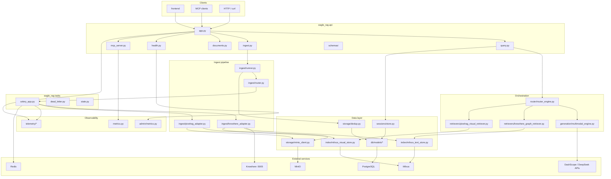
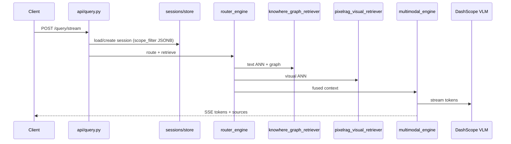
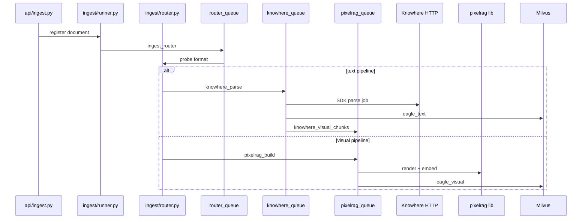

# :material-folder: Project structure

Repository layout and **module dependency graph** for Eagle-RAG. Paths are relative to the repository root unless noted.

Entry points: [`README.md`](https://github.com/fintax-ai/eagle-rag/blob/master/README.md), [`AGENTS.md`](https://github.com/fintax-ai/eagle-rag/blob/master/AGENTS.md).

## Top-level tree

```
eagle-rag/
├── eagle_rag/              # Python backend package (primary)
├── frontend/               # Next.js 16 app (Bun)
├── tests/                  # Pytest suite
├── alembic/                # Database migrations
│   └── versions/
├── docker/                 # Dockerfiles + knowhere-self-hosted/
├── docs/                   # MkDocs (en/ + zh/)
├── design/                 # Design artefacts
├── data/                   # Runtime dir (gitignored): uploads, HF cache
├── docker-compose.yml
├── docker-compose.override.yml
├── Taskfile.yml
├── pyproject.toml          # uv / hatchling / ruff / mypy / pytest
├── mkdocs.yml
├── eagle_rag/settings.yaml
├── AGENTS.md
└── README.md
```

## `eagle_rag/` package map

| Directory | Responsibility |
| --- | --- |
| `api/` | FastAPI app, routers, MCP, Pydantic schemas |
| `ingest/` | Routing, Knowhere/PixelRAG adapters, Celery task bodies |
| `retrievers/` | LlamaIndex retrievers (text graph, visual) |
| `router/` | `EagleRouterQueryEngine`, LLM routing, scope filter resolution |
| `generation/` | Multimodal answer synthesis (VLM streaming) |
| `index/` | Milvus text/visual stores, tag catalog, document structure |
| `db/` | SQLModel models, async/sync DB helpers |
| `storage/` | MinIO client, dedup registry |
| `kb/` | Knowledge-base registry, lifecycle, stats |
| `sessions/` | Session + message persistence |
| `attachments/` | Ephemeral attachment parse (no Milvus write) |
| `notifications/` | User notification store |
| `tasks/` | Celery app, dead letter, task state audit |
| `admin/` | Queue metrics sampling, MCP log, system settings |
| `telemetry/` | loguru, structlog, OpenTelemetry |
| `metrics.py` | Prometheus MCP metrics (standalone app) |
| `config.py` | Settings loader |

## Module dependency graph

High-level import / call direction (runtime). External systems on the boundary.



### Layer rules

1. **`api/`** may call `router`, `ingest/runner`, `sessions`, `kb`, `admin` — not Milvus directly from routers (go through stores/retrievers).
2. **`ingest/`** tasks write via `index/` + `storage/`; dispatch uses `send_task_with_trace`.
3. **`router/`** + **`generation/`** read vectors only through retrievers and image store.
4. **`db/models/`** — no business logic; Alembic owns schema.
5. **`telemetry/`** — no imports from api/ingest (avoid cycles); consumers import telemetry.

## Request path (query)



## Ingest path



## `frontend/` structure

```
frontend/
├── app/                 # Next.js App Router (locale segments)
├── components/          # UI components (HeroUI)
├── lib/                 # API client helpers
├── messages/            # next-intl zh/en
├── package.json
└── biome.json
```

Frontend talks to backend only via HTTP (`NEXT_PUBLIC_API_URL`). No shared Python/TS types — OpenAPI is the contract.

## `tests/` structure

Flat layout — `tests/test_*.py` mirrors domains:

| Pattern | Area |
| --- | --- |
| `test_api_*` | FastAPI routes (TestClient / async) |
| `test_router_*`, `test_retrievers` | Retrieval and generation |
| `test_ingest_*` | Routing, URL validation, smoke |
| `test_mcp_*` | MCP tools, HTTP transport, metrics |
| `test_telemetry_*` | Logging and tracing |
| `test_knowhere_*`, `test_milvus_*` | Adapter edge cases |

Shared fixtures: [`tests/conftest.py`](https://github.com/fintax-ai/eagle-rag/blob/master/tests/conftest.py). Details: [Testing](testing.md).

## `docker/` layout

```
docker/
├── Dockerfile.api
├── Dockerfile.worker
├── Dockerfile.frontend
├── Dockerfile.docs
└── knowhere-self-hosted/
    ├── compose.yaml
    ├── .env.example
    └── env.defaults
```

## `alembic/` layout

```
alembic/
├── env.py               # Imports SQLModel metadata
├── script.py.mako
└── versions/
    ├── 0001_*.py
    └── 0002_health_module_tables.py
```

Models live in `eagle_rag/db/models/`; migrations are the only DDL path.

## Key files quick reference

| File | Why read it |
| --- | --- |
| [`ingest/router.py`](https://github.com/fintax-ai/eagle-rag/blob/master/eagle_rag/ingest/router.py) | Format + PDF probe routing matrix |
| [`router/router_engine.py`](https://github.com/fintax-ai/eagle-rag/blob/master/eagle_rag/router/router_engine.py) | `_resolve_scope_filter`, hybrid retrieval |
| [`tasks/celery_app.py`](https://github.com/fintax-ai/eagle-rag/blob/master/eagle_rag/tasks/celery_app.py) | Queues, beat schedule, ack semantics |
| [`tasks/dead_letter.py`](https://github.com/fintax-ai/eagle-rag/blob/master/eagle_rag/tasks/dead_letter.py) | Retry + dead letter |
| [`api/health.py`](https://github.com/fintax-ai/eagle-rag/blob/master/eagle_rag/api/health.py) | Probes and admin |
| [`telemetry/tracing.py`](https://github.com/fintax-ai/eagle-rag/blob/master/eagle_rag/telemetry/tracing.py) | `trace_span`, Celery propagation |
| [`db/models/sessions.py`](https://github.com/fintax-ai/eagle-rag/blob/master/eagle_rag/db/models/sessions.py) | `scope_filter` JSONB |

## Data stores per module

| Module | PostgreSQL | Milvus | MinIO | Redis |
| --- | --- | --- | --- | --- |
| `sessions/` | sessions, messages | — | — | — |
| `storage/dedup` | dedup registry | — | objects | — |
| `index/milvus_*` | — | eagle_text, eagle_visual | — | — |
| `tasks/` | task_audit | — | — | broker |
| `admin/metrics` | metric_sample | — | — | LLEN queues |
| `attachments/` | attachments meta | — | temp files | — |

## Adding a new feature (where to put code)

| Feature type | Touch |
| --- | --- |
| REST endpoint | `api/schemas/`, `api/<router>.py`, `app.py` include |
| MCP tool | `mcp_server.py`, `TOOL_DEFINITIONS`, tests |
| Ingest format | `ingest/router.py`, settings `ingest.routing`, adapter |
| Retrieval mode | `router/`, `retrievers/`, `settings.yaml` router section |
| Persistent entity | `db/models/`, Alembic revision, store module |
| Background job | `ingest/*_adapter.py` or new module, `celery_app.include`, `task_routes` |

## Related

- [Development index](index.md)
- [Coding standards](coding-standards.md)
- [Architecture docs](../architecture/index.md)
