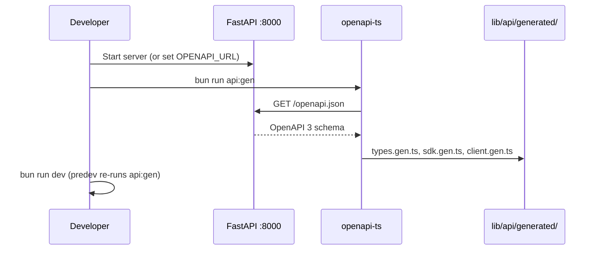

# API Client

The frontend talks to FastAPI through a **generated TypeScript SDK** (`@hey-api/openapi-ts`) plus thin wrappers for SSE and evidence URLs.

---

## OpenAPI generation flow



### Configuration (`openapi-ts.config.ts`)

```typescript
export default defineConfig({
  input: {
    path: `${apiBase}/openapi.json`,
    watch: process.env.OPENAPI_WATCH === "1",
  },
  output: "./lib/api/generated",
  plugins: ["@hey-api/typescript", "@hey-api/sdk", "@hey-api/client-fetch"],
});
```

**Environment resolution** (first match):

1. `OPENAPI_URL`
2. `API_BASE`
3. `NEXT_PUBLIC_API_BASE`
4. `http://localhost:8000`

### Scripts (`package.json`)

| Script | Action |
|--------|--------|
| `api:gen` | One-shot regenerate |
| `api:gen:watch` | Watch mode for active API development |
| `predev` | Runs `api:gen` before `next dev` |

### Generated artifacts

| File | Contents |
|------|----------|
| `types.gen.ts` | `QueryRequest`, `SessionSummary`, … |
| `sdk.gen.ts` | `postQueryQueryPost`, `listTasksTasksGet`, … |
| `client.gen.ts` | Configured fetch client + SSE support |
| `core/serverSentEvents.gen.ts` | `StreamEvent`, SSE options |

**Do not hand-edit** `generated/` — changes are overwritten.

---

## Runtime client (`lib/api/client.ts`)

```typescript
export const API_BASE = process.env.NEXT_PUBLIC_API_BASE ?? "http://localhost:8000";

client.setConfig({ baseUrl: API_BASE });
```

### Interceptors

| Hook | Current behaviour | Extension point |
|------|-------------------|-----------------|
| `request` | Pass-through | Add `Authorization` header |
| `response` | Pass-through | Global 401 handler |
| `error` | `console.error` | Toast / telemetry |

### Evidence URL builders

Endpoints consumed as raw URLs (not always in OpenAPI as typed operations):

```typescript
imageUrl(imageId)                    // GET /images/{id}
fileUrl(documentId)                  // GET /documents/{id}/file
chunkHtmlUrl(documentId, chunkId)    // GET /documents/{id}/chunks/{chunk_id}
```

Used in ``, `<iframe src>` for `FilePreview`.

---

## SSE layer (`lib/api/sse.ts`)

Wraps generated `client.sse.post` and SDK SSE getters.

### Core types

```typescript
export interface SseEvent {
  event: string;
  data: string;  // raw JSON string
}
```

`toSseEvent` normalizes `StreamEvent` from hey-api (default event name `message`).

### `subscribeSse` pattern

1. Create `AbortController`
2. Open stream with `onSseEvent` / `onSseError` callbacks
3. Drain async iterable until abort
4. Return cancel function → `controller.abort()`

### Exported streams

| Function | Endpoint |
|----------|----------|
| `streamQuery` | `POST /query/stream` |
| `streamSearch` | `POST /search/stream` |
| `streamTaskProgress` | `GET /tasks/{id}/stream` |
| `streamAdminLogs` | `GET /admin/logs` |

### Error handling

`apiErrorFromUnknown` (`lib/api/errors.ts`) normalizes fetch failures for toast display.

---

## Hook layer (`lib/hooks/`)

Hooks import from `@/lib/api/generated/sdk.gen` and cast responses:

```typescript
const result = await postQueryQueryPost({ body: request });
if (result.error) throw result.error;
return result.data as unknown as QueryResponse;
```

Typed aliases live in `lib/types.ts` (re-exports / extensions of generated types).

Domain modules:

| File | Domain |
|------|--------|
| `useQA.ts` | Query + sessions |
| `useIngest.ts` | Ingest + tasks |
| `useKB.ts` | Knowledge bases |
| `useHealth.ts` | Health + admin |
| `useDocuments.ts` | Document list |
| `useTags.ts` | Tag catalog |
| `useAttachments.ts` | Upload helper |

---

## Import conventions

```typescript
// Preferred — tree-shakeable SDK functions
import { postQueryQueryPost } from "@/lib/api/generated/sdk.gen";

// Types
import type { QueryRequest } from "@/lib/types";

// SSE + URLs
import { streamQuery } from "@/lib/api/sse";
import { fileUrl } from "@/lib/api/client";

// Side-effect: client config (import once in app)
import "@/lib/api/client";
```

`lib/api/index.ts` re-exports common entry points.

---

## CI recommendation

When API schemas change in PRs:

1. Start API or export `openapi.json` in CI
2. Run `bun run api:gen`
3. Commit regenerated `lib/api/generated/*`

Diff in generated types catches breaking frontend contract changes early.

---

## Related documentation

- [API index](../api/index.md)
- [Query API](../api/query.md) — SSE byte protocol
- [Q&A module](qa-module.md) — stream consumer
