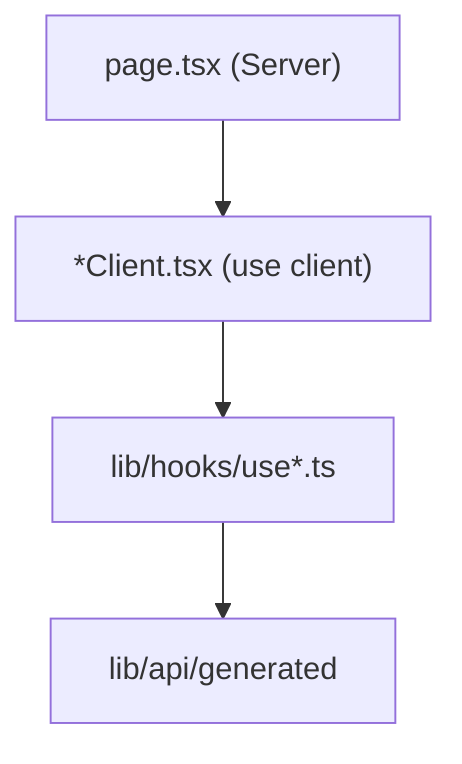

# App Structure

The frontend uses the **Next.js 16 App Router** with a `[locale]` dynamic segment for internationalization. All operator routes are client-accessible pages wrapped in a shared shell.

---

## Directory layout

```
frontend/
├── app/
│   ├── [locale]/
│   │   ├── layout.tsx      # Root shell: fonts, i18n, sidebar
│   │   ├── page.tsx        # Redirect / home
│   │   ├── qa/page.tsx
│   │   ├── ingest/page.tsx
│   │   ├── kb/page.tsx
│   │   ├── kb/[kbName]/page.tsx
│   │   └── health/page.tsx
│   ├── globals.css         # Design tokens
│   └── providers.tsx       # TanStack Query
├── components/
│   ├── qa/                 # Q&A module
│   ├── ingest/
│   ├── kb/
│   ├── health/
│   ├── ai-elements/        # Vercel AI Elements primitives
│   └── ui/                 # Shared wrappers
├── lib/
│   ├── api/                # Generated SDK + SSE + URL builders
│   ├── hooks/              # TanStack Query hooks per domain
│   └── stores/             # Zustand stores
├── messages/               # i18n JSON + fragments/
└── i18n/
    ├── routing.ts
    └── request.ts
```

---

## Route table

| URL path | File | Component |
|----------|------|-----------|
| `/` | `[locale]/page.tsx` | Landing / redirect |
| `/qa` | `qa/page.tsx` | `QAClient` |
| `/ingest` | `ingest/page.tsx` | Ingest workspace |
| `/kb` | `kb/page.tsx` | `KBManagementClient` |
| `/kb/:kbName` | `kb/[kbName]/page.tsx` | `KBDetailClient` |
| `/health` | `health/page.tsx` | Health dashboards |

`localePrefix: "never"` — URLs omit `/en` prefix; locale from cookie / `Accept-Language` via `proxy.ts`.

---

## Root layout (`app/[locale]/layout.tsx`)

Server Component responsibilities:

1. Validate `locale` against `routing.locales` — `notFound()` if invalid
2. `setRequestLocale(locale)` for static rendering
3. Load messages via `getMessages()` (merged fragments)
4. Apply fonts: **Inter** (`--font-inter`), **JetBrains Mono** (`--font-jetbrains-mono`)
5. Force light mode: `className="light"`, `data-theme="light"`

```tsx
<html lang={locale} className={`light ${inter.variable} ${jetbrainsMono.variable}`}>
  <body className="light bg-background text-foreground">
    <NextIntlClientProvider messages={messages}>
      <Providers>
        <div className="flex min-h-screen">
          <Sidebar />
          <div className="flex min-w-0 flex-1 flex-col">{children}</div>
        </div>
      </Providers>
    </NextIntlClientProvider>
  </body>
</html>
```

### Q&A layout exception

`QAClient` renders its own `AppBar` and uses full viewport height (`h-screen`) — it still inherits sidebar from parent layout unless page opts out (current: sidebar visible).

---

## Providers (`app/providers.tsx`)

Client-only wrapper:

```tsx
new QueryClient({
  defaultOptions: {
    queries: {
      staleTime: 30_000,
      retry: 1,
      refetchOnWindowFocus: false,
    },
  },
});
```

HeroUI v3 needs **no** `HeroUIProvider` — theming is CSS-variable based (`globals.css`).

Extension seam for future global providers (toast region, auth context).

---

## Navigation shell

| Component | Role |
|-----------|------|
| `Sidebar` | Primary nav links with locale-aware `Link` |
| `AppBar` | Q&A top bar (history, scope, mode) |

Icons: `lucide-react`. Active route styling via pathname match.

---

## Page composition pattern



Server pages stay thin — no data fetching at RSC layer for most modules (TanStack Query on client). Exception: metadata via `generateMetadata` if added later.

---

## React 19 considerations

- **Refs as props** — no `forwardRef` needed in new components
- **`use` hook** — not yet primary pattern; async data via TanStack Query
- **Strict Mode** — double-mount in dev; SSE subscriptions must abort in cleanup (`streamCancelRef` in `QAClient`)

---

## Build & dev scripts

| Script | Action |
|--------|--------|
| `bun run dev` | `predev` → `api:gen`, then `next dev` |
| `bun run build` | Production bundle |
| `bun run lint` | Biome check |
| `bun run api:gen` | Regenerate OpenAPI client |

---

## Related documentation

- [i18n](i18n.md) — locale routing
- [API client](api-client.md) — SDK wiring
- [Design system](design-system.md) — `globals.css` tokens
