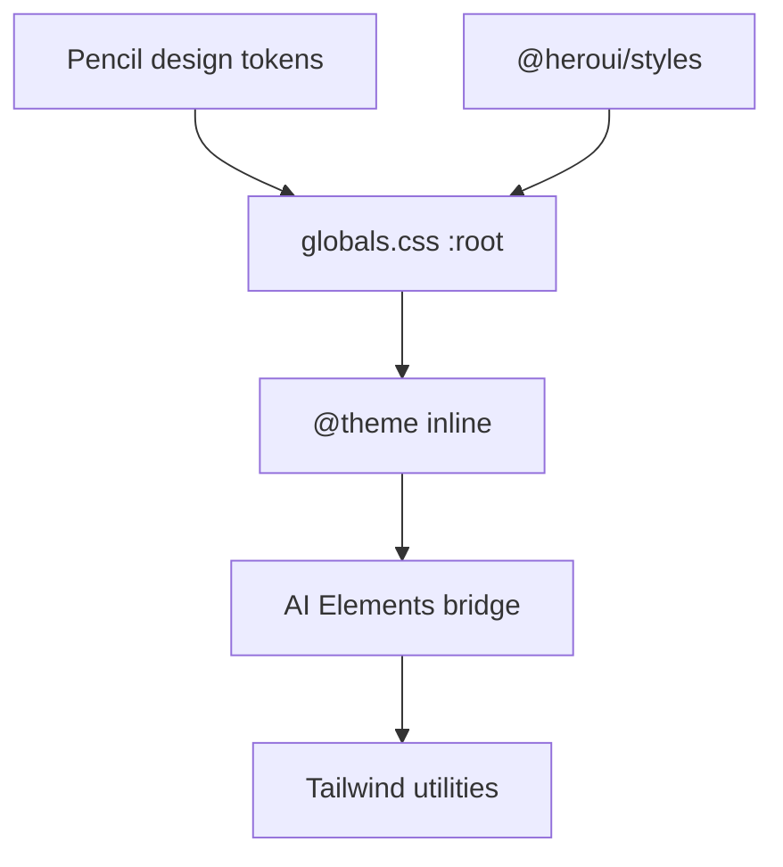

# Design System

Eagle-RAG uses **HeroUI v3** with **Tailwind v4**, a **light-only** palette derived from Pencil design tokens, and **Vercel AI Elements** for chat primitives. All theming flows through CSS variables in `app/globals.css`.

---

## Stack

| Layer | Technology |
|-------|------------|
| Component library | `@heroui/react` + `@heroui/styles` |
| Utility CSS | Tailwind v4 (`@import "tailwindcss"`) |
| Chat primitives | `components/ai-elements/*` (shadcn-compatible) |
| Markdown answers | `streamdown` + `@streamdown/math` |
| Icons | `lucide-react` |
| Motion | `framer-motion` (drawers, modals) |
| Class merging | `clsx` + `tailwind-merge` → `cn()` in `lib/utils.ts` |

HeroUI v3 is **providerless** — no `HeroUIProvider`. Theme = CSS variables on `:root` / `.light`.

---

## Token architecture



### Core semantic tokens (`:root`, `.light`)

| Variable | Role |
|----------|------|
| `--background` / `--foreground` | Page surface + text |
| `--surface` / `--surface-muted` | Cards, panels |
| `--border` / `--divider` | Borders |
| `--accent` / `--accent-foreground` | Brand blue (primary actions) |
| `--danger` | Destructive |
| `--focus` | Focus ring |
| `--overlay` | Modal glass |

### Typography

```css
--font-sans: var(--font-inter), …;
--font-mono: var(--font-jetbrains-mono), …;
```

Loaded in `layout.tsx` via `next/font/google`.

### Spacing

`--spacing: 0.25rem` — HeroUI multiplies for its scale.

---

## AI Elements bridge (`@theme inline`)

AI Elements expect shadcn colour names. Bridge maps:

| shadcn token | Eagle source |
|--------------|--------------|
| `--color-primary` | `--accent` |
| `--color-muted-foreground` | `--foreground-secondary` |
| `--color-card` | `--surface` |
| `--color-destructive` | `--danger` |
| `--color-ring` | `--focus` |

Enables `bg-primary`, `text-muted-foreground` in `components/ai-elements/*` without visual drift.

### streamdown scan

```css
@source "../node_modules/streamdown/dist/index.js";
```

Ensures Tailwind generates utility classes used by the markdown renderer.

---

## Shared UI (`components/ui/`)

| Component | Usage |
|-----------|-------|
| `Card` | KPI panels |
| `IconButton` | Toolbar actions |
| `StatCard` | Health / KB metrics |

Prefer HeroUI primitives (`Button`, `Drawer`, `Modal`, `Spinner`) for interactive controls.

---

## AI Elements catalogue

| Component | Q&A usage |
|-----------|-----------|
| `prompt-input` | `Composer` textarea + submit |
| `message` | Bubble layout |
| `response` | Wrapper for answer body |
| `chain-of-thought` | `ThinkingTrace` steps |
| `code-block` | Fenced code in answers |
| `actions` | Message action row |

Collapsible animations:

```css
--animate-collapsible-down: collapsible-down 220ms …;
```

---

## KB theme swatches

Knowledge bases carry `theme` string (`blue`, `violet`, `emerald`, …). `kb-visuals.tsx` + `ThemeSwatchPicker` map to pastel backgrounds for cards — not full dark-mode themes.

---

## Layout primitives

| Pattern | Classes |
|---------|---------|
| Page max width | `max-w-360` (custom spacing token) |
| Q&A split | `lg:flex-row` chat + `lg:w-110` rail |
| Glass modal | HeroUI `Modal` + `overlay` token |

`design-frames.ts` — shared frame dimensions for Figma parity (if referenced).

---

## Accessibility

- Light-only: `color-scheme: light` on `:root`
- Focus rings via `--focus`
- Icon buttons require `aria-label` (enforced in code review / Biome a11y rules where configured)

---

## Biome

`biome.json` — formatting + lint. Run `bun run lint` before commit.

No ESLint — Biome is the sole JS/TS linter.

---

## Related documentation

- [Q&A module](qa-module.md) — component usage
- [App structure](app-structure.md) — font loading
- [i18n](i18n.md) — translated strings in components
