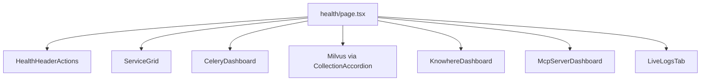

# Health Module

Operations dashboard at `/health` (`components/health/`). Surfaces dependency probes, Celery/Milvus/Knowhere admin views, MCP tool catalog, and live log streaming.

---

## Page structure



---

## Service grid (`ServiceGrid.tsx`)

`GET /health` → `HealthResponse.dependencies[]`.

Each `ServiceCard` shows:

- Status dot (`up` / `down` / `unknown`)
- Latency ms
- Uptime string
- Expand for `detail` text

`health-visuals.ts` maps dependency names to icons and colours.

---

## Admin dashboards

Opened via drawer pattern (`drawer-parts.tsx`) from service cards or tabs.

| Dashboard | API | Highlights |
|-----------|-----|------------|
| `CeleryDashboard` | `GET /admin/celery` | Workers, queue depths, active tasks |
| `CollectionAccordion` | `GET /admin/milvus` | Per-collection row counts, KB partitions |
| `StorageDashboard` | `GET /admin/minio` | Bucket usage |
| `KnowhereDashboard` | `GET /admin/knowhere` | Remote parser :5005 status |
| `McpServerDashboard` | `GET /admin/mcp`, `/mcp/tools` | Tool defs + recent call log |

`ToggleSwitch` components patch admin settings (`PATCH /admin/model-router`, resource limits).

---

## Live logs (`LiveLogsTab.tsx`)

SSE subscription:

```typescript
import { streamAdminLogs } from "@/lib/api/sse";

const cancel = streamAdminLogs((evt) => {
  if (evt.event === "log") appendLog(JSON.parse(evt.data));
});
```

Cleanup on tab unmount — abort controller.

---

## Hooks (`lib/hooks/useHealth.ts`)

| Hook | Endpoint | Query key |
|------|----------|-----------|
| `useHealth` | `/health` | `["health"]` |
| `useAdminCelery` | `/admin/celery` | `["admin", "celery"]` |
| `useAdminMilvus` | `/admin/milvus` | `["admin", "milvus"]` |
| … | | `["admin", …]` |

Refetch intervals may be shorter than global 30s staleTime for ops freshness.

---

## Types (`lib/health/types.ts`)

Narrowed admin response shapes for chart props.

---

## UX patterns

- **Accordion** for dense Milvus partition tables
- **StatCard** (`components/ui/StatCard.tsx`) for numeric KPIs
- Light-only charts — Recharts colours from CSS variables

---

## Related documentation

- [Health & admin API](../api/health-admin.md)
- [API client](api-client.md) — `streamAdminLogs`
- [MCP tools](../api/mcp-tools.md)
