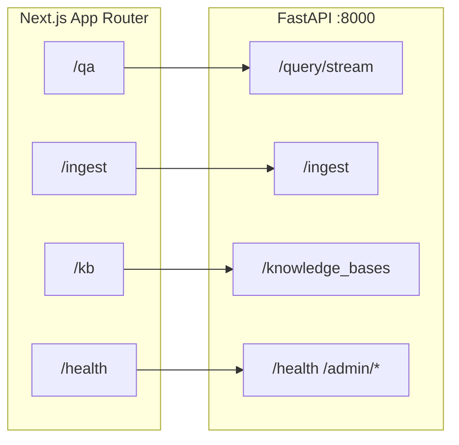

# Eagle-RAG Frontend

The Eagle-RAG frontend is a **Next.js 16** operator console for a multimodal retrieval-augmented generation (RAG) platform. It covers the full lifecycle: **ingest → index → retrieve → generate**, with bilingual UI (**English / Chinese**), light-only theming, and a generated OpenAPI client.

This page is the entry point for frontend documentation.

> **Scope lock (ADR-008)**: the built-in UI showcases **Core only** (knowhere semantic structure + pixelrag visual hybrid retrieval). Domain plugins (biomed, lakehouse-bi, …) have **no frontend** in this repo — Agents consume them via MCP/API. Frontend backlog excludes: biomed entity panels, lakehouse semantic browsers, industry collection switchers, domain MCP playgrounds.

### Showcase focus

| Capability | UI surface |
| --- | --- |
| KB selection & ingest | `/kb`, `/ingest` |
| Hybrid retrieval (text / visual / hybrid) | `/qa` Composer modes |
| Four-anchor provenance | `VisualSourceCard` (`chunk_type` / `parent_section` / `content_summary` / `source_chunk_id`) |
| Document structure + visual hits | `DocumentStructureTree`, Sources rail |
| Route / `collection_plans` readability | `ThinkingTrace` route step |
| Core health (knowhere / pixelrag / MCP) | `/health` (no vertical features) |

See [ADR-008](../architecture/adr/008-rag-only-plugin-platform.md).

---

## Console map

| Area | Route | RAG role |
|------|-------|----------|
| **Q&A** | `/qa` | Stream answers, inspect citations, scope-filtered retrieval |
| **Ingest** | `/ingest` | Upload files/URLs, monitor Celery tasks |
| **Knowledge bases** | `/kb`, `/kb/[kbName]` | KBs (`kb_name`) inside the deploy domain, Milvus stats, purge/rebuild |
| **Health** | `/health` | Dependency probes, admin dashboards, live logs |

---

## Technology stack

| Concern | Choice | Notes |
|---------|--------|-------|
| Framework | Next.js 16 App Router | `[locale]` segment; `proxy.ts` locale negotiation |
| UI runtime | React 19 | Client islands for streaming / interaction |
| Components | HeroUI v3 | Providerless; CSS variable theming |
| Styling | Tailwind v4 | `@import "tailwindcss"` + `@heroui/styles` |
| Server data | TanStack Query v5 | `staleTime: 30s`, `retry: 1` |
| Client state | Zustand v5 | Scope, filters, UI prefs — selective `persist` |
| i18n | next-intl v4 | Locales `zh` / `en`, `localePrefix: "never"` |
| Streaming | SSE | Query tokens, search steps, task progress, admin logs |
| API | `@hey-api/openapi-ts` | `lib/api/generated/` |
| Answer render | streamdown | Markdown + math via `@streamdown/math` |
| Charts | Recharts v3 | KB + queue analytics |
| Tooling | Bun, Biome | `bun run lint` / `format` |

---

## React 19 + App Router patterns

### Server Components by default

`app/[locale]/*/page.tsx` files are Server Components unless marked `"use client"`. They:

- Call `setRequestLocale(locale)` for static rendering
- Pass minimal props into client shells (`QAClient`, `KBManagementClient`, …)

### Client islands

Heavy interactivity lives in `components/*/*Client.tsx`:

| Client shell | Why client-side |
|--------------|-----------------|
| `QAClient` | SSE streaming, message list mutation |
| `IngestPage` clients | Task polling, SSE progress, file upload |
| `KB*Client` | Drawers, modals, charts |

### Async request APIs

Next.js 16 passes `params` as `Promise<{ locale: string }>` — layouts `await params` before `setRequestLocale`.

### No Pages Router

All routes under `app/[locale]/`. No `getServerSideProps`.

---

## Documentation map

| Page | Topic |
|------|-------|
| [App structure](app-structure.md) | Routes, layout, providers, sidebar |
| [Q&A module](qa-module.md) | Chat, SSE, citations, evidence rail |
| [Ingest module](ingest-module.md) | Upload, task table, queue metrics |
| [KB module](kb-module.md) | Knowledge-base cards, detail KPIs |
| [Health module](health-module.md) | Probes, admin drawers |
| [API client](api-client.md) | Generated SDK, SSE helpers |
| [State management](state-management.md) | Zustand + Query keys |
| [Design system](design-system.md) | Tokens, HeroUI, AI Elements |
| [i18n](i18n.md) | Message fragments |

---

## Environment

| Variable | Default | Purpose |
|----------|---------|---------|
| `NEXT_PUBLIC_API_BASE` | `http://localhost:8000` | REST + SSE base URL |
| `OPENAPI_URL` | falls back to API base | `bun run api:gen` input |

---

## Operator checklist

- [ ] API reachable at `NEXT_PUBLIC_API_BASE`
- [ ] `bun run api:gen` succeeded (runs on `predev`)
- [ ] At least one KB registered
- [ ] Celery workers on all three queues
- [ ] Documents `ready` before Q&A

!!! warning "No authentication"
    Console assumes **intranet deployment**. Add auth at the reverse proxy if exposing beyond trusted networks.

---

## Related documentation

- [API reference](../api/index.md)
- [Backend API layer](../backend/api-layer.md)
- [Installation](../getting-started/installation.md)
