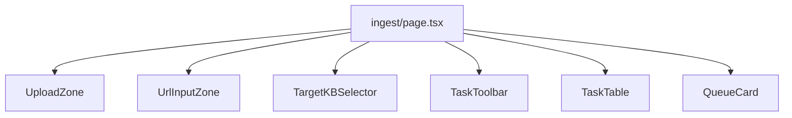

# Ingest Module

The ingest workspace (`/ingest`, `components/ingest/`) dispatches documents into the Celery pipeline and monitors task progress through polling and SSE.

---

## Page layout



---

## Upload flows

### File upload (`UploadZone.tsx`)

- Drag-and-drop or file picker
- `POST /ingest` multipart: `file`, `source_type_hint`, `kb_name`
- Toast via `IngestToast` on success / dedup hit

### URL ingest (`UrlInputZone.tsx`)

- Form field `url` + same metadata fields
- Server-side SSRF guard + prefetch before dispatch

### Target KB (`TargetKBSelector.tsx`)

Reads `useKBStore` / `useKnowledgeBases` — selected `kb_name` attached to every ingest call. **Distinct** from QA scope store.

---

## Task table (`TaskTable.tsx`)

Data: `useIngest` → `GET /tasks` with filters from `filterStore.taskFilter`:

| Filter | Query param |
|--------|-------------|
| `query` | client-side on `job_id` / `document_id` after fetch, or `q` param |
| `pipelines[]` | `pipeline` |
| `statuses[]` | `status` |
| `autoPoll` | refetch interval when true |

### Status pills (`StatusPill.tsx`)

Uses `status_phase` from API (`pending | running | success | failed`) mapped in `status.ts` — mirrors backend `_STATUS_PHASE_MAP`.

### Live progress

`TaskTable` opens SSE via `streamTaskProgress(jobId)` on row expand or modal:

- `progress` events update row state
- `timeout` → user notification

`TaskLogsModal` fetches `GET /tasks/{id}/logs`.

### Actions

| Action | API |
|--------|-----|
| Retry | `POST /tasks/{id}/retry` |
| Delete audit | `DELETE /tasks/{id}` |
| View document | Link to `/kb` detail if `document_id` set |

---

## Queue metrics (`QueueCard.tsx`)

`GET /ingest/queue-metrics` → per-queue `concurrency` + Redis `size`.

`QueueTrendChart` (optional history) uses admin metrics when wired.

---

## Pipeline badge (`PipelineBadge.tsx`)

Displays raw `pipeline` field (`router`, `knowhere`, `pixelrag`) with colour coding aligned to routing matrix in AGENTS.md.

---

## Hooks (`lib/hooks/useIngest.ts`)

| Export | Purpose |
|--------|---------|
| `useTasks` | Paginated task list query |
| `useTask` | Single task detail |
| `useIngestFile` | Upload mutation |
| `useIngestUrl` | URL mutation |
| `useRetryTask` | Retry mutation |
| `useQueueMetrics` | Queue depth query |
| `errorMessage` | Shared error string helper (used by QA too) |

### TanStack Query keys

```
["tasks", params]
["task", jobId]
["ingest", "queue-metrics"]
```

---

## Zustand: task filters

`useFilterStore` → `taskFilter` persisted as `eagle-rag-filter`:

```typescript
{
  query: string;
  pipelines: string[];
  statuses: string[];
  autoPoll: boolean;
}
```

---

## Dedup UX

HTTP **200** with `dedup_hit: true` — show informational toast ("already indexed") rather than error.

---

## Related documentation

- [Ingest API](../api/ingest.md)
- [Tasks API](../api/tasks.md)
- [State management](state-management.md)
- [KB module](kb-module.md) — register KB before ingest
