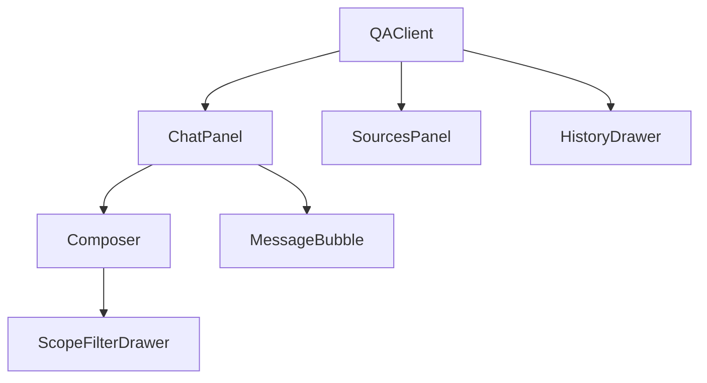

# Q&A Module

The Q&A workspace (`/qa`, `components/qa/`) is the primary **retrieval-augmented conversation** surface. It streams multimodal answers over SSE, renders citations inline, and provides a three-pane **evidence workbench** (sources, document structure, file preview).

---

## Component architecture



| Component | File | Responsibility |
|-----------|------|----------------|
| `QAClient` | `QAClient.tsx` | Session state, SSE orchestration, toast errors |
| `ChatPanel` | `ChatPanel.tsx` | Message list, composer slot, scroll stick-to-bottom |
| `Composer` | `Composer.tsx` | Prompt input, mode toggles, attachments, scope chips |
| `MessageBubble` | `MessageBubble.tsx` | User/assistant render, thinking trace, citations |
| `AnswerBody` | `AnswerBody.tsx` | streamdown markdown + cite buttons |
| `ThinkingTrace` | `ThinkingTrace.tsx` | Collapsible step timeline |
| `SourcesPanel` | `SourcesPanel.tsx` | Evidence rail (sources / structure / preview) |
| `ScopeFilterDrawer` | `ScopeFilterDrawer.tsx` | KB / document / tag union picker |
| `HistoryDrawer` | `HistoryDrawer.tsx` | Session list grouped by recency |
| `DocumentStructureTree` | `DocumentStructureTree.tsx` | Knowhere section hierarchy |
| `FilePreview` | `FilePreview.tsx` | PDF / HTML / image inline viewer |
| `VisualSourceCard` / `TextSourceCard` | | Rich citation cards |

---

## Ask modes

| Mode | API | UX |
|------|-----|-----|
| **Ask** | `POST /query/stream` | Steps + sources + **token** deltas + answer |
| **Search** | `POST /search/stream` | Steps + sources only (`retrievalOnly` message) |

Toggle in `Composer` → `askMode` state in `QAClient`.

---

## SSE consumer (`QAClient.handleSend`)

### Subscription

```typescript
import { streamQuery, streamSearch } from "@/lib/api/sse";

streamCancelRef.current = isSearch
  ? streamSearch(streamBody, onStreamEvent, onStreamError)
  : streamQuery(
      { ...streamBody, session_id: sessionId, attachments: attachmentIds ?? null },
      onStreamEvent,
      onStreamError,
    );
```

`streamCancelRef` aborts prior stream on new send via `AbortController` inside `subscribeSse`.

### Request body assembly

```typescript
const { scope_filter: scopeFilter, kb_name } = toQueryScope(useScopeStore.getState());

const streamBody = {
  query,
  mode,                    // auto | text | visual | hybrid
  scope: null,             // legacy — use scope_filter instead
  scope_filter: scopeFilter,
  kb_name,                 // always null from toQueryScope (drawer is authoritative)
  filters,                 // documentFilter facets from filterStore
};
```

### Event handler matrix

| Event | UI mutation |
|-------|-------------|
| `session` | `setSessionId(data.session_id)` |
| `step` | Append to `pendingMsg.steps`; if `name === "route"`, set `route` |
| `sources` | Set `pendingMsg.sources` (evidence rail populates early) |
| `token` | Append `delta` to `pendingMsg.content` (Ask mode only) |
| `done` | Finalize message id, answer, sources, steps; `setSending(false)` |
| `error` | Remove pending message, show toast |

### Streaming UX theory

Eagle-RAG implements a **dual-phase** streaming pattern aligned with HCI guidance on perceived latency:

1. **Phase A — Retrieval transparency** (`step` + `sources`): Users see routing decisions and evidence *before* generation completes. This mirrors *progressive disclosure* for long-running AI (Shneiderman, 1998) and the *evidence-first* pattern popularized by conversational search UIs (Perplexity-class products).

2. **Phase B — Token streaming** (`token`): Character-by-character answer assembly sustains engagement during VLM latency (similar to incremental generation in NLP literature).

Search mode skips Phase B — appropriate when the operator only needs inspectable retrieval quality.

---

## Citation UI patterns

### Inline citations (`AnswerBody`)

Assistant markdown may reference sources by index. `onCite(messageId, index)` fires on cite chip click.

### Focus model

```typescript
// Citation click → right rail focuses that source
handleCite(messageId, index) {
  setFocusedMessageId(messageId);
  setFocusedSourceIndex(index);
}
```

`SourcesPanel` receives `highlightIndex` (1-based flat index across text + image sources).

### Visual preview intent

Rerank step thumbnails call `onPreviewVisual(messageId, imageId)` → sets `previewIntent` → switches rail to **Preview** tab.

### Structure drill-down

On citation focus, if `document_id` present:

- Switch to **Structure** view
- Set `structureDoc` + `structureFocus` (`path` for text, `parent_section` for images)
- Highlight retrieved paths in `DocumentStructureTree`

This implements **bidirectional grounding** between generated text and parsed document skeleton — a best practice in auditable RAG (cf. "citeable chunks" in Gao et al., 2023 survey on RAG).

### Four anchors (visual cards)

`VisualSourceCard` surfaces the Core multimodal fusion anchors:

| Field | Meaning |
| --- | --- |
| `chunk_type` | `tile` / `image` / `table` |
| `parent_section` | Nearest text chunk `path` |
| `content_summary` | Knowhere visual summary |
| `source_chunk_id` | Knowhere chunk anchor |

### Route `collection_plans`

SSE `step` named `route` includes `collection_plans` (collection / encoder / top_k). `ThinkingTrace` renders them under the routing step for Core multi-collection hybrid debugging (**not** a domain-specific UI).

---

## Evidence rail (`SourcesPanel`)

Three co-equal views:

| View | Data source | API |
|------|-------------|-----|
| **Sources** | `QuerySources` from SSE / history | — |
| **Structure** | Section tree | `GET /documents/{id}/structure` |
| **Preview** | File / chunk HTML / image | `/file`, `/chunks/{id}`, `/images/{id}` |

URL builders (`lib/api/client.ts`):

```typescript
fileUrl(documentId)           // iframe PDF
chunkHtmlUrl(docId, chunkId)  // table HTML
imageUrl(imageId)             // PNG tile
```

Expand modal (`expanded` state) — glass overlay for full-content reading.

---

## Scope filter

### Zustand store (`lib/stores/scopeStore.ts`)

```typescript
interface ScopeSelectionState {
  kbNames: ScopeRef[];
  documents: ScopeRef[];
  tags: ScopeRef[];
}
```

Persisted to `localStorage` key `eagle-rag-scope`.

`toQueryScope()` → `{ scope_filter, kb_name: null }` — **does not** fall back to ingest KB picker; empty scope = all KBs.

### Drawer (`ScopeFilterDrawer`)

Data sources:

- `useKnowledgeBases()` — KB tab
- `useDocuments()` — document tab
- `useTags()` — tag tab (`GET /tags`)

Apply → `setScope(draft)` → chips in `Composer`.

### Session persistence

Each query persists scope via backend `_resolve_session` → `set_session_scope_filter`.

Loading history (`handleSelectSession`) hydrates store from `session.scope_filter`.

---

## Document facets (`filterStore`)

Separate from scope union — **AND** facets on `QueryFilters`:

| UI field | API field |
|----------|-----------|
| `sourceType` | `filters.source_type` |
| `pipeline` | `filters.pipeline` |
| `year` | `filters.year` |

Stored in `eagle-rag-filter` localStorage. Cleared independently of scope.

---

## Attachments (`Composer`)

1. `uploadAttachment(file)` → `POST /attachments`
2. Collect `attachment_id[]` on send
3. Passed as `attachments` on `streamQuery` body only (not search)

Parse happens server-side at query time — no Milvus write.

---

## Session history

`HistoryDrawer` uses `useSessions`, `useDeleteSession`.

Grouping: `history-utils.ts` → `today` / `week` / `older`.

`handleNewSession` clears messages, session id, and scope store.

TanStack Query keys — see [State management](state-management.md).

---

## Message rendering

| Role | Renderer |
|------|----------|
| User | Plain text bubble |
| Assistant (pending) | Spinner → `ThinkingTrace` + partial `AnswerBody` |
| Assistant (done) | Full markdown via streamdown |

`ThinkingTrace` uses AI Elements `ChainOfThought` — steps from SSE (`route`, `recall`, `rerank`, …).

---

## Mode selector

`mode` state: `auto | text | visual | hybrid` → `QueryRequest.mode`.

Distinct from `askMode` (ask vs search). Icon: `Route` in composer toolbar.

---

## Error handling

`QAToast` displays variant toasts. SSE `error` event and `onStreamError` remove pending assistant bubble.

Translation keys: `messages/fragments/qa.{en,zh}.json` namespace `qa.error.*`.

---

## Key types (`components/qa/types.ts`)

```typescript
interface ChatMessage {
  id: string;
  role: "user" | "assistant";
  content: string;
  sources?: QuerySources | null;
  steps?: Step[] | null;
  route?: RouteInfo | null;
  pending?: boolean;
  streaming?: boolean;
  retrievalOnly?: boolean;
  createdAt: string;
}
```

---

## Related documentation

- [Query API](../api/query.md) — SSE protocol
- [Documents API](../api/documents.md) — structure + chunk HTML
- [State management](state-management.md) — scope store
- [API client](api-client.md) — `streamQuery`
- [Design system](design-system.md) — AI Elements theming

### References

- Shneiderman, B. (1998). *Designing the User Interface* — responsiveness principles.
- Gao, Y. et al. (2023). Retrieval-Augmented Generation for Large Language Models: A Survey. [arXiv:2312.10997](https://arxiv.org/abs/2312.10997)
