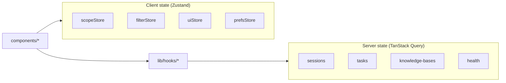

# State Management

Client state splits between **TanStack Query** (server cache) and **Zustand** (UI preferences + scope). No Redux.

---

## Architecture overview



---

## TanStack Query defaults

From `app/providers.tsx`:

| Option | Value | Rationale |
|--------|-------|-----------|
| `staleTime` | 30_000 ms | Reduce refetch churn on tab focus |
| `retry` | 1 | Fast failure for intranet API |
| `refetchOnWindowFocus` | false | Ops consoles often stay open |

---

## Query key catalogue

### Q&A / sessions (`useQA.ts`)

| Key | Hook | Invalidated by |
|-----|------|----------------|
| `["sessions", params?]` | `useSessions` | create/delete session |
| `["session", sessionId]` | `useSession` | update session |
| `["messages", sessionId, params?]` | `useMessages` | (manual fetch on select) |

`useQueryAction` / `useSearch` are **mutations** — no list cache by default.

`QAClient.handleSelectSession` uses `queryClient.fetchQuery` imperatively.

### Ingest (`useIngest.ts`)

| Key | Hook |
|-----|------|
| `["tasks", params]` | `useTasks` |
| `["task", jobId]` | `useTask` |
| `["ingest", "queue-metrics"]` | `useQueueMetrics` |

Mutations: ingest file/url, retry — invalidate `["tasks"]`.

### Knowledge bases (`useKB.ts`)

| Key | Hook |
|-----|------|
| `["knowledge-bases", params]` | `useKnowledgeBases` |
| `["knowledge-bases", "overview"]` | overview |
| `["knowledge-bases", kbName]` | detail |

### Documents & tags

| Key | Hook |
|-----|------|
| `["documents", params]` | `useDocuments` |
| `["tags", params]` | `useTags` |

### Health (`useHealth.ts`)

| Key | Hook |
|-----|------|
| `["health"]` | `useHealth` |
| `["admin", segment]` | admin dashboards |

### Cache isolation

Keys include `kb_name` / filter params where relevant — switching KB on ingest does not bleed cached task lists from another knowledge-base filter.

---

## Zustand stores

### `scopeStore.ts` — QA retrieval scope

**Persistence:** `localStorage` key `eagle-rag-scope`

```typescript
interface ScopeSelectionState {
  kbNames: ScopeRef[];
  documents: ScopeRef[];
  tags: ScopeRef[];
}
```

| Action | Effect |
|--------|--------|
| `setScope` | Replace all dimensions (drawer Apply, session hydrate) |
| `addDocument` | @-mention deduped add |
| `removeItem` | Chip dismiss |
| `clear` | New session |

**API bridge:**

```typescript
toScopeFilter(state)  // → ScopeSelection | null
toQueryScope(state)   // → { scope_filter, kb_name: null }
```

**Sessions API sync:** Backend persists `scope_filter` on each query; loading session hydrates store (see [Sessions API](../api/sessions.md)).

### `filterStore.ts` — ingest + facet filters

**Persistence:** `eagle-rag-filter`

| Slice | Used by |
|-------|---------|
| `taskFilter` | Ingest task table |
| `documentFilter` | QA `QueryFilters` facets |

Independent from scope union — facets **AND** with scope.

### `uiStore.ts` — ephemeral UI

**Not persisted** (default):

| Field | Purpose |
|-------|---------|
| `qaHistoryOpen` | History drawer |
| `qaLightboxImageId` | Image lightbox |

### `prefsStore.ts` — user preferences

Locale override, sidebar collapse, etc. (if enabled) — `eagle-rag-prefs`.

### Ingest KB picker

Target KB for ingest may live in `useKBStore` or component local state — **not** `scopeStore`. QA deliberately uses `toQueryScope` with `kb_name: null` to avoid silently scoping queries to ingest picker.

---

## When to use which

| Need | Tool |
|------|------|
| API list/detail | TanStack Query |
| Form draft in drawer | `useState` locally |
| Cross-page scope selection | Zustand `scopeStore` |
| Survive refresh | Zustand `persist` |
| Streaming message buffer | `useState` in `QAClient` |
| SSE subscription cleanup | `useRef` cancel handle |

---

## React 19 notes

- Zustand selectors: `useScopeStore((s) => s.kbNames)` — fine-grained re-render
- Avoid storing SSE partial tokens in Zustand — high churn; keep in component state

---

## Related documentation

- [Q&A module](qa-module.md) — SSE + scope
- [Sessions API](../api/sessions.md) — persistence contract
- [Ingest module](ingest-module.md) — task filters
