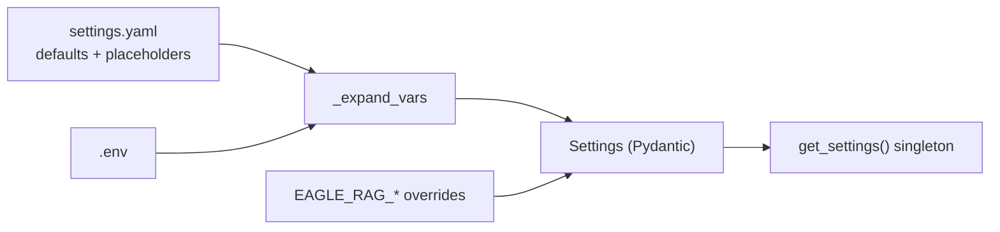

# Configuration

Eagle-RAG loads settings from three layers with clear precedence. Understanding this model helps you tune routing, queues, model endpoints, and Milvus indexes without hunting through code.

---

## Theory and foundations

### Why layered configuration?

Hard-coding URLs and API keys in Python makes deployments brittle. Production systems separate:

1. **Schema and defaults** — checked into version control
2. **Secrets** — never committed (`.env`, secret managers)
3. **Runtime overrides** — per-container or per-environment patches

This follows [12-factor app](https://12factor.net/config) config principles. Pydantic-settings provides type validation at load time — mis-typed `visual_index_type` fails fast instead of silently misconfiguring Milvus.

### Configuration vs code paths

Not every knob lives in YAML. **Behavioral** routing logic is in Python (`eagle_rag/ingest/router.py`, `eagle_rag/router/router_engine.py`); **data-driven** rules (extension lists, keyword heuristics) are in `settings.yaml` under `ingest` and `router.heuristic`.

---

## Eagle-RAG implementation

### The three layers



**Precedence** (lowest → highest):

1. `eagle_rag/settings.yaml` — `${VAR:-default}` placeholders
2. `.env` — values for those variables (loaded by Taskfile and Compose)
3. `EAGLE_RAG_*` — pydantic-settings overrides

### Load path in code

```python
# eagle_rag/config.py — simplified
@lru_cache(maxsize=1)
def get_settings() -> Settings:
    path = os.environ.get("EAGLE_RAG_SETTINGS_PATH", str(_DEFAULT_SETTINGS_PATH))
    data = _load_yaml(Path(path))  # _expand_vars resolves ${VAR:-default}
    return Settings(**data)          # EAGLE_RAG_* env vars override fields
```

`_expand_vars` iterates up to 10 times for nested placeholders. `Settings` uses `env_prefix="EAGLE_RAG_"` and `env_nested_delimiter="__"`.

**Example overrides:**

```bash
EAGLE_RAG_MILVUS__HOST=staging-milvus
EAGLE_RAG_ROUTER__MODE=text
EAGLE_RAG_CELERY__MAX_RETRIES=5
```

### Settings model map

Full pydantic models in `eagle_rag/config.py`. Abbreviated section reference:

| Section | Class | Primary consumers |
| --- | --- | --- |
| `app` | `AppSettings` | `eagle_rag/api/app.py` |
| `kb_name` | `str` | All API routers, tasks, Milvus filters |
| `milvus` | `MilvusSettings` | `milvus_text_store.py`, `milvus_visual_store.py` |
| `knowhere` | `KnowhereSettings` | `knowhere_adapter.py` |
| `pixelrag` | `PixelRAGSettings` | `pixelrag_adapter.py` |
| `pdf_probe` | `PdfProbeSettings` | `probe_pdf_form()` |
| `llm` / `vlm` | `LLMSettings`, `VLMSettings` | Router LLM, multimodal engine |
| `embedding` | `EmbeddingSettings` | Text + visual embed clients |
| `rerank` | `RerankSettings` | Post-retrieval rerank |
| `router` | `RouterSettings` | `route_query()`, scope limits |
| `celery` | `CelerySettings` | `celery_app.py`, `@with_retry` |
| `ingest` | `IngestSettings` | `route()`, `infer_source_type()` |
| `attachments` | `AttachmentsSettings` | `attachments/parser.py` |
| `mcp` | `McpSettings` | `mcp_http.py`, `mcp_server.py` |
| `telemetry` | `TelemetrySettings` | structlog, loguru, OTel |

---

## Settings sections (detailed)

### `milvus`

```yaml
milvus:
  host: ${MILVUS_HOST:-localhost}
  port: ${MILVUS_PORT:-19530}
  text_collection: eagle_text
  visual_collection: eagle_visual
  dim_text: 1536
  dim_visual: 2048
  visual_index_type: ${MILVUS_VISUAL_INDEX_TYPE:-hnsw}   # hnsw | diskann
```

**Code:** `ensure_collection()` reads `visual_index_type` → `_vector_index_params()`:

| Type | Milvus params | When |
| --- | --- | --- |
| `hnsw` | `M=16`, `efConstruction=256`, `metric_type=IP` | Default; fits in RAM |
| `diskann` | DiskANN build/search params | Visual corpus exceeds memory |

Text collection managed by LlamaIndex — index params in `milvus_text_store.py`.

### `knowhere`

```yaml
knowhere:
  base_url: ${KNOWHERE_BASE_URL:-http://localhost:5005}
  api_key: ${KNOWHERE_API_KEY:-}
  timeout: 60
  upload_timeout: 600
  max_retries: 5
  poll_interval: 10
  poll_timeout: 1800
  parsing_params:
    model: advanced
    ocr_enabled: true
```

Forwarded to `Knowhere(api_key, base_url).parse(file=..., parsing_params=...)`.

### `pixelrag`

```yaml
pixelrag:
  chunk_size: 1024
  tile_height: 8192        # Per-page tile height (px)
  quality: 85              # JPEG quality
  viewport_width: 875      # Render viewport — aligns to 28px patches
  backend: ${PIXELRAG_BACKEND:-cdp}   # cdp | playwright
  pdf_dpi: 200
  embed_device: ${PIXELRAG_EMBED_DEVICE:-auto}   # auto | cuda | mps | cpu
  embed_instruction: "Represent the user's input."
```

**`embed_instruction`:** Shared encoding instruction for Qwen3-VL-Embedding query and document vectors. **`embed_device`** applies only when `embedding.visual.provider=pixelrag`.

### `embedding.visual`

Core `eagle_visual` backend via `get_visual_encoder()`:

```yaml
embedding:
  visual:
    provider: ${VISUAL_EMBEDDING_PROVIDER:-pixelrag}   # pixelrag | dashscope
    model: ${VISUAL_EMBEDDING_MODEL:-Qwen/Qwen3-VL-Embedding-2B}
    api_key: ${DASHSCOPE_API_KEY:-}                    # dashscope path
    base_url: ${DASHSCOPE_API_BASE:-}                  # native DashScope API (not OpenAI-compat)
    dim: 2048
    batch_size: ${VISUAL_EMBEDDING_BATCH_SIZE:-5}
    timeout_s: ${VISUAL_EMBEDDING_TIMEOUT_S:-60}
    max_retries: ${VISUAL_EMBEDDING_MAX_RETRIES:-3}
```

| Provider | Backend | Notes |
| --- | --- | --- |
| `pixelrag` | `LocalQwen3VLEncoder` | Local HF weights; uses `pixelrag.embed_device` |
| `dashscope` | `DashScopeQwen3VLEncoder` | Bailian `qwen3-vl-embedding`; no local weights |

Ingest and query must share the same provider; switching backends requires rebuilding `eagle_visual`.

### `pdf_probe`

```yaml
pdf_probe:
  text_page_ratio: 0.2       # Fraction of pages with extractable text
  avg_chars_per_page: 50     # Mean chars threshold
```

Used by `probe_pdf_form()` — see [Routing matrix](../architecture/routing-matrix.md). Per-KB override: `knowledge_bases.pdf_text_page_ratio`.

### `router`

```yaml
router:
  mode: ${ROUTER_MODE:-auto}
  max_scope_documents: 500
  source_content_max_chars: 4000
  structure_max_nodes: 2000
  llm:
    enabled: true
    prompt_template: |-
      判断以下查询应使用哪种检索方式...
  heuristic:
    rules: [...]
    default: text
```

| Field | Purpose |
| --- | --- |
| `mode` | Query-time default: `auto` / `text` / `visual` / `hybrid` |
| `max_scope_documents` | Cap tag-resolved documents in Milvus `document_id in [...]` |
| `source_content_max_chars` | Truncate chunk body in `/search` and `/query` sources |
| `structure_max_nodes` | Cap `doc_nav` tree nodes persisted to `documents.extra` |
| `llm.enabled` | `false` → skip DeepSeek classification; use heuristics only |

### `celery`

```yaml
celery:
  broker_url: ${CELERY_BROKER_URL:-redis://localhost:6379/0}
  result_backend: ${CELERY_RESULT_BACKEND:-redis://localhost:6379/1}
  task_routes:
    eagle_rag.tasks.ingest_router: router_queue
    eagle_rag.tasks.knowhere_parse: knowhere_queue
    eagle_rag.tasks.pixelrag_build: pixelrag_queue
  queues:
    router_queue:   { concurrency: 4 }
    knowhere_queue: { concurrency: 8 }
    pixelrag_queue: { concurrency: 1 }
  max_retries: 3
  retry_backoff: 60
```

`@with_retry` reads `max_retries` and `retry_backoff` for exponential backoff: `countdown = retry_backoff * 2^retries`.

### `ingest.routing`

Drives `route()` selector chain:

```yaml
ingest:
  routing:
    prefix_force:
      "knowhere:": knowhere
      "pixelrag:": pixelrag
    knowhere_exts: [.docx, .doc, .md, ...]
    pixelrag_exts: [.png, .jpg, .html, ...]
    pdf_exts: [.pdf]
    content_type_rules: [...]
    default_pipeline: knowhere
  source_type:
    rules: []       # Core default empty; industry keywords via profile / deploy YAML
    default: other
```

### `plugins`

Single-domain instance binding + in-repo plugin loading:

```yaml
plugins:
  enabled:
    - eagle_rag.plugins.core_defaults
  default_namespace: core          # = Milvus DB / PG namespace
  allow_namespace_override: false  # prod: ignore request plugin_namespace
  query_assemble_enabled: true
  options:                         # per-namespace knobs (not Core-typed)
    biomed:
      default_dual_text_search: false
      exploratory_search_collections: []
      encoder_mode: ${EAGLE_BIOMED_ENCODER_MODE:-auto}  # auto | require_native | deterministic

# EAGLE_RAG_PROFILE=biomed|lakehouse-bi|core
profiles:
  biomed:
    plugins:
      enabled: [eagle_rag.plugins.core_defaults, plugins.biomed]
      default_namespace: biomed
    milvus:
      db_name: biomed
```

Authoring: copy `plugins/_template/`; see [Authoring an industry plugin](../guides/authoring-industry-plugin.md).

**Maturity:** `biomed` is **experimental**; `lakehouse-bi` is **under development**. Production default remains `core`.

**Deploy notes:**

- Set `EAGLE_RAG_PROFILE` on API and **all** Celery workers — mismatched profiles cause wrong Milvus Database or missing domain MCP tools.
- `milvus.db_name` in the active profile must match `plugins.default_namespace`.
- Vertical knobs belong in `plugins.options.<namespace>` — do not add industry fields to Core `Settings`.
- Probe after deploy: `GET /health/plugins` (manifests + `celery_modules`) and `GET /mcp/tools` (exposed tool names).

### `attachments`

Query-time only — **no Milvus write**:

```yaml
attachments:
  ttl_hours: 24
  parse:
    max_bytes: 10485760
    max_chunks: 50
    timeout_sec: 120
    cache_enabled: true
    chunk_size: 2000
```

Sidecar cache: `{path}.parsed.json` when `cache_enabled=true`.

### `mcp`

```yaml
mcp:
  transport: http              # stdio | http
  streamable_http_path: /mcp
  stateless_http: true
  tool_timeout: 30
  circuit_fail_threshold: 5
  cache_ttl: 300
  redis_url: ""                # falls back to celery.broker_url
```

### `telemetry`

```yaml
telemetry:
  enabled: true
  ai_log_file: logs/ai_telemetry.jsonl
  op_log_file: logs/eagle_rag.log
  tracing_enabled: false
  otlp_endpoint: ""
  plugin_audit_enabled: ${PLUGIN_AUDIT_ENABLED:-true}
  plugin_audit_ring_cap: 1000
  plugin_audit_redis_enabled: ${PLUGIN_AUDIT_REDIS_ENABLED:-true}
  plugin_audit_health_limit: 50
```

`TelemetryMiddleware` in `eagle_rag/api/app.py` — per-request SERVER spans when OTel enabled. PluginAudit sinks (AI JSONL + Redis recent window + memory ring + Prometheus) feed `GET /health/plugins` (`recent_decisions` / `audit_stats`).

---

## Router configuration (query-time)

The router decides **retrieval mode**, not ingest pipeline:

=== "`ROUTER_MODE=auto` (default)"

    When `router.llm.enabled=true`, DeepSeek classifies `text` / `visual` / `hybrid` using `router.llm.prompt_template`. On failure or when disabled, `router.heuristic.rules` apply (keyword → route).

=== "Forced modes"

    `text`, `visual`, or `hybrid` skip LLM classification. Useful for benchmarks or constrained agents.

Per-request override: `mode` on `POST /query` or MCP `core_query` tool.

**Ingest override (different knob):** `settings.router.mode` when not `auto` also forces ingest pipeline via `ForcedModeSelector` in `route()`.

---

## Configuration tensions

| Tension | Knob | Effect |
| --- | --- | --- |
| Settings cache | `@lru_cache` on `get_settings()` | Process ignores `.env` edits until restart |
| Ingest rules in YAML | `ingest.routing.*` | Typo can send extension to wrong pipeline at startup parse |
| Nested env overrides | `EAGLE_RAG_ROUTER__MODE` | Double-underscore nesting easy to mistype in K8s manifests |
| Query router without LLM key | `HeuristicSelector` fallback | Deterministic keyword rules — cheaper but coarser than `LLMIntentSelector` |
| Visual index type | `MILVUS_VISUAL_INDEX_TYPE` | `diskann` for billion-scale tiles; higher query latency than in-memory HNSW |

---

## Runtime overrides

```bash
# Force text-only routing for this process
EAGLE_RAG_ROUTER__MODE=text task be:api

# Alternative settings file
EAGLE_RAG_SETTINGS_PATH=/etc/eagle-rag/staging.yaml task be:api

# DiskANN for large visual corpus
MILVUS_VISUAL_INDEX_TYPE=diskann task up:prod
```

!!! tip "Cache invalidation"
    `get_settings()` is cached per process. After editing `.env`, restart API and workers. In tests: `get_settings.cache_clear()`.

---

## Failure modes and operations

| Misconfiguration | Symptom | Fix |
| --- | --- | --- |
| Wrong `MILVUS_HOST` in Compose | All queries return empty | Use service DNS `milvus`, not `localhost` |
| Unknown `embedding.visual.provider` | `get_visual_encoder()` raises `ValueError` | Use `pixelrag` or `dashscope`; keep ingest+query on the same provider (switch ⇒ rebuild `eagle_visual`) |
| `pixelrag_queue` concurrency > 1 | OOM kills worker | Reset to 1 in `settings.yaml` |
| `poll_timeout` too low | Large PDFs fail in `RENDERING` | Increase `knowhere.poll_timeout` |
| Missing `KNOWHERE_BASE_URL` in host dev | `KnowhereError` on ingest | Point to running Knowhere instance |
| Stale `get_settings()` in long worker | Old config after deploy | Restart workers after config change |

### Validating config at runtime

```bash
uv run python -c "
from eagle_rag.config import get_settings
s = get_settings()
print('kb:', s.kb_name)
print('milvus:', s.milvus.host, s.milvus.visual_index_type)
print('router:', s.router.mode)
"
```

---

## Adding new settings (contributors)

1. Add `${VAR:-default}` placeholder to `eagle_rag/settings.yaml`
2. Add pydantic field to appropriate `*Settings` class in `eagle_rag/config.py`
3. Read via `get_settings()` in application code — **not** `os.environ` directly
4. Document env var in `.env.example`

See [coding standards](../development/coding-standards.md).

---

## References

- [Pydantic Settings](https://docs.pydantic.dev/latest/concepts/pydantic_settings/)
- [Milvus index parameters](https://milvus.io/docs/index.md)
- [LlamaIndex configuration](https://docs.llamaindex.ai/)
- [Task queue](../backend/task-queue.md)
- Next: [deployment](deployment.md)
