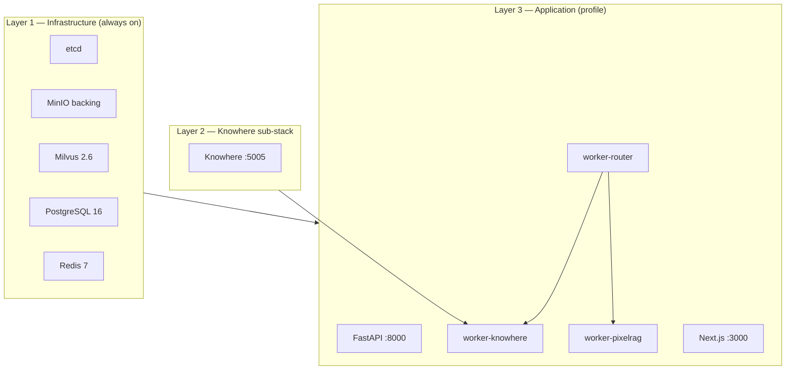

# Deployment

Bring Eagle-RAG up in development or production using Taskfile wrappers around Docker Compose.

---

## Theory and foundations

### Deployment topology for RAG systems

Production RAG has **heterogeneous resource profiles**:

| Component | CPU | Memory | GPU | Scaling axis |
| --- | --- | --- | --- | --- |
| FastAPI API | Low | Low | No | Horizontal (stateless) |
| `router_queue` | Medium | Low | No | Horizontal |
| `knowhere_queue` | Medium | Medium | No | Horizontal (I/O bound to Knowhere HTTP) |
| `pixelrag_queue` | High | **Very high** | Optional | **Vertical** — concurrency 1 |
| Milvus | Medium | High (HNSW) or disk (DiskANN) | No | Horizontal cluster |
| Knowhere | High | High | Often yes | Separate service |

[Gao et al., 2023](https://arxiv.org/abs/2312.10997) notes that ingest throughput and query latency often require **decoupled** worker pools — Eagle-RAG's three-queue Celery topology implements this.

### Stateful vs stateless tiers

| Tier | Stateful? | Backup concern |
| --- | --- | --- |
| PostgreSQL | Yes | `task db:migrate`; pg_dump |
| Milvus | Yes | etcd + MinIO backing data |
| MinIO | Yes | Object blobs — original files, tiles |
| Redis | Ephemeral | Broker only; task state in PostgreSQL audit |
| API / workers | No | Replace containers freely |

---

## Eagle-RAG implementation

### Deployment model

Eagle-RAG splits into three layers:



1. **Infrastructure** — etcd, MinIO (Milvus backing), Milvus, PostgreSQL, Redis (no Compose profile — always started)
2. **Knowhere sub-stack** — `docker/knowhere-self-hosted/` on shared `knowhere-net`
3. **Application** — API, three Celery workers, frontend (`dev` / `test` / `prod` profiles)

### Minimal sequence

```bash
task setup          # .env + uv sync + bun install
# edit .env — API keys and DB credentials
task up             # dev profile
task db:migrate     # alembic upgrade head — first run and after model changes
task health
```

`task up` execution order:

1. `knowhere:up` — creates `knowhere-net`, starts parser
2. `docker compose --profile dev up -d` — infra + app services

FastAPI lifespan: `get_combined_lifespan(mcp_app)` in `eagle_rag/api/app.py` — chains app startup with FastMCP `StreamableHTTPSessionManager` for `/mcp`.

---

## dev vs prod

| Aspect | `task up` (dev) | `task up:prod` |
| --- | --- | --- |
| Compose files | Base + auto-merged `docker-compose.override.yml` | `COMPOSE_FILE=docker-compose.yml` only |
| Frontend | Bun + `next dev` HMR in override | Multi-stage image, `next start` |
| Infra ports | Postgres, Redis, Milvus, MinIO exposed | Not exposed to host |
| Worker limits | Relaxed | Enforced (e.g. pixelrag worker 4 GB) |
| Hot reload | API `--reload`; workers need restart | Production images |
| Uvicorn workers | 1 with reload | Multiple workers |

!!! warning "Never use plain `docker compose up` in production"
    Auto-merged dev override would leak `--reload` and source mounts. Always use `task up:prod`.

```bash
task build:prod
task up:prod
```

---

## Host development (no app containers)

When you want Python/TypeScript hot reload on the host:

```bash
task dev            # parallel be:api + fe:dev

# Separate terminals — one queue each (recommended)
task be:worker QUEUES=router_queue CONCURRENCY=4
task be:worker QUEUES=knowhere_queue CONCURRENCY=8
task be:worker QUEUES=pixelrag_queue CONCURRENCY=1
```

Point `.env` at `localhost` for Milvus, Postgres, Redis, MinIO, and Knowhere.

**Lazy init benefit:** API starts without Milvus connection; first query/ingest triggers client construction.

---

## Port mapping (dev profile)

| Service | Host | Purpose |
| --- | --- | --- |
| api | 8000 | FastAPI REST + SSE + `/mcp` mount |
| frontend | 3000 | Next.js |
| docs | 8001 | MkDocs (`task docs:serve`) |
| postgres | 5432 | Metadata |
| redis | 6379 | Celery broker |
| minio | 9000 / 9001 | S3 API / console |
| milvus | 19530 / 9091 | gRPC / metrics |
| knowhere | 5005 | Parser HTTP API |
| mcp (standalone) | 8081 | Optional `MCP_STANDALONE=true` |

Prod exposes only **8000** and **3000** to the host.

Prometheus: `GET /metrics` on API — scraped for queue depth and dependency gauges.

---

## Database migration

Schema managed by Alembic + SQLModel (`alembic/versions/`):

```bash
task db:migrate     # uv run alembic upgrade head
```

Run before first use and after pulls touching `eagle_rag/db/models/`.

!!! note "No DDL in repositories"
    All schema changes go through Alembic revisions — never raw DDL in `eagle_rag/db/repositories/`.

Milvus schema: `ensure_collection()` in `milvus_visual_store.py` — idempotent create + `add_collection_field` migrations for new scalar fields.

---

## Celery worker deployment

| Queue | Task names | Concurrency | Memory note |
| --- | --- | --- | --- |
| `router_queue` | `eagle_rag.tasks.ingest_router` | 4 | Light — route + dispatch |
| `knowhere_queue` | `eagle_rag.tasks.knowhere_parse` | 8 | HTTP I/O to Knowhere |
| `pixelrag_queue` | `pixelrag_build`, `knowhere_visual_chunks` | **1** | Chromium + Qwen3-VL encoder |

Celery app config (`eagle_rag/tasks/celery_app.py`):

- `task_acks_late=True`
- `worker_prefetch_multiplier=1`
- `task_reject_on_worker_lost=True`
- Hard time limit 3600s (soft 3300s)

Beat job (if enabled): samples queue `LLEN` every 30s → `metric_sample` table.

---

## Deployment tensions

| Tension | Setting | Guidance |
| --- | --- | --- |
| Dev vs prod compose merge | `COMPOSE_FILE` | Lock `docker-compose.yml` only in prod — override adds `--reload` and host mounts |
| Visual worker memory | `worker-pixelrag` 4g limit | OOM during `embed_tiles` on large PDFs — reduce tile count via `tile_height` or split documents |
| At-least-once ingest | `acks_late`, `prefetch_multiplier=1` | Retries may duplicate Milvus upserts — IDs must stay deterministic |
| MCP on API port | `/mcp` on `:8000` | Single ingress for agents; isolate with network policy if API is multi-tenant |
| Index vs registry | Best-effort Milvus on ingest | After disaster recovery, reconcile Postgres `documents` with Milvus entity counts |

---

## Configuration for deployment

| Env var | Dev typical | Prod typical |
| --- | --- | --- |
| `APP_ENV` | `dev` | `prod` |
| `EAGLE_RAG_PROFILE` | `core` (default) | `core`, `biomed`, or `lakehouse-bi` — one domain per instance |
| `PLUGIN_NAMESPACE` | matches profile | Same as `plugins.default_namespace` in active profile |
| `MILVUS_HOST` | `milvus` | `milvus` |
| `MILVUS_VISUAL_INDEX_TYPE` | `hnsw` | `diskann` if corpus large |
| `TELEMETRY_ENABLED` | `true` | `true` |
| `OTEL_TRACING_ENABLED` | `false` | `true` with `OTEL_EXPORTER_OTLP_ENDPOINT` |
| `AUTH_ENABLED` | `false` | `true` if edge-exposed |

### Single-domain deployment

Each API + worker fleet binds **one** `plugin_namespace` (= Milvus Database). Multi-industry production means **multiple instances** with different `EAGLE_RAG_PROFILE` values — not runtime domain switching in Core. See [ADR-002](../architecture/adr/002-single-domain-deployment.md).

See [configuration](configuration.md) for full schema.

---

## Health and logs

```bash
task health
task knowhere:health
task ps

task logs:api
task logs:worker SERVICE=worker-knowhere
task logs:worker SERVICE=worker-pixelrag
task logs              # all services, follow
```

`/health` probes (3s timeout each, isolated):

- PostgreSQL
- Redis
- Milvus
- MinIO
- Knowhere HTTP
- PixelRAG ( `unknown` if not configured)

Knowhere `down` degrades text parsing; API process still starts.

SSE log streaming: Redis pub/sub channel `logs` (config: `telemetry.redis_log_channel`). Redis down → in-memory `asyncio.Queue` fallback.

---

## Failure modes and operations

| Incident | Detection | Response |
| --- | --- | --- |
| `pixelrag_queue` backlog | Admin queue metrics; LLEN growth | Do not raise concurrency; add RAM or second worker host |
| Milvus OOM (HNSW) | Milvus pod restart | Switch to `diskann`; prune old KBs |
| Worker lost mid-task | `task_reject_on_worker_lost` requeues | Check logs; replay from dead letter |
| Migration failure on deploy | `task db:migrate` exit ≠ 0 | Fix Alembic conflict before traffic |
| Knowhere net split | `knowhere:health` fails | `task knowhere:up`; verify `knowhere-net` |
| Disk full on MinIO | Ingest upload fails | Expand volume; lifecycle old attachments |

### Operator checklist

- [ ] `task db:migrate` after every deploy with model changes
- [ ] Verify `/health` all critical deps `up` before traffic shift
- [ ] Monitor `pixelrag_queue` depth
- [ ] Backup PostgreSQL + MinIO — see [ops/backup-restore](../ops/backup-restore.md)
- [ ] Drain dead letter after root-cause fix

### Production build commands

```bash
task build:prod
task up:prod
task down              # stop
task clean             # down -v — deletes volumes (destructive)
```

| Command | Description |
| --- | --- |
| `task setup` | Bootstrap dependencies |
| `task up` / `up:prod` / `down` | Start / prod start / stop |
| `task dev` | Host hot reload |
| `task be:api` / `be:worker` | API / parameterized worker |
| `task be:test` / `be:lint` / `be:typecheck` | Quality gates |
| `task db:migrate` | Apply migrations |
| `task health` | API probe |

---

## References

- [Milvus production guide](https://milvus.io/docs/install-overview.md)
- [Celery best practices](https://docs.celeryq.dev/en/stable/userguide/tasks.html)
- [Docker Compose profiles](https://docs.docker.com/compose/profiles/)
- Configuration: [configuration](configuration.md)
- Container topology: [ops/docker](../ops/docker.md)
- Reliability: [architecture/reliability](../architecture/reliability.md)
