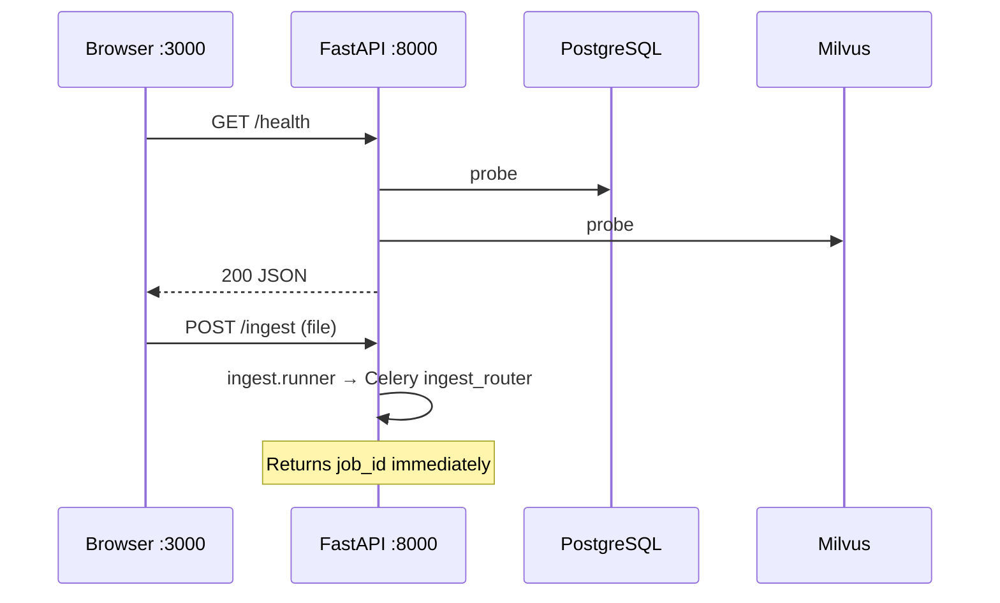
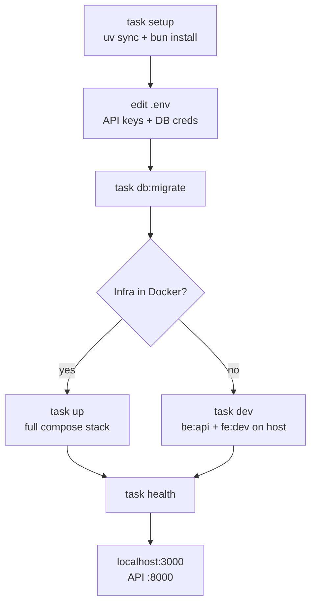

# Quick start

Get Eagle-RAG running locally in about three minutes. This guide is the shortest path from zero to a working stack; deeper theory lives in [Architecture](../architecture/index.md) and the [learning path](../learning-path.md).

---

## Theory and foundations

### What you are starting

Eagle-RAG is a **multimodal RAG data layer** — not a chat wrapper around a single LLM. It implements the retrieve-then-generate pattern from [Lewis et al., 2020](https://arxiv.org/abs/2005.11401) with two vector indexes (text 1536-d, visual 2048-d) and dual ingest pipelines.

| Tier | Role | Technology |
| --- | --- | --- |
| Client | QA, ingest, health UI | Next.js 16 + React 19 |
| API | REST, SSE, MCP | FastAPI on `:8000` |
| Workers | Async ingest | Celery — 3 queues |
| Parsers | Document → chunks | Knowhere HTTP `:5005` + PixelRAG library |
| Storage | Vectors + metadata + files | Milvus, PostgreSQL, MinIO, Redis |

A single `Taskfile.yml` orchestrates setup; `docker-compose.yml` bundles infrastructure when you prefer containers.

---

## Eagle-RAG implementation

### Bootstrap sequence

`task setup` performs:

1. Copy `.env.example` → `.env` (without overwriting existing)
2. `uv sync` — Python dependencies from `pyproject.toml`
3. `bun install` in `frontend/`

`task up` then:

1. `knowhere:up` — self-hosted Knowhere on `knowhere-net`
2. `docker compose --profile dev up -d` — infra + API + workers + frontend
3. Services wire via Compose DNS (`milvus`, `postgres`, `redis`, `minio`, `knowhere`)

### First-request path



Configuration singleton: `get_settings()` in `eagle_rag/config.py` — loaded once per process via `@lru_cache`.

---

## Local development modes

| Mode | When to use | Practical note |
| --- | --- | --- |
| `task up` (Docker) | First-time bring-up, demo, CI-like parity | Worker code changes need container restart unless bind-mounted |
| `task dev` (host API + frontend) | Fast API/`--reload` iteration | You run Milvus, Postgres, Redis, MinIO, Knowhere yourself |
| Idempotent `task setup` | Fresh clone | Does not overwrite existing `.env` — merge new keys manually |

Auth is off by default — acceptable on localhost; enable `auth.enabled` before any non-trusted network exposure.

---

## Prerequisites (one-liner)

```bash
python3.12 --version && uv --version && bun --version && docker compose version
```

If any command fails, install the missing tool:

- **Python ≥ 3.12** + [`uv`](https://docs.astral.sh/uv/) — backend dependencies
- **Node.js + [Bun](https://bun.sh/)** — frontend
- **Docker + Docker Compose** — full-stack bring-up

See [installation](installation.md) for the full matrix.

---

## The 3-minute path

```bash
# 1. Bootstrap: copy .env, install dependencies
task setup

# 2. Edit .env — set API keys and database credentials
$EDITOR .env

# 3a. Full stack in Docker (recommended)
task up
task db:migrate    # first run only

# 3b. OR hot-reload on host (you start infra yourself)
task dev
```

After `task up`, open:

| Service | URL |
| --- | --- |
| Frontend | <http://localhost:3000> |
| API | <http://localhost:8000/health> |
| API docs | <http://localhost:8000/docs> |
| MkDocs | <http://localhost:8001> (`task docs:serve`) |

!!! warning "API keys required"
    Set at minimum `LLM_API_KEY`, `VLM_API_KEY`, and `DASHSCOPE_API_KEY` before querying. See [installation — Model API keys](installation.md#model-api-keys).

---

## Configuration (minimal)

| Variable | Purpose |
| --- | --- |
| `KB_NAME` | Default tenant (`default`) |
| `LLM_API_KEY` | DeepSeek routing + text |
| `VLM_API_KEY` | Qwen-VL generation |
| `DASHSCOPE_API_KEY` | Text embedding + rerank |
| `KNOWHERE_BASE_URL` | Parser service (`http://localhost:5005` on host) |

Full layering: [configuration](configuration.md).

---

## Verify it works

```bash
task health              # API /health JSON
task knowhere:health     # Knowhere parser at :5005
task ps                  # docker compose ps — services healthy
```

Expected `/health` shape: per-dependency status (`up` / `down` / `unknown`). A single dependency reporting `down` **degrades** that feature rather than crashing the API — by design. See [Reliability](../architecture/reliability.md).

### Smoke-test ingest + query

```bash
# Upload via API (replace with your file)
curl -F "file=@README.md" -F "kb_name=default" http://localhost:8000/ingest

# Poll task status, then query
curl -s http://localhost:8000/query -H 'Content-Type: application/json' \
  -d '{"query":"What is Eagle-RAG?","kb_name":"default"}' | jq .answer
```

---

## Failure modes and operations

| Symptom | Likely cause | Fix |
| --- | --- | --- |
| `task up` fails on Knowhere | Missing `docker/knowhere-self-hosted/.env` | Copy example env; set `DS_KEY` |
| `/health` shows milvus `down` | Milvus still starting (~60s) | Wait; `task ps` |
| Query returns API error | Missing `LLM_API_KEY` / `VLM_API_KEY` | Edit `.env`; restart API |
| Ingest task `FAILED` | Knowhere unreachable | `task knowhere:health` |
| Frontend cannot reach API | Wrong `NEXT_PUBLIC_API_URL` | Set to `http://localhost:8000` |

---

## Dev workflow



=== "Docker (`task up`)"

    Infrastructure, API, workers, and frontend HMR run in Compose. Worker code reload requires container restart.

=== "Host (`task dev`)"

    Uvicorn and Next.js hot-reload on the host. You must run Milvus, PostgreSQL, Redis, MinIO, and Knowhere separately and point `.env` at `localhost`.

!!! note "Knowhere is external to the Python package"
    Knowhere (`Ontos-AI/knowhere`, HTTP `:5005`) is bundled in the Compose stack as a self-hosted service. For `task dev`, set `KNOWHERE_BASE_URL` to your running instance and probe with `task knowhere:health`.

### Worker processes (host dev)

```bash
task be:worker QUEUES=router_queue CONCURRENCY=4
task be:worker QUEUES=knowhere_queue CONCURRENCY=8
task be:worker QUEUES=pixelrag_queue CONCURRENCY=1   # keep at 1
```

---

## Where to go next

| Goal | Doc |
| --- | --- |
| Full install matrix | [Installation](installation.md) |
| Settings deep dive | [Configuration](configuration.md) |
| Dev vs prod deploy | [Deployment](deployment.md) |
| System design | [Architecture overview](../architecture/index.md) |
| RAG theory path | [Learning path](../learning-path.md) |

---

## References

- [Lewis et al., 2020](https://arxiv.org/abs/2005.11401) — RAG foundation
- [Knowhere](https://github.com/Ontos-AI/knowhere) — parser service
- [uv documentation](https://docs.astral.sh/uv/)
- [Taskfile](https://taskfile.dev/) — project automation
