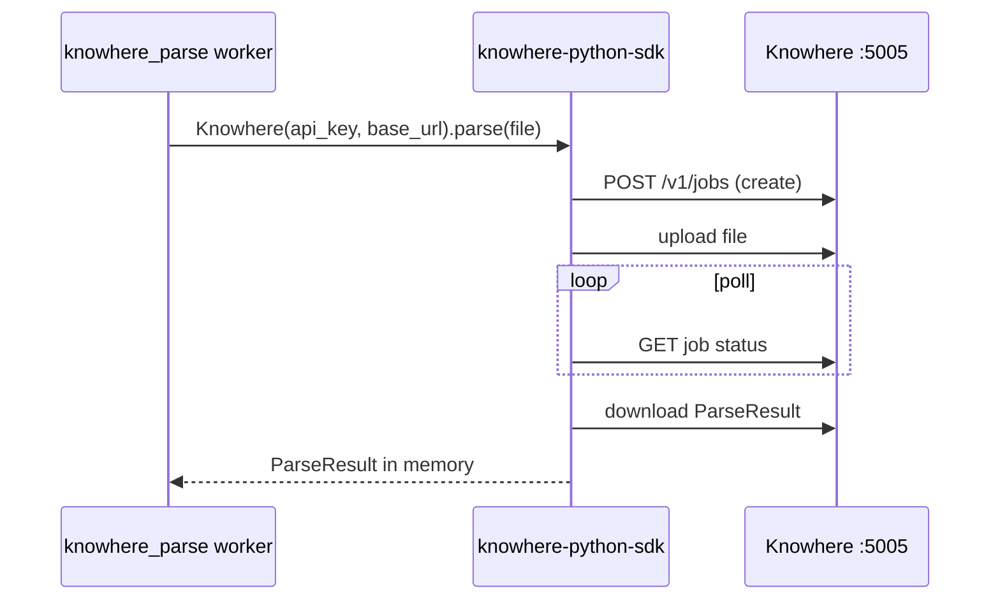

# Installation

Install host tools, Python dependencies, frontend packages, and model API keys before running Eagle-RAG.

!!! tip "Fast path"
    `task setup` performs most steps below automatically. This page explains what that command does and the theory behind each dependency.

---

## Theory and foundations

### Why these dependencies exist

Eagle-RAG is a **distributed RAG system**, not a single Python package:

| Component | CS/ML role | Why separate from the API process |
| --- | --- | --- |
| **Milvus** | ANN index ([HNSW](https://arxiv.org/abs/1603.09320) / [DiskANN](https://papers.nips.cc/paper/2019/hash/09853c7ff1cb93b59a86b8e886786b9b-Abstract.html)) | Vector search at scale; scalar filters for multi-tenancy |
| **PostgreSQL** | ACID metadata, dedup, sessions | Relational integrity for `(sha256, kb_name)` and task audit |
| **Redis** | Message broker | Celery task distribution; optional SSE log fanout |
| **MinIO** | Object storage | Original files, visual chunk blobs, tile PNGs |
| **Knowhere** | Document parser | Heavy layout/OCR models — isolated HTTP service |
| **PixelRAG** | Visual render + embed | In-process library; GPU memory isolated to `pixelrag_queue` worker |

[Gao et al., 2023](https://arxiv.org/abs/2312.10997) surveys how production RAG stacks combine these layers.

---

## Prerequisites

| Dependency | Version | Purpose |
| --- | --- | --- |
| Python | ≥ 3.12 | Backend runtime; [`uv`](https://docs.astral.sh/uv/) for packages |
| Node.js + Bun | latest | Frontend (`bun install`) |
| Docker + Compose | latest | One-command full stack |
| Milvus | 2.6+ | `eagle_text` (1536-d) + `eagle_visual` (2048-d) |
| PostgreSQL | 16 | Sessions, dedup, task audit |
| Redis | 7 | Celery broker and result backend |
| MinIO | latest | Object storage |

Milvus, PostgreSQL, Redis, and MinIO are declared in `docker-compose.yml` — host installs are optional when using `task up`. Versions matter for `task dev` with self-managed infra.

!!! tip "Install uv and Bun"
    ```bash
    curl -LsSf https://astral.sh/uv/install.sh | sh
    curl -fsSL https://bun.sh/install | bash
    ```

---

## Eagle-RAG implementation

### Backend install (`uv sync`)

Dependencies in `pyproject.toml`:

| Command | Installs | When |
| --- | --- | --- |
| `uv sync` | FastAPI, Celery, LlamaIndex, Milvus client, DashScope, `pixelrag_render` / `pixelrag_embed`, `knowhere-python-sdk` | Always |
| `uv sync --group dev` | pytest, ruff, mypy | Tests and lint |
| `uv sync --extra docs` | MkDocs Material | Local doc site |

```bash
uv sync                  # core (required)
uv sync --group dev      # optional: tests/lint
uv sync --extra docs     # optional: docs
```

**Key packages and code paths:**

| Package | Eagle-RAG usage |
| --- | --- |
| `llama-index-vector-stores-milvus` | `eagle_rag/index/milvus_text_store.py` |
| `pymilvus` | `eagle_rag/index/milvus_visual_store.py` |
| `knowhere` (SDK) | `parse_with_knowhere_sdk()` |
| `pixelrag_render`, `pixelrag_embed` | `eagle_rag/ingest/pixelrag_adapter.py` |

### Frontend install

```bash
cd frontend
bun install
```

Stack: Next.js 16 (App Router), React 19, HeroUI v3, Tailwind v4, TanStack Query, Zustand, `next-intl`.

OpenAPI SDK under `frontend/lib/api/generated/` regenerates via `predev` hook (`bun run api:gen`).

### Database schema

```bash
task db:migrate    # uv run alembic upgrade head
```

Schema defined in `eagle_rag/db/models/` — **no DDL in store modules**. Migrations in `alembic/versions/`.

---

## Model API keys {#model-api-keys}

Eagle-RAG uses **DeepSeek + Qwen only** — no OpenAI or Cohere adapters.

| Purpose | Model | Environment variables | Code consumer |
| --- | --- | --- | --- |
| Text LLM / routing | DeepSeek-V4-Pro | `LLM_API_KEY`, `LLM_BASE_URL`, `LLM_MODEL` | `route_query()`, generation |
| VLM (image reading) | Qwen-VL-Max | `VLM_API_KEY`, `VLM_BASE_URL`, `VLM_MODEL` | `EagleMultimodalQueryEngine` |
| Text embedding (1536-d) | `text-embedding-v4` | `DASHSCOPE_API_KEY`, `TEXT_EMBEDDING_MODEL` | `upsert_text_nodes()` |
| Text rerank | `qwen3-rerank` | `DASHSCOPE_API_KEY`, `RERANK_TEXT_MODEL` | Rerank step in generation |
| Visual embedding (2048-d) | Qwen3-VL-Embedding-2B | Local via PixelRAG — no API key | `_Qwen3VLVisualEncoder` |

`DASHSCOPE_API_KEY` is shared by embedding and rerank clients. Compatible-mode base URL: `https://dashscope.aliyuncs.com/compatible-mode/v1`.

!!! warning "Vendor policy"
    New models must integrate via LlamaIndex packages. See [contributing](../development/contributing.md).

---

## External services

### Knowhere (`:5005`)

Document semantic parser — [Ontos-AI/knowhere](https://github.com/Ontos-AI/knowhere).

**Integration flow:**



- Default: `KNOWHERE_BASE_URL=http://localhost:5005`
- SDK unreachable → `KnowhereError`, task `FAILED` — **no mock fallback**
- Self-hosted stack: `docker/knowhere-self-hosted/` with own `.env` (`DS_KEY`, `ALI_API_KEYS`)

**Poll settings** (`settings.yaml` → `knowhere`):

| Key | Default | Meaning |
| --- | --- | --- |
| `poll_interval` | 10s | Status poll cadence |
| `poll_timeout` | 1800s | Max wait for parse completion |
| `upload_timeout` | 600s | Large file upload limit |

### PixelRAG library

In-process `pixelrag_render` + `pixelrag_embed`.

- **`pixelrag-serve` and FAISS are not used** — visual vectors go to Milvus HNSW/DiskANN
- Lazy import in `pixelrag_adapter.py` — fail-fast if missing
- `embedding.visual.provider` must be `"pixelrag"` or `_ensure_loaded()` raises

!!! note "PixelRAG is a core dependency"
    On `linux/aarch64`, transitive `cef-capi-py` is skipped via uv overrides; functionality unaffected.

---

## Install-time notes

| Topic | Detail |
| --- | --- |
| Lazy visual encoder | `_Qwen3VLVisualEncoder` loads on first `embed_tiles` — API container starts without GPU; first pixelrag task pays model load |
| Knowhere poll window | SDK blocks up to `knowhere.poll_timeout` (default 1800s) inside worker — not API timeout |
| Embedding provider lock | `embedding.visual.provider` must be `pixelrag` — mismatched third-party visual APIs change vector geometry and break Milvus index |
| Chrome in worker image | HTML table render uses headless browser in `Dockerfile.worker` — required for Knowhere table chunks |

---

## `.env` configuration

`task setup` copies `.env.example` → `.env`. Variables map to `${VAR:-default}` in `eagle_rag/settings.yaml`.

| Section | Key variables | Notes |
| --- | --- | --- |
| App | `APP_ENV`, `APP_HOST`, `APP_PORT`, `LOG_LEVEL` | |
| KB | `KB_NAME` | Default tenant |
| Knowhere | `KNOWHERE_BASE_URL`, `KNOWHERE_API_KEY` | Parser service |
| LLM | `LLM_API_KEY`, `LLM_BASE_URL`, `LLM_MODEL` | DeepSeek |
| VLM | `VLM_API_KEY`, `VLM_BASE_URL`, `VLM_MODEL` | Qwen-VL |
| DashScope | `DASHSCOPE_API_KEY`, `TEXT_EMBEDDING_MODEL`, `RERANK_TEXT_MODEL` | Embed + rerank |
| Milvus | `MILVUS_HOST`, `MILVUS_PORT`, `MILVUS_VISUAL_INDEX_TYPE` | `hnsw` or `diskann` |
| Redis | `CELERY_BROKER_URL`, `CELERY_RESULT_BACKEND` | DB 0 / DB 1 |
| MinIO | `MINIO_ENDPOINT`, `MINIO_ACCESS_KEY`, `MINIO_SECRET_KEY` | Object storage |
| Postgres | `POSTGRES_DSN`, `POSTGRES_*` | Metadata |
| Router | `ROUTER_MODE` | `auto` / `text` / `visual` / `hybrid` |
| Frontend | `NEXT_PUBLIC_API_URL` | Browser → API URL |

Override path for alternate config file:

```bash
EAGLE_RAG_SETTINGS_PATH=/path/to/staging.yaml task be:api
```

---

## Container vs host service names

`settings.yaml` defaults use `localhost`. Inside Compose, use service DNS:

| Service | Docker (`.env`) | Host (`task dev`) |
| --- | --- | --- |
| Milvus | `MILVUS_HOST=milvus` | `localhost` |
| Redis | `redis://redis:6379/0` | `redis://localhost:6379/0` |
| MinIO | `minio:9000` | `localhost:9000` |
| Postgres | `postgres:5432` | `localhost:5432` |
| Knowhere | `http://knowhere:5005` | `http://localhost:5005` |

---

## Failure modes and operations

| Failure | Behavior | Resolution |
| --- | --- | --- |
| `uv sync` fails on PixelRAG | Platform-specific wheel missing | Check `pyproject.toml` overrides; use Docker |
| Knowhere health fails | Sub-stack not started | `task knowhere:up`; check `docker/knowhere-self-hosted/.env` |
| Milvus connection refused | Service still booting | Wait ~60s after `task up` |
| `alembic upgrade` fails | Schema drift | Pull latest; check migration conflicts |
| Missing API keys | Query/generation errors at runtime | Set keys in `.env`; restart processes |
| Visual embed OOM | Worker killed | `pixelrag_queue` concurrency = 1 only |

### Verification commands

```bash
uv run python -c "from eagle_rag.config import get_settings; print(get_settings().kb_name)"
task health
task knowhere:health
uv run pytest tests/test_ingest_smoke.py -q   # after dev install
```

---

## References

- [uv documentation](https://docs.astral.sh/uv/)
- [Milvus install overview](https://milvus.io/docs/install-overview.md)
- [Knowhere repository](https://github.com/Ontos-AI/knowhere)
- [PixelRAG repository](https://github.com/StarTrail-org/PixelRAG)
- [LlamaIndex installation](https://docs.llamaindex.ai/en/stable/getting_started/installation/)
- Next: [configuration](configuration.md) or [deployment](deployment.md)
