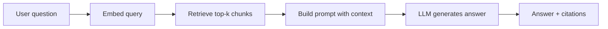
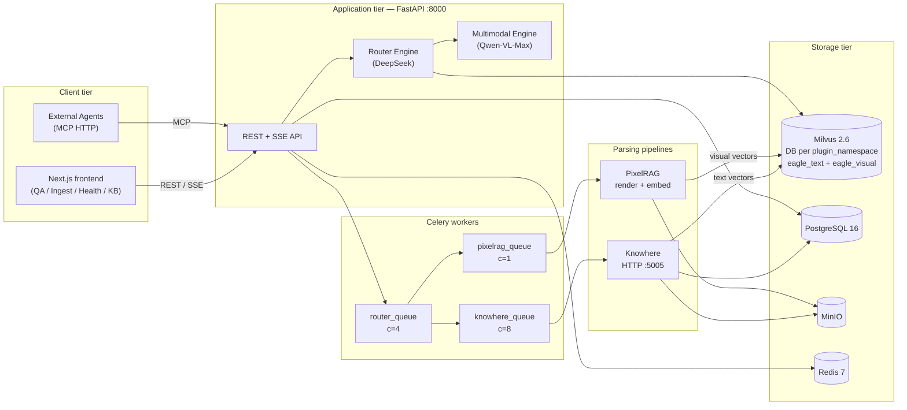

# Eagle-RAG

> An industry-agnostic, multi-tenant **multimodal Retrieval-Augmented Generation (RAG)** knowledge base — the **data layer** for Agents and LLMs (not a business Agent app).

!!! important "Product boundary"
    Eagle-RAG owns ingest, retrieval, context assembly, and provenance, exposed over REST/SSE/MCP to downstream Agents. The built-in frontend showcases **Core** knowhere + pixelrag only; domain plugins (biomed, lakehouse-bi, …) are **backend MCP only**. See [ADR-008](architecture/adr/008-rag-only-plugin-platform.md) and [plugin architecture](architecture/plugin-architecture.md).

## Theory and foundations

### Why RAG exists

Large language models (LLMs) answer from **parametric memory** — weights frozen at training time. They cannot cite your internal documents, update when policies change, or scope answers to a tenant's knowledge base without fine-tuning.

**Retrieval-Augmented Generation (RAG)** inserts a retrieval step before generation:



The canonical formulation is [Lewis et al., 2020](https://arxiv.org/abs/2005.11401) (*Retrieval-Augmented Generation for Knowledge-Intensive NLP Tasks*). Lewis et al. show that conditioning generation on retrieved passages from a dense vector index reduces hallucination on knowledge-intensive tasks and allows updating knowledge without retraining the LLM.

[Gao et al., 2023](https://arxiv.org/abs/2312.10997) (*Retrieval-Augmented Generation for Large Language Models: A Survey*) categorizes the full RAG stack: chunking strategies, embedding models, retrievers (sparse, dense, hybrid), rerankers, and generation policies. Eagle-RAG implements a **multimodal** variant of this stack with dual dense indexes and query-time routing.

### Why multimodal RAG

Text embeddings compress layout-sensitive content — charts, tables, diagrams — into short summaries. [Chen et al., 2022 — MuRAG](https://arxiv.org/abs/2210.02928) demonstrates that retrieving **both** text passages and visual evidence improves QA over documents where answers live in figures or table structure. Eagle-RAG's **semantic-tree anchored fusion** (see [Multimodal fusion](architecture/multimodal-fusion.md)) extends this idea: visual tiles are indexed in a separate vector space but linked back to Knowhere section paths for scoped retrieval and VLM prompting.

### Why approximate nearest neighbor (ANN)

Exact k-nearest-neighbor search in high dimensions is O(n) per query. Production RAG uses **ANN indexes** — [HNSW](https://arxiv.org/abs/1603.09320) (Malkov & Yashunin, 2016) builds a hierarchical navigable small-world graph for sub-linear search; [DiskANN](https://papers.nips.cc/paper/2019/hash/09853c7ff1cb93b59a86b8e886786b9b-Abstract.html) (Subramanya et al., NeurIPS 2019) extends graph search to disk for billion-scale corpora. Eagle-RAG stores vectors in [Milvus 2.6](https://milvus.io/docs) with HNSW (default) or DiskANN on `eagle_visual`, plus inverted scalar indexes for `kb_name` and fusion anchor fields.

---

## Eagle-RAG at a glance

Eagle-RAG extends classic text RAG in three ways that matter for real enterprise documents:

| Challenge | Eagle-RAG response | Primary code |
| --- | --- | --- |
| Mixed formats (PDF, Excel, images, URLs) | Dual ingest pipelines: Knowhere (text/structure) + PixelRAG (scanned/visual) | `eagle_rag/ingest/router.py` `route()` |
| Charts, tables, diagrams lose detail in text | Semantic-tree anchored fusion — visual tiles linked to Knowhere `path` | `extract_visual_chunks()` → `upsert_visual()` |
| Multiple teams / domains on one cluster | `plugin_namespace` (Milvus Database) + `kb_name` scalar filters inside that DB | `resolve_namespace()`, repositories, `milvus_pool.py` |

!!! note "Further reading"
    New to RAG? Start with the [learning path](learning-path.md). For fusion design, see [Multimodal fusion](architecture/multimodal-fusion.md).

---

## Key capabilities

- :octicons-git-branch-24: **Dual ingestion pipelines** — Knowhere (HTTP `:5005`, `knowhere-python-sdk`) for text-based PDFs, Office, CSV, Markdown; PixelRAG (`pixelrag_render` + `pixelrag_embed`) for scanned PDFs, images, and web pages.
- :octicons-organization-24: **Multi-tenancy** — two layers: `plugin_namespace` (domain / Milvus Database) and `kb_name` (KB inside that domain); dedup `(sha256, kb_name, plugin_namespace)`.
- :octicons-search-24: **Hybrid retrieval** — Milvus ANN on `eagle_text` (1536-d) and `eagle_visual` (2048-d), graph expansion on text nodes via `connect_to`, scalar filters on `kb_name` / `document_id` / tags.
- :octicons-eye-24: **Multimodal generation** — DeepSeek routes queries; Qwen-VL-Max synthesizes over text chunks and image tiles; `qwen3-rerank` / `qwen3-rerank` reranks.
- :octicons-plug-24: **MCP tool server** — `core_ingest`, `core_query`, `core_retrieve_text`, `core_retrieve_visual` at `/mcp` ([Model Context Protocol](https://modelcontextprotocol.io/)); domain profiles add `{namespace}_*` tools.
- :octicons-puzzle-24: **Microkernel plugins** — Core + in-repo vertical plugins; `EAGLE_RAG_PROFILE` selects the deploy domain; see [Authoring an industry plugin](guides/authoring-industry-plugin.md).
- :octicons-pulse-24: **Observable operations** — dependency probes, SSE log streaming, queue metrics, admin dashboards.

---

## System architecture



### Control flow summary

| Phase | Entry point | Key functions |
| --- | --- | --- |
| Ingest | `POST /ingest` → `ingest.runner` | `route()` → `ingest_router` → `knowhere_parse` / `pixelrag_build` |
| Query | `POST /query` → `EagleRouterQueryEngine` | `route_query()` → `_fetch_nodes()` → `EagleMultimodalQueryEngine.custom_query()` |
| Agent | `POST /mcp` → FastMCP tools | `mcp_server.py` → same engines as REST |

Infrastructure: Milvus (etcd + MinIO backing) · PostgreSQL (sessions, dedup, audit) · Redis (Celery broker) · MinIO (original files and tile PNGs).

---

## Design tensions and tuning

These are the parameters that actually move retrieval quality, latency, and consistency in production — not inventory comparisons of stack components.

| Tension | Knob | Effect when raised | Effect when lowered |
| --- | --- | --- | --- |
| Recall vs ANN latency | Milvus HNSW `ef` (search, default 64) | Better recall on visual/text ANN | Faster queries, more missed neighbors |
| Candidate breadth vs rerank cost | `top_k` (retrieval) vs `top_n` (qwen3-rerank) | More context for VLM; higher DashScope bill | Cheaper; risk empty or off-topic context |
| Ingest routing precision | `pdf_probe.text_page_ratio`, `avg_chars_per_page` | Fewer scanned PDFs misrouted to Knowhere | More text PDFs sent to PixelRAG (slower, layout-aware) |
| Visual index granularity | `pixelrag.tile_height` | Finer tiles; better small-figure recall | Fewer vectors per page; lower ingest cost |
| Scope breadth vs Milvus expr cost | `router.max_scope_documents` (tag → doc union) | Wider multi-doc QA | Smaller `document_id in [...]` predicates |
| Index completeness vs time-to-ready | Non-blocking `dispatch_visual_chunks` | Document `ready` while text is searchable | Visual answers lag or miss until `knowhere_visual_chunks` finishes |
| Registry vs vector consistency | Best-effort `upsert_text_nodes` on ingest failure | Ingest audit reaches `SUCCESS`; ops can re-index | Stricter fail would block dedup short-circuit semantics |

Cross-links: [retrieval](../backend/retrieval.md) (DPR + graph expansion + rerank chain), [multimodal fusion](architecture/multimodal-fusion.md) (pooling + tile geometry), [routing matrix](architecture/routing-matrix.md) (PDF probe math).

---

## Configuration

Settings load from three layers (see [Configuration](getting-started/configuration.md)):

1. `eagle_rag/settings.yaml` — defaults with `${VAR:-default}` placeholders
2. `.env` — secrets and environment-specific values
3. `EAGLE_RAG_*` — runtime overrides via pydantic-settings

| Concern | Key settings | Env vars |
| --- | --- | --- |
| Default tenant / domain | `kb_name`, `plugins.default_namespace` | `KB_NAME`, `EAGLE_RAG_PROFILE`, `PLUGIN_NAMESPACE` |
| Milvus | `milvus.host`, `milvus.db_name`, `visual_index_type` | `MILVUS_HOST`, `MILVUS_VISUAL_INDEX_TYPE` |
| Plugins | `plugins.enabled`, `plugins.options` | `EAGLE_RAG_PROFILE` |
| Ingest routing | `ingest.routing`, `pdf_probe` | `ROUTER_MODE` (query-time; ingest uses `ingest.routing`) |
| Models | `llm`, `vlm`, `embedding`, `rerank` | `LLM_API_KEY`, `VLM_API_KEY`, `DASHSCOPE_API_KEY` |
| Queues | `celery.queues` | `CELERY_BROKER_URL` |

Singleton access: `get_settings()` in `eagle_rag/config.py` — `@lru_cache(maxsize=1)`.

---

## Failure modes and operations

Eagle-RAG assumes **partial failure is normal**. See [Reliability](architecture/reliability.md) for the full matrix.

| Failure | System behavior | Operator action |
| --- | --- | --- |
| Knowhere unreachable | `KnowhereError` → task `FAILED`; no mock parse | Fix `:5005` service; replay task |
| Milvus write error during ingest | Logged; document may reach `SUCCESS` without full index | Check Milvus health; re-ingest document |
| PixelRAG OOM | Worker crash; task retries → dead letter | Keep `pixelrag_queue` concurrency at 1 |
| VLM API key missing | Generation returns error string | Set `VLM_API_KEY` |
| Redis down for SSE | In-memory queue + 5 s heartbeats | Restore Redis for multi-instance log fanout |

Health probes: `GET /health` — 3 s timeout per dependency, isolated `try/except`. PixelRAG reports `unknown` when visual provider is not configured (not red `down`).

```bash
task health              # API aggregate probe
task knowhere:health     # Knowhere parser
task ps                  # Compose service status
```

---

## Technology stack

| Layer | Technologies |
| --- | --- |
| **Backend** | Python ≥ 3.12, FastAPI, Celery 5, [LlamaIndex](https://docs.llamaindex.ai/), Pydantic v2, SQLModel, Alembic |
| **Frontend** | Next.js 16, React 19, TypeScript, HeroUI v3, Tailwind v4, TanStack Query, Zustand, `next-intl` (zh/en) |
| **AI models** | DeepSeek-V4-Pro (LLM / routing), Qwen-VL-Max (VLM), `text-embedding-v4` (1536-d), Qwen3-VL-Embedding-2B (2048-d), `qwen3-rerank` — DeepSeek + Qwen only |
| **Vector store** | [Milvus 2.6](https://milvus.io/docs) — dual collection `eagle_text` + `eagle_visual`; HNSW or DiskANN |
| **Infrastructure** | PostgreSQL 16, Redis 7, MinIO, Docker Compose |
| **Integration** | MCP (HTTP `/mcp` + stdio), OpenAPI-generated TypeScript SDK |

!!! tip "Multimodal fusion"
    Visual tiles in `eagle_visual` are anchored to Knowhere's semantic tree via four fields: `chunk_type`, `parent_section`, `content_summary`, `source_chunk_id`. Details in [Multimodal fusion](architecture/multimodal-fusion.md).

---

## Where to go next

:octicons-arrow-right-24:{ .lg .middle } **[RAG learning path](learning-path.md)** — curated reading order with papers and external docs

| Goal | Start here |
| --- | --- |
| Run it locally | [Getting started](getting-started/index.md) |
| Understand the design | [Architecture](architecture/index.md) |
| Read module internals | [Backend](backend/index.md) · [Frontend](frontend/index.md) |
| Integrate via API or agents | [API reference](api/index.md) · [MCP tools](api/mcp-tools.md) |
| Operate in production | [Operations](ops/index.md) |
| Terminology | [Glossary](glossary.md) |

---

## References

| Resource | Contribution to Eagle-RAG |
| --- | --- |
| [Lewis et al., 2020](https://arxiv.org/abs/2005.11401) | Foundational RAG retrieve-then-generate pattern |
| [Gao et al., 2023](https://arxiv.org/abs/2312.10997) | Survey of chunking, hybrid retrieval, reranking |
| [MuRAG, Chen et al., 2022](https://arxiv.org/abs/2210.02928) | Multimodal retrieval motivation |
| [HNSW, Malkov & Yashunin, 2016](https://arxiv.org/abs/1603.09320) | Default visual ANN index in Milvus |
| [DiskANN, NeurIPS 2019](https://papers.nips.cc/paper/2019/hash/09853c7ff1cb93b59a86b8e886786b9b-Abstract.html) | Disk-resident ANN for large visual corpora |
| [Milvus docs](https://milvus.io/docs) | Dual collection, scalar filtering, hybrid search |
| [LlamaIndex RAG](https://docs.llamaindex.ai/en/stable/understanding/rag/) | TextNode abstractions, vector store integration |
| [Knowhere](https://github.com/Ontos-AI/knowhere) | Document semantic parser |
| [PixelRAG](https://github.com/StarTrail-org/PixelRAG) | Visual tile rendering and embedding library |
| [MCP spec](https://modelcontextprotocol.io/) | Agent tool transport at `/mcp` |
