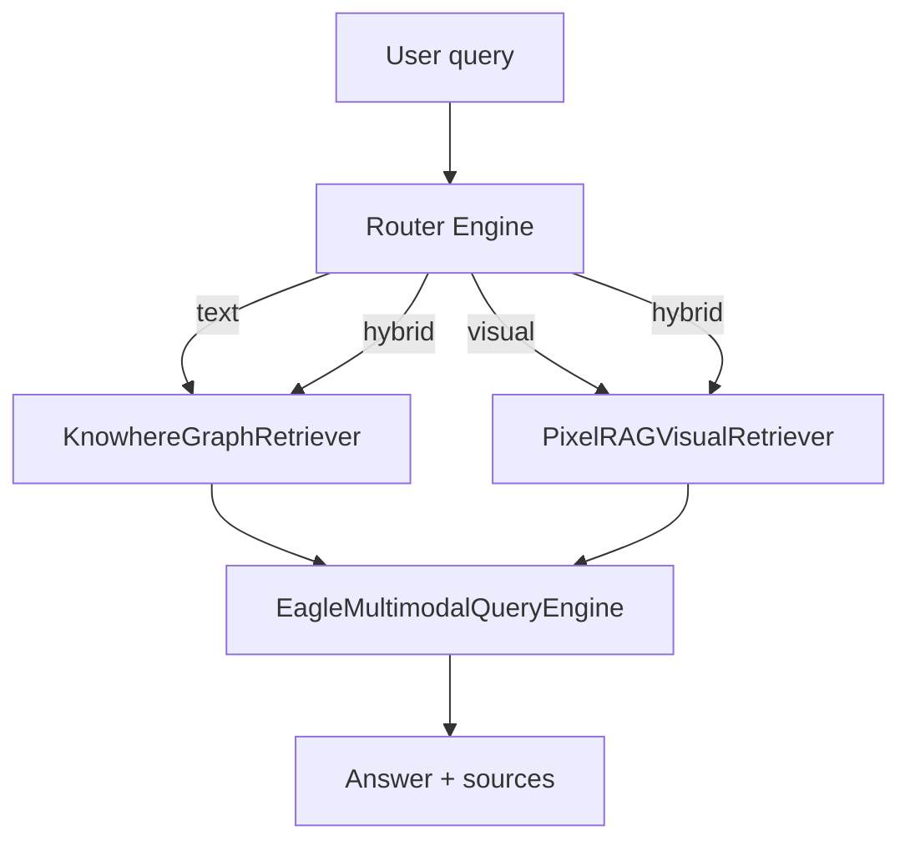

# RAG learning path

:material-school:{ .lg .middle } A curated journey from RAG fundamentals to operating Eagle-RAG in production. Each level explains *why* a concept matters, maps it to Eagle-RAG code, and points at deeper documentation.

## Prerequisites

Before starting, you should be comfortable with:

- [ ] Python async basics (FastAPI handlers, Celery workers)
- [ ] Vector databases at a conceptual level — embeddings, approximate nearest neighbor (ANN) search
- [ ] LLM APIs — chat completions, streaming tokens

!!! tip "Doc site locally"
    Run `task docs:serve` and browse at `http://localhost:8001`.

---

## Level 0 — Mathematical and systems background

### Dense retrieval in one page

Given a query \(q\) and corpus chunks \(\{c_i\}\), dense retrieval:

1. Encodes \(q \rightarrow \mathbf{e}_q \in \mathbb{R}^d\) and each \(c_i \rightarrow \mathbf{e}_{c_i}\)
2. Ranks by similarity — typically **cosine** or **inner product (IP)** on L2-normalized vectors
3. Returns top-\(k\) chunks for prompt construction

[HNSW](https://arxiv.org/abs/1603.09320) approximates step 2 in sub-linear time by navigating a multi-layer proximity graph. Eagle-RAG uses IP with L2-normalized 2048-d visual vectors in `eagle_rag/index/milvus_visual_store.py` — mathematically equivalent to cosine similarity.

### What papers to read first

| Paper | Year | What it contributes | Eagle-RAG mapping |
| --- | --- | --- | --- |
| [Lewis et al.](https://arxiv.org/abs/2005.11401) | 2020 | RAG = retrieve + generate | `EagleRouterQueryEngine.query()` → `EagleMultimodalQueryEngine` |
| [Gao survey](https://arxiv.org/abs/2312.10997) | 2023 | Full RAG taxonomy | Chunking (`chunks_to_text_nodes`), rerank (`qwen3-rerank`), hybrid retrieval |
| [MuRAG](https://arxiv.org/abs/2210.02928) | 2022 | Multimodal evidence retrieval | Dual `eagle_text` + `eagle_visual` collections |
| [HNSW](https://arxiv.org/abs/1603.09320) | 2016 | Graph-based ANN | `MILVUS_VISUAL_INDEX_TYPE=hnsw` |
| [DiskANN](https://papers.nips.cc/paper/2019/hash/09853c7ff1cb93b59a86b8e886786b9b-Abstract.html) | 2019 | Disk ANN at scale | `MILVUS_VISUAL_INDEX_TYPE=diskann` |

---

## Level 1 — RAG foundations

### What problem does RAG solve?

Without retrieval, an LLM can hallucinate facts or answer from stale training data. RAG inserts a **retrieval step** before generation:


The classic pipeline — chunk → embed → index → retrieve → generate — is described in [LlamaIndex RAG concepts](https://docs.llamaindex.ai/en/stable/understanding/rag/).

### Eagle-RAG mapping

| RAG stage | Eagle-RAG component | Key function / module | Doc |
| --- | --- | --- | --- |
| Parse & chunk | Knowhere typed chunks + PixelRAG tiles | `parse_with_knowhere_sdk()`, `pixelrag_build` | [Ingest pipeline](backend/ingest-pipeline.md) |
| Embed | Qwen text 1536-d + visual 2048-d | `upsert_text_nodes()`, `upsert_visual()` | [Vector stores](backend/vector-stores.md) |
| Retrieve | Hybrid text + visual, scalar filters | `EagleRouterQueryEngine.retrieve()` | [Retrieval](backend/retrieval.md) |
| Rerank | DashScope `qwen3-rerank` | `EagleMultimodalQueryEngine` | [Generation](backend/generation.md) |
| Generate | Qwen-VL-Max over retrieved context | `custom_query()`, `stream_custom_query()` | [Generation](backend/generation.md) |

### Hands-on: verify the text pipeline

```bash
task setup && task up
# Ingest a .md file via frontend or POST /ingest
# Query with mode=text
curl -s localhost:8000/query -H 'Content-Type: application/json' \
  -d '{"query":"What is in the document?","mode":"text","kb_name":"default"}' | jq .
```

### Tuning at Level 1

| Concept | Eagle-RAG knob | Read next |
| --- | --- | --- |
| ANN recall vs latency | HNSW `ef`, retrieval `top_k` | [Vector stores](backend/vector-stores.md) |
| Bi-encoder → cross-encoder gap | `top_k` then gte-rerank `top_n` | [Generation](backend/generation.md) |
| Parent-document noise | `section_summary` + `path` prefix drill-down | [Retrieval](backend/retrieval.md) |
| Graph expansion tokens | `connect_to` edges in Knowhere chunks | [Retrieval](backend/retrieval.md) |

**External references**

- [Milvus — multi-vector search](https://milvus.io/docs/multi-vector-search.md)
- [Gao et al., 2023](https://arxiv.org/abs/2312.10997)

---

## Level 2 — Multimodal and routing

### Why one pipeline is not enough

Text-only RAG fails when the answer lives in a **chart, table layout, or diagram**. A sentence like *"see Figure 3"* retrieves no pixels.



### Ingest routing vs query routing

These are **different** decision points:

| When | Function | Decides |
| --- | --- | --- |
| Document upload | `eagle_rag/ingest/router.py` `route()` | Knowhere vs PixelRAG pipeline |
| User question | `eagle_rag/router/router_engine.py` `route_query()` | text / visual / hybrid retriever |

Ingest routing uses PDF form probe (`probe_pdf_form`), extension lists, and filename prefixes. Query routing uses DeepSeek classification or keyword heuristics.

### Code walkthrough: `route()` (ingest)

```python
# eagle_rag/ingest/router.py — simplified control flow
def route(...) -> list[str]:
    cfg = get_settings().ingest.routing
    ctx = _build_context(filename, content_type, source_uri, local_path, kb_name, ...)
    chain = _build_chain(cfg, probe=probe_pdf_form)
    return chain.select(ctx)  # ["knowhere"] | ["pixelrag"] | both
```

Selector priority (first non-`None` wins):

1. `PrefixSelector` — `knowhere:` / `pixelrag:` filename prefix
2. `ForcedModeSelector` — `settings.router.mode` when not `auto`
3. `HttpUriSelector` — URLs → PixelRAG
4. `PdfFormSelector` — `probe_pdf_form()` for `.pdf`
5. `ExtensionSelector` — configured extension lists
6. `ContentTypeSelector` — MIME fallback
7. Default — `knowhere`

Full walkthrough: [Routing matrix](architecture/routing-matrix.md).

### Fusion anchor fields

When Knowhere parses a document with embedded images/tables, `extract_visual_chunks()` walks chunks in order, tracking the latest text chunk's `path` as `parent_section`. Visual vectors land in `eagle_visual` with four anchor fields — see [Multimodal fusion](architecture/multimodal-fusion.md).

### Checklist

- [ ] [Routing matrix](architecture/routing-matrix.md) — ingest-time pipeline selection
- [ ] [Multimodal fusion](architecture/multimodal-fusion.md) — anchoring visual tiles to semantic tree
- [ ] [Router engine](backend/router-engine.md) — query-time mode and scope filters

### Hands-on: compare pipelines

- [ ] Ingest a **text PDF** and a **scanned PDF**; compare task logs in `/tasks`
- [ ] Run `hybrid` query on a document with charts
- [ ] Open `GET /documents/{id}/structure` — verify `doc_nav` tree

**External references**

- [Chen et al., 2022 — MuRAG](https://arxiv.org/abs/2210.02928)
- [PixelRAG](https://github.com/StarTrail-org/PixelRAG)
- [Knowhere](https://github.com/Ontos-AI/knowhere)

---

## Level 3 — Production RAG

Running RAG in production means **isolation**, **degradation**, and **observability** — not just higher `top_k`.

### Multi-tenancy (`plugin_namespace` + `kb_name`)

Eagle-RAG uses **two isolation layers** inside one cluster:

| Layer | Identifier | Mechanism |
| --- | --- | --- |
| Domain | `plugin_namespace` | Milvus Database + PostgreSQL repository filter (deploy-time) |
| KB | `kb_name` | Scalar filter inside that Database (request-time) |

Within one domain Database, many KBs share base collections (`eagle_text`, `eagle_visual`) and optional specialized collections. Isolation is `kb_name` scalar filtering — not separate Milvus collections per KB.

```
kb_name == 'pharma' and document_id in ['doc_a', 'doc_b']
```

Dedup key `(sha256, kb_name, plugin_namespace)` allows the same file in multiple KBs and domains (on separate instances). Details: [Multi-tenancy](architecture/multi-tenancy.md).

### Reliability patterns

| Pattern | Code location | Effect |
| --- | --- | --- |
| `@with_retry` + dead letter | `eagle_rag/tasks/dead_letter.py` | Exponential backoff; exhausted tasks → `dead_letter` queue |
| Retriever empty list | `EagleRouterQueryEngine._fetch_nodes()` | Logs warning; continues with other modality |
| Non-blocking visual dispatch | `dispatch_visual_chunks()` | Text index succeeds even if visual queue fails |
| Task state machine | `eagle_rag/tasks/state.py` | Illegal transitions raise — audit stays consistent |

### Scope filter (advanced retrieval)

`QueryRequest.scope_filter = {kb_names, document_ids, tags}` — **union (OR)** semantics. Tags resolve via `document_keywords` table → `resolve_tags_to_document_ids()`. Capped by `router.max_scope_documents` (default 500).

### Checklist

- [ ] [Multi-tenancy](architecture/multi-tenancy.md)
- [ ] [Reliability](architecture/reliability.md)
- [ ] [Observability](ops/observability.md)
- [ ] [MCP tools](api/mcp-tools.md)
- [ ] [Plugin architecture](architecture/plugin-architecture.md)
- [ ] [ADR-008 RAG-only + frontend scope](architecture/adr/008-rag-only-plugin-platform.md)
- [ ] [Authoring industry plugins](guides/authoring-industry-plugin.md)

### Hands-on: production exercises

- [ ] Run hybrid query with `scope_filter` (KB + tag)
- [ ] Call `core_query` via MCP at `/mcp`
- [ ] Simulate Knowhere down — verify `/health` degrades without API crash
- [ ] Inspect dead letter queue via admin after forced task failure
- [ ] (Optional) With `EAGLE_RAG_PROFILE=biomed`, confirm `biomed_*` MCP tools appear with no domain UI dependency

**External references**

- [Anthropic — Building effective agents](https://www.anthropic.com/research/building-effective-agents)
- [Model Context Protocol spec](https://modelcontextprotocol.io/)
- [Milvus production guide](https://milvus.io/docs/install-overview.md)

---

## Level 4 — Contributing

- [ ] [Project structure](development/project-structure.md)
- [ ] [Coding standards](development/coding-standards.md)
- [ ] [Testing](development/testing.md)
- [ ] [AGENTS.md](https://github.com/fintax-ai/eagle-rag/blob/master/AGENTS.md) — agent and architecture constraints

When changing architecture, sync: `README.md`, `README.zh.md`, `AGENTS.md`, `docs/*/architecture/plugin-architecture.md`, `docs/*/architecture/multimodal-fusion.md`, `docs/*/architecture/adr/008-*.md`, `eagle_rag/settings.yaml`.

---

## Configuration quick reference

| Learning goal | Settings to tune |
| --- | --- |
| Force text-only retrieval | `ROUTER_MODE=text` or per-request `mode` |
| PDF scanned detection | `pdf_probe.text_page_ratio`, `pdf_probe.avg_chars_per_page` |
| Visual index at scale | `MILVUS_VISUAL_INDEX_TYPE=diskann` |
| Scope filter bounds | `router.max_scope_documents` |
| Profile / domain binding | `EAGLE_RAG_PROFILE`, `plugins.default_namespace`; verify `/health/plugins` |
| Queue backpressure | `celery.queues.pixelrag_queue.concurrency` (keep at 1) |

---

## Failure modes cheat sheet

| Symptom | Likely cause | Doc |
| --- | --- | --- |
| Task stuck in `RENDERING` | Knowhere poll timeout | [Reliability](architecture/reliability.md) |
| Empty visual sources | `pixelrag_queue` backlog or OOM | [Ops troubleshooting](ops/troubleshooting.md) |
| Cross-tenant leakage | Missing `kb_name` filter or wrong `plugin_namespace` / profile | [Multi-tenancy](architecture/multi-tenancy.md) |
| Duplicate upload rejected | Dedup hit `(sha256, kb_name, plugin_namespace)` | [Ingest API](api/ingest.md) |

---

## Full hands-on checklist

- [ ] `task setup && task up` — bring up the full stack
- [ ] Ingest a text PDF and a scanned PDF; compare pipelines in `/tasks`
- [ ] Run a hybrid query with `scope_filter` (KB + tag)
- [ ] Call `core_query` via MCP at `/mcp`
- [ ] Open document structure in the frontend evidence viewer
- [ ] Stream query via `POST /query/stream` — observe SSE event order
- [ ] Run `task be:test` before submitting a PR

---

## References

- [Lewis et al., 2020](https://arxiv.org/abs/2005.11401) — RAG foundation
- [Gao et al., 2023](https://arxiv.org/abs/2312.10997) — RAG survey
- [MuRAG](https://arxiv.org/abs/2210.02928) — multimodal retrieval
- [LlamaIndex docs](https://docs.llamaindex.ai/)
- [Milvus docs](https://milvus.io/docs)
- [MCP specification](https://modelcontextprotocol.io/)
