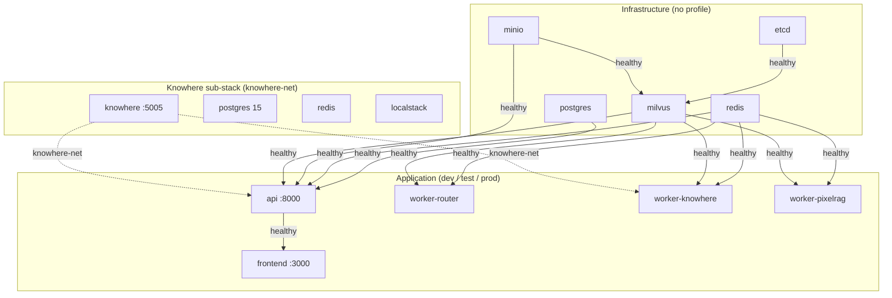
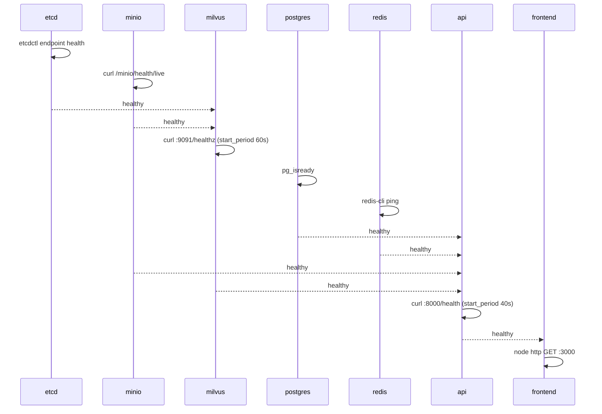

# :material-docker: Docker Compose and images

Eagle-RAG deploys as a single Docker Compose project named `eagle-rag`. The base file [`docker-compose.yml`](https://github.com/fintax-ai/eagle-rag/blob/master/docker-compose.yml) is shared by `dev`, `test`, and `prod` profiles; dev-only overrides live in [`docker-compose.override.yml`](https://github.com/fintax-ai/eagle-rag/blob/master/docker-compose.override.yml). Four multi-stage Dockerfiles under `docker/` build the application images. Healthchecks gate startup order so each service begins only after its dependencies are healthy.

Orchestration shortcuts are in [`Taskfile.yml`](https://github.com/fintax-ai/eagle-rag/blob/master/Taskfile.yml) (`task up`, `task up:prod`, `task down`).

## Layered topology



### Infrastructure layer

| Service | Image | Volume | Role |
| --- | --- | --- | --- |
| `etcd` | `quay.io/coreos/etcd:v3.5.5` | `vol-etcd` | Milvus metadata store; revision auto-compaction, 4 GB backend quota |
| `minio` | `minio/minio:RELEASE.2023-03-20T20-16-18Z` | `vol-minio` | Object storage for tile PNGs and originals |
| `milvus` | `milvusdb/milvus:v2.6.19` | `vol-milvus` | Standalone vector DB; `ETCD_ENDPOINTS=etcd:2379`, `MINIO_ADDRESS=minio:9000` |
| `postgres` | `postgres:16-alpine` | `vol-postgres` | Sessions, dedup, task audit, `metric_sample`; DB `eagle_rag`, user `eagle` |
| `redis` | `redis:7-alpine` | `vol-redis` | Celery broker (`/0`) and result backend (`/1`) |

All infrastructure services attach to bridge network `eagle-net`. Logging uses the shared anchor `x-logging`: json-file driver, 10 MB × 3 files rotation.

### Knowhere self-hosted sub-stack

Knowhere runs from [`docker/knowhere-self-hosted/compose.yaml`](https://github.com/fintax-ai/eagle-rag/blob/master/docker/knowhere-self-hosted/compose.yaml) as a **separate compose project**. Eagle-RAG joins external network `knowhere-net` and resolves the parser at DNS name `knowhere`.

| Service | Image | Volume | Notes |
| --- | --- | --- | --- |
| `app` | `ghcr.io/ontos-ai/knowhere:latest` | `knowhere_user_data`, `knowhere_model_cache`, `knowhere_secrets` | API `:5005`, dashboard `:13000` (host bind) |
| `postgres` | `postgres:15-alpine` | `postgres_data` | DB `Knowhere`, user `root` |
| `redis` | `redis:7-alpine` | `redis_data` | 2 GB LRU, AOF |
| `localstack` | `localstack/localstack:3.8` | `localstack_data` | S3-compatible stub for Knowhere internals |

`task knowhere:up` runs `unset POSTGRES_PASSWORD APP_ENV` before `docker compose up` so root `.env` values do not override Knowhere defaults (documented in Taskfile).

### Application layer

| Service | Image build | Ports | Profiles |
| --- | --- | --- | --- |
| `api` | `docker/Dockerfile.api` → `eagle-rag-api:latest` | `8000:8000` | dev, test, prod |
| `worker-router` | `docker/Dockerfile.worker` → `eagle-rag-worker:latest` | — | dev, test, prod |
| `worker-knowhere` | same worker image | — | dev, test, prod |
| `worker-pixelrag` | same worker image | — | dev, test, prod |
| `frontend` | `docker/Dockerfile.frontend` → `eagle-rag-frontend:latest` | `3000:3000` | dev, test, prod |
| `docs` | `docker/Dockerfile.docs` → `eagle-rag-docs:latest` | `8001:8001` | docs, prod |

Workers share `x-worker-build` context `.` and `docker/Dockerfile.worker`. Environment variables `QUEUES` and `CONCURRENCY` select the queue set at runtime:

| Container | `QUEUES` | `CONCURRENCY` | CPU / memory limits |
| --- | --- | --- | --- |
| `worker-router` | `router_queue` | `4` | none |
| `worker-knowhere` | `knowhere_queue` | `8` | `cpus: 2.0` |
| `worker-pixelrag` | `pixelrag_queue` | `1` | `memory: 4g`, `cpus: 2.0` |

`worker-pixelrag` mounts `./data:/app/data` for uploads and local artefacts. The Qwen3-VL-Embedding-2B weights are **baked into the worker image** at `/opt/huggingface/model` during `docker build` in an isolated `model-prefetch` stage (unaffected by `eagle_rag` code changes). BuildKit cache mount `eagle-rag-visual-model-cache` keeps the ~4 GB download on disk across rebuilds when that stage reruns. Default `MODEL_DOWNLOAD_SOURCE=modelscope` (stable in China); set `huggingface` or `auto` to use `HF_ENDPOINT` (e.g. hf-mirror.com) with ModelScope fallback. Runtime `VISUAL_EMBEDDING_MODEL=/opt/huggingface/model` — no Hub download on container start.

## Healthcheck dependency chain {#healthcheck-dependency-chain}

Compose `depends_on: condition: service_healthy` creates a **startup DAG**. A service in `starting` state blocks dependents until its probe succeeds or retries exhaust.



### Per-service probe definitions

| Service | Test command | Interval | start_period | Notes |
| --- | --- | --- | --- | --- |
| `etcd` | `etcdctl endpoint health` | 30s | — | Data dir `/etcd` on `vol-etcd` |
| `minio` | `curl -fsS http://localhost:9000/minio/health/live` | 30s | — | Uses image-bundled `curl` |
| `milvus` | `curl -f http://localhost:9091/healthz` | 30s | **60s** | Slow cold start |
| `postgres` | `pg_isready -U eagle -d eagle_rag` | 10s | — | Faster probe cadence |
| `redis` | `redis-cli ping` | 10s | — | |
| `api` | `curl -f http://localhost:8000/health` | 30s | **40s** | Hits full dependency probe bundle |
| `worker-*` | `celery inspect ping -d celery@$(hostname)` | 30s | **60s** | Scoped to local worker name |
| `frontend` | `node -e "require('http').get(...)"` | 30s | 40s | No curl in slim image |
| `docs` | `wget -q -O /dev/null http://localhost:8001/` | 30s | 20s | nginx alpine |

Workers depend only on **redis + milvus** (not postgres). The API depends on postgres, redis, minio, and milvus. Knowhere has **no** `depends_on` edge from eagle-rag compose — operators must start Knowhere first (`task up` runs `knowhere:up` as a dependency).

### What `/health` checks inside the API container

The API healthcheck calls [`eagle_rag/api/health.py`](https://github.com/fintax-ai/eagle-rag/blob/master/eagle_rag/api/health.py) which concurrently probes:

| Probe | Pass criteria |
| --- | --- |
| `milvus` | `MilvusClient.list_collections()` succeeds |
| `knowhere` | HTTP GET `settings.knowhere.base_url` returns any response |
| `pixelrag` | `pixelrag_render` / `pixelrag_embed` importable, else `unknown` |
| `vlm` | `GET {base_url}/models` with Bearer token → 200 |
| `redis` | `PING` on broker URL |
| `minio` | `list_buckets()` |
| `celery` | `inspect.ping()` with **1.0s** timeout (avoids false `down` from 3s broadcast wait) |
| `postgres` | `SELECT 1` via asyncpg |

Aggregate rule: any probe `down` → `status: degraded`; `unknown` (optional pixelrag) does **not** degrade.

## Why `pixelrag_queue` concurrency is 1 {#why-pixelrag_queue-concurrency-is-1}

PixelRAG is no longer a standalone serve process. `worker-pixelrag` loads heavy in-process dependencies:

1. **`pixelrag_render`** — Chrome/CDP or Playwright HTML/PDF rasterisation; large page tiles (default tile height 8192 px).
2. **`pixelrag_embed`** + **`_Qwen3VLVisualEncoder` singleton** — Qwen3-VL-Embedding-2B via `transformers` + `torch`; 2048-d vectors written to Milvus `eagle_visual`.

Running more than one concurrent task per container causes:

- **Memory pressure** — multiple Chrome instances + GPU/CPU tensor allocations; compose sets `deploy.resources.limits.memory: 4g`.
- **Encoder singleton contention** — the visual encoder is a process-wide singleton; parallel embed jobs fight for the same device.
- **Milvus write bursts** — visual inserts are large; serialising smooths segment flush behaviour.

`settings.yaml` documents the intent explicitly:

```yaml
pixelrag_queue:
  concurrency: 1        # Strict low concurrency to avoid OOM.
```

To increase visual throughput, scale **horizontally** (multiple `worker-pixelrag` containers on different hosts) rather than raising `-c` inside one container. `knowhere_queue` stays at 8 because it is HTTP-bound to external Knowhere. `router_queue` at 4 matches quick dispatch work.

## Dockerfiles

| File | Base | Output |
| --- | --- | --- |
| `docker/Dockerfile.api` | Python 3.12 slim + `uv` | FastAPI app on port 8000 |
| `docker/Dockerfile.worker` | Python 3.12 slim + Chrome for PixelRAG render + pre-downloaded Qwen3-VL-Embedding-2B at `/opt/huggingface` | Celery worker entrypoint reading `QUEUES` / `CONCURRENCY` |
| `docker/Dockerfile.frontend` | Bun multi-stage → Node runtime | Next.js production server |
| `docker/Dockerfile.docs` | MkDocs build → nginx alpine | Static docs on 8001 |

Worker image sets `CHROME_PATH=/usr/local/bin/chrome` for `pixelrag_render` CDP backend.

## Dev override behaviour

When `docker-compose.override.yml` merges (default `docker compose up`):

| Change | Rationale |
| --- | --- |
| API `command: uvicorn ... --reload --reload-dir eagle_rag` | Hot reload; **do not** watch `./data` (HF cache writes restart SSE) |
| Bind-mount `./eagle_rag:/app/eagle_rag:ro` on api + workers | Live code without image rebuild |
| `worker-knowhere` / `worker-pixelrag` `deploy: !reset null` | Remove prod CPU/memory limits for local debugging |
| Frontend → `oven/bun:1.2.18` + `bunx next dev` | Skip production image build |
| Expose postgres/redis/minio/milvus ports | Host-side debugging |

Prod command:

```bash
COMPOSE_FILE=docker-compose.yml docker compose --profile prod up -d
```

## Environment wiring

Compose `env_file: .env` plus explicit `environment:` blocks override `settings.yaml` defaults. Critical container injections from [`docker-compose.yml`](https://github.com/fintax-ai/eagle-rag/blob/master/docker-compose.yml):

```yaml
KNOWHERE_BASE_URL: ${KNOWHERE_BASE_URL:-http://knowhere:5005}
HF_HOME: /opt/huggingface          # worker-pixelrag (baked in image)
CHROME_PATH: /usr/local/bin/chrome   # worker-pixelrag only
```

If `MILVUS_HOST`, `CELERY_BROKER_URL`, or `POSTGRES_DSN` are missing from `.env`, they fall back to `localhost` inside the container and probes fail — always set service DNS names for compose deployments.

## Networks

```yaml
networks:
  eagle-net:
    driver: bridge
  knowhere-net:
    external: true
    name: knowhere-net
```

`api` and `worker-knowhere` join both networks. `worker-router` and `worker-pixelrag` use only `eagle-net` (PixelRAG does not call Knowhere HTTP during tile build).

Create the external network once:

```bash
docker network create knowhere-net
```

`task setup` and `task net:ensure` run this idempotently.

## Volumes (compose names) {#volumes-compose-names}

Declared in the top-level `volumes:` block:

| Compose volume | Mounted at | Store |
| --- | --- | --- |
| `vol-etcd` | `/etcd` | Milvus metadata |
| `vol-minio` | `/data` | Object blobs |
| `vol-milvus` | `/var/lib/milvus` | Vector segments |
| `vol-postgres` | `/var/lib/postgresql/data` | Relational data |
| `vol-redis` | `/data` | Broker persistence (if enabled) |

Host bind mount `./data` is **not** a named volume — it lives beside the repo. Backup procedures: [Backup & restore](backup-restore.md).

## Worker restart after code changes

Dev override does **not** auto-reload Celery. After editing task code:

```bash
docker compose restart worker-router worker-knowhere worker-pixelrag
```

Or `task logs:worker SERVICE=worker-knowhere` to tail a single worker.

## Swarm / MCP standalone (optional)

[`docker/swarm/mcp-stack.yml`](https://github.com/fintax-ai/eagle-rag/blob/master/docker/swarm/mcp-stack.yml) documents a separate MCP HTTP deployment with its own `/metrics` and `/health` from [`eagle_rag/metrics.py`](https://github.com/fintax-ai/eagle-rag/blob/master/eagle_rag/metrics.py). That path is independent of the main `api` service.

## Common compose operations

```bash
# Rebuild after Dockerfile change
docker compose --profile dev build api worker-router

# Scale is not used for workers (fixed service names); add duplicate services manually if needed

# Inspect health state
docker inspect --format='{{.State.Health.Status}}' eagle-rag-api-1

# Exec into API container
docker compose exec api bash

# Sync frontend node_modules inside dev container
task fe:deps
```

## Failure modes at startup

| Symptom | Likely cause |
| --- | --- |
| `network knowhere-net could not be found` | Run `docker network create knowhere-net` |
| `api` stuck `starting` | Milvus `start_period` not elapsed, or `/health` dependency down |
| Worker `unhealthy` immediately | Celery not listening yet; wait 60s or check `CONCURRENCY` env |
| `worker-pixelrag` OOMKilled | Tile too large or concurrency raised above 1 |
| Frontend never healthy | API not healthy; check upstream |

See [Troubleshooting](troubleshooting.md) for log correlation.
