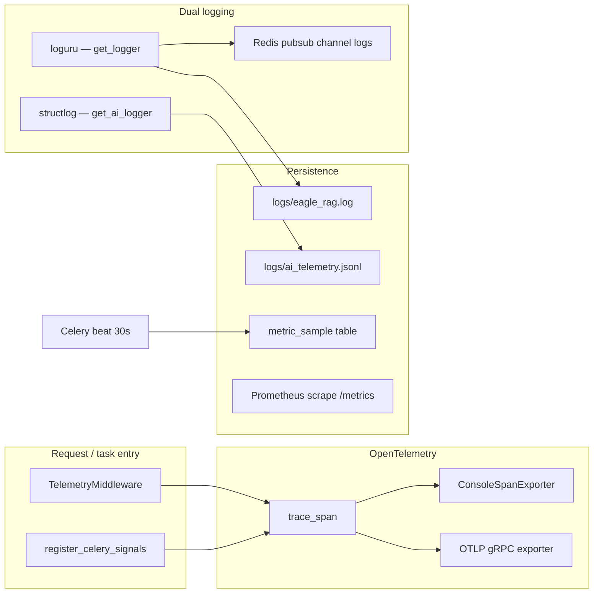
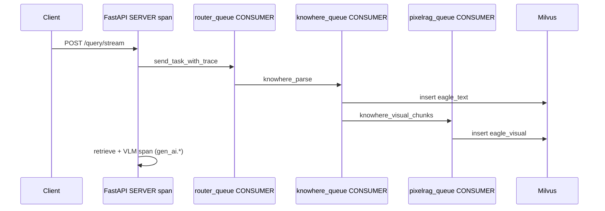

# :material-chart-line: Observability

Eagle-RAG exposes three complementary observability planes: **ops logs** (loguru), **AI event logs** (structlog JSONL via `get_ai_logger`), and **distributed traces** (OpenTelemetry). HTTP admin routes aggregate dependency health, queue metrics, and live log streaming. MCP standalone deployments add Prometheus counters on `/metrics`.

Configuration lives in [`eagle_rag/settings.yaml`](https://github.com/fintax-ai/eagle-rag/blob/master/eagle_rag/settings.yaml) under `telemetry:` and is loaded by [`eagle_rag/telemetry/`](https://github.com/fintax-ai/eagle-rag/tree/master/eagle_rag/telemetry).

## Architecture overview



## Telemetry configuration

| Setting | Env override | Default | Purpose |
| --- | --- | --- | --- |
| `telemetry.enabled` | `TELEMETRY_ENABLED` | `true` | Master switch; off → stdlib logging only |
| `telemetry.tracing_enabled` | `OTEL_TRACING_ENABLED` | `false` | Export spans when true |
| `telemetry.otlp_endpoint` | `OTEL_EXPORTER_OTLP_ENDPOINT` | empty | gRPC collector address |
| `telemetry.otlp_insecure` | `OTEL_EXPORTER_OTLP_INSECURE` | `true` | TLS off for local collectors |
| `telemetry.service_name` | `OTEL_SERVICE_NAME` | `eagle-rag` | `service.name` resource attribute |
| `telemetry.op_log_file` | `OP_LOG_FILE` | `logs/eagle_rag.log` | Rotating ops log |
| `telemetry.ai_log_file` | `AI_TELEMETRY_LOG_FILE` | `logs/ai_telemetry.jsonl` | AI events JSONL |
| `telemetry.redis_log_channel` | `REDIS_LOG_CHANNEL` | `logs` | SSE `/admin/logs` fan-out |

Prompt/completion text in spans is truncated per `prompt_truncate` (512) and `completion_truncate` (1024).

## OpenTelemetry tracing

Implementation: [`eagle_rag/telemetry/tracing.py`](https://github.com/fintax-ai/eagle-rag/blob/master/eagle_rag/telemetry/tracing.py).

### Bootstrap

`configure_tracing(settings)` runs from `configure_telemetry` during API lifespan and Celery `worker_process_init`. Behaviour:

| Condition | TracerProvider | Export |
| --- | --- | --- |
| `enabled=false` or `tracing_enabled=false` | SDK provider, no processor | Spans created for log correlation only |
| Tracing on + `otlp_endpoint` set | Resource with `service.name`, `deployment.environment` | `OTLPSpanExporter` + `BatchSpanProcessor` |
| Tracing on, no endpoint | Same resource | `ConsoleSpanExporter` (dev) |

OpenTelemetry documents the [GenAI semantic conventions](https://opentelemetry.io/docs/specs/semconv/gen-ai/) Eagle-RAG follows via `set_llm_span_attributes` (`gen_ai.system`, `gen_ai.request.model`, `gen_ai.prompt`, `gen_ai.completion`, token usage).

### `trace_span` API

Dual form — context manager or decorator:

```python
from eagle_rag.telemetry import trace_span

with trace_span("knowhere.parse") as span:
  ...

@trace_span
def route_document(...):
  ...
```

On enter: binds `trace_id` and `span_id` into telemetry contextvars (visible in loguru format `{extra[trace_id]}`). On exception: `record_exception` + `StatusCode.ERROR`. On exit: clears span-bound context.

Hot paths instrumented include ingest adapters (`knowhere_adapter`, `pixelrag_adapter`), `router_engine`, and `multimodal_engine`.

### HTTP request spans

`TelemetryMiddleware` (Starlette):

- Opens a **SERVER** span named `{METHOD} {path}`.
- Extracts W3C `traceparent` from incoming headers for upstream continuation.
- Binds `request_id`, `http_method`, `http_route`, `trace_id`, `span_id`.
- Sets `http.status_code`; marks ERROR on 5xx.
- Does **not** read the request body (would break streaming query bodies).

### Celery trace propagation

`register_celery_signals` hooks:

| Signal | Action |
| --- | --- |
| `task_prerun` | Extract parent context from `task.request.headers`; open **CONSUMER** span `{task.name}:{task_id}`; bind `job_id`, `document_id`, `kb_name` from kwargs |
| `task_postrun` | End span; `clear_context()` |
| `task_failure` | `record_exception` on span |

`send_task_with_trace` wraps `celery_app.send_task` and **injects** the active span context into message headers so API → router → knowhere/pixelrag chains share one trace.

### RAG pipeline trace shape (typical)



In Jaeger or Grafana Tempo, filter by `service.name=eagle-rag` and look for nested CONSUMER spans under the SERVER span.

### Enabling OTLP in Docker

Add to `.env`:

```bash
OTEL_TRACING_ENABLED=true
OTEL_EXPORTER_OTLP_ENDPOINT=otel-collector:4317
OTEL_EXPORTER_OTLP_INSECURE=true
```

Run an OpenTelemetry Collector sidecar or host agent receiving gRPC on 4317.

## Dual logging system

Implementation: [`eagle_rag/telemetry/logging_setup.py`](https://github.com/fintax-ai/eagle-rag/blob/master/eagle_rag/telemetry/logging_setup.py).

### Ops logger — `get_logger`

- Backed by **loguru** when telemetry is enabled.
- Sinks: stderr (pretty, colour on TTY), rotating file (`op_log_rotation` / `op_log_retention`), optional Redis pubsub on `redis_log_channel`.
- Installs `_InterceptHandler` so uvicorn, FastAPI, Celery, and LlamaIndex stdlib loggers flow into loguru.
- Format includes component name and `trace_id` for correlation.

Example line:

```text
2026-07-05 09:15:22.431 | WARNING  | eagle_rag.admin.metrics:abc123def456 | queue length sampling skipped: Redis unavailable
```

### AI event logger — `get_ai_logger`

- Backed by **structlog** with a processor chain including `add_open_telemetry_span` (injects `trace_id` / `span_id` into each JSON event).
- Writes rotating JSONL to `ai_log_file` via dedicated logger `eagle_ai_telemetry` (excluded from loguru intercept to prevent loops).

Used for business events with stable schemas:

| Module | Event examples |
| --- | --- |
| `api/query.py` | `query_started`, `query_completed`, streaming token milestones |
| `ingest/knowhere_adapter.py` | parse job submitted, chunk counts |
| `ingest/pixelrag_adapter.py` | `pixelrag_render`, `pixelrag_embed` timings |
| `generation/multimodal_engine.py` | retrieval route, VLM completion |

Example JSONL record:

```json
{
  "event": "query_completed",
  "component": "eagle_rag.api.query",
  "session_id": "…",
  "kb_name": "default",
  "trace_id": "abc123…",
  "latency_ms": 842,
  "timestamp": "2026-07-05T01:15:22.431Z"
}
```

Downstream analytics (Databricks, ELK, ClickHouse) should ingest `ai_telemetry.jsonl` separately from ops logs.

### Context binding

[`eagle_rag/telemetry/context.py`](https://github.com/fintax-ai/eagle-rag/blob/master/eagle_rag/telemetry/context.py) provides `bind_context` / `get_context` / `clear_context` used by middleware, spans, and query handlers (`session_id`, `kb_name`).

## HTTP observability endpoints

Defined in [`eagle_rag/api/health.py`](https://github.com/fintax-ai/eagle-rag/blob/master/eagle_rag/api/health.py).

### Public

| Route | Response model | Notes |
| --- | --- | --- |
| `GET /health` | `HealthResponse` | 8 dependencies; `degraded` if any `down` |
| `GET /mcp/tools` | `McpToolsResponse` | Tool catalog mirror |

### Admin (`/admin/*`, no auth — intranet only)

| Route | Purpose |
| --- | --- |
| `GET /admin/probes` | Per-probe `latency_ms`, uptime strings, psutil CPU/memory |
| `GET /admin/celery` | Workers, active tasks, queue sizes, 24h success count, backlog series |
| `GET /admin/milvus` | Collection stats, field schema, index metadata |
| `POST /admin/milvus/flush`, `/clean` | Flush / compact all collections |
| `GET /admin/knowhere` | Knowhere probe + per-`kb_name` doc/chunk counts |
| `GET /admin/pixelrag` | Library status + `eagle_visual` row count + 24h render/embed metrics |
| `GET /admin/vlm` | Model config + 24h latency/token/error aggregates |
| `GET /admin/redis` | Broker INFO, masked URL |
| `GET /admin/minio` | Bucket list, default bucket object count (capped 10k) |
| `GET /admin/mcp` | Tool registration, recent MCP call log |
| `GET /admin/config` | Masked settings dump |
| `GET /admin/logs` | **SSE** stream (`event: log` / `heartbeat`) |

Uptime display uses `humanize.naturaldelta` on in-process monotonic timers (resets on API restart).

## Queue metrics and Celery beat

[`eagle_rag/admin/metrics.py`](https://github.com/fintax-ai/eagle-rag/blob/master/eagle_rag/admin/metrics.py) defines `sample_queue_metrics`, scheduled every **30 seconds** in [`celery_app.py`](https://github.com/fintax-ai/eagle-rag/blob/master/eagle_rag/tasks/celery_app.py) `beat_schedule`.

For each of `router_queue`, `knowhere_queue`, `pixelrag_queue`:

1. Redis `LLEN` on the queue list key.
2. `INSERT INTO metric_sample (metric_name='queue_size', labels='{"queue": "…"}', value=…)`.

`get_queue_backlog_series` reshapes the last N samples for `/admin/celery` charts.

Failure logs:

```text
queue length sampling skipped: Redis unavailable: …
metric_sample write failed (queue=knowhere_queue): …
```

**Note:** Compose does not ship a `celery beat` container by default. Run beat alongside workers if you need continuous sampling:

```bash
uv run celery -A eagle_rag.tasks.celery_app beat --loglevel=info
```

## Prometheus metrics (MCP)

[`eagle_rag/metrics.py`](https://github.com/fintax-ai/eagle-rag/blob/master/eagle_rag/metrics.py) defines MCP instrumentation (not the main FastAPI app unless MCP is mounted standalone).

| Metric | Labels | Type |
| --- | --- | --- |
| `mcp_tool_calls_total` | `tool`, `status` | Counter |
| `mcp_tool_duration_seconds` | `tool` | Histogram |
| `mcp_active_requests` | `tool` | Gauge |
| `mcp_circuit_state` | `tool` | Gauge (`0=closed`, `1=half-open`, `2=open`) |

`status` values: `success`, `cache_hit`, `circuit_open`, `timeout`, `error` — inferred by `@with_metrics` from return payload or exceptions.

Scrape target: `GET /metrics` on the MCP HTTP server (`prometheus_client.generate_latest`).

VLM operational metrics (`vlm_latency_ms`, `vlm_tokens`, `vlm_error`) are sampled into `metric_sample` by application code and aggregated via `get_metric_aggregate` on `/admin/vlm`, not Prometheus gauges.

## Live log SSE

`GET /admin/logs`:

1. Prefer **Redis pubsub** subscribe on channel `logs` (loguru Redis sink publishes here).
2. Fallback: in-memory `asyncio.Queue` per connected client + 5 s heartbeat.

Redis pubsub uses `socket_timeout=None` to avoid spurious timeouts on idle channels.

## Metric catalog (`metric_sample` table)

| `metric_name` | Source | Admin consumer |
| --- | --- | --- |
| `queue_size` | Celery beat | `/admin/celery` |
| `pixelrag_render` | pixelrag adapter | `/admin/pixelrag` |
| `pixelrag_embed` | pixelrag adapter | `/admin/pixelrag` |
| `vlm_latency_ms` | multimodal engine | `/admin/vlm` |
| `vlm_tokens` | multimodal engine | `/admin/vlm` |
| `vlm_error` | multimodal engine | `/admin/vlm` |

`get_metric_aggregate(name, agg, window_hours)` supports `avg`, `sum`, `count` over sliding windows.

## MCP call audit

[`eagle_rag/admin/mcp_log.py`](https://github.com/fintax-ai/eagle-rag/blob/master/eagle_rag/admin/mcp_log.py) persists recent tool invocations to PostgreSQL; `/admin/mcp` surfaces the last 50 as `console_logs`.

## Operational runbooks

### Verify tracing end-to-end

1. Enable `OTEL_TRACING_ENABLED=true` and console exporter (no endpoint).
2. `POST /query` with a simple question.
3. Confirm SERVER + CONSUMER spans in worker stdout.
4. Confirm `trace_id` matches between `eagle_rag.log` and `ai_telemetry.jsonl`.

### Verify queue sampling

```sql
SELECT metric_name, labels, value, sampled_at
FROM metric_sample
WHERE metric_name = 'queue_size'
ORDER BY sampled_at DESC
LIMIT 10;
```

### Tail AI events

```bash
tail -f logs/ai_telemetry.jsonl | jq -c '{event, kb_name, trace_id, latency_ms}'
```

### Subscribe to live ops logs

```bash
curl -N http://localhost:8000/admin/logs
```

## References

- [OpenTelemetry Python](https://opentelemetry.io/docs/languages/python/)
- [OpenTelemetry GenAI semantic conventions](https://opentelemetry.io/docs/specs/semconv/gen-ai/)
- [Celery monitoring](https://docs.celeryq.dev/en/stable/userguide/monitoring.html)
- Eagle-RAG agent rules: [`AGENTS.md`](https://github.com/fintax-ai/eagle-rag/blob/master/AGENTS.md)
