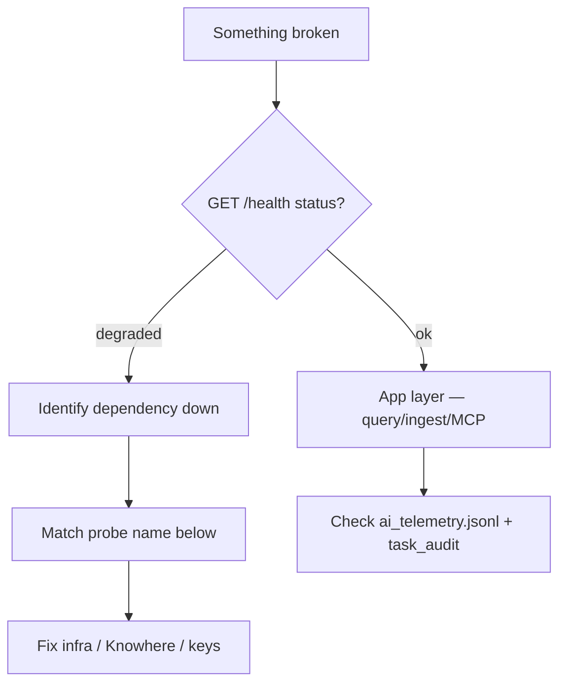

# :material-wrench: Troubleshooting

Symptom-oriented guide for Eagle-RAG operators. Each section maps **what you see** (UI, probe, log line) to **likely cause** and **remediation**. Cross-check live state with `task health`, `task ps`, and [`GET /admin/probes`](http://localhost:8000/admin/probes).

Source references: [`eagle_rag/api/health.py`](https://github.com/fintax-ai/eagle-rag/blob/master/eagle_rag/api/health.py), [`eagle_rag/tasks/dead_letter.py`](https://github.com/fintax-ai/eagle-rag/blob/master/eagle_rag/tasks/dead_letter.py), [`Taskfile.yml`](https://github.com/fintax-ai/eagle-rag/blob/master/Taskfile.yml).

## Quick diagnostic flow



```bash
task health                    # pretty JSON
curl -s localhost:8000/admin/probes | jq '.dependencies'
task ps                        # both compose projects
docker compose logs -f api worker-knowhere --tail=200
```

---

## Dependency probe matrix

### `milvus` — down

| Observation | Detail string examples |
| --- | --- |
| Probe `down` | `Connection refused`, `timeout after 3.0s` |
| `/health` `degraded` | `milvus.status = down` |
| API container `starting` | Milvus healthcheck not yet green |

**Causes**

- Milvus still in `start_period` (60 s cold start).
- etcd or MinIO unhealthy (Milvus depends on both).
- Wrong `MILVUS_HOST` inside container (`localhost` instead of `milvus`).

**Fix**

```bash
docker compose ps milvus etcd minio
docker compose logs milvus --tail=100
# Verify env
docker compose exec api printenv MILVUS_HOST
```

---

### `knowhere` — down

| Observation | Detail string examples |
| --- | --- |
| Probe `down` | `ConnectError`, `Connection refused` |
| Ingest tasks `FAILED` | `task_audit.log_entry` contains Knowhere HTTP errors |
| `task knowhere:health` | HTTP non-2xx or timeout |

**Causes**

- Knowhere sub-stack not running (`task knowhere:up`).
- `knowhere-net` missing.
- `KNOWHERE_BASE_URL` points to `localhost` from inside a container.

**Fix**

```bash
docker network inspect knowhere-net
task knowhere:ps
task knowhere:logs
curl -s http://localhost:5005/health
```

Eagle-RAG **fail-closed**: no silent fallback parser. Text ingest recovers automatically once Knowhere is up; failed jobs may need re-ingest or dead-letter replay.

---

### `pixelrag` — unknown (not down)

| Observation | Detail string examples |
| --- | --- |
| Probe `unknown` | `optional vision extra not installed (mock fallback)` |
| Probe `up` | `libraries=pixelrag_render,pixelrag_embed` |

**Causes**

- Expected in minimal installs — PixelRAG is core in `pyproject.toml` but import probe reports `unknown` when modules are absent.
- Visual pipeline unavailable; scanned PDFs may fail or mock.

**Fix**

```bash
docker compose exec worker-pixelrag python -c "import pixelrag_render, pixelrag_embed"
docker compose logs worker-pixelrag --tail=50
```

---

### `vlm` — down

| Observation | Detail string examples |
| --- | --- |
| Probe `down` | `api_key not set` |
| Probe `down` | `status_code=401` |
| `/admin/vlm` | `error_rate` elevated |

**Causes**

- Missing `VLM_API_KEY` in `.env`.
- DashScope quota / wrong `VLM_BASE_URL`.

**Fix**

```bash
grep VLM_ .env
curl -s -H "Authorization: Bearer $VLM_API_KEY" "$VLM_BASE_URL/models" | head
```

---

### `redis` — down

| Observation | Detail string examples |
| --- | --- |
| Probe `down` | `Connection refused` |
| Log | `queue length sampling skipped: Redis unavailable` |
| `/admin/celery` 503 | `celery inspect failed` |

**Causes**

- Redis container stopped.
- Wrong `CELERY_BROKER_URL` (DB index, password, host).

**Fix**

```bash
docker compose exec redis redis-cli ping
docker compose exec api printenv CELERY_BROKER_URL
```

---

### `minio` — down

| Observation | Detail string examples |
| --- | --- |
| Probe `down` | `list_buckets` failure |
| Ingest | Object upload errors in worker logs |

**Fix**

```bash
docker compose ps minio
curl -fsS http://localhost:9000/minio/health/live
```

---

### `celery` — down

| Observation | Detail string examples |
| --- | --- |
| Probe `down` | `no worker responded` |
| Worker container `unhealthy` | `celery inspect ping` fails |
| False positive (historical) | Probe used 3 s inspect timeout — fixed to 1.0 s in code |

**Causes**

- No worker containers running.
- Worker still in 60 s `start_period`.
- Worker crash loop (import error, OOM).

**Fix**

```bash
docker compose ps worker-router worker-knowhere worker-pixelrag
docker compose logs worker-router --tail=100
celery -A eagle_rag.tasks.celery_app inspect ping -t 5   # from host with same broker URL
```

---

### `postgres` — down

| Observation | Detail string examples |
| --- | --- |
| Probe `down` | `asyncpg` connection errors |
| API errors | Session / ingest registry 500s |

**Fix**

```bash
docker compose exec postgres pg_isready -U eagle -d eagle_rag
task db:migrate
```

---

## Ingest and queue symptoms

### Queue backlog grows monotonically

| Queue | Check | Action |
| --- | --- | --- |
| `router_queue` | `/admin/celery` `queues[].size` | Scale `worker-router` or increase `CONCURRENCY` (default 4) |
| `knowhere_queue` | Active tasks stuck on HTTP | Knowhere capacity, `KNOWHERE_POLL_TIMEOUT` |
| `pixelrag_queue` | Single worker, long tasks | **Do not** raise concurrency above 1 per container; add second host |

Log correlation:

```text
# Normal idle
metric_sample write failed ...   # only if DB down

# Stuck visual job
worker-pixelrag | pixelrag_render ... timeout
```

### Document status `FAILED` after upload

1. `GET /tasks/{job_id}` or `task_audit` row.
2. Search ops log for `job_id` / `document_id`.
3. Common patterns:

| Log / audit hint | Cause |
| --- | --- |
| `Knowhere` + `ConnectError` | Parser down |
| `SoftTimeLimitExceeded` | Job > 55 min |
| `dead-letter:` | Retries exhausted |
| `retry#1:` | Transient error, will retry |

### Duplicate chunks after re-ingest

Dedup PK is `(sha256, kb_name)`. Same bytes in the same KB should skip; different `kb_name` is intentional. If duplicates appear within one KB, check whether Milvus delete ran on document removal.

---

## Query and generation symptoms

### Empty answer, sources present

- Check `/admin/vlm` model router toggles (`system_setting.model_router`).
- AI log: `query_completed` with `token_count=0` → LLM/VLM call failed silently; search ops log for DashScope errors.

### Streaming SSE disconnects

- Dev API `--reload` watching `./data` — override restricts reload to `eagle_rag/` only; if you customised commands, exclude `data/`.
- Proxy buffering — disable nginx buffering for `text/event-stream`.

### Scope filter returns no hits

`scope_filter` uses **OR** union across `kb_names`, `document_ids`, `tags`. Empty intersection with indexed data is expected if tags mismatch. Persisted filter: `sessions.scope_filter` JSONB — verify session row.

---

## Celery at-least-once delivery and dead letters {#celery-at-least-once-delivery-and-dead-letters}

Celery with Redis guarantees **at-least-once** semantics when:

```python
task_acks_late = True
worker_prefetch_multiplier = 1
task_reject_on_worker_lost = True
```

(from [`celery_app.py`](https://github.com/fintax-ai/eagle-rag/blob/master/eagle_rag/tasks/celery_app.py))

A task may run **more than once** if a worker dies after executing but before ack. Ingest tasks should be idempotent where possible (dedup registry, Milvus upsert keys).

### Retry path (`@with_retry`)

[`eagle_rag/tasks/dead_letter.py`](https://github.com/fintax-ai/eagle-rag/blob/master/eagle_rag/tasks/dead_letter.py):

- `autoretry_for=(Exception,)`
- Backoff: `countdown = retry_backoff * (2 ** retries)` (default base 60 s, max 3 retries)
- `task_audit` → `RETRYING` with `retry#N:` log entry

### Dead-letter path

When retries exhaust, `DeadLetterTask.on_failure` publishes to queue **`dead_letter`** (not consumed by workers):

```json
{
  "job_id": "...",
  "task_name": "eagle_rag.tasks.knowhere_parse",
  "payload": {"args": [], "kwargs": {"document_id": "..."}},
  "error": "…",
  "retries_exhausted": true
}
```

Admin Python API:

```python
from eagle_rag.tasks.dead_letter import drain_dead_letter, replay_dead_letter
records = drain_dead_letter(limit=10)
replay_dead_letter(job_id="…")
```

`replay_dead_letter` drains up to 1000 messages, re-dispatches the match, and **re-publishes** others so nothing is dropped.

### Symptom → dead letter

| Symptom | `task_audit.status` | Log |
| --- | --- | --- |
| Permanent Knowhere 4xx | `FAILED` | `dead-letter: …` |
| Milvus schema mismatch | `FAILED` | Same |
| Transient network | `RETRYING` then success | `retry#1:` |

---

## Worker-pixelrag OOM

| Observation | Cause |
| --- | --- |
| Container exit 137 | Kernel OOM killer |
| Compose `OOMKilled` | Exceeded 4 GB limit |
| Log | Chrome / torch allocation failure |

**Fix**

- Keep `CONCURRENCY=1`.
- Reduce `pixelrag.tile_height` / `pdf_dpi` in settings.
- Ensure `embed_device=cpu` if GPU memory is tight.
- Process fewer pages per document (split PDF upstream).

---

## Knowhere / Taskfile env collision

| Symptom | Cause |
| --- | --- |
| Knowhere Postgres auth fails after `task up` | Root `.env` `POSTGRES_PASSWORD` overrides Knowhere compose |
| Knowhere app in wrong mode | Root `APP_ENV` leaked |

Taskfile runs `unset POSTGRES_PASSWORD APP_ENV` for knowhere tasks. If you invoke `docker compose` manually in `docker/knowhere-self-hosted/`, unset those first.

---

## Plugin and profile issues

### Wrong `EAGLE_RAG_PROFILE` or namespace mismatch

| Symptom | Likely cause |
| --- | --- |
| HTTP **403** on API with `plugin_namespace` detail | Client sent `plugin_namespace` ≠ `settings.plugins.default_namespace` |
| Domain MCP tools missing from `/mcp/tools` | Profile enables plugin but `default_namespace` does not match tool namespace (G3) |
| Milvus empty but Postgres has documents | API/worker `EAGLE_RAG_PROFILE` differs — writing to another Database |
| `GET /health/plugins` shows unexpected `enabled_modules` | Stale worker env; plugin module import path wrong |

**Fix**

```bash
# API and all workers must share the same profile
docker compose exec api printenv EAGLE_RAG_PROFILE
docker compose exec worker-router printenv EAGLE_RAG_PROFILE
curl -s localhost:8000/health/plugins | jq '.default_namespace, .manifests[].namespace'
curl -s localhost:8000/mcp/tools | jq '.tools[].name'
```

Restart all app containers after changing `.env` (`get_settings()` is cached per process).

### Plugin import / manifest errors

| Symptom | Check |
| --- | --- |
| `enabled_modules` shorter than `settings.plugins.enabled` | Import error in `plugins/<name>/__init__.py` — inspect API startup logs |
| `celery_modules` mismatch vs API | Worker missing `EAGLE_RAG_PROFILE` or `./plugins` mount |
| Specialized collections never queried | Core G4 — need domain `QueryRouteClassifier` or scope-aware catalog union |

Ensure dev override mounts `./plugins:/app/plugins:ro` on api and workers ([docker](docker.md)).

---

## MCP-specific issues

| Symptom | Metric / log | Fix |
| --- | --- | --- |
| Tool always errors | `mcp_tool_calls_total{status="circuit_open"}` | Wait for breaker half-open; check upstream `/health` |
| Slow tools | `mcp_tool_duration_seconds` histogram | Increase `mcp.tool_timeout` |
| Cache stale | `status="cache_hit"` | Lower `mcp.cache_ttl` or invalidate |

Prometheus metrics live on MCP standalone `/metrics` ([`eagle_rag/metrics.py`](https://github.com/fintax-ai/eagle-rag/blob/master/eagle_rag/metrics.py)).

---

## Frontend cannot reach API

| Symptom | Cause |
| --- | --- |
| Browser network error | `NEXT_PUBLIC_API_BASE` wrong in frontend build |
| CORS (local) | API host not reachable from browser |

Dev Docker: `NEXT_PUBLIC_API_BASE=http://localhost:8000`. Frontend `depends_on: api: service_healthy`.

---

## Database migration failures

```bash
task db:migrate
# alembic.util.exc.CommandError: Can't locate revision
```

Ensure container image matches repo migrations. Never run DDL from application stores — Alembic only ([`AGENTS.md`](https://github.com/fintax-ai/eagle-rag/blob/master/AGENTS.md)).

---

## Telemetry gaps

| Symptom | Cause |
| --- | --- |
| No `trace_id` in logs | `TELEMETRY_ENABLED=false` |
| No spans exported | `OTEL_TRACING_ENABLED=false` or missing collector |
| Empty `/admin/logs` SSE | Redis down and no in-process log producer |
| Flat queue charts | Celery beat not running |

---

## Escalation data package

When filing an issue, attach:

1. `curl -s localhost:8000/health | jq`
2. `docker compose ps`
3. Last 200 lines: `docker compose logs api worker-knowhere worker-pixelrag`
4. Relevant `task_audit` row or `job_id`
5. Redacted `.env` keys list (names only)
6. `grep '"event":' logs/ai_telemetry.jsonl | tail -20` for the failing `session_id`

---

## Related pages

- [Docker — healthcheck chain](docker.md#healthcheck-dependency-chain)
- [Observability — log and trace locations](observability.md)
- [Backup & restore](backup-restore.md)
