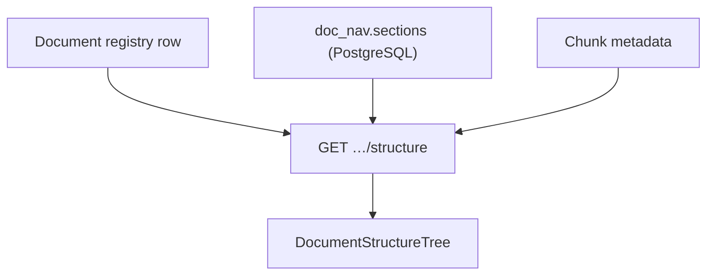
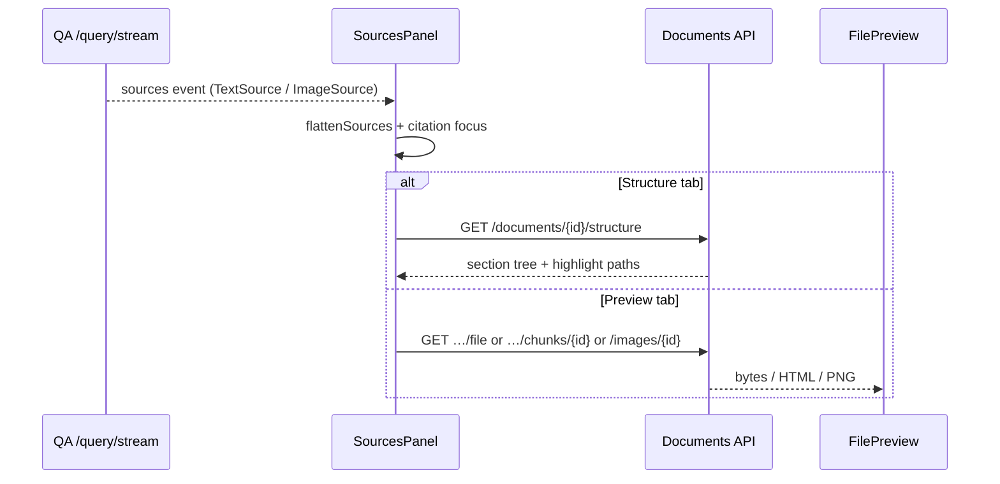

# 文档与图像 API

语料检查与问答引用 UI 的**证据端点**。路由：`eagle_rag/api/documents.py`。Schema：`eagle_rag/api/schemas/documents.py`。

两个路由实例：

| 路由 | 前缀 | 标签 |
|--------|--------|-----|
| `router` | `/documents` | `documents` |
| `images_router` | `/images` | `images` |

---

## `GET /documents`

带过滤的分页文档注册表。

### 查询参数

| 参数 | 说明 |
|-------|-------------|
| `q` | 模糊名称匹配 |
| `kb_name` | 多租户过滤 |
| `source_type` | `policy \| financial \| business \| bidding \| tax \| other` |
| `pipeline` | `knowhere \| pixelrag` |
| `status` | `pending \| indexing \| ready \| failed` |
| `limit` | 1–500，默认 50 |
| `offset` | ≥ 0 |

### 响应 — `DocumentListResponse`

```json
{
  "items": [ { "document_id": "…", "name": "…", "kb_name": "finance", "status": "ready", … } ],
  "total": 142,
  "limit": 50,
  "offset": 0
}
```

---

## `GET /documents/{document_id}`

单个 `DocumentOut`。**404** 若不存在。

典型字段：`document_id`、`name`、`kb_name`、`source_type`、`pipeline`、`status`、`sha256`、`source_uri`、`created_at`、`updated_at`、chunk 计数。

---

## `GET /documents/{document_id}/structure`

返回 `DocumentStructureOut` —— Knowhere 解析的**语义骨架**。

### 用途

驱动问答 **Structure** 侧栏标签：层级 `sections`，含 `path`、`level`、`summary`、子 chunk 引用与视觉锚点元数据。

由 `eagle_rag/index/document_structure.py` 中 `build_document_structure(document_id, doc)` 构建。



### 响应形状（概念）

```json
{
  "document_id": "doc_abc",
  "name": "Annual Report.pdf",
  "sections": [
    {
      "path": "/1/Introduction",
      "level": 1,
      "title": "Introduction",
      "summary": "…",
      "children": [ … ],
      "chunks": [ { "chunk_id": "…", "type": "text" } ]
    }
  ]
}
```

精确 schema：OpenAPI 中的 `DocumentStructureOut`。

---

## `GET /documents/{document_id}/file`

内联预览用的原始摄入文件。

| `source_uri` 类型 | 行为 |
|-------------------|-----------|
| `http://` / `https://` | **307 重定向**到外部 URL |
| MinIO 对象键 | 按猜测的 `Content-Type` 流式返回字节 |
| 缺失 | **404** `document has no stored source file` |
| 读取失败 | **502** |

**Headers：** `Content-Disposition: inline; filename*=UTF-8''…`

前端：`lib/api/client.ts` 中 `fileUrl(documentId)` → `FilePreview` 中 `<iframe>` / PDF 查看器。

---

## `GET /documents/{document_id}/chunks/{chunk_id}`

返回 Knowhere 表格或视觉 chunk 的 **HTML**（`text/html; charset=utf-8`）。

解析：`load_chunk_html(document_id, chunk_id)` —— MinIO 优先，Milvus 元数据回退。

前端：`chunkHtmlUrl(documentId, chunkId)` → 证据栏表格预览。

chunk 不存在时 **404**。

---

## `DELETE /documents/{document_id}`

删除注册表行。返回 `{ "deleted": true/false }` —— id 未知时为 `false`（非 404）。

!!! warning "警告"
    完整命名空间清理（Milvus + MinIO + 关键词）使用 KB 级生命周期 API。单文档删除范围取决于 `registry.delete_document` 实现。

---

## `GET /images/{image_id}`

原始 **PNG tile 字节**（`image/png`）。PixelRAG 视觉切片与 Knowhere 渲染 tile。

图像元数据缺失时 **404**。存储读取失败 **500**。

前端：`imageUrl(imageId)` —— 无 OpenAPI GET 封装；手写 URL。

---

## `GET /images/{image_id}/meta`

`ImageMetaOut`：`image_id`、`document_id`、`page`、`position`、`kb_name`、尺寸等。

---

## 证据查看器流程（前端）



引用点击 → `highlightIndex` → 在 `path` 或 `parent_section` 上聚焦结构。

---

## 多租户

文档携带 `kb_name`。列表过滤 `?kb_name=pharma`。Milvus chunk 继承相同标量。

并集语义下，`scope_filter` 的 `document_ids` 可跨 KB 引用这些 id。

---

## 相关文档

- [查询](query.md) —— 响应中的 `TextSource` / `ImageSource`
- [问答模块](../frontend/qa-module.md) —— `SourcesPanel`、`DocumentStructureTree`
- [知识库管理](knowledge-bases.md) —— 清理 / 重建
- [多模态融合](../architecture/multimodal-fusion.md) —— 视觉锚点字段
