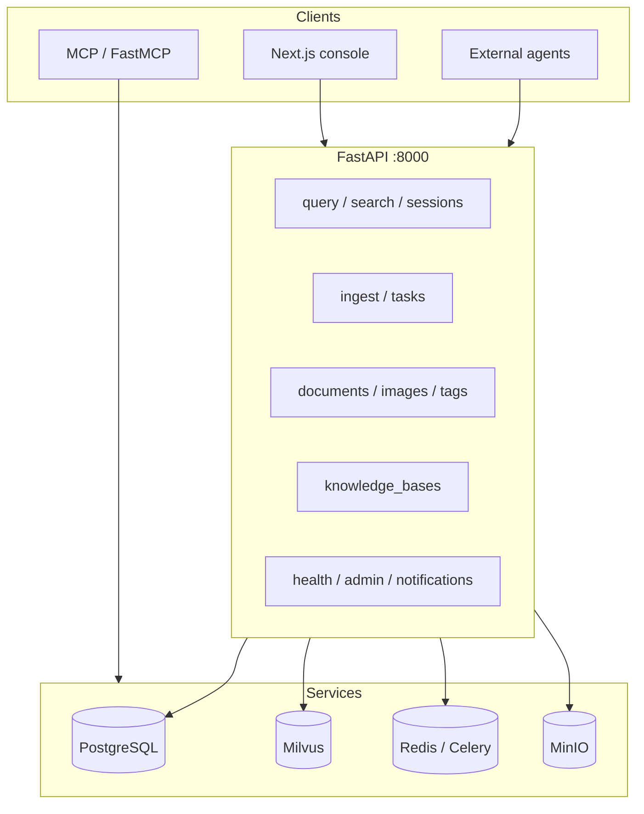

# Eagle-RAG REST API

Eagle-RAG 暴露 **FastAPI** HTTP API（默认端口 **8000**）。它是 Next.js 控制台、外部 Agent、Celery worker 与 MCP 客户端的集成面。端点覆盖完整 RAG 生命周期：**ingest → index → retrieve → generate**，以及多租户知识库管理与运维探测。

!!! info "交互式文档"
    打开 [`http://localhost:8000/docs`](http://localhost:8000/docs) 查看由路由 `response_model` 生成的 Swagger UI；[`/openapi.json`](http://localhost:8000/openapi.json) 为机器可读模式导出。

## 架构位置



MCP 工具**直接**调用服务层（无 HTTP 自调用）。`eagle_rag/api/*.py` 中的 REST 路由共享相同引擎与存储。

---

## 按标签的 API 地图

| OpenAPI 标签 | 基础路径 | 指南 |
|-------------|------------|-------|
| **query** | `/query`、`/search`、`/sessions` | [查询](query.md)、[会话](sessions.md) |
| **ingest** | `/ingest`、`/tasks`、`/ingest/queue-metrics` | [入库](ingest.md)、[任务](tasks.md) |
| **documents** | `/documents`、`/images` | [文档](documents.md) |
| **tags** | `/tags` | [查询 → 标签](query.md#get-tags) |
| **knowledge_bases** | `/knowledge_bases` | [知识库](knowledge-bases.md) |
| **attachments** | `/attachments` | [附件](attachments.md) |
| **notifications** | `/notifications` | [通知](notifications.md) |
| **health** | `/health`、`/health/plugins`、`/mcp/tools` | [健康与管理](health-admin.md) |
| **admin** | `/admin/*` | [健康与管理](health-admin.md) |

基础设施路由（未必在标签摘要中列出）：

| 路径 | 用途 |
|------|---------|
| `GET /` | 应用名、版本、文档链接（`RootResponse`） |
| `GET /metrics` | Prometheus 抓取 |
| `GET /health`（metrics 模块） | Docker / HAProxy 存活 |

MCP 流式 HTTP 挂载于 `settings.mcp.streamable_http_path`（默认 `/mcp`）。参见 [MCP 工具](mcp-tools.md)。

---

## 请求 / 响应约定

### 分页

列表端点返回 `PaginatedMeta`：

```json
{ "items": […], "limit": 50, "offset": 0 }
```

部分列表还含 `total`（文档、知识库）或 `error`（降级任务列表）。

### 删除确认

`DELETE` 路由返回 `DeletedResponse`：

```json
{ "deleted": true }
```

404 不使用 `deleted: false` — 缺失资源抛出 **404**。

### 日期时间

经 `iso_datetime()` 辅助（`eagle_rag/api/schemas/_helpers.py`）的 UTC ISO 8601 字符串。

### 内容协商

- JSON 体：`Content-Type: application/json`
- 文件入库：`multipart/form-data`
- SSE 流：`text/event-stream`（无 `Accept` 协商）

---

## 多租户（`plugin_namespace` + `kb_name`）

Eagle-RAG 使用**两层隔离**：

| 层 | 标识符 | 设置方 |
|-------|------------|--------|
| 域 | `plugin_namespace` | 部署配置 — `settings.plugins.default_namespace` 或 `EAGLE_RAG_PROFILE` |
| 知识库 | `kb_name` | 请求 / `KB_NAME` 默认 |

大多数写与查询端点接受可选 **`kb_name`**。域由进程隐式确定，除非发送不匹配的 `plugin_namespace`（→ **403**）。

传播链：

| 层 | 用法 |
|-------|-------|
| PostgreSQL | 仓库注入 `plugin_namespace`；行含 `kb_name` |
| Milvus | 客户端池 `db_name=` 每域；该 Database 内标量过滤 `kb_name == 'pharma'` |
| Celery | 任务 kwargs `kb_name=…`（命名空间来自 settings） |
| 去重 PK | `(sha256, kb_name, plugin_namespace)` |

插件绑定探测：`GET /health/plugins`。参见 [多租户](../architecture/multi-tenancy.md) 与 [插件架构](../architecture/plugin-architecture.md)。

---

## Scope filter（`ScopeSelection`）

`/query` 与 `/search` 上的高级召回范围：

```json
{
  "kb_names": ["pharma", "finance"],
  "document_ids": ["doc_abc123"],
  "tags": ["clinical-trial"]
}
```

**并集（OR）语义** — 块属于任一所列 KB、显式文档或任一标签解析出的文档即匹配。在 `router_engine._resolve_scope_filter` 解析并下推到 Milvus。详情：[查询 → Scope filter](query.md#scope-filter--milvus-pushdown)。

---

## 流式（SSE）概览

| 端点 | 事件 |
|----------|--------|
| `POST /query/stream` | `session`、`step`、`sources`、`token`、`done`、`error` |
| `POST /search/stream` | `step`、`sources`、`done`、`error` |
| `GET /tasks/{job_id}/stream` | `progress`、`timeout` |
| `GET /admin/logs` | `log`、`heartbeat` |

线格式与字节级示例：[查询 → SSE 协议](query.md#post-querystream--sse-protocol)。

---

## 错误模型

除非注明，FastAPI 返回标准 HTTP 错误：

| 状态 | 典型 `detail` | 降级行为 |
|--------|------------------|-------------------|
| `404` | 资源未找到（`session not found: …`） | — |
| `409` | 冲突（`kb_name already exists`） | — |
| `422` | 校验（`Either file or url is required`） | URL 预取结构化 detail |
| `500` | 引擎 / 意外（`detail` 字符串） | 入库可能返回 JSON 体 |
| `502` | Celery 分发失败（任务重试） | — |
| `503` | 数据库不可用 | `GET /sessions` → 空列表 |

流开始后 SSE 端点发射 `error` **事件**而非 HTTP 错误体。

### 幂等性摘要

| 操作 | 幂等？ |
|-----------|-------------|
| `POST /ingest`（相同文件哈希 + kb） | **是** — `dedup_hit: true`，HTTP 200 |
| `POST /query` | **否** — 追加消息 |
| `POST /attachments` | **否** — 每次上传新 `attachment_id` |
| `DELETE /*` | **是** — 第二次删除 → 404 |
| `PATCH /sessions/{id}` | **是** — 相同标题 |

---

## 认证

REST 路由默认**无认证中间件**。部署在私有网络、VPN 或 API 网关后。

MCP 可经 `settings.auth.enabled` 与 `configure_mcp_auth()` 单独启用认证（静态 token、GitHub OAuth、自定义 JWT）。参见 [MCP 工具](mcp-tools.md)。

---

## OpenAPI 生成（前端）

Next.js 控制台从实时 OpenAPI 文档重新生成 TypeScript SDK：

```bash
# API 须运行（或设置 OPENAPI_URL）
cd frontend && bun run api:gen
```

配置：`frontend/openapi-ts.config.ts` — 输入 `${API_BASE}/openapi.json`，输出 `lib/api/generated/`。`predev` 自动运行 `api:gen`。

---

## 配置面

服务器 host、port、模型密钥、Milvus URI、Celery broker、MCP 传输从 `eagle_rag/settings.yaml` 加载，带 `${ENV:-default}` 替换。参见 [配置](../getting-started/configuration.md)。

---

## 集成清单

- [ ] 首次请求前 `alembic upgrade head`（或 `task db:migrate`）
- [ ] 注册至少一个知识库（`POST /knowledge_bases`）
- [ ] 非默认 `core` 时设置 `EAGLE_RAG_PROFILE`（或 `plugins.default_namespace`）以单域绑定
- [ ] 验证 `GET /health/plugins` 显示预期清单与 MCP 工具
- [ ] 启动 `router_queue`、`knowhere_queue`、`pixelrag_queue` 的 Celery worker
- [ ] 客户端指向 `http://<host>:8000`（或反向代理 + `NEXT_PUBLIC_API_BASE`）
- [ ] 交互 UX 用 `/query/stream`；检索基准用 `/search`
- [ ] API 模式变更后运行 `bun run api:gen`

---

## 相关文档

| 主题 | 链接 |
|-------|------|
| 后端路由布局 | [API 层](../backend/api-layer.md) |
| 检索路由 | [路由引擎](../backend/router-engine.md) |
| 前端 SDK | [API 客户端](../frontend/api-client.md) |
| MCP 实现 | [MCP 服务器（后端）](../backend/mcp-server.md) |
| 模式参考 | [模式](../backend/schemas.md) |
