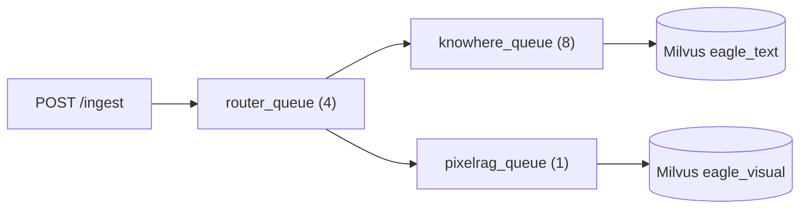

# 摄入 API

文档摄入经 **`POST /ingest`** 进入，通过 **`/tasks`** 与 **`/ingest/queue-metrics`** 跟踪。实现：`eagle_rag/api/ingest.py`，schema：`eagle_rag/api/schemas/ingest.py`，执行器：`eagle_rag/ingest/runner.py`。

## `POST /ingest`

**multipart 文件上传**或 **URL 表单字段**的统一入口。

### 请求

**Content-Type：** `multipart/form-data`

| 字段 | 类型 | 必填 | 说明 |
|-------|------|----------|-------------|
| `file` | `UploadFile` | `file` / `url` 二选一 | 原始字节 |
| `url` | `string` | `file` / `url` 二选一 | `http://` 或 `https://` 来源 |
| `source_type_hint` | `string` | 否 | `policy \| financial \| business \| bidding \| tax \| other` |
| `kb_name` | `string` | 否 | 目标 KB；必须已注册 |

### 响应 — `IngestResponse`

```json
{
  "job_id": "celery-uuid",
  "status": "pending",
  "dedup_hit": false,
  "document_id": "doc_abc123"
}
```

| HTTP | 条件 |
|------|-----------|
| `201` | 新摄入已派发 |
| `200` | 去重命中 —— 复用已有 `(sha256, kb_name)` 行 |
| `404` | 知识库未注册 |
| `422` | 缺少 file/url、校验错误、URL 预取失败 |
| `500` | Runner 异常（`{"detail": "…"}` JSON 体） |

### URL 摄入防护

Celery 派发前，API 会：

1. `validate_url_format(url)`
2. `assert_not_ssrf_target(url)` —— 阻止内网 IP / 元数据端点
3. `prefetch_url(url)` —— HEAD/GET 可达性检查，含超时与重定向上限

422 响应可包含结构化 `UrlValidationErrorDetail`：

```json
{
  "detail": {
    "code": "url_unreachable",
    "reason": "Connection timed out",
    "suggestion": "Check firewall rules"
  }
}
```

### 流水线路由

`ingest_router`（Celery `router_queue`）之后，按格式 + 内容形态路由：

| 输入 | 流水线 |
|-------|----------|
| 文本型 PDF | Knowhere（`knowhere_queue`） |
| 扫描 / 图像 PDF | PixelRAG（`pixelrag_queue`） |
| Office / Markdown / CSV / … | Knowhere |
| 图像 / URL / HTML | PixelRAG |

覆盖：文件名前缀 `knowhere:` / `pixelrag:`，或 `settings.router.mode`。

### 多租户

`kb_name` 流入：

- PostgreSQL `documents.kb_name`
- 所有下游任务的 Celery kwargs
- 已索引 chunk 的 Milvus 标量字段

去重键：`(sha256, kb_name)` —— 相同文件字节可同时存在于 `finance` 与 `pharma`。

### 幂等性

向同一 KB 重复上传相同文件返回 `dedup_hit: true`，不重新索引。不同 KB → 新文档行。

---

## `GET /ingest/queue-metrics`

返回 `IngestQueueMetricsResponse`：

```json
{
  "queues": [
    { "name": "router_queue", "concurrency": 4, "size": 2 },
    { "name": "knowhere_queue", "concurrency": 8, "size": 0 },
    { "name": "pixelrag_queue", "concurrency": 1, "size": 5 }
  ]
}
```

| 字段 | 来源 |
|-------|--------|
| `concurrency` | `settings.celery.queues.*.concurrency`（静态） |
| `size` | Redis 对队列名的 `LLEN`；broker 不可达时为 `null` |

始终 HTTP **200** —— 部分数据可接受，供仪表盘展示。

---

## Celery 队列拓扑



`pixelrag_queue` 并发 **1** —— 视觉编码器受 GPU/内存约束。

---

## 错误码（摄入路径）

| 情况 | HTTP | `detail` 模式 |
|-----------|------|------------------|
| 空 multipart | 422 | `Either file or url is required` |
| 未注册 KB | 404 | `knowledge base not registered` / 本地化变体 |
| SSRF 被拦 URL | 422 | 结构化 URL 校验 |
| Runner `ValueError` | 422 | 消息字符串 |
| 意外异常 | 500 | `{"detail": "…"}` |

---

## MCP 对等

MCP `ingest` 工具接受 `source_uri`（文件路径或 URL），直接调用 `runner.ingest`。返回 `{ job_id, status, document_id, dedup_hit }` 或 `{ error: "…" }`。见 [MCP 工具](mcp-tools.md)。

---

## 前端集成

摄入控制台（`/ingest`）使用：

- `POST /ingest`（`useIngest` hook）
- 带过滤的 `GET /tasks` + SSE `GET /tasks/{id}/stream`
- `GET /ingest/queue-metrics`（`QueueCard` 组件）

见 [摄入模块](../frontend/ingest-module.md)。

---

## 相关文档

- [任务](tasks.md) —— 审计列表、SSE 进度、重试
- [文档](documents.md) —— 摄入后语料 API
- [知识库](knowledge-bases.md) —— 摄入前注册 KB
- [任务队列（后端）](../backend/task-queue.md)
