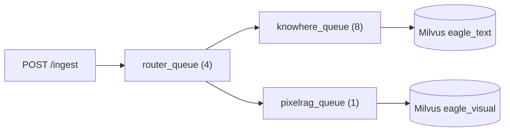

# 入库 API

文档入库经 **`POST /ingest`** 进入，经 **`/tasks`** 与 **`/ingest/queue-metrics`** 跟踪。预检使用独立的 validate 端点。实现：`eagle_rag/api/ingest.py`，模式在 `eagle_rag/api/schemas/ingest.py`，runner 在 `eagle_rag/ingest/runner.py`。

## 预检：先 validate 再入队

客户端应先调用 validate，再调用 enqueue。File 与 URL 使用**不同**端点与错误码。

### `POST /ingest/validate/file`

仅 multipart `file`。经 `validate_file_preflight` 执行 MinerU `ingest.limits`（体积 + PDF 页数）。后续可按类型扩展。

**`200 FileValidateResponse`：** `ok`、`filename`、`size_bytes`、`resource_kind`、`page_count?`、`content_type?`

**`422`：** `IngestLimitErrorDetail` — `file_too_large` | `pdf_too_many_pages` | `pdf_unreadable`

### `POST /ingest/validate/url`

表单字段 `url`。顺序：格式 → 有界 DNS SSRF → HEAD/GET prefetch → 按内容类型加深：

| `resource_kind` | 额外检查 |
|-----------------|----------|
| `html` | 仅可达性 |
| `pdf` | 与本地文件相同的 MinerU 体积/页数（限流下载，上限 `max_file_bytes`） |
| `image` / `other` | 有 `Content-Length` 时比对 `max_file_bytes` |

**`200 UrlValidateResponse`：** `ok`、`status_code`、`content_type`、`final_url`、`resource_kind`、`size_bytes?`、`page_count?`、`suggested_pipeline?`

**`422`：** URL 错误码，或 PDF/体积的 limit 错误码。

配置：`ingest.url_prefetch`（`dns_timeout_sec`、`timeout_sec`、`max_redirects`、`pdf_download_timeout_sec`）。

## `POST /ingest`

**multipart 文件上传**或 **URL 表单字段**的统一**入队**入口（客户端 validate 之后）。

### 请求

**Content-Type：** `multipart/form-data`

| 字段 | 类型 | 必填 | 描述 |
|-------|------|----------|-------------|
| `file` | `UploadFile` | `file` / `url` 二选一 | 原始字节 |
| `url` | `string` | `file` / `url` 二选一 | `http://` 或 `https://` 源 |
| `filename` | `string` | 否 | URL 摄入可选展示/路由名（如 `knowhere:https://…`） |
| `source_type_hint` | `string` | 否 | 自由文本来源类型元数据 |
| `kb_name` | `string` | 否 | 目标 KB；必须已注册 |

### 响应 — `IngestResponse`

```json
{
  "job_id": "celery-uuid",
  "status": "pending",
  "dedup_hit": false,
  "document_id": "doc_abc123"
}
```

| HTTP | 条件 |
|------|-----------|
| `201` | 新入库已分发 |
| `200` | 去重命中 — 复用已有 `(sha256, kb_name)` 行 |
| `404` | 知识库未注册 |
| `422` | 缺少 file/url、校验错误、SSRF/格式失败 |
| `500` | Runner 异常（`{"detail": "…"}` JSON 体） |

### URL 入队门禁

Celery 分发前（轻量；可达性属于 validate）：

1. `validate_url_format(url)`
2. `assert_not_ssrf_target(url)` — 有界 DNS；阻止私有 IP / 元数据端点

Worker 在 HTTP 抓取前复检 SSRF。文件路径仍会执行 `validate_ingest_file` 作为安全网。

422 响应可含结构化 `UrlValidationErrorDetail`：

```json
{
  "detail": {
    "code": "url_unreachable",
    "reason": "Connection timed out",
    "suggestion": "Check firewall rules"
  }
}
```

### 流水线路由

`ingest_router`（Celery `router_queue`）之后，文档按格式 + 内容形态路由：

| 输入 | 流水线 |
|-------|----------|
| 文本型 PDF | Knowhere（`knowhere_queue`） |
| 扫描 / 图像 PDF | PixelRAG（`pixelrag_queue`） |
| Office / Markdown / CSV / … | Knowhere |
| 图像 / URL / HTML | PixelRAG |

覆盖：文件名前缀 `knowhere:` / `pixelrag:`，或 `settings.router.mode`。

### 多租户

`kb_name` 流入：

- PostgreSQL `documents.kb_name`（经仓库按命名空间划分）
- 所有下游任务的 Celery kwargs
- 已绑定 Milvus Database 内索引块的 Milvus 标量字段

去重键：`(sha256, kb_name, plugin_namespace)` — 相同文件字节可在 `finance` 与 `pharma` 共存，或在不同实例的域间共存。

### 幂等性

向同一 KB 重复上传相同文件返回 `dedup_hit: true` 且不重新索引。不同 KB → 新文档行。

---

## `GET /ingest/queue-metrics`

返回 `IngestQueueMetricsResponse`：

```json
{
  "queues": [
    { "name": "router_queue", "concurrency": 4, "size": 2 },
    { "name": "knowhere_queue", "concurrency": 8, "size": 0 },
    { "name": "pixelrag_queue", "concurrency": 1, "size": 5 }
  ]
}
```

| 字段 | 来源 |
|-------|--------|
| `concurrency` | `settings.celery.queues.*.concurrency`（静态） |
| `size` | 队列名上 Redis `LLEN`；broker 不可达时为 `null` |

始终 HTTP **200** — 面板可接受部分数据。

---

## Celery 队列拓扑



`pixelrag_queue` 并发 **1** — 视觉编码器受 GPU/内存限制。

---

## 错误码（入库路径）

| 情况 | HTTP | `detail` 模式 |
|-----------|------|------------------|
| 空 multipart | 422 | `Either file or url is required` |
| 未注册 KB | 404 | `knowledge base not registered` / 本地化变体 |
| SSRF 阻止 URL | 422 | 结构化 URL 校验 |
| Runner `ValueError` | 422 | 消息字符串 |
| 意外异常 | 500 | `{"detail": "…"}` |

---

## MCP 对等

MCP `core_ingest` 接受 `source_uri`（文件路径或 URL）并直接调用 `runner.ingest`。返回 `{ job_id, status, document_id, dedup_hit }` 或 `{ error: "…" }`。参见 [MCP 工具](mcp-tools.md)。

---

## 前端集成

入库控制台（`/ingest`）使用：

- `POST /ingest` 经 `useIngest` hook
- `GET /tasks` 带过滤 + SSE `GET /tasks/{id}/stream`
- `GET /ingest/queue-metrics` 用于 `QueueCard` 组件

参见 [入库模块](../frontend/ingest-module.md)。

---

## 相关文档

- [任务](tasks.md) — 审计列表、SSE 进度、重试
- [文档](documents.md) — 入库后语料 API
- [知识库](knowledge-bases.md) — 入库前注册 KB
- [任务队列（后端）](../backend/task-queue.md)
