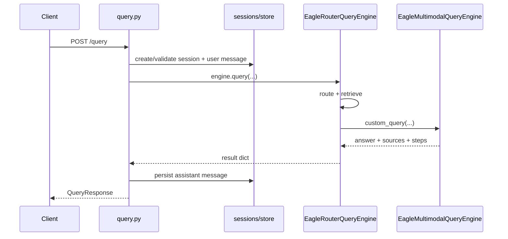

# 查询与搜索 API

**query** 标签组涵盖多模态问答、纯检索、会话持久化，以及支撑高级范围过滤的标签目录。路由位于 `eagle_rag/api/query.py`；请求/响应模型位于 `eagle_rag/api/schemas/query.py`。

!!! note "说明"
    关于 RAG 流式 UX 的研究（例如检索增强系统中的 *Incremental Generation*）表明，用户在首个 token 之前看到*进度*时，**感知延迟**会显著下降。因此 Eagle-RAG 将 **step 事件**（路由、召回、重排）与 **token 事件**（LLM 增量）分离。Step 事件回答「系统在做什么？」；token 事件回答「答案正在变成什么？」。这与 HCI 文献中对长时 AI 任务推荐的*渐进披露*模式一致（Shneiderman, 1998）。

## 端点摘要

| 方法 | 路径 | 响应 | 用途 |
|--------|------|----------|---------|
| `POST` | `/query` | `QueryResponse` | 完整问答（路由 → 检索 → 生成 → 持久化） |
| `POST` | `/query/stream` | SSE | 相同流水线，带 step + token 流式 |
| `POST` | `/search` | `SearchResponse` | 仅检索（无 LLM 答案） |
| `POST` | `/search/stream` | SSE | 流式检索（step + sources） |
| `GET` | `/tags` | `TagListResponse` | 范围过滤 UI 用的关键词标签目录 |

会话路由（`/sessions/*`）见 [会话](sessions.md)。

---

## 请求模型

### `QueryRequest`

```json
{
  "session_id": "550e8400-e29b-41d4-a716-446655440000",
  "query": "What are the revenue recognition rules in section 3?",
  "mode": "auto",
  "kb_name": "finance",
  "attachments": ["att_abc123"],
  "scope": ["doc_xyz"],
  "filters": {
    "source_type": "policy",
    "pipeline": "knowhere",
    "year": 2025
  },
  "scope_filter": {
    "kb_names": ["finance", "pharma"],
    "document_ids": ["doc_abc123"],
    "tags": ["clinical-trial"]
  }
}
```

| 字段 | 类型 | 必填 | 说明 |
|-------|------|----------|-------------|
| `session_id` | `string \| null` | 否 | 已有会话 UUID。省略 → 自动创建，标题为 query 前 30 字符 |
| `query` | `string` | **是** | 自然语言问题 |
| `mode` | `auto \| text \| visual \| hybrid` | 否 | 覆盖路由。默认来自 `settings.router.mode` |
| `kb_name` | `string \| null` | 否 | 单 KB 遗留范围。`scope_filter` 非空时被忽略 |
| `attachments` | `string[] \| null` | 否 | `POST /attachments` 返回的 `attachment_id` |
| `scope` | `string[] \| null` | 否 | 遗留 `document_id` 列表（`scope_filter` 未激活时作检索后过滤） |
| `filters` | `QueryFilters \| null` | 否 | Milvus 标量分面：`source_type`、`pipeline`、`year` |
| `scope_filter` | `ScopeSelection \| null` | 否 | 高级并集范围（见下文） |

### `QueryFilters`

| 字段 | 类型 | Milvus 下推 |
|-------|------|-----------------|
| `source_type` | `policy \| financial \| business \| bidding \| tax \| other` | `source_type == '…'` |
| `pipeline` | `knowhere \| pixelrag` | 同时强制路由模式 |
| `year` | `int` | `year == N` |

### `ScopeSelection`

```python
# eagle_rag/api/schemas/query.py
class ScopeSelection(BaseModel):
    kb_names: list[str] = []
    document_ids: list[str] = []
    tags: list[str] = []

    def is_empty(self) -> bool:
        return not (self.kb_names or self.document_ids or self.tags)
```

**并集（OR）语义：** chunk 在以下**任一**条件成立时合格：

1. 其 `kb_name` 在 `kb_names` 中
2. 其 `document_id` 在 `document_ids` 中
3. 其文档出现在**任一**所选标签解析出的文档集合中

空 `ScopeSelection` → 回退到遗留 `kb_name` / `scope` 行为。

### `SearchRequest`

与 `QueryRequest` 字段相同，**但**不含 `session_id` 与 `attachments`。用于基准测试与前端的「搜索模式」（证据栏、无生成）。

---

## 响应模型

### `QueryResponse`

| 字段 | 类型 | 说明 |
|-------|------|-------------|
| `session_id` | `string` | 持久化会话 id |
| `message_id` | `string` | 助手消息 UUID |
| `answer` | `string` | 最终生成文本 |
| `sources` | `QuerySources` | `{ text: TextSource[], image: ImageSource[] }` |
| `route` | `RouteInfo` | `{ mode, selected, reason, kb_name, … }` |
| `steps` | `QueryStep[]` | 执行轨迹（`route`、`recall`、`rerank`、`warning` 等） |

### `TextSource`

富引用载荷 —— UI 无需额外请求即可渲染证据：

| 字段 | 说明 |
|-------|-------|
| `type` | `text \| table \| image \| section_summary` |
| `path` | Knowhere 层级路径 |
| `content` | Chunk 正文（表格带 HTML） |
| `summary`、`keywords`、`page_nums` | 语义元数据 |
| `document_id`、`file_name`、`file_path` | 文档锚点 |
| `kb_name`、`source_type` | 多租户 + 分面 |
| `source` | `kb \| attachment` |
| `score` | 重排后相关性 |

### `ImageSource`

视觉 tile，含**四个融合锚点字段**（见 [多模态融合](../architecture/multimodal-fusion.md)）：

| 字段 | 用途 |
|-------|---------|
| `chunk_type` | `tile \| image \| table` |
| `parent_section` | 最近文本 chunk 的 `path` |
| `content_summary` | Knowhere 视觉摘要 |
| `source_chunk_id` | Knowhere `chunk_id` 锚点 |
| `image_id`、`page`、`position` | PixelRAG 坐标 |

---

## 范围过滤 → Milvus 下推 {#scope-filter--milvus-pushdown}

解析在 `EagleRouterQueryEngine._resolve_scope_filter` 中完成：

```python
# eagle_rag/router/router_engine.py (abbreviated)
@staticmethod
def _resolve_scope_filter(scope_filter) -> tuple[list[str], list[str], bool]:
    if not scope_filter:
        return [], [], False
    kb_names = list(scope_filter.get("kb_names") or [])
    document_ids = list(scope_filter.get("document_ids") or [])
    tags = list(scope_filter.get("tags") or [])
    if not (kb_names or document_ids or tags):
        return [], [], False
    doc_set = dict.fromkeys(document_ids)
    if tags:
        for doc_id in resolve_tags_to_document_ids(tags, cap=max_scope_documents):
            doc_set.setdefault(doc_id, None)
    return kb_names, list(doc_set), True
```

当 `use_scope_filter=True` 时，检索器以 `kb_names` 与 `document_ids` 下推到 Milvus 标量表达式构造：

```python
text_retriever = KnowhereGraphRetriever(
    top_k=self.top_k,
    kb_names=scope_kb_names,
    document_ids=scope_doc_ids,
    source_type=source_type,
    year=year,
)
```

标签解析**跨所有知识库**（标签为 `document_keywords` 中的全局关键词）。上限 `settings.router.max_scope_documents` 防止无界 `document_id in […]` 表达式。

!!! warning "警告"
    `scope_filter` 激活时，遗留 `scope` 列表**不会**在检索后应用。请将文档约束传入 `scope_filter.document_ids`。

---

## `POST /query`（非流式）

**流程：**



**HTTP 状态码：**

| 状态码 | 条件 |
|------|-----------|
| `200` | 成功 |
| `404` | `session_id` 未找到 |
| `500` | 引擎异常（`detail` = 消息） |
| `503` | 会话解析时数据库不可用 |

**幂等性：** 非幂等。每次调用创建新用户消息，成功时创建新助手消息。重复提交相同 `query` 文本会追加到会话历史。

**`kb_name` 传播：** 写入用户与助手消息；`scope_filter` 为空时传给检索器。

---

## `POST /query/stream` — SSE 协议 {#post-querystream--sse-protocol}

**Content-Type：** `text/event-stream`  
**实现：** `sse-starlette` `EventSourceResponse` + 后台线程消费 `engine.query_stream`。

### 线格式（字节级）

每个事件遵循 [HTML Living Standard SSE 语法](https://html.spec.whatwg.org/multipage/server-sent-events.html)：

```
event: <name>\r\n
data: <json>\r\n
\r\n
```

- 规范中 `event` 行可选；Eagle-RAG **始终**设置命名事件。
- `data` 为**单行 JSON 对象**，`json.dumps(..., ensure_ascii=False)` 序列化。
- **不使用**多行 `data:` 字段；载荷单行容纳。
- 当前不发出 `id:` 或 `retry:` 字段。

**原始流示例（标注 `\r\n`）：**

```
event: session\r\n
data: {"session_id":"a1b2…","user_message_id":"c3d4…"}\r\n
\r\n
event: step\r\n
data: {"name":"route","mode":"hybrid","selected":["text","visual"],"reason":"…"}\r\n
\r\n
event: step\r\n
data: {"name":"recall","text_count":12,"visual_count":4}\r\n
\r\n
event: step\r\n
data: {"name":"rerank","text_kept":5,"visual_kept":3,"text_top":["/sec/3"],"visual_top":["img_01"]}\r\n
\r\n
event: sources\r\n
data: {"text":[…],"image":[…]}\r\n
\r\n
event: token\r\n
data: {"delta":"Revenue"}\r\n
\r\n
event: token\r\n
data: {"delta":" recognition"}\r\n
\r\n
event: done\r\n
data: {"answer":"…","sources":{…},"route":{…},"steps":[…],"message_id":"e5f6…"}\r\n
\r\n
```

### 事件目录

| 事件 | 时机 | `data` 形状 |
|-------|------|--------------|
| `session` | 已知 `session_id` 时首次 yield | `{ session_id, user_message_id }` |
| `step` | 路由 / 召回 / 重排 / 附件解析 | `{ name, … }` —— 允许额外键 |
| `sources` | 重排后、生成前 | `QuerySources` 对象 |
| `token` | 每个 LLM 增量 | `{ delta: string }` |
| `done` | 持久化之后 | 完整载荷 + `message_id` |
| `error` | 失败 | `{ code, message }` |

**`done` 延迟：** API 层缓冲引擎内部 `done` 事件，待助手消息写入 PostgreSQL 后再发出带 `message_id` 的 `done`。客户端应将 `done` 视为终端成功信号。

**`error` 事件中的错误码：**

| `code` | HTTP 等价 | 原因 |
|--------|-----------------|-------|
| `session_error` | 404 | 无效 `session_id` |
| `database_unavailable` | 503 | 会话存储不可用 |
| `engine_error` | 500 | 检索或生成失败 |

### 客户端解析检查清单

1. 使用 `EventSource` 或基于 fetch 的 SSE 解析器（前端使用 `@hey-api/client-fetch` SSE 模式）。
2. 对每个 `data` 字符串独立 `JSON.parse`。
3. 将 `token.delta` 追加到运行中的答案缓冲区。
4. 在 `sources` 时替换待定 UI 状态（答案完成前即可查看引用）。
5. `done` 时将临时消息 id 换为 `message_id`。
6. 处理连接断开：无自动恢复；重新 `POST` 视为新查询。

!!! tip "提示"
    在 `token` 事件**之前**发出 `sources` 可实现 Perplexity 式界面的*证据优先*模式：答案流式输出时用户即可检查召回 chunk。`SourcesPanel` 如何绑定此事件顺序见 [问答模块](../frontend/qa-module.md)。

---

## `POST /search` 与 `/search/stream`

纯检索 —— 不调用 `EagleMultimodalQueryEngine`。

**`/search` 响应：** `{ sources, route, steps }` —— 无 `answer`，无副作用于会话。

**`/search/stream` 事件：** `step` → `sources` → `done`（无 `session`、无 `token`）。

典型 `step` 序列：

1. `{ name: "route", mode, selected, reason, kb_name }`
2. `{ name: "recall", text_count, visual_count }`

---

## `GET /tags` {#get-tags}

支撑 `ScopeSelection` 的标签维度。

| 查询参数 | 类型 | 说明 |
|-------------|------|-------------|
| `q` | `string` | 模糊关键词匹配 |
| `kb_name` | `string` | 单 KB 过滤 |
| `kb_names` | `string[]` | 多 KB 并集过滤 |
| `limit` | `int` | 1–500，默认 50 |

**响应 `TagOut`：** `{ keyword, hit_count, kb_count, document_count }`

标签来自 Knowhere chunk 关键词，聚合于 `document_keywords`。查询时解析使用 `resolve_tags_to_document_ids`。

---

## 多租户（`kb_name`）

| 场景 | 行为 |
|----------|-----------|
| 仅设置 `kb_name` | 检索器在 Milvus 中过滤 `kb_name == '…'` |
| `scope_filter.kb_names` 非空 | 所列 KB 并集；顶层 `kb_name` 检索时被忽略 |
| 创建会话 | `kb_name` 存入会话行 |
| 持久化消息 | 从请求复制 `kb_name` |

省略时默认 KB：`settings.kb_name`（环境变量 `KB_NAME`，默认 `default`）。

---

## OpenAPI 与代码生成

类型在以下命令后写入 `frontend/lib/api/generated/types.gen.ts`：

```bash
cd frontend && bun run api:gen
```

完整生成流水线见 [API 客户端](../frontend/api-client.md)。

---

## 相关文档

- [会话](sessions.md) —— 会话行上的 `scope_filter` 持久化
- [路由引擎](../backend/router-engine.md) —— 路由矩阵
- [生成](../backend/generation.md) —— 重排 + VLM 流式
- [附件](attachments.md) —— 查询时惰性解析
- [MCP 工具](mcp-tools.md) —— `query` 工具 schema
